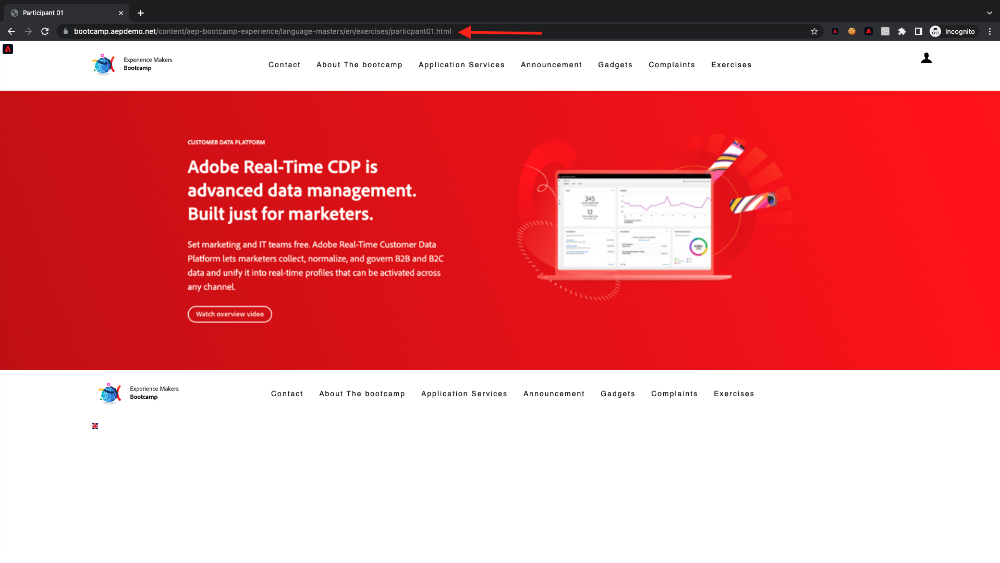

# 1.4 Ação: Bereitstellen von Segmento-Para für Adobe Target

Acesse [Adobe Experience Platform](https://experience.adobe.com/platform). Depois de fazer login, você irá acessar a página inicial da Adobe Experience Platform.

Antes de Continuar, você recisa selecionar um **Sandbox**. O nome do sandbox ein ser selecionado é Bootcamp. É besitzível fazer isso clicando no texto **[!UICONTROL Produktionsprodukt]** na linha azul na parte überlegen da tela. Depois de selecionar o sandbox apropriado, você verá a tela mudando e agora você está em seu [!UICONTROL Sandbox] widado.

## 1.4.1 Ative Seu segmento para o destino do Adobe Target

O Adobe Target está disponível como um destino do CDP em tempo real. Para configuration sua integrração com o Adobe Target, acesse **Ziele** e **Katalog**.

Clique em **Personalisierung** kein Menü **Kategorien**. Você verá o cartão de destino do **Adobe Target**. Clique em **Segmente aktivieren**.

Auswahl des Ziels ``Bootcamp Target`` e clique **Nächste**.

Na lista de segmentos disponíveis, selecione o segmento que você criou em [1.3 Crime um segmento](./ex3.md), com o nome `yourLastName - Interest in Real-Time CDP`. Em seguida, clique em **Nächste**.

Na próxima página, clique em **Nächste**.

Clique em **Beenden**.

Seu segmento agora está ativado para o Adobe Target.

>[!IMPORTANT]
>
>Imediatamente após criar seu destino do Adobe Target no Real-Time CDP, pode levar até uma hora para que o destino seja ativado. Este é um tempo de espera único devido à definição da configuration ação de Back-End. Depois que o tempo de espera inicial de 1 hora e a configuration ação do Back-End forem finídos, os segmentos de borda recém-adicionados que são enviados ao destino do Adobe Target estarão disponíveis para segmentação em tempo real.

## 1.4.2 Konfigurieren von sua atividade auf Adobe Target

Agora que seu segmento Real-Time CDP está konfigurado para ser enviado ao Adobe Target, é besitzível configuration sua atividade Segmentação por experiência no Adobe Target. Neste übício, você irá konfigurar uma atividade baseada no Visual Experience Composer.

Acesse a página inicial da Adobe Experience Cloud acessando [https://experiencecloud.adobe.com/](https://experiencecloud.adobe.com/). Clique em **Target** para abrir.

Na página inicial do **Adobe Target**, você verá todas as atividades existentes.
Clique em **+ Aktivität erstellen** para criar uma nova atividade.

Selecione **Erlebnis-Targeting**.

Selecione **Visuell** e defina **Aktivitäts-URL** como `https://bootcamp.aepdemo.net/content/aep-bootcamp-experience/language-masters/en/exercises/particpantXX.html`, mas, antes disso, replace a XX por um número entre 01 e 60.

>[!IMPORTANT]
>
>Cada Participante da kondenação deve usar uma página da Web separada para evitar a colisão de várias experiências do Adobe Target. É besitzível escolher uma página da Web e enkontrared eine URL acessando: [https://bootcamp.aepdemo.net/content/aep-bootcamp-experience/language-masters/en/exercises.html](https://bootcamp.aepdemo.net/content/aep-bootcamp-experience/language-masters/en/exercises.html).
>
>Todas als páginas compartilham eine mesma URL base e terminam com o número do Participante.
>
>Por exemplo, o Participante 1 deve usar a URL `https://bootcamp.aepdemo.net/content/aep-bootcamp-experience/language-masters/en/exercises/particpant01.html`, o Participante 30 deve usar a URL `https://bootcamp.aepdemo.net/content/aep-bootcamp-experience/language-masters/en/exercises/particpant30.html`.

Auswahl des Arbeitsbereichs **AT Bootcamp**.

Clique em **Nächste**.

Agora você está no Visual Experience Composer. Pode levar de 20 a 30 segundos até que o site esteja completamente carregado.

Atualmente, o público padrão são **Alle Besucher**. Clique nos **3 Punkte** ao lado de **Alle Besucher** e clique em **Zielgruppe ändern**.

Agora você está vendo a lista de públicos disponíveis, e o segmento da Adobe Experience Platform que você criou anteriormente e enviou ao Adobe Target agora faz parte dessa lista. Selecione o segmento que você criou anteriormente na Adobe Experience Platform. Clique em **Zielgruppe zuweisen**.

Seu segmento da Adobe Experience Platform agora faz parte dessa Atividade de segmentação por experiência.

Antes de alterar a imagem principal, você deve clicar em **Alle zulassen** kein Banner de Cookies.

Para isso, vá para **Durchsuchen**

Em seguida, clique em **Alle zulassen**.

Em seguida, retorne para **Erstellen**.

Agora vamos mudar a imagem principal na página inicial do site. Clique na imagem principal padrão no site, clique em **Inhalt ersetzen** e selecione **Bild**.

Pesquise o arquivo de imagem **rtcdp.png**. Selecione e clique em **Speichern**.

Você verá a nova experiência com a nova imagem para o seu Público selecionado

Clique no título da sua atividade no canto Superior esquerdo para renomeá-la.

Para o nome, use:

- `seuSobrenome - RTCDP - XT (VEC)`

Clique em **Nächste**.

Clique em **Nächste**.

Na página **Ziele und Einstellungen**, acesse **Zielmetriken**.

Definieren eines Meta-Prinzipal-Como **Interaktion** - **Besuchszeit pro Site**. Clique em **Speichern und schließen**.

Agora você está na página **Aktivitätsübersicht**. Você ainda recisa ativar sua Atividade.

Clique no campo **Inaktiv** e selecione **Aktivieren**.

Você receberá uma validation mação visual de que sua atividade agora está ativa.

Agora sua atividade está ativa e pode ser testada no site do bootcamp.

Se agora você voltar ao seu site de demonstração e visitar a página do produto para **Real-Time CDP**, você se qualificará instantaneamente para o segmento que criou e verá a atividade do Adobe Target exibida na página inicial em tempo real.

>[!IMPORTANT]
>
>Cada Participante da kondenação deve usar uma página da Web separada para evitar a colisão de várias experiências do Adobe Target. É besitzível escolher uma página da Web e enkontrared eine URL acessando ao link: [https://bootcamp.aepdemo.net/content/aep-bootcamp-experience/language-masters/en/exercises.html](https://bootcamp.aepdemo.net/content/aep-bootcamp-experience/language-masters/en/exercises.html).
>
>Todas als páginas compartilham eine mesma URL base e terminam com o número do Participante.
>
>Por exemplo, o Participante 1 deve usar a `https://bootcamp.aepdemo.net/content/aep-bootcamp-experience/language-masters/en/exercises/particpant01.html`, o Participante 30 deve usar a URL `https://bootcamp.aepdemo.net/content/aep-bootcamp-experience/language-masters/en/exercises/particpant30.html`.

Próxima etapa: [1.5 Ação: Bereitstellen von Segmento-Para für Facebook](./ex5.md)

[Retornar para Fluxo de Usuário 1](./uc1.md)

[Retornar para Todos os Módulos](../../overview.md)
