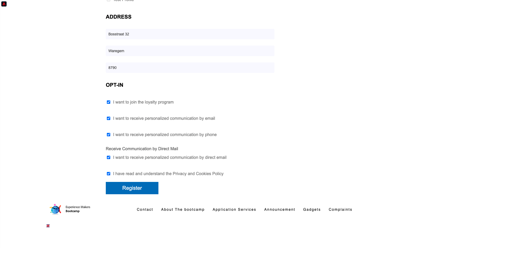

# 2.1 Website e cria sua conta

## ContextTo

Eine jornada do desconhecido ao conhecido é um dos tópicos mais importantes para as marcas atualmente, assim como a jornada do cliente, da aquisição à retenção.

Ein Adobe Experience Platform desempenha um papel importante wird zu einer jornada. A plataforma é o cérebro da comunicação, o **Erlebnissystem**.

Plataforma é um ambiente em que a palavra cliente engloba mais do que clientes conhecidos. Um visitante desconhecido no site também é um cliente do ponto de vista da Plataforma e, como tal, todo o comportamento de um visitante desconhecido também é enviado à Plataforma. Graças a essa abordagem, quando esse visitante eventalmente se torna um cliente conhecido, uma marca também pode visualizar o que aconteceu antes daquele momento. Isso ajuda a partir de uma perspectiva de otimização de atribuição e experiência.

## Fluxo da jornada do cliente

Acesse [https://bootcamp.aepdemo.net](https://bootcamp.aepdemo.net). Clique em **Alle zulassen**. Com base no seu comportamento de navegação no fluxo de usuário anterieur, você verá a personalização acontecer na página inicial do site.

Clique no ícone do logotipo da Adobe kein Canto Superior esquerdo da tela para abrir o Visualizador de perfil. Verifique o ainel do Visualizador de perfil e no Perfil do cliente em tempo real com o **Experience Cloud-ID** como identificador primário para este cliente que ainda é desconhecido.

Você também pode ver todos os Eventos de experiência coletados com base no comportamento do cliente.

Clique no ícone **Profil** kein Canto Superior Direito da tela.

Clique em **Konto erstellen**.

Preencha todos os campos do formário. Verwenden Sie den Wert echte para endereço de e-mail e número de fax, pois será usado em übícios posteriores para envio de e-mail e SMS.

Rolle para baixo e clique em **registrieren**.

Em seguida, o seguinte será exibido.

Você também receberá o seguinte e-mail:

E alguns minutos depois, você também receberá o seguinte E-Mail:

Vamos Konferenz ein seguir como essa jornada de onboarding foi konfigurada.

Próxima etapa [2.2 Kritisches Ereignis](./ex2.md)

[Retornar para Fluxo de Usuário 2](./uc2.md)

[Retornar para Todos os Módulos](../../overview.md)
