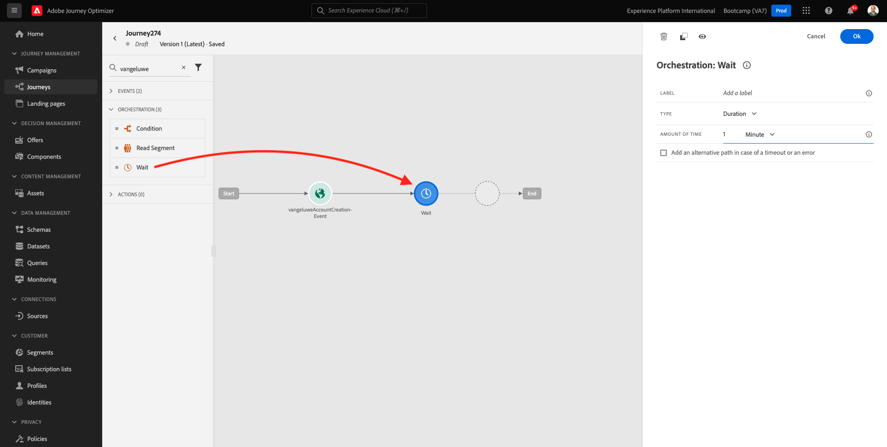
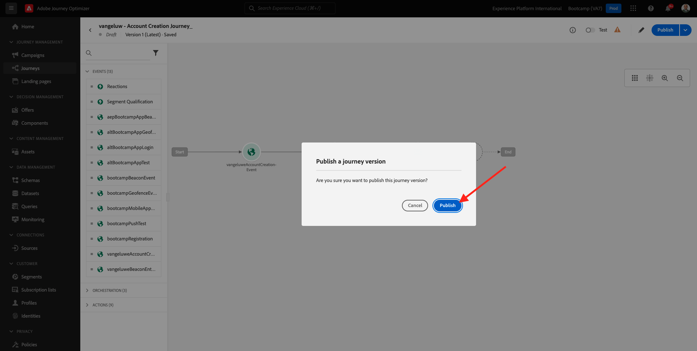

# 2.3 Crie sua jornada e mensagem de e-mail

Neste übício, você irá konfigurar a jornada que preisa ser acionada quando alguém criar uma conta no site de demonstração.

Faça meldet sich bei Adobe Journey Optimizer-Zugriff an und erhält einen [Adobe Experience Cloud](https://experience.adobe.com). Klicken Sie auf em **Journey Optimizer**.

Você será redirecionado para a visualização da **Home** no Journey Optimizer. Primeiro, verifique se você está usando o sandbox correto. O nome do sandbox que deve ser usado é `Bootcamp`. Para alternative de um sandbox para outro, clique em **Prod** e selecione o sandbox na lista. Neste exemplo, o nome do sandbox é **Bootcamp**. Você estará na visualização da **Home** do seu sandbox `Bootcamp`.

## 2.3.1 Crie a sua jornada

Kein Menü à esquerda, klicken Sie auf em **Journey**. Em seguida, clique em **Erstellen Sie Journey** para criar uma nova jornada.

Você verá uma tela de jornada vazia.

No übício anteriore, você criou um novo **Event**. Você nomeou o evento `seuSobrenomeAccountCreationEvent` e replace `seuSobrenome` pelo seu sobrenome. Este foi o result tado da criação do Evento:

Agora você deve rücksichtsar este evento como início desta Jornada. Você pode fazer isso indo para o lado esquerdo da tela e procurando pelo seu evento na lista de eventos.

Selecione seu evento, arraste e solte o evento na tela de Jornada. Sua Jornada agora deve ser semelhante ao seguinte:

Como segunda etapa da jornada, você deve adicionar uma etapa curta de **Wait**. Vá para o lado esquerdo da tela até a seção **Orchestration** para encounter isso. Você usará atributos de perfil e precisará garantir que eles sejam preenchidos no Perfil do Cliente em tempo real.

Sua jornada agora deve ser semelhante ao seguinte. Kein lado direito da tela você recisa configuration o tempo de espera. Definiert ein Komo von 1 Minute. Isso dará bastante tempo para que os atributos do perfil estejam disponíveis após o disparo do evento.

Clique em **OK** para salvar suas alterações.

Como terceira etapa da jornada, você deve adicionar uma ação **Email**. Vá para o lado esquerdo da tela para **Aktionen**, selecione a ação **E-Mail** e arraste e solte a ação no segundo nó da sua jornada. Agora o seguinte será exibido.

Definiert ein **Kategorie** -Komo **Marketing** e selecione uma **E-Mail-Oberfläche** que permita o envio de e-mail. Nesse caso, eine **E-Mail-Oberfläche** ein Benutzer selecionada é E-Mail. Certifique-se de que as caixas de selekção **Klicks auf E-Mail** e **email opens** estejam marcadas.

Ein próximo etapa é criar sua mensagem. Klicken Sie in Para auf em **Inhalt bearbeiten**.

## 2.3.2 Krim a sua mensagem

Para criar sua mensagem, clique em **Inhalt bearbeiten**.

O seguinte será exibido.

Klicken Sie auf kein Campo de texto **Betreffzeile**.

Na área de texto, comece **Olá**

Ein linha de assunto ainda não está pronta. Em seguida, você recisa trazer o token de personalização para o **Vorname** que está rüarmzenado em `profile.person.name.firstName`. Kein Menü à esquerda, Rolle para baixo para enkontra o elemento **Person** e clique na seta para visualizar mais campos

Agora encontre o elemento **Full name** e clique na seta para visualizar mais campos.

Por fim, localize o campo **Vorname** e clique no símbolo **+** ao lado dele. Você verá o token de personalização aparecer no campo de texto.

Em seguida, adicione o texto, **agradecemos a sua inscrição!**. Klicken Sie auf em **Save**.

Então, você irá retornar para esta tela. Klicken Sie auf em **E-Mail an Designer** para criar oder conteúdo do do e-mail.

Na próxima tela, será solicitado que você forneça o conteúdo e-mail através de 3 métodos diferentes:

- **Design von Grund auf neu**: Comece com uma tela em branco e use o editor WYSIWYG para arrastar e soltar a estrutura e os componentes de conteúdo para criar visualmente o conteúdo E-Mail.
- **Code Ihres eigenen**: Crie seu próprio modelo de e-mail codificando usando HTML
- **HTML importieren**: Importe um modelo HTML existente, que você poderá editar.

Klicken Sie auf em **HTML importieren**.

Array e solte o arquivo **mailtemplatebootcamp.html**, que você pode baixa [aqui](../../assets/html/mailtemplatebootcamp.html.zip). Klicken Sie auf em Wichar.

Você verá este modelo de e-mail padrão:

Vamos personalizar oder e-mail. Clique ao lado do texto **Olá** e, em seguida, clique no ícone **Add Personalization**.

Em seguida, você recisa trazer o token de personalização **Vorname** que está rüzenado em `profile.person.name.firstName`. Kein Menü, lokalisieren oder elemento **Person**, faça uma busca detalhada no elemento **Vollständiger Name** e clique no ícone **+** para adicionar o campo **Vorname** ao-Editor.

Klicken Sie auf em **Save**.

Agora você verá como campo de personalização foi adicionado ao seu texto.

Klicken Sie em **Save** para salvar sua mensagem.

Retorne para o malel de mensagens clicando na seta ao lado do texto da linha de assunto no canto überlegener esquerdo.

Agora você final a criação do seu e-mail de cadastro. Clique na seta no canto Superior esquerdo para retornar à sua jornada.

Klicken Sie auf em **OK**.

## 2.3.3 Sua jornada veröffentlichen

Você ainda preisa dar um Nome à sua jornada. Você pode fazer isso clicando no ícone **Properties** no canto überlegen direito da tela.

Você pode fazer isso clicando no item clicar no item &quot;Name&quot; e inserindo seguinte nome `yourLastName - Account Creation Journey`. Clique em **OK** para salvar as mudanças.

Agora você pode publicar sua jornada clicando em **Publish**.

Clique em **Publish** novamente.

Você verá uma barra de bestätigmação verde informando que sua jornada agora está Publicada.

Você terminou este übício.

Próxima etapa: [2,4 Teste sua jornada](./ex4.md)

[Retornar para Fluxo de Usuário 2](./uc2.md)

[Retornar para Todos os Módulos](../../overview.md)
