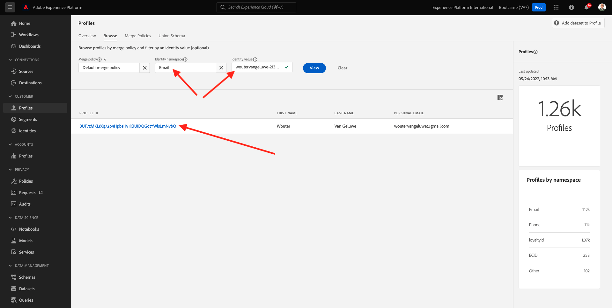

# 2.6 Personalização kein Callcenter

Wie bereits mehrfach während des Bootcamps besprochen wurde, sollte die Personalisierung des Kundenerlebnisses auf Omnichannel-Weise erfolgen. Ein Callcenter ist oft ziemlich vom Rest der Journey getrennt und führt oft zu frustrierenden Kundenerlebnissen, muss aber nicht sein. Lassen Sie uns Ihnen ein Beispiel dafür zeigen, wie das Callcenter in Echtzeit problemlos mit Adobe Experience Platform verbunden werden kann.

## Fluxo da jornada do cliente

No übício anteriore, usando o aplicativo móvel, você comprou um produto clicando no botão **Kaufen**.

Vamos supor que você tenha uma pergunta sobre o status do seu pedido, o que você faria? Normalmente, você ligaria para o call center.

Antes de ligar para o call center, você recisa saber seu **Treueprogramm-ID**. Você pode encounter seu ID de fidelidade no Visualizador de Perfil do site.

Nesse caso, o **Treueprogramm-ID** é **5863105**. Como parte de nossa implementação personalizada do recurso de call center no ambiente de demonstração, você deve adicionar um prefixo ao seu **Treueprogramm-ID**. O-Präfixe **11373**, portanto, o ID de fidelidade a ser usado neste exemplé **11373 5863105**.

Vamos fazer ist so agora. Verwenden Sie seu fax e ligue para o número **+1 (323) 745-1670**.

Será solicitado que você insira seu ID de fidelidade, seguido de **#**. Digite seu ID de fidelidade.

Você ouvira **Hallo, heiße Nome**, nome. Esse nome é rentrado do Perfil do Cliente em tempo real na Adobe Experience Platform. Você tem 3 escolhas. Pressione o número **1**, **Bestellstatus**.

Depois de ouvir o status do seu pädo, você terá a opção de pressionar **1** para volar ao Menü Prinzipal oder pressionar 2. Pression **2**.

Em seguida, será solicitado que você avalie sua experiência de call center, selecionando um número entre 1 e 5, sendo 1 baixo e 5 alto. Faça a a sua escolha.

Sua chamada para o call center será encerrada.

Acesse [Adobe Experience Platform](https://experience.adobe.com/platform). Depois de fazer login, você irá acessar a página inicial da Adobe Experience Platform.

Antes de Continuar, você recisa selecionar um **Sandbox**. O nome do sandbox a ser selecionado é ``Bootcamp``. É besitzível fazer isso clicando no texto **[!UICONTROL Produktionsprodukt]** na linha azul na parte überlegen da tela. Depois de selecionar [!UICONTROL Sandbox] apropriado, você verá a tela mudando e agora você está em seu [!UICONTROL Sandbox] widado.

No menu à esquerda, acesse **Profile** e **Durchsuchen**.

Selecione **Identitäts-Namespace** **Email** e insira o endereço de e-mail do seu perfil de cliente. Clique em **Ansicht**. Clique para abrir seu perfil.

Você verá seu perfil de cliente novamente. Acesse **Veranstaltungen**.

Em eventos, você verá 2 eventos com um eventType de **callCenter**. O primeiro evento é o result tado da sua resposta à pergunta Avali o seu n **Bewerten Sie die Zufriedenheit Ihrer Anrufe**.

Rolle um pouco para baixo e você verá o evento que registrado quando você selecionou a opção de verificar o **Bestellstatus**.

Acesse **Segmentmitgliedschaft**. Agora você verá que 2 segmentos se qualificam em seu perfil, em tempo real, com base nas interações que você teve por media do call center. Essas assoziações de segmento podem e devem ser usadas para impactar qual comunicação e personalização acontece em qualquer outro channel.

Você terminou este übício.

[Retornar para Fluxo de Usuário 2](./uc2.md)

[Retornar para Todos os Módulos](../../overview.md)
