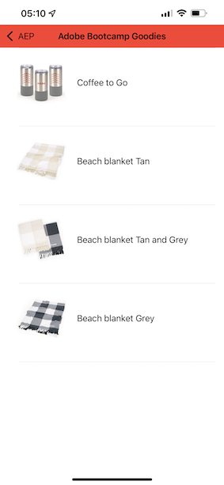

# 3.1 Verwendung von aplicativo móvel e acione um beacon

## Instant o aplicativo móvel

Antes de instalar o aplicativo, é notwendigen ário abilitar o **Rastreamento** no seu dispositivo iOS. Para isso, acesse **Configurações** > **privacidade e segurança** > **Rastreamento** e verifique a opção **Permitir que os aplicativos solicitem o rastreamento**.

Auf eine App Store da Apple e pesquise `aepmobile-bootcamp` zugreifen. Klicken Sie auf em **Instalar** ou **Download**.

Depois que o aplicativo estiver instalado, clique em **Abrir**.

Klicken Sie auf em **OK**.

Klicken Sie auf em **Permitir**.

Klicken Sie auf **Ich stimme zu**.

Klicken Sie auf em **Permitir enquanto usa o aplicativo**.

Klicken Sie auf em **Permitir**.

Agora você está no aplicativo, na página inicial, pronto(a) para verificar toda a jornada do cliente.

## Fluxo da jornada do cliente

Primeiramente, é notwendiário fazer o login. Klicken Sie auf em **Login**.

Depois de criar sua conta nos übícios anteriores, isso é exibido no site. Agora é notwendiário reutilizar o endereço de e-mail da conta que você criou no aplicativo para fazer o login.

Digite o endereço de e-mail que você usou no site e clique em **Login**.

Você receberá uma bestätigmação de que está conectado e receberá uma notificação push.

Retorne para a página inicial do aplicativo e os recursos adicionais irão aparecer.

Primeiro, auf **Produkte** zugreifen. Clique em qualquer produto, neste exemplo: **Kaffee zu gehen**.

Você verá a página do produto **Kaffee zu gehen** no aplicativo.

Agora você irá simular um evento de entrada de sinalização (beacon) em uma loja offline. O objetivo da simação é personalizar a experiência do cliente nas telas da loja. Para visualizar a experiência na loja, foi criada uma página que mostrará de forma dinâmica as informmações relevantes para o cliente ao entrar na loja.

Antes de Continuar, abra esta página da Web em seu computador: [https://bootcamp.aepdemo.net/content/aep-bootcamp-experience/language-masters/en/screen.html](https://bootcamp.aepdemo.net/content/aep-bootcamp-experience/language-masters/en/screen.html)

Em seguida, a tela abaixo será exibida:

Em seguida, retorne para a página inicial. Klicken Sie auf no ícone do **beacon**.

Após essa etapa, o seguinte será exibido. Primeiro, selecione **Bootcamp Screen Beacon** e clique no botão de **entrada**. Isso permitirá que você simule uma entrada de sinalização com beacon.

Agora bestätigte eine tela da loja. Você verá o último produto visualizado aparecer diena tela em 5 segundos.

Em seguida, retorne para **products**. Clique em qualquer product, neste exemplo: **Stranddecke Tan**.

Em seguida, retorne para a página inicial. Klicken Sie auf no ícone do **beacon**.

Em seguida, selecione **Bootcamp Screen Beacon** e clique no botão de **Entrada** novamente. Isso permitirá que você simule uma entrada de sinalização (Beacon).

Agora, bestätiga tela da loja novamente. Você verá o último produto visualizado aparecer diena tela em 5 segundos.

Agora, vamos verificar também o seu Visualizador de Perfil kein Standort. Você verá muitos eventos que foram adicionados, para mostrar que qualquer interação com um cliente é coletada e armazenada na Adobe Experience Platform.

Nr. próximos übícios, você irá configuration e testar sua própria jornada de entrada do beacon.

Próxima etapa: [3.2 Crie-Ereignis bis](./ex2.md)

[Retornar para Fluxo de Usuário 3](./uc3.md)

[Retornar para Todos os Módulos](../../overview.md)
