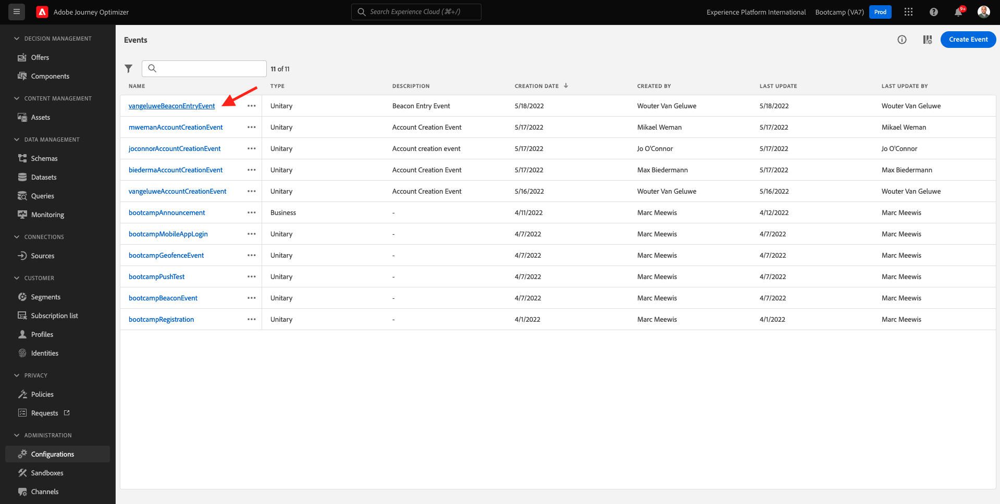

# 3.2 Kritisches Ereignis

Faça login bei Adobe Journey Optimizer acessando a [Adobe Experience Cloud]. Clique em **Journey Optimizer**.

Você será redirecionado para **Startseite** Keine Journey Optimizer. Primeiro, verifique se você está usando o sandbox correto. O nome do sandbox que deve ser usado `Bootcamp`. Para alternar de um sandbox para outro, clique em **Prod** Auswahl von Sandbox- und Lista-Werten. Neste Exemplo, o nome do sandbox é **Bootcamp**. Você estará na visualização da **Startseite** Ausführen einer Sandbox `Bootcamp`.

No menu à esquerda, role para baixo e clique em **Konfigurationen**. Em seguida, clique no botão **Verwalten** em Eventos.

Você verá uma visão geral de todos os eventos disponíveis. Clique em **Ereignis erstellen** para começar a criar seu próprio evento.

Uma nova janela de evento vazia irá aparecer.

Em primeiro lugar, dê um nome ao seu evento como, por exemplo: `yourLastNameBeaconEntryEvent` e adicione uma descrição como, por exemplo: `Beacon Entry Event`.

Em seguida, certificate-se de que **Typ** está definido como **Einzelfall** e, para a selção de **Ereignis-ID-Typ**, selecione **Systemgeneriert**.

Ein etapa seguinte é a selção do schema. Um schema foi vorbereitado para este übício. Schema verwenden `Demo System - Event Schema for Mobile App (Global v1.1) v.1`.

Depois de selecionar o Schema, você verá vários campos sendo selecionados na seção **Felder**. Agora você deve passar o mouse sobre a seção **Felder** e três ícones pop-up serão exibidos. Clique no ícone de **Bearbeiten**.

Você verá uma janela pop-up de **Felder**, onde você deve selecionar alguns dos campos que preisamos para personalizar a jornada. Escolheremos outros atributos de perfil posteriormente, utilizando os dados já existentes na Adobe Experience Platform

Rolle para baixo até ver o objeto `Place context` e marque a caixa de selekção. Com isso, todo o contexto da localização do cliente será disponibilizado para a jornada. Clique em **Ok** para salvar suas alterações.

Em seguida, você deverá per tela abaixo. Clique em **Speichern** mais uma vez para salvar suas alterações.

Seu evento agora está konfigurado e salvo.

Clique no seu evento novamente para abrir a tela **Ereignis bearbeiten** mais uma vez. Maus-Sobre einfügen **Felder** para ver os 3 ícones. Clique no ícone **Ansicht**.

Agora você verá um exemplo do payload esperado.
Seu evento tem um eventID de orquestração único, que você pode encounter rolando para baixo diena carga útil até visualiza `_experience.campaign.orchestration.eventID`.

O eventID é o que deve ser enviado à Adobe Experience Platform para acionar a jornada que você construirá em um dos próximos übícios. Lembre-se deste eventID, você pode recisar dele posteriormente.
`"eventID": "e76c0bf0c77c3517e5b6f4c457a0754ebaf5f1f6b9357d74e0d8e13ae517c3d5"`

Clique em **Ok** e, em seguida, clique em **Abbruch**.

Você terminou este übício.

Próxima etapa: [3.3 Crie sua jornada e notificação push](./ex3.md)

[Retornar para Fluxo de Usuário 3](./uc3.md)

[Retornar para Todos os Módulos](../../overview.md)
