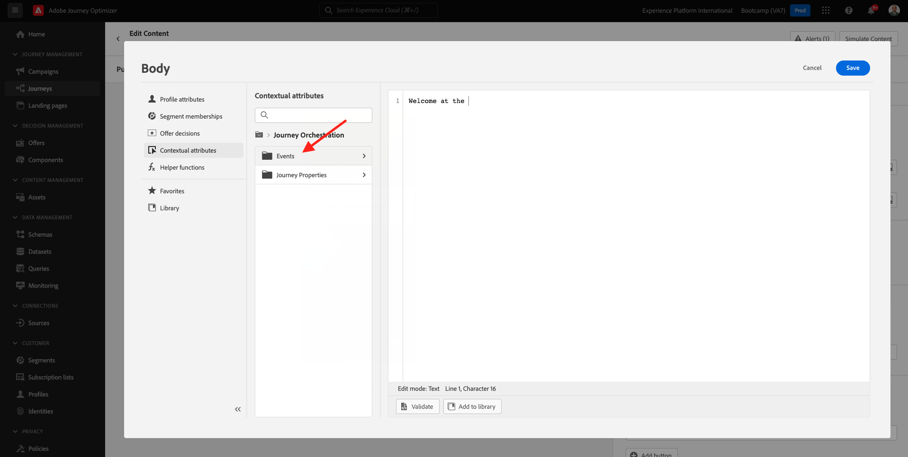

# 3.3 Crie sua jornada e notificação push

Neste ercício, você irá configurar a jornada e a menagem que precisa ser acionada quando alguém inserir uma sinalização (Beacon) usando o aplicativo móvel.

Faça Anmeldung auf Adobe Journey Optimizer acessando a [Adobe Experience Cloud](https://experience.adobe.com). Klicken Sie auf AEM **Journey Optimizer**.

Você será redirecionado para a visualização da **Home** no Journey Optimizer. Primeiro, verifique se você está usando oder sandbox correto. O nome do sandbox que deve ser usado é `Bootcamp`. Para alternative de um sandbox para outro, clique em **prod** e selecione o sandbox na lista. Neste exemplo, o nome do sandbox é **Bootcamp**. Você estará na visualização da **Home** do seu sandbox `Bootcamp`.

## 3.3.1 Crie a sua jornada

Kein Menü à esquerda, clique em **Journey**. Em seguida, clique em **Create Journey** para criar uma nova jornada.

Você verá uma tela de jornada vazia.

No ercício anterior, você criou um novo **Event**. Você nomeou o evento `yourLastNameBeaconEntryEvent` e substituiu `yourLastName` pelo seu sobrenome. Este foi o resultado da criação do Evento:

Agora você deve Considerar este evento como o início desta Jornada. Você pode fazer isso indo para o lado esquerdo da tela e procurando pelo seu event to na lista de eventos.

Selecione seu evento, arraste e solte o evento na tela de jornada. Sua jornada agora deve ser semelhante ao seguinte. Clique em **OK** para salvar suas alterações.

Como segunda etapa da jornada, você deve adicionar uma ação **Push**. Vá para o lado esquerdo da tela **Actions**, selecione a ação **Push** e arraste e solte a ação no segundo nó da sua jornada.

No lado direito da tela, agora você deve criar sua notificação push.

Definieren Sie eine **Kategorie** como **Marketing** e selecione um push surface que permite enviar notificações push. Nesse caso, a superfície push a ser selecionada é **mmeeewis-app-mobile-bootcamp**.

## 3.3.2 Crie a sua menagem

Klicken Sie auf **Inhalt bearbeiten**.

Em seguida, a tela abaixo será exibida:

Vamos definir o conteúdo da notificação push.

Clique no campo de texto **Titel**.

Na área de texto, comece **Olá**. In: Clique no ícone de personalização.

Agora você precisa trazer o token de personalização para o campo **Vorname** que está armazenado em `profile.person.name.firstName`. Kein Menü à esquerda, selecione **Profilattribute**, role para baixo/navegue para encontra o elemento **Person** e clique na seta para avançar um nível até chegar ao campo `profile.person.name.firstName`. Clique no ícone **+** para adicionar o campo à tela. Klicken Sie auf **Speichern**.

Então, você irá retornar para esta tela. Clique no ícone de personalização ao lado do campo **Body**.

Na área de texto, escreva `Bem-vindo(a)`.

em seguida, clique em **Kontextattribute** e **Journey Orchestration**.

Klicken Sie auf **Ereignisse**.

Clique no nome do seu event, que deve ser semelhante ao seguinte: **yourLastNameBeaconEntryEvent**.

Clique EM **Ortskontext**.

Clique EM **POI Interaction**.

Clique EM **POI-Detail**.

Klicken Sie auf Kein **+** Symbol **POI-Name**.
Em seguida, o seguinte será exibido. Klicken Sie auf **Speichern**.

In: Sua menagem agora está pronta. Clique na seta no canto superior esquerdo para retornar à sua jornada.

Clique EM **OK**.

## 3.3.2 Envie uma menagem para uma tela

Como terceira etapa da jornada, você deve adicionar uma ação **sendMessageToScreen**. Vá para o lado esquerdo da tela **Actions**, selecione a ação **sendMessageToScreen** e arraste e solte a ação no terceiro nó da sua jornada. Em seguida, você verá a tela abaixo

**sendMessageToScreen** é uma ação personalizada que irá publicar uma menagem no **Endpoint** usado pela exibição na loja. A ação **sendMessageToScreen** espera que múltiplas variáveis sejam definidas. Você pode visualizar essas variáveis rolando para baixo até ver **Aktionsparameter**.

Agora você precisa definir os valores para cada parâmetro de ação. Siga esta tabela para entender quais valores são necários e onde.

| Parameter | Wert |
|:-------------:| :---------------:|
| VERSAND | `'image'` |
| ECID | `@{yourLastNameBeaconEntryEvent._experienceplatform.identification.core.ecid}` |
| VORNAME | `#{ExperiencePlatform.ProfileFieldGroup.profile.person.name.firstName}` |
| EREIGNISBETREFF | `#{ExperiencePlatform.ProductListItems.experienceevent.first(currentDataPackField.eventType == "commerce.productViews").productListItems.first().name}` |
| EVENTSUBJECTURL | `#{ExperiencePlatform.ProductListItems.experienceevent.first(currentDataPackField.eventType == "commerce.productViews").productListItems.first()._experienceplatform.core.imageURL}` |
| SANDBOX | `'bootcamp'` |
| CONTAINER-ID | `''` |
| ACTIVITYID | `''` |
| PLACEMENTID | `''` |

{style="table-layout:auto"}

Para definir esses valores, clique no ícone **Bearbeiten**.

em seguida, selecione **Erweiterter Modus**.

Em seguida, cole o valor com base na tabela acima. Clique EM **OK**.

In: Repita esse proceso para adicionar valores para cada.

>[!IMPORTANT]
>
>Para o campo ECID, há uma referência ao evento`yourLastNameBeaconEntryEvent`. In: Lembre-se de substituir `yourLastName` pelo seu sobrenome.

O resultado final deve ser semelhante ao seguinte:

Role para cima e clique em **OK**.

Sie müssen Ihrem Journey dennoch einen Namen geben. Klicken Sie dazu auf das Symbol **Eigenschaften** oben rechts auf Ihrem Bildschirm.

Você pode inserir o nome da jornada aqui. `yourLastName - Beacon Entry Journey` verwenden. Clique em **OK** para salvar suas alterações.

Agora você pode publicar sua jornada clicando em **Publish**.

Clique em **Publish** novamente.

Você verá uma barra de confirmação verde informando que sua jornada agora está Publicada.

In: Sua jornada agora está ativa e pode ser acionada.

In: Você terminou este exercício.

Próxima etapa: [3.4 Teste sua jornada](./ex4.md)

[Retornar para Fluxo de Usuário 3](./uc3.md)

[In: Retornar para Todos os Módulos](../../overview.md)
