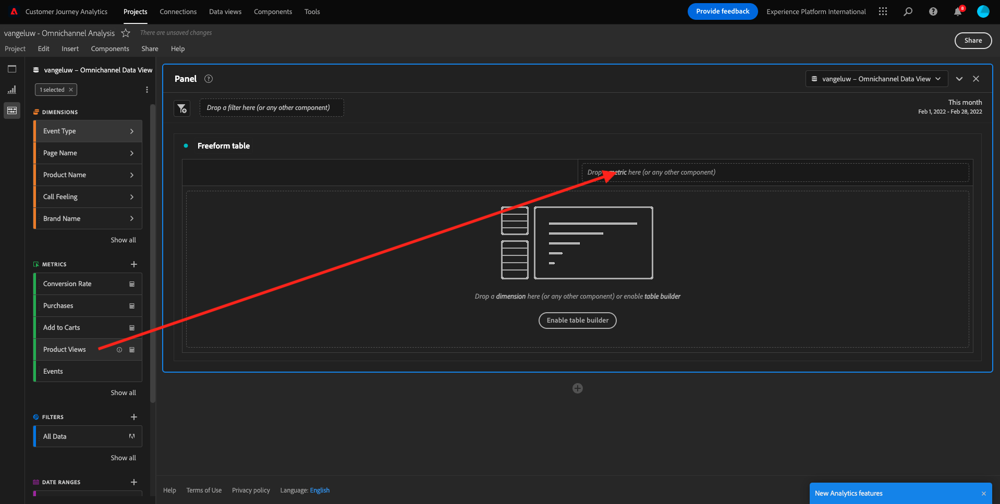
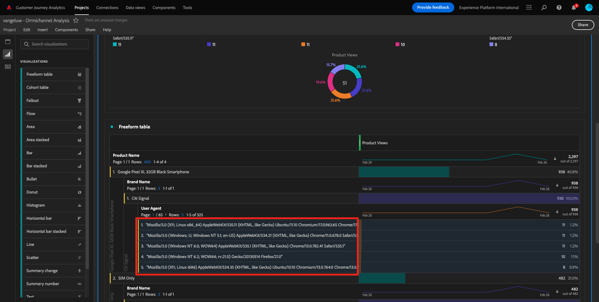

# 4.5 Visualização usando o Customer Journey Analytics

## objektivisch

- Entenda a UI do Analysis Workspace
- Conheça alguns recursos que tornam o Analysis Workspace tão diferente.
- Aprenda a analisar no CJA usando o Analysis Workspace

## ContextTo

Neste ercício, você usará o Analysis Workspace no CJA para analisar visualizações de produtos, funis de produtos, rotatividade, etc.

Vamos usar o projeto que você criou em [4.4 Preparação de dados no Analysis Workspace](./ex4.md), então acesse [https://analytics.adobe.com](https://analytics.adobe.com).

Abra seu projeto `yourLastName - Omnichannel Analysis`.

Com seu projeto aberto e visualização de dados `yourLastName - Omnichannel Analysis` selecionado, você está pronto para começar a construir suas primeiras visualizações.

## Wie sieht die Visualisierung aus?

Em primeiro lugar, precisamos selecionar as datas certas para analisar os dados. Zugang zum Menü suspenso do calendário no lado direito da tela. In: Clique nele e selecione o intervalo de datas aplicável.

>[!IMPORTANT]
>
>Selecione um intervalo de datas como **Diese Woche** ou **Diesen Monat**. Os dados disponíveis mais recentes foram absorvidos em 19 de setembro de 2022.

Kein Menü do lado esquerdo (área de componentes), encontre as métricas calculate **(Produktansichten**. Selecione-as e arraste e solte na tela, no canto superior direito da tabela de forma livre.

Automated dimensão **Day** será adicionada para criar sua primeira tabela. Agora você pode ver sua pergunta respondida imediatamente.

Em seguida, clique com o botão direito do mouse no resumo da métrica.

Clique em **Visualize** e selecione **Line** como visualização.

Você verá as suas visualizações de produto por dia.

Você pode alterar o escopo de tempo para o dia clicando em **Settings** na visualização.

Clique no ponto ao lado de **Line** e **Manage the Data Source**.

Em seguida, clique em **Lock Selection** e selecione **Selected Items** para bloquear esta visualização para que ela sempre exiba uma linha do tempo de visualizações de produtos.

## 5 produtos mais vistos

Quais são os 5 produtos mais vistos?

In: Lembre-se de salvar o projeto de tempos em tempos.

| Betriebssystem | Abkürzung |
| ----------------- |-------------| 
| Windows | Strg+S |
| Mac | Befehl + S |

Vamos começar a encontra os 5 produtos mais vistos. Kein Menü do lado esquerdo, encontre o Nome do produto - Dimensão.

Agora arraste e solte **Produktname** para substituir a dimensão **Day**:

In: Este será o resultado.

Em seguida, tente dividir um dos produtos por Nome da marca. Pesquise **brandName** e arraste para baixo do primeiro nome do produto.

Em seguida, faça um detalhamento usando o agente de usuário. Pesquise **User agent** e arraste-o para baixo do nome da marca.

Em seguida, será exibida a tela abaixo:

Por fim, você pode adicionar mais visualizações. Kein lado esquerdo, em visualizações, pesquise `Donut`. Pegue `Donut`, arraste e solte na tela sob a visualização **Line** 

Wählen Sie als Nächstes in der Tabelle die ersten 5 Zeilen **Benutzeragenten** aus der Aufschlüsselung aus, die wir unter **Google Pixel XL 32 GB Black Smartphone** > **Citi Signal** durchgeführt haben. Halten Sie die Taste **STRG** (unter Windows) oder die Taste **Befehl** (unter Mac) gedrückt, während Sie die 5 Zeilen auswählen.

Em seguida, na Tabela, selecione as primeiras 5 linhas de **User agent** do detalhamento que fizemos em **Google Pixel XL 32GB Black Smartphone** > **Citi Signal**. Ao selecionar as 5 linhas, segure o botão **CTRL** (no Windows) ou o botão **Command** (no Mac).

Você verá o gráfico de donut alterado:

Você pode até adaptar o design para ser mais legível, tornando o gráfico de **Line** e o gráfico de **Donut** um pouco menor para que sejam exibidos lado a lado:

Clique no ponto ao lado de *Donut** para **Manage the Data Source**. Em seguida, clique em **Lock Selection** para bloquear essa visualização para que ela sempre exiba uma linha do tempo de visualizações de produto.

Saiba mais sobre visualizações usando o Analysis Workspace em:

- [https://experienceleague.adobe.com/docs/analytics/analyze/analysis-workspace/visualizations/freeform-analysis-visualizations.html](https://experienceleague.adobe.com/docs/analytics/analyze/analysis-workspace/visualizations/freeform-analysis-visualizations.html)
- [https://experienceleague.adobe.com/docs/analytics/analyze/analysis-workspace/visualizations/t-sync-visualization.html](https://experienceleague.adobe.com/docs/analytics/analyze/analysis-workspace/visualizations/t-sync-visualization.html)

## Funil de interação do produto, da visualização à compra

Existem muitas formas de resolver esta questão. Uma delas é usar o Tipo de Interação de Produto e usá-lo em uma tabela de formato livre. Outra forma é usar uma **Fallout-Visualisierung**. Vamos usar o último, pois queremos visualizar e analisar ao mesmo tempo.

Feche o painel tatsächlich clicando aqui:

Agora adicione um novo painel em branco clicando em **+ Blankes Feld hinzufügen**.

In: Clique na visualização de **Fallout**.

In: Selecione o mesmo intervalo de datas do ercício anterior.

Em seguida, você verá:

Geben Sie eine dimensão **Ereignistyp** nos components no lado esquerdo ein:

Clique na seta para abrir a dimension:

Você verá todos os Tipos de eventos disponíveis.

Wählen Sie ein Element aus **commerce.productViews** e arraste e solte-o no campo **Touchpoint hinzufügen** dentro da **Fallout-Visualisierung**.

Faça o mesmo com **commerce.productListAdds** and **commerce.purchases** e solte-os no campo **Touchpoint hinzufügen** dentro da **Fallout-Visualisierung**. Sua visualização agora deve ser semelhante ao seguinte:

Você pode fazer muitas coisas aqui. Alguns beispielhaft: comparar ao longo do tempo, comparar cada passo por dispositivo ou comparar por fidelidade. No entanto, se quisermos analisar coisas interessantes como porque os clientes não compram depois de adicionar um item ao carrinho, podemos usar a melhor ferramenta do CJA: clicar com o botão direito.

Clique com o botão direito do mouse no Touchpoint **commerce.productListAdds**. Em seguida, clique em **Fallout aufschlüsseln an diesem Touchpoint**.

Uma nova tabela de formato livre será criada para analisar o que as pessoas fizeram são compraram.

Altere o **Ereignistyp** von **Seitenname**, na nova tabela de formato livre, para ver em quais páginas eles estão indo, em vez da Página de confirmação de compra.

## O que as pessoas fazem no site antes de acessar a página Cancelar serviço?

Novamente, há muitas formas de realizar essa análise. In: Vamos usar a análise de fluxo para iniciar parte da descoberta.

Feche o painel tatsächlich clicando aqui:

Agora adicione um novo painel em branco clicando em **+ Blankes Feld hinzufügen**.

In: Clique na visualização **Flow**.

Em seguida, será exibido:

In: Selecione o mesmo intervalo de datas do ercício anterior.

Geben Sie eine dimensão **Seitenname** nos components no lado esquerdo ein:

Clique na seta para abrir a dimension:

Você encontrará todas as páginas vistas. Encontre o nome da página: **Service**.
Arraste e solte **Service** na visualização de fluxo no campo do meio:

Em seguida, será exibido:

Vamos agora analisar se os clientes que visitaram a página C **Cancel Service** no site também ligaram para o call center e qual foi o resultado.

In: Nas dimensões, retorne e encontre tipo de interação de chamada. Arraste e solte **Call Interaction Type** para substituir a primeira interação à direita em **Flow Visualization**.

Agora você visualiza o ticket de suporte dos clientes que ligaram para a central de atendimento depois de visitar a página **Service**.

EM seguida, nas dimensões, **Call Feeling**. Arraste e solte para substituir a primeira interação à direita na visualização de fluxo.

Em seguida, será exibido:

Como pode ver, Executamos uma análise Omnichannel usando a visualização de fluxo. Graças a isso, descobrimos que alguns clientes que estavam pensando em cancelar o serviço tiveram uma avaliação positiva depois de ligar para o call center. Talvez tenhamos mudado de ideia com uma promoção?

## Sind die Kunden in der Lage, Callcenter-Positivo- und Relação-aos-Prinzipale zu kontaktieren?

Primeiramente, vamos segmentar os dados para obter apenas usuários com chamadas **positiv**. Keine CJA, os Segmentos são chamados de Filtros. Acesse para filtros na área de componentes (no lado esquerdo) e clique em **+**.

Dentro do Construtor de filtro, dê um nome ao filtro

| Name | Beschreibung |
| ----------------- |-------------| 
| Call Feeling - Positiv | Call Feeling - Positiv |

Nr. componentes (dentro do Construtor de filtro), encontre **Call Feeling** e arraste e solte na Definição do Construtor de filtro.

Agora selecione **positiv** como valor para o filtro.

Altere o escopo para o nível **Person**.

Para finalizar, basta clicar em **Speichern**.

Então, você irá retornar para esta tela. Se ainda não retornou, feche o painel anterior.

Agora adicione um novo painel em branco clicando em **+ Blankes Feld hinzufügen**.

In: Selecione o mesmo intervalo de datas do ercício anterior.

Clique EM **Freiformtabelle**.

Agora arraste e solte o filtro que você acabou de criar.

In: Hora de adicionar algumas métricas. Comece com **Produktansichten**. In: Arraste e solte na tabela de forma livre. Você também pode excluir a métrica **Events**.

Faça o mesmo com **People**, **In den Warenkorb** e **Bestellungen**. Você vai acabar com uma tabela como a seguinte.

Graças à primeira análise de fluxo, uma nova pergunta surgiu. Então decidimos criar esta tabela e verificar alguns KPIs em um segmento para responder a essa pergunta. Como você pode ver, o tempo de insight é muito mais rápido do que usar SQL ou usar outras soluções de BI.

## Recapitulação do Analysis Workspace e do Customer Journey Analytics

O Analysis Workspace entfernen todas als limitações típicas de um relatório do Analytics. Ele fornece uma tela robusta e flexível para criar projetos de analytics personalizados. Arraste e solte qualquer número de tabelas de dados, visualizações e componentes (dimensões, métricas, segmentos e granularidades de tempo) para um project. Você pode criar de forma instantânea filtros e analises, gráficos de corte, alertas, segmentos, análises de fluxo e relatórios de curadoria e agendamento para compartilhar com qualquer pessoa em seu negócio.

Próxima etapa: [4.6 De Insights a ação](./ex6.md)

[Retornar para Fluxo de Usuário 4](./uc4.md)

[In: Retornar para Todos os Módulos](./../../overview.md)
