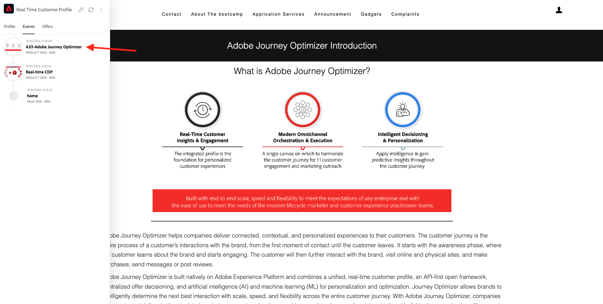

# 1.1 Von unbekannt bis bekannt auf der Website

## Kontext

Die Journey von Unbekannt zu Bekanntem ist heutzutage eines der wichtigsten Markenthemen, ebenso wie die Kunden-Journey von der Akquise bis zur Bindung.

Adobe Experience Platform spielt bei dieser Journey eine große Rolle. Platform ist das Gehirn für Kommunikation, das **Erlebnissystem der Aufzeichnung**.

Platform ist eine Umgebung, in der das Wort Kunde weiter gefasst ist als nur die bekannten Kunden. Ein unbekannter Besucher auf der Website ist auch aus Sicht von Platform ein Kunde. Daher wird das gesamte Verhalten eines unbekannten Besuchers ebenfalls an Platform gesendet. Dank dieses Ansatzes kann sich eine Marke, wenn dieser Besucher schließlich ein bekannter Kunde wird, auch vor diesem Moment vorstellen, was passiert ist. Dies hilft aus Sicht der Attribution und Erlebnisoptimierung.

## Kunden-Journey-Fluss

Navigieren Sie zu [https://bootcamp.aepdemo.net](https://publish9122.adobedemo.com/content/aep-bootcamp-experience/language-masters/en.html). Klicken Sie **Alle zulassen**.

Klicken Sie auf das Adobe-Logo oben links im Bildschirm, um den Profil-Viewer zu öffnen.

Sehen Sie sich das Bedienfeld Profil-Viewer und das Echtzeit-Kundenprofil mit der **Experience Cloud-ID** als primäre Kennung für diesen derzeit unbekannten Kunden an.

Sie können auch alle Erlebnisereignisse sehen, die basierend auf dem Verhalten des Kunden erfasst wurden. Die Liste ist derzeit leer, aber das wird sich bald ändern.

Rufen Sie die Menüoption **Anwendungsdienste** auf und klicken Sie auf das Produkt **Real-Time CDP**.

Anschließend wird die Produktdetailseite angezeigt. Ein Erlebnisereignis vom Typ **Produktansicht** wurde jetzt mithilfe der Web-SDK-Implementierung, die Sie in Modul 1 überprüft haben, an Adobe Experience Platform gesendet. Öffnen Sie das Bedienfeld Profil-Viewer und sehen Sie sich Ihre **Erlebnisereignisse“**.

Rufen Sie die Menüoption **Anwendungsdienste** auf und klicken Sie auf das Produkt **Adobe Journey Optimizer**. Ein weiteres Erlebnisereignis wurde an Adobe Experience Platform gesendet.

Öffnen Sie das Bedienfeld Profil-Viewer . Es werden jetzt zwei Erlebnisereignisse vom Typ **Produktansicht** angezeigt. Während das Verhalten anonym ist, wird jeder Klick in Adobe Experience Platform verfolgt und gespeichert. Sobald der anonyme Kunde bekannt wird, können wir das gesamte anonyme Verhalten automatisch mit dem bekannten Profil zusammenführen.

Analysieren wir jetzt Ihr Kundenprofil und verwenden wir Ihr Verhalten, um Ihr Kundenerlebnis auf der Website zu personalisieren.

Nächster Schritt: [1.2 Visualisieren Sie Ihr eigenes Echtzeit-Kundenprofil - Benutzeroberfläche](./ex2.md)

[Zurück zu Benutzerfluss 1](./uc1.md)

[Zurück zu „Alle Module“](../../overview.md)
