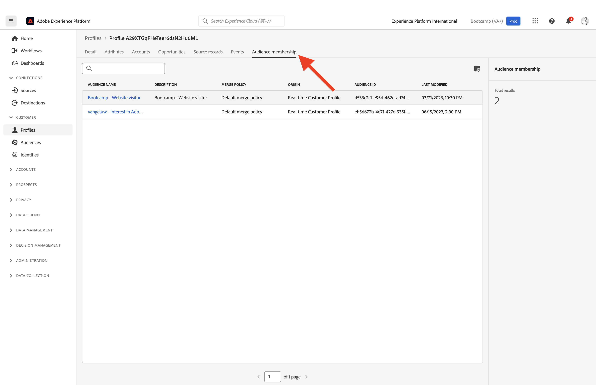

# 1.2 Visualisieren Sie Ihr eigenes Echtzeit-Kundenprofil - Benutzeroberfläche

In dieser Übung melden Sie sich bei Adobe Experience Platform an und sehen sich Ihr eigenes Echtzeit-Kundenprofil in der Benutzeroberfläche an.

## Geschichte

Im Echtzeit-Kundenprofil werden alle Profildaten zusammen mit Ereignisdaten sowie vorhandenen Zielgruppenmitgliedschaften angezeigt. Die angezeigten Daten können von überall kommen, von Adobe-Anwendungen und externen Lösungen. Dies ist die leistungsstärkste Ansicht in Adobe Experience Platform, das wahre Erlebnissystem der Aufzeichnungen.

## 1.2.1 Verwenden der Kundenprofilansicht in Adobe Experience Platform

Wechseln Sie zu [Adobe Experience Platform](https://experience.adobe.com/platform). Nach der Anmeldung landen Sie auf der Startseite von Adobe Experience Platform.

Bevor Sie fortfahren, müssen Sie eine **Sandbox** auswählen. Die auszuwählende Sandbox heißt ``Bootcamp``. Klicken Sie dazu in der blauen Zeile oben auf Ihrem Bildschirm auf den Text **[!UICONTROL Produktions-Prod]** . Nachdem Sie die entsprechende [!UICONTROL Sandbox] ausgewählt haben, sehen Sie die Bildschirmänderung und befinden sich nun in Ihrer dedizierten [!UICONTROL Sandbox].

Gehen Sie im linken Menü zu **Profile** und zu **Durchsuchen**.

Im Bedienfeld &quot;Profil-Viewer&quot;auf Ihrer Website finden Sie die Identitätsübersicht. Jede Identität ist mit einem Namespace verknüpft.

Bei Adobe Experience Platform sind alle IDs gleichermaßen wichtig. Zuvor war die ECID die wichtigste ID im Adobe-Kontext, und alle anderen IDs waren hierarchisch mit der ECID verknüpft. Bei Adobe Experience Platform ist dies nicht mehr der Fall und jede ID kann als primäre Kennung betrachtet werden.

In der Regel hängt die primäre Kennung vom Kontext ab. Wenn Sie Ihr Callcenter fragen, **Was ist die wichtigste ID?** werden sie wahrscheinlich antworten, **die Telefonnummer!** Wenn Sie jedoch Ihr CRM-Team fragen, antworten diese, **Die E-Mail-Adresse!** Adobe Experience Platform versteht diese Komplexität und verwaltet sie für Sie. Jede Anwendung, ob Adobe-Anwendung oder Nicht-Adobe-Anwendung, spricht mit Adobe Experience Platform, indem sie auf die ID verweist, die sie als primär betrachten. Und es funktioniert einfach.

Wählen Sie für das Feld **Identitäts-Namespace** die Option **ECID** aus und geben Sie für das Feld **Identitätswert** die ECID ein, die Sie im Profilanzeige-Bedienfeld der Bootcamp-Website finden können. Klicken Sie auf **Ansicht**. Ihr Profil wird dann in der Liste angezeigt. Klicken Sie auf die **Profil-ID** , um Ihr Profil zu öffnen.

Sie sehen jetzt eine Übersicht über einige wichtige **Profilattribute** Ihres Kundenprofils.

Navigieren Sie zu **Ereignisse** , wo Sie Einträge für jedes Erlebnisereignis sehen können, das mit Ihrem Profil verknüpft ist.

Navigieren Sie schließlich zur Menüoption **Zielgruppenmitgliedschaft**. Jetzt werden alle Zielgruppen angezeigt, die für dieses Profil qualifiziert sind.

Erstellen wir nun eine neue Zielgruppe, mit der Sie das Kundenerlebnis für einen anonymen oder bekannten Kunden personalisieren können.

Nächster Schritt: [1.3 Erstellen einer Zielgruppe - Benutzeroberfläche](./ex3.md)

[Zurück zum Benutzerfluss 1](./uc1.md)

[Zu allen Modulen zurückkehren](../../overview.md)
