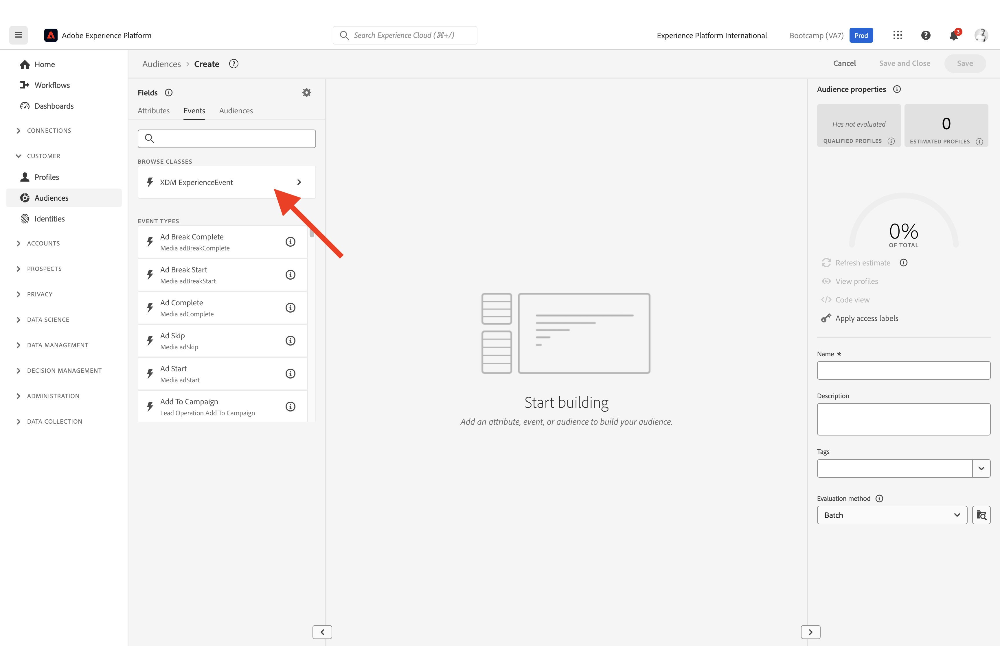

# 1.3 Erstellen einer Zielgruppe - Benutzeroberfläche

In dieser Übung erstellen Sie eine Zielgruppe, indem Sie den Audience Builder von Adobe Experience Platform verwenden.

## Story

Zu [Adobe Experience Platform](https://experience.adobe.com/platform). Nach dem Login landen Sie auf der Homepage von Adobe Experience Platform.

Bevor Sie fortfahren, müssen Sie eine **Sandbox“**. Die auszuwählende Sandbox hat den Namen ``Bootcamp``. Klicken Sie dazu auf den Text **[!UICONTROL Produktion]** in der blauen Linie am oberen Bildschirmrand. Nach Auswahl der entsprechenden [!UICONTROL Sandbox] wird der Bildschirm geändert und Sie befinden sich nun in Ihrer dedizierten [!UICONTROL Sandbox].

Gehen Sie im Menü auf der linken Seite zu **Zielgruppen**. Auf dieser Seite werden Dashboards mit wichtigen Informationen zur Leistung von **Audience** angezeigt.

Klicken Sie auf **Durchsuchen**, um eine Übersicht aller bestehenden Audiences anzuzeigen. Klicken Sie auf die Schaltfläche **+ Zielgruppe erstellen**, um mit der Erstellung einer neuen Zielgruppe zu beginnen.

**Es wird ein Pop-up angezeigt, in dem Sie gefragt werden, ob Sie die Regel &quot;** erstellen“ oder &quot;**erstellen“** möchten. Wählen Sie „Regel erstellen **aus** um fortzufahren, und klicken Sie auf **Erstellen**.

![Segmentierung][def]

Sobald Sie sich im Audience Builder befinden, bemerken Sie sofort die Menüoption **Attribute** und die Referenz **XDM Individual Profile**.

Da XDM die Sprache ist, die das Experience Business unterstützt, ist XDM auch die Grundlage für den Audience Builder. Alle in Platform aufgenommenen Daten sollten XDM zugeordnet werden. Daher werden alle Daten unabhängig davon, woher sie stammen, Teil desselben Datenmodells. Dies bietet Ihnen beim Erstellen von Zielgruppen einen großen Vorteil, da Sie über diese eine Audience Builder-Benutzeroberfläche Daten aus jedem Ursprung im selben Workflow kombinieren können. In Audience Builder erstellte Zielgruppen können an Lösungen wie Adobe Target, Adobe Campaign oder andere Aktivierungskanäle gesendet werden.

Jetzt müssen Sie eine Zielgruppe für alle Kunden erstellen, die das Produkt **Real-Time CDP angesehen**.

Um diese Zielgruppe zu erstellen, müssen Sie ein Erlebnisereignis hinzufügen. Sie können alle Erlebnisereignisse finden, indem Sie auf das Symbol **Ereignisse** in der Menüleiste **Felder** klicken.

Als Nächstes sehen Sie den Knoten **XDM ExperienceEvents** der obersten Ebene. Klicken Sie auf **XDM ExperienceEvent**.

Navigieren Sie **Produktlistenelemente**.

Wählen Sie **Name** aus und ziehen Sie das **Name**-Objekt aus dem linken Menü auf die Arbeitsfläche des Audience Builders in den Abschnitt **Ereignisse** . Sie sehen dann Folgendes:

Der Vergleichsparameter sollte &quot;**&quot;** und im Eingabefeld &quot;**&quot;**.

Jedes Mal, wenn Sie ein Element zum Audience Builder hinzufügen, können Sie auf die Schaltfläche **Schätzung aktualisieren** klicken, um eine neue Schätzung der Population in Ihrer Audience zu erhalten.

Wählen **als** **Edge** aus.

Geben wir schließlich Ihrer Zielgruppe einen Namen und speichern wir sie.

Verwenden Sie als Namenskonvention:

- `yourLastName - Interest in Real-Time CDP`

Klicken Sie dann auf die Schaltfläche **Speichern und schließen**, um Ihre Zielgruppe zu speichern.

Sie gelangen jetzt zurück zur Seite mit der Zielgruppenübersicht, auf der Sie eine Beispielvorschau der Kundenprofile sehen, die für Ihre Zielgruppe qualifiziert sind.

Sie können jetzt mit der nächsten Übung fortfahren und Ihre Audience mit Adobe Target verwenden.

Nächster Schritt: [1.4 Aktion durchführen: Ihre Zielgruppe an Adobe Target senden](./ex4.md)

[Zurück zu Benutzerfluss 1](./uc1.md)

[Zurück zu „Alle Module“](../../overview.md)

[def]: ./images/segmentationpopup.png
