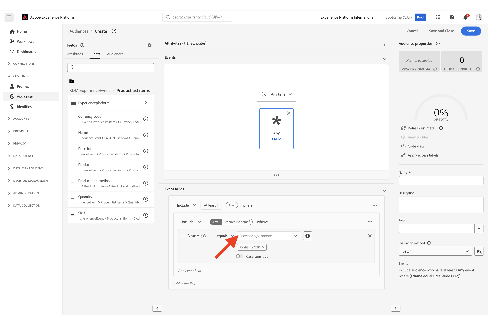

# 1.3 Segment erstellen - Benutzeroberfläche

In dieser Übung erstellen Sie ein Segment, indem Sie den Segmentaufbau von Adobe Experience Platform verwenden.

## Geschichte

Navigieren Sie zu [Adobe Experience Platform](https://experience.adobe.com/platform). Nach der Anmeldung landen Sie auf der Startseite von Adobe Experience Platform.

Bevor Sie fortfahren, müssen Sie eine **Sandbox**. Die auszuwählende Sandbox heißt ``Bootcamp``. Klicken Sie hierzu auf den Text **[!UICONTROL Produktionsprodukt]** in der blauen Zeile auf Ihrem Bildschirm. Nach Auswahl der entsprechenden [!UICONTROL Sandbox], sehen Sie die Änderung des Bildschirms und befinden sich jetzt in Ihrem [!UICONTROL Sandbox].

Gehen Sie im Menü auf der linken Seite zu **Segmente**. Auf dieser Seite sehen Sie eine Übersicht über alle vorhandenen Segmente. Klicken Sie auf **+ Segment erstellen** -Schaltfläche, um mit der Erstellung eines neuen Segments zu beginnen.

Sobald Sie sich im neuen Segment-Builder befinden, wird Ihnen sofort die **Attribute** Menüoption und **XDM Individual Profile** Referenz.

Da XDM die Sprache ist, die das Erlebnisgeschäft steuert, ist XDM auch die Grundlage für den Segment-Builder. Alle Daten, die in Platform erfasst werden, sollten XDM zugeordnet werden. Daher werden alle Daten Teil desselben Datenmodells, unabhängig davon, woher diese Daten stammen. Dies bietet Ihnen beim Erstellen von Segmenten einen großen Vorteil. So können Sie in dieser einzigen Segment Builder-Benutzeroberfläche Daten aus jedem beliebigen Ursprung im selben Workflow kombinieren. In Segment Builder erstellte Segmente können zur Aktivierung an Lösungen wie Adobe Target, Adobe Campaign und Adobe Audience Manager gesendet werden.

Jetzt müssen Sie ein Segment aller Kunden erstellen, die das Produkt angesehen haben **Real-Time CDP**.

Um dieses Segment zu erstellen, müssen Sie ein Erlebnisereignis hinzufügen. Klicken Sie auf die Schaltfläche **Veranstaltungen** im **Felder** Menüleiste.

Als Nächstes sehen Sie die oberste Ebene. **XDM ExperienceEvents** Knoten. Klicken Sie auf **XDM ExperienceEvent**.

Navigieren Sie zu **Produktlistenelemente**.

Auswählen **Name** und ziehen Sie die **Name** -Objekt aus dem linken Menü auf die Arbeitsfläche des Segmentaufbaus in der **Veranstaltungen** Abschnitt. Daraufhin sehen Sie Folgendes:

Der Vergleichsparameter sollte **gleich** und geben Sie im Eingabefeld **Echtzeit-Kundendatenplattform**.

Jedes Mal, wenn Sie ein Element zum Segment Builder hinzufügen, können Sie auf die **Schätzung aktualisieren** -Schaltfläche, um eine neue Schätzung der Population in Ihrem Segment zu erhalten.

As **Auswertungsmethode** auswählen **Edge**.

Geben wir schließlich Ihrem Segment einen Namen und speichern es.

Verwenden Sie als Namenskonvention:

- `yourLastName - Interest in Real-Time CDP`

Klicken Sie dann auf die **Speichern und schließen** zum Speichern des Segments.

Sie werden jetzt wieder zur Segmentübersichtsseite zurückgeführt, auf der eine Beispielvorschau der Kundenprofile angezeigt wird, die für Ihr Segment qualifiziert sind.

Sie können jetzt mit der nächsten Übung fortfahren und Ihr Segment mit Adobe Target verwenden.

Nächster Schritt: [1.4 Maßnahmen ergreifen: Senden Ihres Segments an Adobe Target](./ex4.md)

[Zurück zum Benutzerfluss 1](./uc1.md)

[Zu allen Modulen zurückkehren](../../overview.md)
