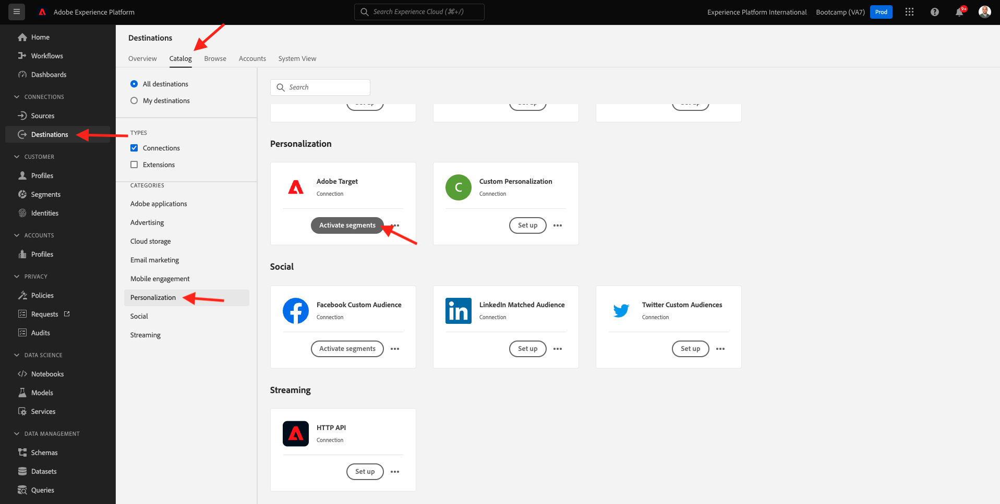
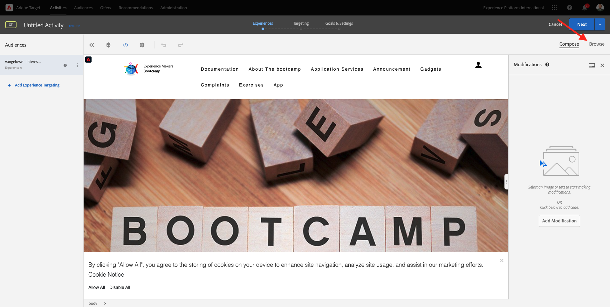
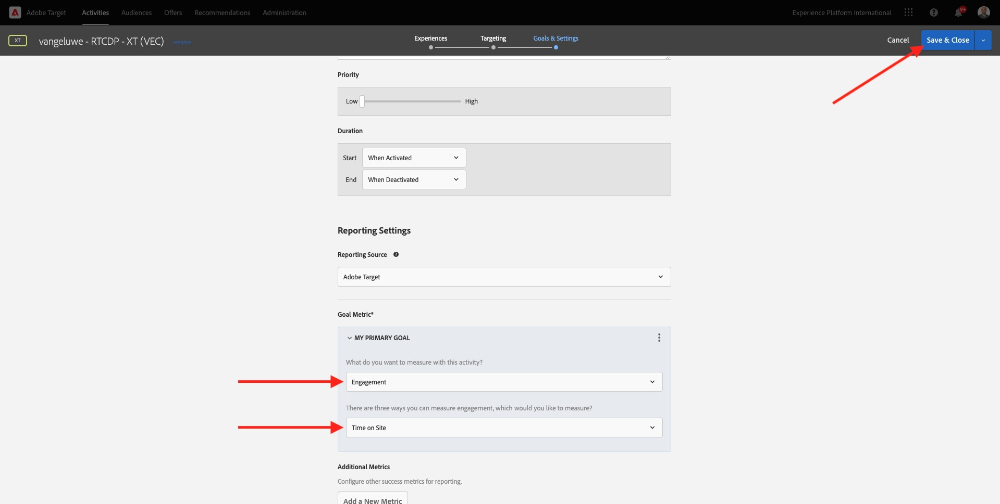

# 1.4 Maßnahmen ergreifen: Senden Ihres Segments an Adobe Target

Navigieren Sie zu [Adobe Experience Platform](https://experience.adobe.com/platform). Nach der Anmeldung landen Sie auf der Startseite von Adobe Experience Platform.

Bevor Sie fortfahren, müssen Sie eine **Sandbox**. Die auszuwählende Sandbox heißt ``Bootcamp``. Klicken Sie hierzu auf den Text **[!UICONTROL Produktionsprodukt]** in der blauen Zeile auf Ihrem Bildschirm. Nach Auswahl der entsprechenden [!UICONTROL Sandbox], sehen Sie die Änderung des Bildschirms und befinden sich jetzt in Ihrem [!UICONTROL Sandbox].

## 1.4.1 Aktivieren Sie Ihr Segment für Ihr Adobe Target-Ziel

Adobe Target ist als Ziel von Real-Time CDP verfügbar. Informationen zum Einrichten der Adobe Target-Integration finden Sie unter **Ziele**, um **Katalog**.

Klicken **Personalisierung** im **Kategorien** Menü. Sie werden dann die **Adobe Target** Zielkarte. Klicken **Segmente aktivieren**.

Ziel auswählen ``Bootcamp Target`` und klicken Sie auf **Nächste**.

Wählen Sie in der Liste der verfügbaren Segmente das Segment aus, das Sie in [1.3 Segment erstellen](./ex3.md), der `yourLastName - Interest in Real-Time CDP`. Klicken Sie dann auf **Weiter**.

Klicken Sie auf der nächsten Seite auf **Nächste**.

Klicken Sie auf **Fertigstellen**.

Ihr Segment ist jetzt für Adobe Target aktiviert.

>[!IMPORTANT]
>
>Wenn Sie Ihr Adobe Target-Ziel gerade in Real-Time CDP erstellt haben, kann es bis zu einer Stunde dauern, bis das Ziel aktiv ist. Dies ist eine einmalige Wartezeit aufgrund der Einrichtung der Backend-Konfiguration. Sobald die anfängliche Wartezeit von einer Stunde und die Backend-Konfiguration abgeschlossen sind, sind neu hinzugefügte Edge-Segmente, die an das Adobe Target-Ziel gesendet werden, für das Targeting in Echtzeit verfügbar.

## 1.4.2 Konfigurieren der formularbasierten Adobe Target-Aktivität

Nachdem Ihr Real-Time CDP-Segment für den Versand an Adobe Target konfiguriert wurde, können Sie Ihre Erlebnis-Targeting-Aktivität in Adobe Target konfigurieren. In dieser Übung konfigurieren Sie eine Visual Experience Composer-basierte Aktivität.

Rufen Sie die Adobe Experience Cloud-Homepage auf, indem Sie [https://experiencecloud.adobe.com/](https://experiencecloud.adobe.com/). Klicken **Target** um es zu öffnen.

Im **Adobe Target** Homepage werden Sie alle vorhandenen Aktivitäten sehen.
Klicken **+ Aktivität erstellen** , um eine neue Aktivität zu erstellen.

Auswählen **Erlebnis-Targeting**.

Auswählen **Visuell** und legen Sie die **Aktivitäts-URL** nach `https://bootcamp.aepdemo.net/content/aep-bootcamp-experience/language-masters/en/exercises/particpantXX.html`, aber bevor Sie dies tun, ersetzen Sie XX durch eine Zahl zwischen 01 und 30.

>[!IMPORTANT]
>
>Jeder Teilnehmer der Aktivierung sollte eine separate Webseite verwenden, um Kollisionen verschiedener Adobe Target-Erlebnisse zu vermeiden. Sie können eine Webseite auswählen und die URL finden, indem Sie hier gehen: [https://bootcamp.aepdemo.net/content/aep-bootcamp-experience/language-masters/en/exercises.html](https://bootcamp.aepdemo.net/content/aep-bootcamp-experience/language-masters/en/exercises.html).
>
>Seiten teilen alle dieselbe Basis-URL und enden in der Anzahl der Teilnehmer.
>
>Beispiel: Teilnehmer 1 sollte URL verwenden `https://bootcamp.aepdemo.net/content/aep-bootcamp-experience/language-masters/en/exercises/particpant01.html`, Teilnehmer 30 sollte URL verwenden `https://bootcamp.aepdemo.net/content/aep-bootcamp-experience/language-masters/en/exercises/particpant30.html`.

Arbeitsbereich auswählen **AT Bootcamp**.

Klicken Sie auf **Weiter**.

Sie befinden sich jetzt im Visual Experience Composer. Es kann 20-30 Sekunden dauern, bis die Website vollständig geladen ist.

Die Standardzielgruppe ist derzeit **Alle Besucher**. Klicken Sie auf **3 Punkte** neben **Alle Besucher** und klicken Sie auf **Zielgruppe ändern**.

Jetzt wird die Liste der verfügbaren Zielgruppen angezeigt. Das Adobe Experience Platform-Segment, das Sie zuvor erstellt und an Adobe Target gesendet haben, ist jetzt Teil dieser Liste. Wählen Sie das Segment aus, das Sie zuvor in Adobe Experience Platform erstellt haben. Klicken **Zielgruppe zuweisen**.

Ihr Adobe Experience Platform-Segment ist jetzt Teil dieser Erlebnis-Targeting-Aktivität.

Bevor Sie das Hero-Bild ändern können, müssen Sie auf **Alle zulassen** im Cookie-Banner.

Gehen Sie dazu zu **Durchsuchen**

Klicken Sie anschließend auf **Alle zulassen**.

Gehen Sie als Nächstes zurück zu **Erstellen**.

Ändern wir nun das Hero-Bild auf der Startseite der Website. Klicken Sie auf das standardmäßige Hero-Bild auf der Website und klicken Sie auf **Inhalt ersetzen** und wählen Sie **Bild**.

Suchen Sie nach der Bilddatei. **rtcdp.png**. Wählen Sie es aus und klicken Sie dann auf **Speichern**.

Anschließend sehen Sie das neue Erlebnis mit dem neuen Bild für Ihre ausgewählte Zielgruppe.

Klicken Sie oben links auf den Titel Ihrer Aktivität, um sie umzubenennen.

Für den Namen verwenden Sie bitte:

- `yourLastName - RTCDP - XT (VEC)`

Klicken Sie auf **Weiter**.

Klicken Sie auf **Weiter**.

Im **Ziele und Einstellungen** - Seite, navigieren Sie zu **Zielmetriken**.

Primäres Ziel festlegen auf **Interaktion** - **Besuchszeit pro Site**. Klicken Sie auf **Speichern und schließen**.

Du bist jetzt auf der **Aktivitätsübersicht** Seite. Sie müssen Ihre Aktivität weiterhin aktivieren.

Klicken Sie auf das Feld **Inaktiv** und wählen Sie **Aktivieren**.

Sie erhalten dann eine visuelle Bestätigung, dass Ihre Aktivität jetzt live ist.

Ihre Aktivität ist jetzt live und kann auf der Bootcamp-Website getestet werden.

Wenn Sie jetzt zu Ihrer Demo-Website zurückkehren und die Produktseite für **Real-Time CDP** eingeben, werden Sie sich sofort für das Segment qualifizieren, das Sie erstellt haben, und die Adobe Target-Aktivität wird auf der Startseite in Echtzeit angezeigt.

>[!IMPORTANT]
>
>Jeder Teilnehmer der Aktivierung sollte eine separate Webseite verwenden, um Kollisionen verschiedener Adobe Target-Erlebnisse zu vermeiden. Sie können eine Webseite auswählen und die URL finden, indem Sie hier gehen: [https://bootcamp.aepdemo.net/content/aep-bootcamp-experience/language-masters/en/exercises.html](https://bootcamp.aepdemo.net/content/aep-bootcamp-experience/language-masters/en/exercises.html).
>
>Seiten teilen alle dieselbe Basis-URL und enden in der Anzahl der Teilnehmer.
>
>Beispiel: Teilnehmer 1 sollte URL verwenden `https://bootcamp.aepdemo.net/content/aep-bootcamp-experience/language-masters/en/exercises/particpant01.html`, Teilnehmer 30 sollte URL verwenden `https://bootcamp.aepdemo.net/content/aep-bootcamp-experience/language-masters/en/exercises/particpant30.html`.

Nächster Schritt: [1.5 Maßnahmen ergreifen: Senden Ihres Segments an Facebook](./ex5.md)

[Zurück zum Benutzerfluss 1](./uc1.md)

[Zu allen Modulen zurückkehren](../../overview.md)
