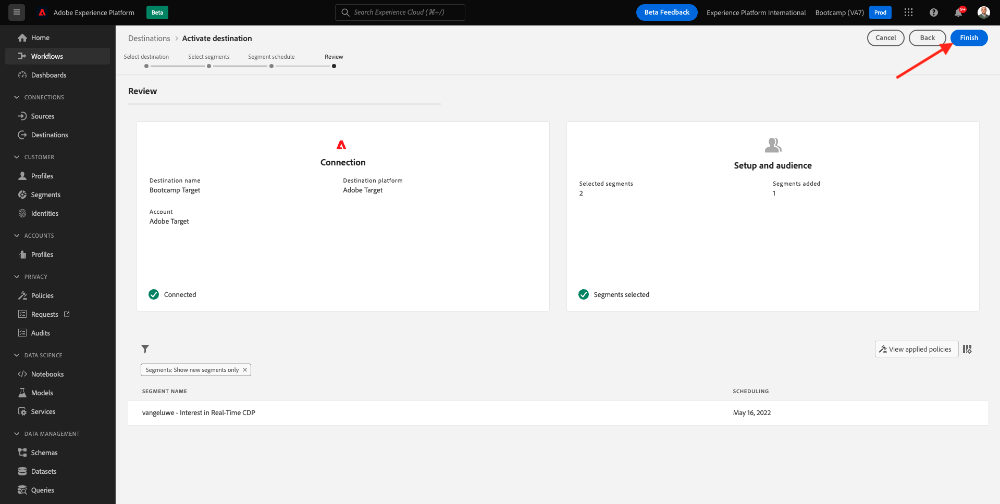

# 1.4 Aktion durchführen: Senden Sie Ihre Audience an Adobe Target

Wechseln Sie zu [Adobe Experience Platform](https://experience.adobe.com/platform). Nach der Anmeldung landen Sie auf der Startseite von Adobe Experience Platform.

Bevor Sie fortfahren, müssen Sie eine **Sandbox** auswählen. Die auszuwählende Sandbox heißt ``Bootcamp``. Klicken Sie dazu in der blauen Zeile oben auf Ihrem Bildschirm auf den Text **[!UICONTROL Produktions-Prod]** . Nachdem Sie die entsprechende [!UICONTROL Sandbox] ausgewählt haben, sehen Sie die Bildschirmänderung und befinden sich nun in Ihrer dedizierten [!UICONTROL Sandbox].

## 1.4.1 Zielgruppe für Adobe Target aktivieren

Adobe Target ist als Ziel von Real-Time CDP verfügbar. Um Ihre Adobe Target-Integration einzurichten, gehen Sie zu **Ziele**, zu **Katalog**.

Klicken Sie im Menü **Kategorien** auf **Personalization** . Dann sehen Sie die Zielkarte **Adobe Target**. Klicken Sie auf **Zielgruppen aktivieren**.

Wählen Sie das Ziel ``Bootcamp Target`` aus und klicken Sie auf **Weiter**.

Wählen Sie in der Liste der verfügbaren Zielgruppen die in [1.3 Erstellen einer Zielgruppe](./ex3.md) erstellte Zielgruppe mit dem Namen `yourLastName - Interest in Real-Time CDP` aus. Klicken Sie dann auf **Weiter**.

Klicken Sie auf der nächsten Seite auf **Weiter**.

Klicken Sie auf **Fertigstellen**.

Ihre Audience ist jetzt für Adobe Target aktiviert.

>[!IMPORTANT]
>
>Wenn Sie Ihr Adobe Target-Ziel gerade in Real-Time CDP erstellt haben, kann es bis zu einer Stunde dauern, bis das Ziel aktiv ist. Dies ist eine einmalige Wartezeit aufgrund der Einrichtung der Backend-Konfiguration. Sobald die anfängliche Wartezeit von einer Stunde und die Backend-Konfiguration abgeschlossen sind, sind neu hinzugefügte Edge-Zielgruppen, die an das Adobe Target-Ziel gesendet werden, für das Targeting in Echtzeit verfügbar.

## 1.4.2 Konfigurieren der formularbasierten Adobe Target-Aktivität

Nachdem Ihre Real-Time CDP-Audience für den Versand an Adobe Target konfiguriert wurde, können Sie Ihre Erlebnis-Targeting-Aktivität in Adobe Target konfigurieren. In dieser Übung konfigurieren Sie eine Visual Experience Composer-basierte Aktivität.

Rufen Sie die Adobe Experience Cloud-Homepage auf, indem Sie zu [https://experiencecloud.adobe.com/](https://experiencecloud.adobe.com/) navigieren. Klicken Sie auf **Ziel** , um es zu öffnen.

Auf der Startseite von **Adobe Target** werden alle vorhandenen Aktivitäten angezeigt.
Klicken Sie auf **+ Aktivität erstellen** , um eine neue Aktivität zu erstellen.

Wählen Sie **Erlebnis-Targeting** aus.

Wählen Sie **Visuell** aus und setzen Sie die **Aktivitäts-URL** auf `https://bootcamp.aepdemo.net/content/aep-bootcamp-experience/language-masters/en/exercises/particpantXX.html`. Ersetzen Sie jedoch vor diesem Vorgang XX durch eine Zahl zwischen 01 und 30.

>[!IMPORTANT]
>
>Jeder Teilnehmer der Aktivierung sollte eine separate Webseite verwenden, um Kollisionen verschiedener Adobe Target-Erlebnisse zu vermeiden. Sie können eine Webseite auswählen und die URL finden, indem Sie hier gehen: [https://bootcamp.aepdemo.net/content/aep-bootcamp-experience/language-masters/en/exercises.html](https://bootcamp.aepdemo.net/content/aep-bootcamp-experience/language-masters/en/exercises.html).
>
>Seiten teilen alle dieselbe Basis-URL und enden in der Anzahl der Teilnehmer.
>
>Beispiel: Teilnehmer 1 sollte URL `https://bootcamp.aepdemo.net/content/aep-bootcamp-experience/language-masters/en/exercises/particpant01.html` verwenden, Teilnehmer 30 sollte URL `https://bootcamp.aepdemo.net/content/aep-bootcamp-experience/language-masters/en/exercises/particpant30.html` verwenden.

Wählen Sie den Arbeitsbereich **AT Bootcamp** aus.

Klicken Sie auf **Weiter**.

Sie befinden sich jetzt im Visual Experience Composer. Es kann 20-30 Sekunden dauern, bis die Website vollständig geladen ist.

Die Standardzielgruppe ist derzeit **Alle Besucher**. Klicken Sie auf die Punkte **3 Punkt** neben **Alle Besucher** und klicken Sie auf **Zielgruppe ändern**.

Jetzt wird die Liste der verfügbaren Zielgruppen angezeigt. Die zuvor erstellte und an Adobe Target gesendete Adobe Experience Platform-Zielgruppe ist jetzt Teil dieser Liste. Wählen Sie die zuvor in Adobe Experience Platform erstellte Audience aus. Klicken Sie auf **Zielgruppe zuweisen**.

Ihre Adobe Experience Platform-Zielgruppe ist jetzt Teil dieser Erlebnis-Targeting-Aktivität.

Bevor Sie das Hero-Bild ändern können, müssen Sie im Cookie-Banner auf **Alle zulassen** klicken.

Gehen Sie dazu zu **Durchsuchen**

Klicken Sie anschließend auf **Alle zulassen**.

Als Nächstes gehen Sie zurück zu **Erstellen**.

Ändern wir nun das Hero-Bild auf der Startseite der Website. Klicken Sie auf das standardmäßige Hero-Bild auf der Website, klicken Sie auf **Inhalt ersetzen** und wählen Sie dann **Bild** aus.

Suchen Sie nach der Bilddatei **rtcdp.png**. Wählen Sie es aus und klicken Sie dann auf **Speichern**.

Anschließend sehen Sie das neue Erlebnis mit dem neuen Bild für Ihre ausgewählte Zielgruppe.

Klicken Sie auf den Titel Ihrer Aktivität in der oberen linken Ecke, um sie umzubenennen.

Für den Namen verwenden Sie bitte:

- `yourLastName - RTCDP - XT (VEC)`

Klicken Sie auf **Weiter**.

Klicken Sie auf **Weiter**.

Wechseln Sie auf der Seite **Ziele und Einstellungen** - zu **Zielmetriken**.

Setzen Sie das Primäre Ziel auf **Interaktion** - **Besuchszeit pro Site**. Klicken Sie auf **Speichern und schließen**.

Sie befinden sich nun auf der Seite **Aktivitätsübersicht** . Sie müssen Ihre Aktivität weiterhin aktivieren.

Klicken Sie auf das Feld **Inaktiv** und wählen Sie **Aktivieren** aus.

Sie erhalten dann eine visuelle Bestätigung, dass Ihre Aktivität jetzt live ist.

Ihre Aktivität ist jetzt live und kann auf der Bootcamp-Website getestet werden.

Wenn Sie jetzt zu Ihrer Demo-Website zurückkehren und die Produktseite für **Real-Time CDP** besuchen, qualifizieren Sie sich sofort für die erstellte Zielgruppe, und die Adobe Target-Aktivität wird auf der Startseite in Echtzeit angezeigt.

>[!IMPORTANT]
>
>Jeder Teilnehmer der Aktivierung sollte eine separate Webseite verwenden, um Kollisionen verschiedener Adobe Target-Erlebnisse zu vermeiden. Sie können eine Webseite auswählen und die URL finden, indem Sie hier gehen: [https://bootcamp.aepdemo.net/content/aep-bootcamp-experience/language-masters/en/exercises.html](https://bootcamp.aepdemo.net/content/aep-bootcamp-experience/language-masters/en/exercises.html).
>
>Seiten teilen alle dieselbe Basis-URL und enden in der Anzahl der Teilnehmer.
>
>Beispiel: Teilnehmer 1 sollte URL `https://bootcamp.aepdemo.net/content/aep-bootcamp-experience/language-masters/en/exercises/particpant01.html` verwenden, Teilnehmer 30 sollte URL `https://bootcamp.aepdemo.net/content/aep-bootcamp-experience/language-masters/en/exercises/particpant30.html` verwenden.

Nächster Schritt: [1.5 Aktion ausführen: Senden Sie Ihre Audience an Facebook](./ex5.md)

[Zurück zum Benutzerfluss 1](./uc1.md)

[Zu allen Modulen zurückkehren](../../overview.md)
