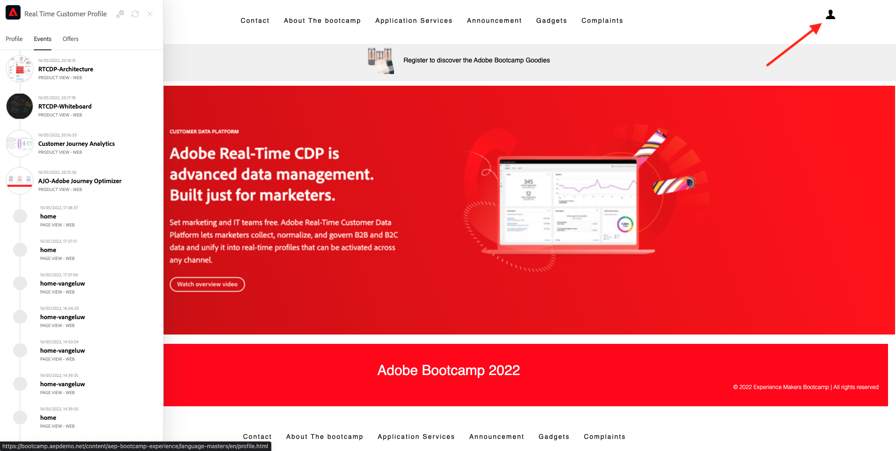

# 2.1 Besuchen Sie die Website und erstellen Sie Ihr Konto

## Kontext

Die Journey von unbekanntem bis bekanntem ist eines der wichtigsten Themen der heutigen Marken, ebenso wie die Journey des Kunden von der Akquise bis zur Aufbewahrung.

Adobe Experience Platform spielt bei diesem Journey eine große Rolle. Plattform ist das Gehirn der Kommunikation, das **Erlebnissystem des Datensatzes**.

Platform ist eine Umgebung, in der das Wort Kunde breiter ist als nur die bekannten Kunden. Ein unbekannter Besucher auf der Website ist auch aus Sicht von Platform ein Kunde. Daher wird das gesamte Verhalten als unbekannter Besucher auch an Platform gesendet. Durch diesen Ansatz kann eine Marke visualisieren, was vor diesem Zeitpunkt auch passiert ist, wenn dieser Besucher schließlich ein bekannter Kunde wird. Dies hilft aus der Sicht der Attribution und Erlebnisoptimierung.

## Journey-Fluss des Kunden

Wechseln Sie zu [https://bootcamp.aepdemo.net](https://bootcamp.aepdemo.net). Klicken Sie auf **Alle zulassen**. Basierend auf Ihrem Browsing-Verhalten im vorherigen Benutzerfluss wird auf der Startseite der Website eine Personalisierung angezeigt.

Klicken Sie auf das Adobe-Logo-Symbol oben links im Bildschirm, um den Profilanzeige zu öffnen. Sehen Sie sich das Bedienfeld &quot;Profil-Viewer&quot;und das Echtzeit-Kundenprofil mit der **Experience Cloud-ID** als primäre Kennung für diesen derzeit unbekannten Kunden an.

Sie können auch alle Erlebnisereignisse sehen, die basierend auf dem Kundenverhalten erfasst wurden.

Klicken Sie oben rechts auf dem Bildschirm auf das Symbol **Profil** .

Klicken Sie auf **Konto erstellen**.

Füllen Sie alle Formularfelder aus. Verwenden Sie einen echten Wert für E-Mail-Adresse und Telefonnummer, da dieser Wert in späteren Übungen zum Versand von E-Mails und SMS verwendet wird.

Scrollen Sie nach unten und klicken Sie auf **Registrieren**.

Dann wirst du das sehen.

Sie erhalten außerdem diese E-Mail:

Einige Minuten später erhalten Sie auch diese E-Mail:

Sehen wir uns an, wie diese Onboarding-Journey als Nächstes konfiguriert wurde.

Nächster Schritt: [2.2 Ereignis erstellen](./ex2.md)

[Zurück zum Benutzerfluss 2](./uc2.md)

[Zu allen Modulen zurückkehren](../../overview.md)
