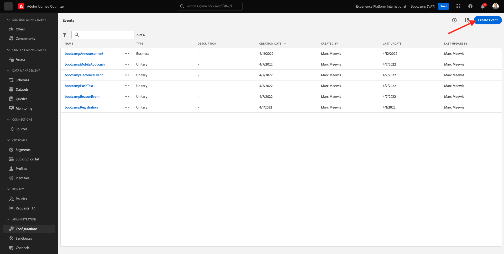
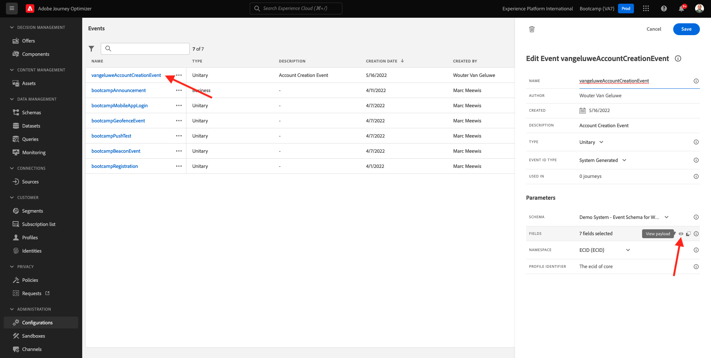

# 2.2 Ereignis erstellen

Melden Sie sich bei Adobe Journey Optimizer an, indem Sie [Adobe Experience Cloud](https://experience.adobe.com). Klicken **Journey Optimizer**.

Sie werden zum **Startseite**  in Journey Optimizer anzeigen. Vergewissern Sie sich zunächst, dass Sie die richtige Sandbox verwenden. Die zu verwendende Sandbox heißt `Bootcamp`. Um von einer Sandbox zu einer anderen zu wechseln, klicken Sie auf **Prod** und wählen Sie die Sandbox aus der Liste aus. In diesem Beispiel erhält die Sandbox den Namen **Bootcamp**. Sie sind dann im **Startseite** Ansicht Ihrer Sandbox `Bootcamp`.

Scrollen Sie im linken Menü nach unten und klicken Sie auf **Konfigurationen**. Klicken Sie anschließend auf das **Verwalten** Schaltfläche unter **Veranstaltungen**.

Daraufhin wird eine Übersicht über alle verfügbaren Ereignisse angezeigt. Klicken **Ereignis erstellen** , um mit der Erstellung Ihres eigenen Ereignisses zu beginnen.

Daraufhin wird ein neues, leeres Ereignisfenster angezeigt.

Geben Sie Ihrem Ereignis zunächst einen Namen wie den folgenden: `yourLastNameAccountCreationEvent` und fügen Sie eine Beschreibung wie die folgende hinzu `Account Creation Event`.

Stellen Sie als Nächstes sicher, dass die **Typ** auf **Einzelfall** und für die **Ereignis-ID-Typ** Auswahl, wählen Sie **Systemgeneriert**.

Als Nächstes folgt die Schemaauswahl. Für diese Übung wurde ein Schema vorbereitet. Bitte verwenden Sie das Schema `Demo System - Event Schema for Website (Global v1.1) v.1`.

Nach Auswahl des Schemas werden im **Felder** Abschnitt. Sie sollten jetzt den Mauszeiger über die **Felder** und Sie sehen 3 Symbole. Klicken Sie auf **Bearbeiten** Symbol.

Sie werden eine **Felder** -Fenster, in dem Sie einige der Felder auswählen müssen, die zur Personalisierung der E-Mail erforderlich sind.  Später werden wir mithilfe der bereits in Adobe Experience Platform vorhandenen Daten andere Profilattribute auswählen.

Im -Objekt `_experienceplatform.demoEnvironment`, wählen Sie bitte die Felder aus. **brandLogo** und **brandName**.

Im -Objekt `_experienceplatform.identification.core`, wählen Sie das Feld aus. **email**.

Klicken **Ok** , um Ihre Änderungen zu speichern.

Dann sollten Sie das sehen. Klicken **Speichern** erneut, um Ihre Änderungen zu speichern.

Ihr Ereignis ist jetzt konfiguriert und gespeichert.

Klicken Sie erneut auf das Ereignis, um die **Ereignis bearbeiten** erneut angezeigt. Bewegen **Felder** erneut, um die 3 Symbole erneut anzuzeigen. Klicken Sie auf **Payload anzeigen** Symbol.

Sie sehen nun ein Beispiel der erwarteten Payload.
Ihr Ereignis verfügt über eine eindeutige eventID für die Orchestrierung, die Sie finden können, indem Sie in dieser Payload nach unten scrollen, bis Sie `_experience.campaign.orchestration.eventID`.

Die Ereignis-ID muss an Adobe Experience Platform gesendet werden, um die Journey Trigger, die Sie in einer der nächsten Übungen erstellen werden. Denken Sie an diese eventID, da Sie sie möglicherweise später benötigen.
`"eventID": "19cab7852cdef99d25b6d5f1b6503da39d1f486b1d585743f97ed2d1e6b6c74f"`

Klicken **Ok**, gefolgt von einem Klick auf **Abbrechen**.

Du bist jetzt mit dieser Übung fertig.

Nächster Schritt: [2.3 E-Mail-Nachricht erstellen](./ex3.md)

[Zurück zum Benutzerfluss 2](./uc2.md)

[Zu allen Modulen zurückkehren](../../overview.md)
