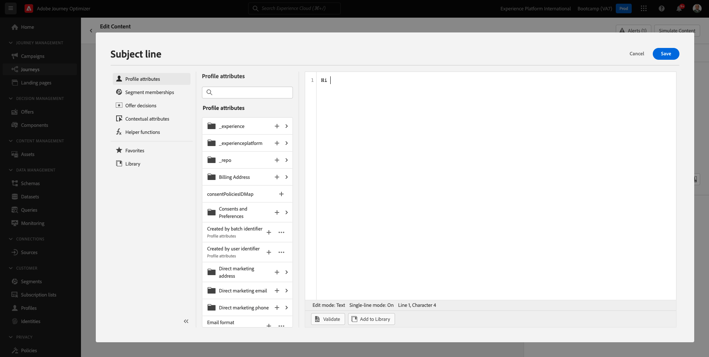

# 2.3 Journey und E-Mail-Nachricht erstellen

In dieser Übung konfigurieren Sie die Journey, die ausgelöst werden muss, wenn jemand ein Konto auf der Demowebsite erstellt.

Melden Sie sich bei Adobe Journey Optimizer an, indem Sie zu [Adobe Experience Cloud](https://experience.adobe.com) wechseln. Klicken Sie auf **Journey Optimizer**.

Sie werden zur Ansicht **Home** in Journey Optimizer weitergeleitet. Vergewissern Sie sich zunächst, dass Sie die richtige Sandbox verwenden. Die zu verwendende Sandbox heißt `Bootcamp`. Um von einer Sandbox zu einer anderen zu wechseln, klicken Sie auf **Prod** und wählen Sie die Sandbox aus der Liste aus. In diesem Beispiel trägt die Sandbox den Namen **Bootcamp**. Sie befinden sich dann in der Ansicht **Home** Ihrer Sandbox `Bootcamp`.

## 2.3.1 Journey erstellen

Klicken Sie im linken Menü auf **Journeys**. Klicken Sie anschließend auf **Journey erstellen** , um eine neue Journey zu erstellen.

Dann sehen Sie einen leeren Journey-Bildschirm.

In der vorherigen Übung haben Sie ein neues **Ereignis** erstellt. Sie haben ihn wie folgt benannt: `yourLastNameAccountCreationEvent` und haben `yourLastName` durch Ihren Nachnamen ersetzt. Dies war das Ergebnis der Ereigniserstellung:

Jetzt müssen Sie dieses Ereignis als Beginn dieser Journey nehmen. Gehen Sie dazu zur linken Seite des Bildschirms und suchen Sie in der Ereignisliste nach Ihrem Ereignis.

Wählen Sie das Ereignis aus, ziehen Sie es auf die Journey-Arbeitsfläche und legen Sie es ab. Ihre Journey sieht nun wie folgt aus:

Als zweiten Schritt im Journey müssen Sie einen kurzen **Warten** -Schritt hinzufügen. Navigieren Sie zur linken Seite Ihres Bildschirms zum Abschnitt **Orchestrierung** , um dies zu finden. Sie verwenden Profilattribute und müssen sicherstellen, dass sie in das Echtzeit-Kundenprofil eingetragen sind.

Ihre Journey sieht jetzt so aus. Auf der rechten Bildschirmseite müssen Sie die Wartezeit konfigurieren. Setzen Sie es auf 1 Minute. Dadurch wird ausreichend Zeit für die Profilattribute zur Verfügung stehen, nachdem das Ereignis ausgelöst wurde.

Klicken Sie auf **OK** , um Ihre Änderungen zu speichern.

Als dritten Schritt im Journey müssen Sie eine **E-Mail** -Aktion hinzufügen. Navigieren Sie auf der linken Bildschirmseite zu **Aktionen**, wählen Sie die Aktion **E-Mail** aus und ziehen Sie sie per Drag-and-Drop auf den zweiten Knoten im Journey. Das sehen Sie jetzt.

Setzen Sie die **Kategorie** auf **Marketing** und wählen Sie eine E-Mail-Oberfläche aus, über die Sie E-Mails senden können. In diesem Fall ist die auszuwählende E-Mail-Oberfläche **E-Mail**. Stellen Sie sicher, dass die Kontrollkästchen für **Klicks auf E-Mail** und **E-Mail-Öffnungen** aktiviert sind.

Der nächste Schritt besteht darin, Ihre Nachricht zu erstellen. Klicken Sie dazu auf **Inhalt bearbeiten**.

## 2.3.2 Nachricht erstellen

Um Ihre Nachricht zu erstellen, klicken Sie auf **Inhalt bearbeiten**.

Das sehen Sie jetzt.

Klicken Sie auf das Textfeld **Betreff**.

Beginnen Sie im Textbereich mit dem Schreiben von **Hi**

Die Betreffzeile ist noch nicht fertig. Als Nächstes müssen Sie das Personalisierungstoken für das Feld **Vorname** einfügen, das unter `profile.person.name.firstName` gespeichert ist. Scrollen Sie im linken Menü nach unten, um das Element **Person** zu suchen, und klicken Sie auf den Pfeil, um eine Ebene tiefer zu gehen.

Suchen Sie nun das Element **Vollständiger Name** und klicken Sie auf den Pfeil, um eine Ebene tiefer zu gehen.

Suchen Sie abschließend das Feld **Vorname** und klicken Sie auf das Symbol **+** daneben. Daraufhin wird das Personalisierungstoken im Textfeld angezeigt.

Fügen Sie als Nächstes den Text **hinzu, vielen Dank für die Anmeldung!**. Klicken Sie auf **Speichern**.

Du wirst dann wieder hier sein. Klicken Sie auf **E-Mail-Designer** , um den E-Mail-Inhalt zu erstellen.

Im nächsten Bildschirm werden Sie mit 3 verschiedenen Methoden aufgefordert, den Inhalt der E-Mail bereitzustellen:

- **Neuen Entwurf erstellen**: Beginnen Sie mit einer leeren Arbeitsfläche und verwenden Sie den WYSIWYG-Editor, um Struktur- und Inhaltskomponenten per Drag-and-Drop zu verschieben, um den Inhalt der E-Mail visuell zu erstellen.
- **Eigenen Code kodieren**: Erstellen Sie Ihre eigene E-Mail-Vorlage, indem Sie sie mit HTML kodieren.
- **HTML importieren**: Importieren Sie eine vorhandene HTML-Vorlage, die Sie bearbeiten können.

Klicken Sie auf **HTML importieren**. Alternativ können Sie auf **Gespeicherte Vorlagen** klicken und die Vorlage **Bootcamp - E-Mail-Vorlage** auswählen.

Wenn Sie **HTML importieren** ausgewählt haben, können Sie jetzt die Datei **mailtemplatebootcamp.html** ziehen und ablegen, die Sie [hier ](../../assets/html/mailtemplatebootcamp.html.zip) herunterladen können. Klicken Sie auf Importieren.

Anschließend wird Ihnen diese Standard-E-Mail-Vorlage angezeigt:

Personalisieren wir die E-Mail. Klicken Sie neben dem Text **Hi** auf und klicken Sie dann auf das Symbol **Personalization hinzufügen** .

Als Nächstes müssen Sie das Personalisierungstoken **Vorname** mitbringen, das unter `profile.person.name.firstName` gespeichert ist. Suchen Sie im Menü das Element **Person** , führen Sie einen Drilldown zum Element **Vollständiger Name** durch und klicken Sie dann auf das Symbol **+** , um das Feld &quot;Vorname&quot;zum Ausdruckseditor hinzuzufügen.

Klicken Sie auf **Speichern**.

Sie werden jetzt feststellen, wie Ihrem Text das Personalisierungsfeld hinzugefügt wurde.

Klicken Sie auf **Speichern** , um Ihre Nachricht zu speichern.

Gehen Sie zurück zum Nachrichten-Dashboard, indem Sie in der oberen linken Ecke auf den Pfeil **11} neben dem Betreffzeilentext klicken.**

Sie haben jetzt die Erstellung Ihrer Registrierungs-E-Mail abgeschlossen. Klicken Sie auf den Pfeil oben links, um zu Ihrer Journey zurückzukehren.

Klicken Sie auf **OK**.

## 2.3.3 Publish Ihre Journey

Sie müssen Ihrer Journey noch einen Namen geben. Klicken Sie dazu auf das Symbol **Stift** oben links auf Ihrem Bildschirm.

Dann können Sie hier den Namen des Journey eingeben. Verwenden Sie bitte `yourLastName - Account Creation Journey`. Klicken Sie auf **OK**, um die Änderungen zu speichern.

Sie können Ihre Journey jetzt veröffentlichen, indem Sie auf **Publish** klicken.

Klicken Sie erneut auf **Publish**.

Sie sehen dann eine grüne Bestätigungsleiste, dass Ihre Journey jetzt veröffentlicht ist.

Du bist jetzt mit dieser Übung fertig.

Nächster Schritt: [2.4 Testen Sie Ihre Journey](./ex4.md)

[Zurück zum Benutzerfluss 2](./uc2.md)

[Zu allen Modulen zurückkehren](../../overview.md)