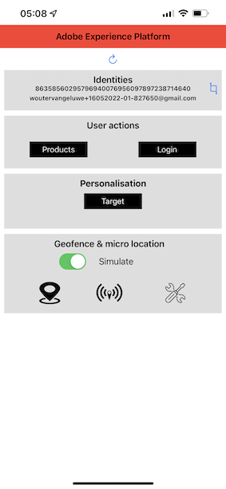

# 2.5 Mobile App installieren und verwenden

## Installieren der App

Vor der Installation des Programms müssen Sie **Tracking** auf Ihrem iOS-Gerät. Gehen Sie dazu zu **Einstellungen** > **Datenschutz und Sicherheit** > **Tracking** und stellen sicher, dass die Option **Zulassen, dass Apps die Verfolgung anfordern**.

Navigieren Sie zur Apple App Store und suchen Sie nach `aepmobile-bootcamp`. Klicken **Installieren** oder **Download**.

Nachdem die App installiert wurde, klicken Sie auf **Öffnen**.

Klicken Sie auf **OK**.

Klicken **Zulassen**.

Klicken **Ich stimme zu**.

Klicken **Verwendung der App zulassen**.

Klicken **Zulassen**.

Sie befinden sich jetzt in der App auf der Startseite und können die Journey durchlaufen.

## Journey-Fluss des Kunden

Zunächst müssen Sie sich anmelden. Klicken Sie auf **Anmelden**.

Nachdem Sie Ihr Konto in den vorherigen Übungen erstellt haben, haben Sie dies auf der Website gesehen. Sie müssen jetzt die E-Mail-Adresse des Kontos, das Sie in der App erstellt haben, erneut verwenden, um sich anzumelden.

Geben Sie hier die E-Mail-Adresse ein, die Sie auf der Website verwendet haben, und klicken Sie auf **Anmelden**.

Sie erhalten dann eine Bestätigung, dass Sie angemeldet sind, und Sie erhalten eine Push-Benachrichtigung.

Kehren Sie zur Homepage in der App zurück und sehen Sie zusätzliche Funktionen.

Navigieren Sie zu **Produkte**. Klicken Sie in diesem Beispiel auf ein beliebiges Produkt. **Kaffee zum Mitnehmen**.

Du wirst die **Kaffee zum Mitnehmen** Produktseite in der App. Klicken **Kaufen**.

Du hast diese Übung nun beendet und bist für die nächsten Übungen bereit.

Nächster Schritt: [2.6 Personalisierung im Callcenter](./ex6.md)

[Zurück zum Benutzerfluss 2](./uc2.md)

[Zu allen Modulen zurückkehren](../../overview.md)
