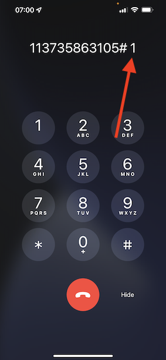

# 2.6 Personalization im Callcenter

Wie bereits mehrmals während des Bootcamps erörtert, sollte die Personalisierung des Kundenerlebnisses auf Omni-Channel-Weise erfolgen. Ein Callcenter ist oft nicht mit dem übrigen Kunden-Journey verbunden. Dies führt oft zu frustrierenden Kundenerlebnissen, aber das muss es nicht sein. Sehen wir uns ein Beispiel dafür an, wie das Callcenter in Echtzeit einfach mit Adobe Experience Platform verbunden werden kann.

## Kunden-Journey-Fluss

In der vorherigen Übung haben Sie über die Mobile App ein Produkt durch Klicken auf die Schaltfläche **Kaufen** gekauft.

Nehmen wir an, Sie haben eine Frage zum Status Ihrer Bestellung, was würden Sie tun? Normalerweise würden Sie das Callcenter anrufen.

Bevor Sie das Callcenter anrufen, müssen Sie Ihre **Treueprogramm-ID** kennen. Ihre Treue-ID finden Sie im Profil-Viewer der Website.

In diesem Fall wird die **Treuekennung** **5863105**. Im Rahmen unserer benutzerdefinierten Implementierung der Callcenter-Funktion in der Demo-Umgebung müssen Sie Ihrer **Treue-ID“ ein Präfix**. Das Präfix ist **11373**, daher ist die in diesem Beispiel zu verwendende Treue-ID **11373 5863105**.

Lass uns das jetzt machen. Verwenden Sie Ihr Telefon und rufen Sie die Nummer **+1 (323) 745-1670**.

Sie werden aufgefordert, Ihre Treue-ID einzugeben, gefolgt von **#**. Geben Sie Ihre Treue-ID ein.

Sie hören dann **Hallo, Vorname**. Dieser Vorname wird aus dem Echtzeit-Kundenprofil in Adobe Experience Platform übernommen. Sie haben dann drei Möglichkeiten. Drücken Sie die Nummer **1**, **Order Status**.

Nachdem Sie Ihren Bestellstatus gehört haben, können Sie wählen, ob Sie **1** drücken möchten, um zum Hauptmenü zurückzukehren, oder drücken Sie 2. Drücken Sie **2**.

Anschließend werden Sie aufgefordert, Ihr Callcenter-Erlebnis zu bewerten, indem Sie eine Zahl zwischen 1 und 5 auswählen, wobei 1 niedrig und 5 hoch ist. Treffen Sie Ihre Wahl.

Ihr Anruf beim Callcenter endet jetzt.

Zu [Adobe Experience Platform](https://experience.adobe.com/platform). Nach dem Login landen Sie auf der Homepage von Adobe Experience Platform.

Bevor Sie fortfahren, müssen Sie eine **Sandbox“**. Die auszuwählende Sandbox hat den Namen ``Bootcamp``. Klicken Sie dazu auf den Text **[!UICONTROL Produktion]** in der blauen Linie am oberen Bildschirmrand. Nach Auswahl der entsprechenden [!UICONTROL Sandbox] wird der Bildschirm geändert und Sie befinden sich nun in Ihrer dedizierten [!UICONTROL Sandbox].

Gehen Sie im linken Menü zu **Profile** und zu **Durchsuchen**.

Wählen Sie **Identity-Namespace** **E-Mail** aus und geben Sie die E-Mail-Adresse Ihres Kundenprofils ein. Klicken Sie **Anzeigen**. Klicken Sie, um Ihr Profil zu öffnen.

Ihr Kundenprofil wird erneut angezeigt. Navigieren Sie zu **Ereignisse**.

Unter „Ereignisse“ werden zwei Ereignisse mit dem eventType „CallCenter ****. Das erste Ereignis ist das Ergebnis Ihrer Antwort auf die Frage **Bewerten Sie Ihre Anrufzufriedenheit**.

Scrollen Sie ein wenig nach unten, und Sie sehen das Ereignis, das aufgezeichnet wurde, als Sie die Option zum Überprüfen Ihres **Bestellstatus** ausgewählt haben.

Navigieren Sie zu **Segmentzugehörigkeit**. Jetzt sehen Sie, dass zwei Segmente in Echtzeit für Ihr Profil qualifiziert sind, basierend auf den Interaktionen, die Sie über das Callcenter hatten. Diese Segmentzugehörigkeiten können und sollten dann verwendet werden, um zu beeinflussen, was über einen anderen Kanal hinweg mit Kommunikation und Personalisierung geschieht.

Sie haben jetzt diese Übung beendet.

[Zurück zu Benutzerfluss 2](./uc2.md)

[Zurück zu „Alle Module“](../../overview.md)
