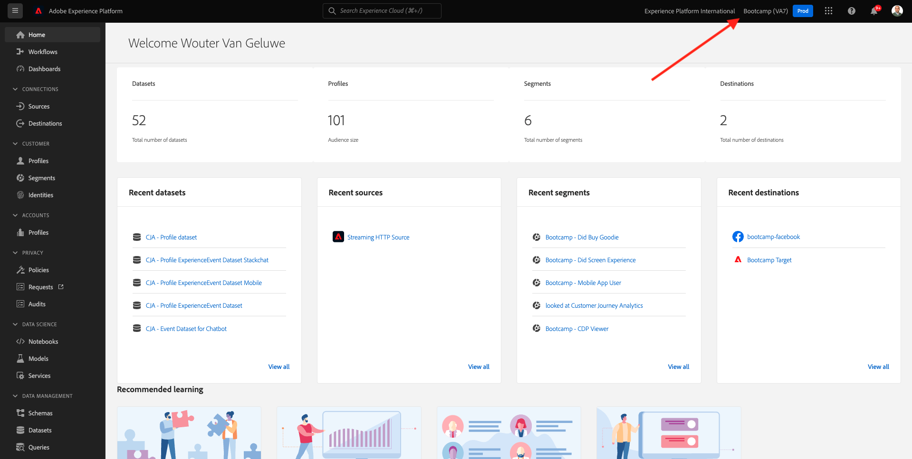

# 2.6 Personalization im Callcenter

Wie bereits mehrfach während des Bootcamps besprochen wurde, sollte die Personalisierung des Kundenerlebnisses auf Omnichannel-Weise erfolgen. Ein Callcenter ist oft ziemlich vom Rest der Journey getrennt und führt oft zu frustrierenden Kundenerlebnissen, muss aber nicht sein. Lassen Sie uns Ihnen ein Beispiel dafür zeigen, wie das Callcenter in Echtzeit problemlos mit Adobe Experience Platform verbunden werden kann.

## Journey des Kunden

In der vorherigen Übung haben Sie mit der Mobile App ein Produkt durch Klicken auf die Schaltfläche **Kaufen** gekauft.

Nehmen wir an, Sie haben eine Frage zum Status Ihrer Bestellung, was würden Sie tun? Normalerweise rufen Sie das Callcenter an.

Bevor Sie das Callcenter aufrufen, müssen Sie Ihre **Loyalitäts-ID** kennen. Ihre Treuekennung finden Sie im Profil-Viewer der Website.

In diesem Fall lautet die **Loyalitäts-ID** **5863105**. Im Rahmen unserer benutzerdefinierten Implementierung der Callcenter-Funktion in der Demoumgebung müssen Sie Ihrer **Loyalitäts-ID** ein Präfix hinzufügen. Das Präfix ist **11373**, daher lautet die in diesem Beispiel zu verwendende Loyalitäts-ID **11373 5863105**.

Machen wir das jetzt! Benutzen Sie Ihr Telefon und rufen Sie die Nummer **+1 (323) 745-1670** an.

Sie werden aufgefordert, Ihre Loyalitäts-ID einzugeben, gefolgt von **#**. Geben Sie Ihre Loyalitäts-ID ein.

Dann hören Sie **Hallo, Vorname**. Dieser Vorname stammt aus dem Echtzeit-Kundenprofil in Adobe Experience Platform. Sie haben dann drei Möglichkeiten. Drücken Sie die Nummer **1**, **Bestellstatus**.

Nachdem Sie Ihren Bestellstatus gehört haben, können Sie durch Drücken von **1** zum Hauptmenü zurückkehren, andernfalls drücken Sie 2. Drücken Sie **2**.

Sie werden dann aufgefordert, Ihr Callcenter-Erlebnis zu bewerten, indem Sie eine Zahl zwischen 1 und 5 auswählen, wobei 1 niedrig und 5 hoch ist. Treffen Sie Ihre Wahl.

Ihr Anruf an das Callcenter wird nun eingestellt.

Wechseln Sie zu [Adobe Experience Platform](https://experience.adobe.com/platform). Nach der Anmeldung landen Sie auf der Startseite von Adobe Experience Platform.

Bevor Sie fortfahren, müssen Sie eine **Sandbox** auswählen. Die auszuwählende Sandbox heißt ``Bootcamp``. Klicken Sie dazu in der blauen Zeile oben auf Ihrem Bildschirm auf den Text **[!UICONTROL Produktions-Prod]** . Nachdem Sie die entsprechende [!UICONTROL Sandbox] ausgewählt haben, sehen Sie die Bildschirmänderung und befinden sich nun in Ihrer dedizierten [!UICONTROL Sandbox].

Gehen Sie im linken Menü zu **Profile** und zu **Durchsuchen**.

Wählen Sie den **Identitäts-Namespace** **E-Mail** aus und geben Sie die E-Mail-Adresse Ihres Kundenprofils ein. Klicken Sie auf **Ansicht**. Klicken Sie auf , um Ihr Profil zu öffnen.

Ihr Kundenprofil wird erneut angezeigt. Wechseln Sie zu **Ereignisse**.

Unter &quot;events&quot;sehen Sie 2 Ereignisse mit dem eventType **callCenter**. Das erste Ereignis ist das Ergebnis Ihrer Antwort auf die Frage **Bewerten der Zufriedenheit Ihrer Anrufe**.

Scrollen Sie nach unten, und Sie sehen das Ereignis, das aufgezeichnet wurde, als Sie die Option zum Überprüfen Ihres **Bestellstatus** ausgewählt haben.

Wechseln Sie zu **Segmentmitgliedschaft**. Jetzt sehen Sie, dass sich zwei Segmente in Echtzeit auf Ihr Profil qualifizieren, basierend auf den Interaktionen, die Sie über das Callcenter hatten. Diese Segmentmitgliedschaften können und sollten dann verwendet werden, um zu beeinflussen, welche Kommunikation und Personalisierung über andere Kanäle hinweg erfolgt.

Du bist jetzt mit dieser Übung fertig.

[Zurück zum Benutzerfluss 2](./uc2.md)

[Zu allen Modulen zurückkehren](../../overview.md)
