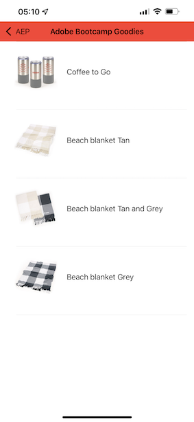
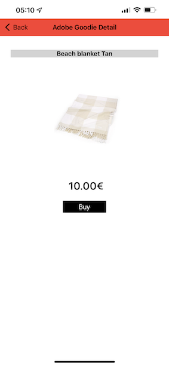

# 3.1 Verwenden der mobilen App und Trigger eines Beacon-Eintrags

## Installieren der App

Bevor Sie die App installieren, müssen Sie das **Tracking** auf Ihrem iOS-Gerät aktivieren. Wechseln Sie dazu zu **Einstellungen** > **Datenschutz und Sicherheit** > **Tracking** und stellen Sie sicher, dass die Option **Zulassen, dass Apps verfolgt werden können**, verwendet wird.

Navigieren Sie zur Apple App Store und suchen Sie nach `aepmobile-bootcamp`. Klicken Sie auf **Installieren** oder **Herunterladen**.

Klicken Sie nach der Installation der App auf **Öffnen**.

Klicken Sie auf **OK**.

Klicken Sie auf **Allow**.

Klicken Sie auf **Ich stimme zu**.

Klicken Sie auf **Zulassen bei Verwendung von App**.

Klicken Sie auf **Allow**.

Sie befinden sich jetzt in der App auf der Startseite und können die Journey durchlaufen.

## Journey-Fluss des Kunden

Zunächst müssen Sie sich anmelden. Klicken Sie auf **Anmelden**.

Nachdem Sie Ihr Konto in den vorherigen Übungen erstellt haben, haben Sie dies auf der Website gesehen. Sie müssen jetzt die E-Mail-Adresse des Kontos, das Sie in der App erstellt haben, erneut verwenden, um sich anzumelden.

Geben Sie hier die E-Mail-Adresse ein, die Sie auf der Website verwendet haben, und klicken Sie auf **Anmelden**.

Sie erhalten dann eine Bestätigung, dass Sie angemeldet sind, und eine Push-Benachrichtigung.

Kehren Sie zur Homepage in der App zurück und sehen Sie zusätzliche Funktionen.

Gehen Sie zuerst zu **Produkte**. Klicken Sie auf ein beliebiges Produkt, in diesem Beispiel **Kaffee, um zu gehen**.

Sie sehen die Produktseite **Kaffee zum Wechseln** in der App.

Sie simulieren jetzt ein Beacon-Eintrittsereignis an einem Offline-Store-Speicherort. Das Ziel der Simulation ist es, das Kundenerlebnis auf den In-Store-Bildschirmen zu personalisieren. Um das Erlebnis im Store zu visualisieren, wurde eine Seite erstellt, auf der die Informationen dynamisch angezeigt werden, die für den Kunden relevant sind, der gerade in den Store eingetreten ist.

Bevor Sie fortfahren, öffnen Sie diese Webseite auf Ihrem Computer: [https://bootcamp.aepdemo.net/content/aep-bootcamp-experience/language-masters/en/screen.html](https://bootcamp.aepdemo.net/content/aep-bootcamp-experience/language-masters/en/screen.html)

Daraufhin sehen Sie Folgendes:

Gehen Sie dann zurück zur Homepage. Klicken Sie auf das Symbol **Beacon** .

Dann wirst du das sehen. Wählen Sie zunächst **Bootcamp Screen Beacon** und klicken Sie dann auf die Schaltfläche **entry** . Auf diese Weise können Sie einen Beacon-Eintrag simulieren.

Sehen Sie sich nun den Bildschirm im Geschäft an. Das zuletzt angezeigte Produkt wird innerhalb von 5 Sekunden angezeigt.

Gehen Sie dann zurück zu **Products**. Klicken Sie auf ein beliebiges Produkt, in diesem Beispiel **Stranddecke Tan**.

Gehen Sie dann zurück zur Homepage. Klicken Sie auf das Symbol **Beacon** .

Dann wirst du das sehen. Wählen Sie zunächst **Bootcamp Screen Beacon** und klicken Sie dann erneut auf die Schaltfläche **entry** . Auf diese Weise können Sie einen Beacon-Eintrag simulieren.

Sehen Sie sich nun noch einmal den Bildschirm im Geschäft an. Das zuletzt angezeigte Produkt wird innerhalb von 5 Sekunden angezeigt.

Sehen wir uns jetzt auch Ihren Profil-Viewer auf der Website an. Dort wurden viele Ereignisse hinzugefügt, um zu zeigen, dass jede Interaktion mit einem Kunden in Adobe Experience Platform erfasst und gespeichert wird.

In den nächsten Übungen konfigurieren und testen Sie Ihre eigene Beacon-Journey.

Nächster Schritt: [3.2 Ereignis erstellen](./ex2.md)

[Zurück zum Benutzerfluss 3](./uc3.md)

[Zu allen Modulen zurückkehren](../../overview.md)
