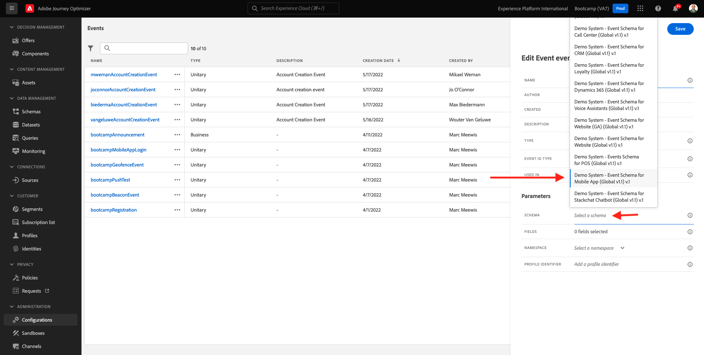

# 3.2 Ereignis erstellen

Melden Sie sich bei Adobe Journey Optimizer an, indem Sie zu [Adobe Experience Cloud](https://experience.adobe.com) wechseln. Klicken Sie auf **Journey Optimizer**.

Sie werden zur Ansicht **Home** in Journey Optimizer weitergeleitet. Vergewissern Sie sich zunächst, dass Sie die richtige Sandbox verwenden. Die zu verwendende Sandbox heißt `Bootcamp`. Um von einer Sandbox zu einer anderen zu wechseln, klicken Sie auf **Prod** und wählen Sie die Sandbox aus der Liste aus. In diesem Beispiel trägt die Sandbox den Namen **Bootcamp2**. Sie befinden sich dann in der Ansicht **Home** Ihrer Sandbox `Bootcamp`.

Scrollen Sie im linken Menü nach unten und klicken Sie auf **Konfigurationen**. Klicken Sie anschließend unter **Ereignisse** auf die Schaltfläche **Verwalten** .

Daraufhin wird eine Übersicht über alle verfügbaren Ereignisse angezeigt. Klicken Sie auf **Ereignis erstellen** , um mit der Erstellung Ihres eigenen Ereignisses zu beginnen.

Daraufhin wird ein neues, leeres Ereignisfenster angezeigt.

Geben Sie zunächst Ihrem Ereignis einen Namen wie folgt: `yourLastNameBeaconEntryEvent` und fügen Sie eine Beschreibung wie diese `Beacon Entry Event` hinzu.

Stellen Sie als Nächstes sicher, dass der **Typ** auf **Einzeln** eingestellt ist, und wählen Sie für die Auswahl des **Ereignis-ID-Typs** die Option **Systemgeneriert** aus.

Als Nächstes folgt die Schemaauswahl. Für diese Übung wurde ein Schema vorbereitet. Verwenden Sie das Schema `Demo System - Event Schema for Mobile App (Global v1.1) v.1`.

Nach Auswahl des Schemas werden im Abschnitt **Felder** eine Reihe von Feldern ausgewählt. Sie sollten nun den Mauszeiger über den Abschnitt **Felder** bewegen und es werden drei Symbole angezeigt. Klicken Sie auf das Symbol **Bearbeiten**.

Es wird ein Popup-Fenster mit dem Namen **Felder** angezeigt, in dem Sie einige der Felder auswählen müssen, die zum Personalisieren der Journey erforderlich sind.  Später werden wir mithilfe der bereits in Adobe Experience Platform vorhandenen Daten andere Profilattribute auswählen.

Scrollen Sie nach unten, bis das Objekt `Place context` angezeigt wird, und aktivieren Sie das Kontrollkästchen. Dadurch wird der gesamte Kontext des Standorts des Kunden dem Journey zur Verfügung gestellt. Klicken Sie auf **OK** , um Ihre Änderungen zu speichern.

Dann sollten Sie das sehen. Klicken Sie erneut auf **Speichern** , um Ihre Änderungen zu speichern.

Ihr Ereignis ist jetzt konfiguriert und gespeichert.

Klicken Sie erneut auf das Ereignis, um den Bildschirm **Ereignis bearbeiten** erneut zu öffnen. Bewegen Sie den Mauszeiger erneut über **Felder**, um die 3 Symbole anzuzeigen. Klicken Sie auf das Symbol **Ansicht** .

Sie sehen nun ein Beispiel der erwarteten Payload.
Ihr Ereignis verfügt über eine eindeutige eventID für die Orchestrierung, die Sie finden können, indem Sie in dieser Payload nach unten scrollen, bis Sie `_experience.campaign.orchestration.eventID` sehen.

Die Ereignis-ID muss an Adobe Experience Platform gesendet werden, um die Journey Trigger, die Sie in einer der nächsten Übungen erstellen werden. Denken Sie an diese eventID, da Sie sie möglicherweise später benötigen.
`"eventID": "e76c0bf0c77c3517e5b6f4c457a0754ebaf5f1f6b9357d74e0d8e13ae517c3d5"`

Klicken Sie auf **OK** und anschließend auf **Abbrechen**.

Du bist jetzt mit dieser Übung fertig.

Nächster Schritt: [3.3 Journey und Push-Benachrichtigung erstellen](./ex3.md)

[Zurück zum Benutzerfluss 3](./uc3.md)

[Zu allen Modulen zurückkehren](../../overview.md)
