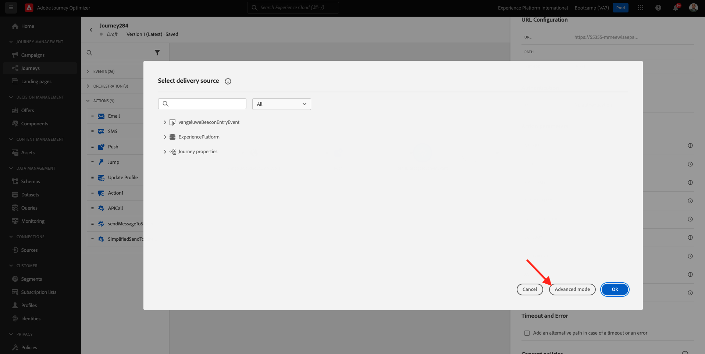
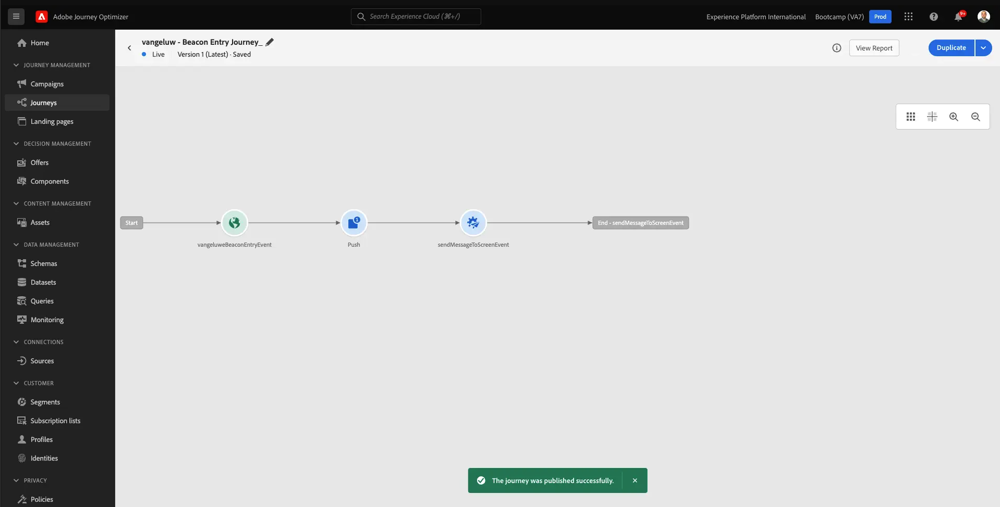

# 3.3 Erstellen von Journey- und Push-Benachrichtigungen

In dieser Übung konfigurieren Sie die Journey und die Nachricht, die ausgelöst werden muss, wenn jemand über die Mobile App einen Beacon betritt.

Melden Sie sich bei Adobe Journey Optimizer an, indem Sie zu [Adobe Experience Cloud wechseln](https://experience.adobe.com). Auf **Journey Optimizer**.

Sie werden zur Ansicht **Startseite** in Journey Optimizer weitergeleitet. Stellen Sie zunächst sicher, dass Sie die richtige Sandbox verwenden. Die zu verwendende Sandbox heißt `Bootcamp`. Um von einer Sandbox in eine andere zu wechseln, klicken Sie auf **Prod** und wählen Sie die Sandbox aus der Liste aus. In diesem Beispiel heißt die Sandbox **Bootcamp**. Sie befinden sich dann in der **Startseite**-Ansicht Ihres Sandbox-`Bootcamp`.

## 3.3.1 Journey erstellen

Klicken Sie im linken Menü auf **Journeys**. Klicken Sie anschließend auf **Journey erstellen**, um eine neue Journey zu erstellen.

Daraufhin wird ein leerer Journey-Bildschirm angezeigt.

In der vorherigen Übung haben Sie ein neues &quot;**&quot;**. Sie haben ihn wie `yourLastNameBeaconEntryEvent` benannt und `yourLastName` durch Ihren Nachnamen ersetzt. Dies war das Ergebnis der Erstellung des Ereignisses:

Jetzt müssen Sie dieses Ereignis als Beginn dieser Journey nehmen. Dies können Sie tun, indem Sie zur linken Seite Ihres Bildschirms gehen und in der Ereignisliste nach Ihrem Ereignis suchen.

Wählen Sie Ihr Ereignis aus und ziehen Sie es per Drag-and-Drop auf die Journey-Arbeitsfläche. Ihr Journey sieht jetzt wie folgt aus. Klicken Sie auf **OK**, um Ihre Änderungen zu speichern.

Als zweiten Schritt auf der Journey müssen Sie eine **Push“-** hinzufügen. Gehen Sie auf der linken Seite des Bildschirms zu **Aktionen** wählen Sie die Aktion **Push** aus und ziehen Sie sie dann per Drag-and-Drop auf den zweiten Knoten in Ihrem Journey.

Jetzt müssen Sie Ihre Push-Benachrichtigung auf der rechten Bildschirmseite erstellen.

Legen Sie die **Kategorie** auf **Marketing** fest und wählen Sie eine Push-Oberfläche aus, mit der Sie Push-Benachrichtigungen senden können. In diesem Fall ist die auszuwählende Push-Oberfläche **mmeeewis-app-mobile-bootcamp**.

## 3.3.2 Erstellen einer Nachricht

Klicken Sie **Inhalt bearbeiten**.

Sie sehen dann Folgendes:

Definieren wir den Inhalt der Push-Benachrichtigung.

Klicken Sie auf **Textfeld** Titel“.

Beginnen Sie im Textbereich mit dem Schreiben **Hi**. Klicken Sie auf das Personalisierungssymbol.

Nun müssen Sie das Personalisierungs-Token für das Feld **Vorname“ einfügen** das unter `profile.person.name.firstName` gespeichert ist. Wählen Sie im linken Menü **Profilattribute**, scrollen Sie nach unten/navigieren Sie, um das Element **Person** zu finden, und klicken Sie auf den Pfeil, um eine Ebene tiefer zu gehen, bis Sie die `profile.person.name.firstName` erreichen. Klicken Sie auf das Symbol **+** , um das Feld zur Arbeitsfläche hinzuzufügen. Klicken Sie auf **Speichern**.

Dann bist du wieder hier. Klicken Sie auf das Personalisierungssymbol neben dem Feld **Hauptteil**.

Schreiben Sie `Welcome at the ` in den Textbereich.

Klicken Sie anschließend auf **Kontextuelle Attribute** und dann auf **Journey Orchestration**.

Klicken Sie auf **Ereignisse**.

Klicken Sie auf den Namen Ihres Ereignisses, der wie folgt aussehen sollte: **yourLastNameBeaconEntryEvent**.

Klicken Sie **Ortskontext**.

Klicken Sie **POI Interaction**.

Klicken Sie auf **POI-Detail**.

Klicken Sie auf das Symbol **+** in **POI-Name**.
Sie werden es dann sehen. Klicken Sie auf **Speichern**.

Ihre Nachricht ist jetzt bereit. Klicken Sie auf den Pfeil oben links, um zu Ihrem Journey zurückzukehren.

Klicken Sie auf **OK**.

## 3.3.2 Senden einer Nachricht an einen Bildschirm

Als dritten Schritt auf der Journey müssen Sie eine Aktion **sendMessageToScreen** hinzufügen. Gehen Sie auf der linken Seite des Bildschirms zu **Aktionen**, wählen Sie die Aktion **sendMessageToScreen** aus und ziehen Sie sie dann per Drag-and-Drop auf den dritten Knoten in Ihrem Journey. Sie werden es dann sehen.

Die **sendMessageToScreen**-Aktion ist eine benutzerdefinierte Aktion, mit der eine Nachricht an dem Endpunkt veröffentlicht wird, der von der Anzeige im Geschäft verwendet wird. Die **sendMessageToScreen**-Aktion erwartet, dass eine Reihe von Variablen definiert wird. Sie können diese Variablen anzeigen, indem Sie nach unten scrollen, bis Sie **Aktionsparameter** sehen.

Jetzt müssen Sie die Werte für jeden Aktionsparameter festlegen. In dieser Tabelle erfahren Sie, welche Werte wo erforderlich sind.

| Parameter | Wert |
|:-------------:| :---------------:|
| VERSAND | `'image'` |
| ECID | `@{yourLastNameBeaconEntryEvent._experienceplatform.identification.core.ecid}` |
| VORNAME | `#{ExperiencePlatform.ProfileFieldGroup.profile.person.name.firstName}` |
| EREIGNISBETREFF | `#{ExperiencePlatform.ProductListItems.experienceevent.first(currentDataPackField.eventType == "commerce.productViews").productListItems.first().name}` |
| EVENTSUBJECTURL | `#{ExperiencePlatform.ProductListItems.experienceevent.first(currentDataPackField.eventType == "commerce.productViews").productListItems.first()._experienceplatform.core.imageURL}` |
| SANDBOX | `'bootcamp'` |
| CONTAINER-ID | `''` |
| ACTIVITYID | `''` |
| PLACEMENTID | `''` |

{style="table-layout:auto"}

Um diese Werte festzulegen, klicken Sie auf das Symbol **Bearbeiten**.

Wählen Sie als Nächstes **Erweiterter Modus** aus.

Fügen Sie dann den Wert basierend auf der obigen Tabelle ein. Klicken Sie auf **OK**.

Wiederholen Sie diesen Vorgang, um Werte für jedes Feld hinzuzufügen.

>[!IMPORTANT]
>
>Für das Feld ECID gibt es einen Verweis auf die `yourLastNameBeaconEntryEvent`. Bitte stellen Sie sicher, dass Sie `yourLastName` durch Ihren Nachnamen ersetzen.

Das Endergebnis sollte wie folgt aussehen:

Scrollen Sie nach oben und klicken Sie auf **OK**.

Sie müssen Ihrem Journey dennoch einen Namen geben. Klicken Sie dazu auf das **Bleistift**-Symbol oben links auf Ihrem Bildschirm.

Geben Sie hier den Namen der Journey ein. Bitte verwenden Sie `yourLastName - Beacon Entry Journey`. Klicken Sie auf **OK**, um die Änderungen zu speichern.

Sie können Ihren Journey jetzt veröffentlichen, indem Sie auf **Publish** klicken.

Klicken Sie erneut auf **** Publish.

Sie sehen dann eine grüne Bestätigungsleiste, dass Ihr Journey jetzt veröffentlicht ist.

Ihr Journey ist jetzt live und kann ausgelöst werden.

Sie haben jetzt diese Übung beendet.

Nächster Schritt: [3.4 Journey testen](./ex4.md)

[Zurück zu Benutzerfluss 3](./uc3.md)

[Zurück zu „Alle Module“](../../overview.md)
