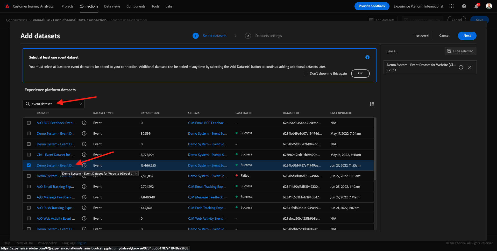
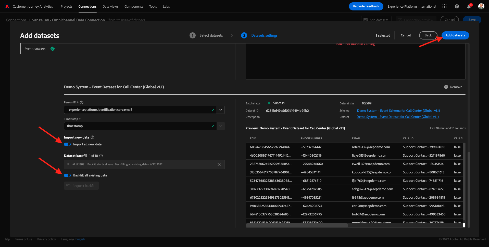

# 4.2 Adobe Experience Platform-Datensätze in Customer Journey Analytics verbinden

## Ziele

- Grundlegendes zur Benutzeroberfläche der Datenverbindung
- Einbinden von Adobe Experience Platform-Daten in CJA
- Personen-ID und Datenzuordnung verstehen
- Erfahren Sie mehr über das Konzept des Daten-Streaming unter Customer Journey Analytics

## 4.2.1 Verbindung

Wechseln Sie zu [analytics.adobe.com](https://analytics.adobe.com) , um auf Customer Journey Analytics zuzugreifen.

Wechseln Sie auf der Customer Journey Analytics-Homepage zu **Verbindungen**.

Hier sehen Sie alle Verbindungen, die zwischen CJA und Platform hergestellt wurden. Diese Verbindungen haben dasselbe Ziel wie Report Suites in Adobe Analytics. Die Erfassung der Daten ist jedoch völlig anders. Alle Daten stammen aus Adobe Experience Platform-Datensätzen.

Erstellen wir Ihre erste Verbindung. Klicken Sie auf **Neue Verbindung erstellen**.

Daraufhin wird die Benutzeroberfläche **Verbindung erstellen** angezeigt.

Jetzt können Sie Ihrer Verbindung einen Namen geben.

Verwenden Sie diese Namenskonvention: `yourLastName – Omnichannel Data Connection`.

Beispiel: `vangeluw - Omnichannel Data Connection`

Sie müssen auch die richtige Sandbox auswählen, die verwendet werden soll. Wählen Sie im Sandbox-Menü Ihre Sandbox aus, die `Bootcamp` sein soll. In diesem Beispiel lautet die zu verwendende Sandbox **Bootcamp**. Außerdem müssen Sie die **durchschnittliche Anzahl der täglichen Ereignisse** auf **weniger als 1 Million** festlegen.

Nachdem Sie Ihre Sandbox ausgewählt haben, können Sie Datensätze zu dieser Verbindung hinzufügen. Klicken Sie auf **Datensätze hinzufügen**.

## 4.2.2 Adobe Experience Platform-Datensätze auswählen

Suchen Sie nach dem Datensatz &quot;`Demo System - Event Dataset for Website (Global v1.1)`&quot;. Klicken Sie auf **+** , um den Datensatz zu dieser Verbindung hinzuzufügen.

Suchen Sie jetzt nach den Kontrollkästchen für `Demo System - Profile Dataset for Loyalty (Global v1.1)` und `Demo System - Event Dataset for Call Center (Global v1.1)` und aktivieren Sie sie.

Dann wirst du das haben. Klicken Sie auf **Weiter**.

## 4.2.3 Personen-ID und Datenzuordnung

### Personen-ID

Das Ziel besteht nun darin, sich diesen Datensätzen anzuschließen. Für jeden ausgewählten Datensatz wird ein Feld namens **Personen-ID** angezeigt. Jeder Datensatz verfügt über ein eigenes Personen-ID-Feld.

Wie Sie sehen können, ist bei den meisten Benutzern automatisch die Personen-ID ausgewählt. Dies liegt daran, dass in jedem Schema in Adobe Experience Platform eine Primäre Kennung ausgewählt ist. Hier ist beispielsweise das Schema für `Demo System - Event Schema for Call Center (Global v1.1)`, in dem die Primäre Kennung auf `phoneNumber` festgelegt ist.

Sie können jedoch weiterhin beeinflussen, welche Kennung zum Zuordnen von Datensätzen für Ihre Verbindung verwendet wird. Sie können jede beliebige Kennung verwenden, die im mit Ihrem Datensatz verknüpften Schema konfiguriert ist. Klicken Sie auf das Dropdown-Menü, um die für jeden Datensatz verfügbaren IDs zu untersuchen.

Wie bereits erwähnt, können Sie für jeden Datensatz verschiedene Personen-IDs festlegen. Auf diese Weise können Sie verschiedene Datensätze aus mehreren Quellen in CJA zusammenführen. Stellen Sie sich vor, Sie würden NPS- oder Umfragedaten einbringen, die sehr interessant und hilfreich wären, um den Kontext und die Gründe zu verstehen, warum etwas passiert ist.

Der Name des Felds Personen-ID ist nicht wichtig, solange der Wert in den Feldern Personen-ID übereinstimmt. Wenn beispielsweise die Personen-ID in einem Datensatz `email` und in einem anderen Datensatz `emailAddress` und `dnb-bootcamp@adobe.com` für das Personen-ID-Feld in beiden Datensätzen identisch ist, kann CJA die Daten zuordnen.

Derzeit gibt es einige andere Einschränkungen, wie die Zuordnung des anonymen Verhaltens zu bekannt. Lesen Sie die FAQs hier: [FAQ](https://experienceleague.adobe.com/docs/analytics-platform/using/cja-overview/cja-faq.html).

### Daten mithilfe der Personen-ID zuordnen

Nachdem Sie nun das Konzept der Zuordnung von Datensätzen mit der Personen-ID kennen, wählen wir für jeden Datensatz `email` als Personen-ID aus.

Gehen Sie zu jedem Datensatz, um die Personen-ID zu aktualisieren.

Füllen Sie nun das Feld Personen-ID aus, das die `email` in der Dropdown-Liste auswählt.

Sobald Sie die drei Datensätze zugeordnet haben, können wir fortfahren.

| datensatz | Personen-ID |
| ----------------- |-------------| 
| Demosystem - Ereignis-Datensatz für Website (Global v1.1) | E-Mail |
| Demosystem - Profildatensatz für Treueprogramm (Global v1.1) | E-Mail |
| Demosystem - Ereignis-Datensatz für das Callcenter (Global v1.1) | E-Mail |

Sie müssen außerdem sicherstellen, dass diese Optionen für jeden Datensatz aktiviert sind:

- Alle neuen Daten importieren
- Alle vorhandenen Daten aufstocken

Klicken Sie auf **Datensätze hinzufügen**.

Klicken Sie auf **Speichern** und gehen Sie zur nächsten Übung.
Nachdem Sie Ihre **Verbindung** erstellt haben, kann es einige Stunden dauern, bis Ihre Daten in Customer Journey Analytics verfügbar sind.

Nächster Schritt: [4.3 Eine Datenansicht erstellen](./ex3.md)

[Zurück zum Benutzerfluss 4](./uc4.md)

[Zu allen Modulen zurückkehren](./../../overview.md)
