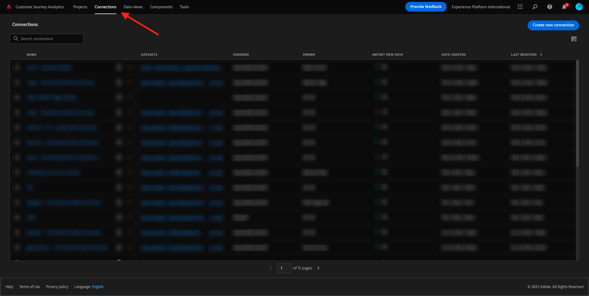
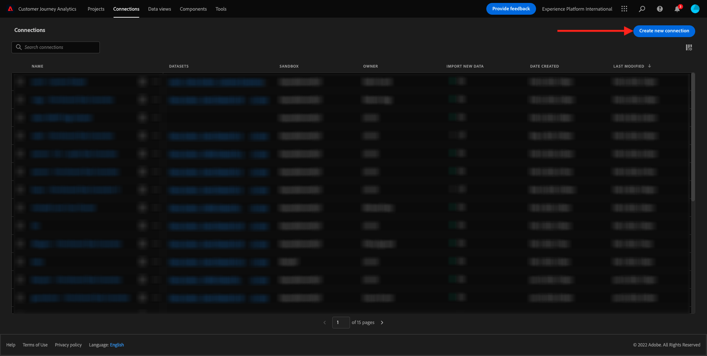
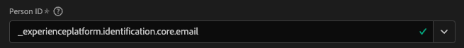
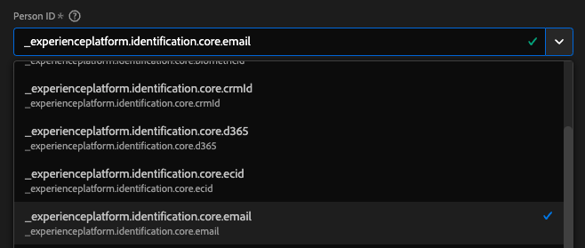

# 4.2 Verbinden von Adobe Experience Platform-Datensätzen in Customer Journey Analytics

## Ziele

- Grundlegendes zur Datenverbindungs-Benutzeroberfläche
- Adobe Experience Platform-Daten in CJA importieren
- Personen-ID und Datenzuordnung verstehen
- Erfahren Sie mehr über das Konzept des Daten-Streaming in Customer Journey Analytics

## 4.2.1 Anschluss

Navigieren Sie zu [analytics.adobe.com](https://analytics.adobe.com), um auf Customer Journey Analytics zuzugreifen.

Gehen Sie auf der Customer Journey Analytics-Homepage zu **Verbindungen**.

Hier können Sie die verschiedenen Verbindungen sehen, die zwischen CJA und Platform hergestellt wurden. Diese Verbindungen verfolgen dasselbe Ziel wie Report Suites in Adobe Analytics. Die Erfassung der Daten ist jedoch völlig anders. Alle Daten stammen aus Adobe Experience Platform-Datensätzen.

Erstellen wir Ihre erste Verbindung. Klicken Sie **Neue Verbindung erstellen**.

Anschließend wird die Benutzeroberfläche **Verbindung erstellen** angezeigt.

Sie können der Verbindung jetzt einen Namen geben.

Bitte diese Namenskonvention verwenden: `yourLastName – Omnichannel Data Connection`.

Beispiel: `vangeluw - Omnichannel Data Connection`

Sie müssen außerdem die richtige zu verwendende Sandbox auswählen. Wählen Sie im Menü Sandbox Ihre Sandbox aus, die `Bootcamp` werden soll. In diesem Beispiel ist die zu verwendende Sandbox **Bootcamp**. Außerdem müssen Sie die **durchschnittliche Anzahl der täglichen Ereignisse** auf **weniger als 1 Million)**.

Nachdem Sie Ihre Sandbox ausgewählt haben, können Sie beginnen, Datensätze zu dieser Verbindung hinzuzufügen. Klicken Sie **Datensätze hinzufügen**.

## 4.2.2 Adobe Experience Platform-Datensätze auswählen

Suchen Sie nach der `Demo System - Event Dataset for Website (Global v1.1)`. Klicken Sie auf **+**, um den Datensatz zu dieser Verbindung hinzuzufügen.

Suchen und aktivieren Sie nun die Kontrollkästchen für `Demo System - Profile Dataset for Loyalty (Global v1.1)` und `Demo System - Event Dataset for Call Center (Global v1.1)`.

Dann hast du das hier. Klicken Sie auf **Weiter**.

## 4.2.3 Personen-ID und Datenzuordnung

### Personen-ID

Das Ziel besteht nun darin, diese Datensätze zusammenzuführen. Für jeden ausgewählten Datensatz wird ein Feld mit dem Namen **Personen-ID** angezeigt. Jeder Datensatz verfügt über ein eigenes Personen-ID-Feld.

Wie Sie sehen können, ist bei den meisten Personen-IDs automatisch ausgewählt. Dies liegt daran, dass in jedem Schema in Adobe Experience Platform eine Primäre Kennung ausgewählt ist. Hier finden Sie beispielsweise das Schema für `Demo System - Event Schema for Call Center (Global v1.1)`, in dem Sie sehen können, dass die Primäre Kennung auf `phoneNumber` festgelegt ist.

Sie können jedoch weiterhin beeinflussen, welche Kennung zum Zusammenfügen von Datensätzen für Ihre Verbindung verwendet wird. Sie können eine beliebige Kennung verwenden, die im mit Ihrem Datensatz verknüpften Schema konfiguriert ist. Klicken Sie auf das Dropdown-Menü, um die für jeden Datensatz verfügbaren IDs zu untersuchen.

Wie bereits erwähnt, können Sie für jeden Datensatz unterschiedliche Personen-IDs festlegen. Auf diese Weise können Sie verschiedene Datensätze aus verschiedenen Ursprüngen in CJA zusammenführen. Stellen Sie sich vor, NPS- oder Umfragedaten einzubringen, die sehr interessant und hilfreich wären, um den Kontext zu verstehen und warum etwas passiert ist.

Der Name des Personen-ID-Feldes ist nicht wichtig, solange der Wert in den Personen-ID-Feldern übereinstimmt. Wenn beispielsweise die Personen-ID in einem Datensatz `email` und in einem anderen `emailAddress` wird und `dnb-bootcamp@adobe.com` für das Personen-ID-Feld in beiden Datensätzen derselbe Wert ist, kann CJA die Daten zusammenfügen.

Derzeit gibt es einige andere Einschränkungen, z. B. das Zuordnen des anonymen Verhaltens zu bekannten. Lesen Sie die FAQs hier: [FAQ](https://experienceleague.adobe.com/docs/analytics-platform/using/cja-overview/cja-faq.html).

### Daten mithilfe der Personen-ID zusammenfügen

Nachdem Sie nun das Konzept des Zusammenfügens von Datensätzen mit der Personen-ID verstanden haben, wählen wir `email` als Personen-ID für jeden Datensatz aus.

Gehen Sie zu jedem Datensatz, um die Personen-ID zu aktualisieren.

Füllen Sie jetzt das Feld Personen-ID aus, indem Sie die `email` in der Dropdown-Liste auswählen.

Nachdem Sie die drei Datensätze zusammengefügt haben, können wir fortfahren.

| datensatz | Personen-ID |
| ----------------- |-------------| 
| Demosystem - Ereignisdatensatz für eine Website (Global v1.1) | E-Mail |
| Demosystem - Profildatensatz für Treue (globale Version 1.1) | E-Mail |
| Demosystem - Ereignisdatensatz für Callcenter (Global v1.1) | E-Mail |

Sie müssen außerdem sicherstellen, dass diese Optionen für jeden Datensatz aktiviert sind:

- Alle neuen Daten importieren
- Alle vorhandenen Daten aufstocken

Klicken Sie **Datensätze hinzufügen**.

Klicken Sie **Speichern** und gehen Sie zur nächsten Übung.
Nachdem Sie Ihre **Verbindung** erstellt haben, kann es einige Stunden dauern, bis Ihre Daten in CJA verfügbar sind.

Nächster Schritt: [4.3 Erstellen einer Datenansicht](./ex3.md)

[Zurück zu Benutzerfluss 4](./uc4.md)

[Zurück zu „Alle Module“](./../../overview.md)
