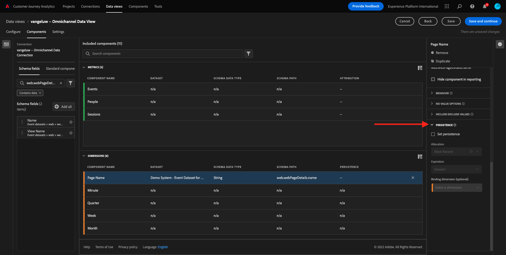

# 4.3 Datenansicht erstellen

## Ziele

- Grundlegendes zur Benutzeroberfläche der Datenansicht
- Grundlegende Einstellungen der Besuchsdefinition
- Grundlegendes zu Attribution und Persistenz in einer Datenansicht

## 4.3.1 Datenansicht

Nachdem die Verbindung hergestellt wurde, können Sie jetzt Fortschritte bei der Beeinflussung der Visualisierung erzielen. Ein Unterschied zwischen Adobe Analytics und CJA besteht darin, dass CJA eine Datenansicht benötigt, um die Daten vor der Visualisierung zu bereinigen und vorzubereiten.

Eine Datenansicht ähnelt dem Konzept von Virtual Report Suites in Adobe Analytics, wo Sie kontextbezogene Besuchsdefinitionen, Filtervorgänge und auch die Art und Weise definieren, wie die Komponenten aufgerufen werden.

Sie benötigen mindestens eine Datenansicht pro Verbindung. Für einige Anwendungsfälle ist es jedoch großartig, mehrere Datenansichten für dieselbe Verbindung zu haben, um verschiedenen Teams unterschiedliche Einblicke zu geben.
Wenn Sie möchten, dass Ihr Unternehmen datengesteuert wird, sollten Sie anpassen, wie Daten in den einzelnen Teams angezeigt werden. Beispiele:

- UX-Metriken nur für das UX-Design-Team
- Verwenden Sie für Google Analytics dieselben Namen für KPIs und Metriken wie für Customer Journey Analytics, damit das Digital Analytics-Team nur 1 Sprache sprechen kann.
- Datenansicht gefiltert, um z. B. Daten nur für einen Markt, eine Marke oder nur für Mobilgeräte anzuzeigen.

Im **Verbindungen** aktivieren Sie das Kontrollkästchen vor der soeben erstellten Verbindung. Klicken **Datenansicht erstellen**.

Sie werden zum **Datenansicht erstellen** Arbeitsablauf.

## 4.3.2 Definition der Datenansicht

Sie können jetzt die grundlegenden Definitionen für Ihre Datenansicht konfigurieren.

Die **Verbindung** die Sie in der vorherigen Übung erstellt haben, ist bereits ausgewählt. Ihre Verbindung heißt `yourLastName – Omnichannel Data Connection`.

Geben Sie Ihrer Datenansicht einen Namen, der dieser Namenskonvention entspricht: `yourLastName – Omnichannel Data View`.

Geben Sie für die Beschreibung denselben Wert ein: `yourLastName – Omnichannel Data View`.

| Name | Beschreibung |
| ----------------- |-------------| 
| `yourLastName – Omnichannel Data View` | `yourLastName – Omnichannel Data View` |

Für **Zeitzone**, wählen Sie die Zeitzone aus. **Berlin, Stockholm, Rom, Bern, Brüssel, Wien, Amsterdam GMT+01:00**. Dies ist ein wirklich interessanter Rahmen, da einige Unternehmen in verschiedenen Ländern und Regionen tätig sind. Wenn Sie für jedes Land die richtige Zeitzone zuweisen, werden typische Datenfehler vermieden, z. B. weil Sie glauben, dass in Peru die Mehrheit der Menschen T-Shirts um 4:00 Uhr kaufen.

Sie können auch die Benennung der Hauptmetriken ändern (Person, Sitzung und Ereignis). Dies ist nicht erforderlich, aber einige Kunden verwenden gerne Personen, Besuche und Treffer anstelle von Personen, Sitzungen und Ereignissen (Standardbenennungskonvention von Customer Journey Analytics).

Folgende Einstellungen sollten jetzt konfiguriert sein:

Klicken **Speichern und fortfahren**.

## 4.3.3 Datenansichtskomponenten

In dieser Übung konfigurieren Sie die Komponenten, die Sie benötigen, um die Daten zu analysieren und mithilfe von Analysis Workspace zu visualisieren. In dieser Benutzeroberfläche gibt es drei Hauptbereiche:

- Linke Seite: Verfügbare Komponenten aus den ausgewählten Datensätzen
- Mittel: Komponenten zur Datenansicht hinzugefügt
- Rechts: Komponenteneinstellungen

>[!IMPORTANT]
>
>Wenn Sie eine bestimmte Metrik oder Dimension nicht finden können, überprüfen Sie, ob das Feld `Contains data` aus Ihrer Datenansicht entfernt. Wenn nicht, löschen Sie bitte dieses Feld.
>
>

Sie müssen jetzt die für die Analyse benötigten Komponenten per Drag-and-Drop in die **Komponenten hinzugefügt**. Wählen Sie dazu die Komponenten im linken Menü aus und ziehen Sie sie auf die Arbeitsfläche in der Mitte.

Beginnen wir mit der ersten Komponente: **Name (web.webPageDetails.name)**. Suchen Sie nach dieser Komponente und ziehen Sie sie auf die Arbeitsfläche.

Diese Komponente ist der Seitenname, den Sie aus dem Lesen des Schemafelds ableiten können `(web.webPageDetails.name)`.

Verwenden Sie jedoch **Name** da der Name nicht die beste Namenskonvention ist, damit ein Business-Anwender diese Dimension schnell verstehen kann.

Ändern wir den Namen in **Seitenname**. Klicken Sie auf die Komponente und benennen Sie sie im **Komponenteneinstellungen** Bereich.

Etwas Wichtiges ist: **Persistenz-Einstellungen**. Das Konzept von eVars und prop existiert nicht in CJA, aber die Persistenzeinstellungen ermöglichen ein ähnliches Verhalten.

Wenn Sie diese Einstellungen nicht ändern, interpretiert CJA die Dimension als **Prop** (Trefferebene). Außerdem können wir die Persistenz ändern, um die Dimension zu einer **eVar** (Beibehalten des Werts über die Journey).

Wenn Sie nicht mit eVars und Props vertraut sind, können Sie [Weitere Informationen dazu finden Sie in der Dokumentation .](https://experienceleague.adobe.com/docs/analytics/landing/an-key-concepts.html).

Lassen Sie den Seitennamen als Eigenschaft. Daher müssen Sie keine **Persistenz-Einstellungen**.

| Komponentenname zur Suche | Neuer Name | Persistenz-Einstellungen |
| ----------------- |-------------| --------------------| 
| Name (web.webPageDetails.name) | Page Name |  |

Wählen Sie als Nächstes die Dimension aus **phoneNumber** und legen Sie es auf der Arbeitsfläche ab. Der neue Name sollte **Telefonnummer**.

Lassen Sie uns abschließend die Persistenz-Einstellungen ändern, da die Mobiltelefonnummer auf Benutzerebene beibehalten werden sollte.

Um die Persistenz zu ändern, scrollen Sie im rechten Menü nach unten und öffnen Sie die **Persistenz** tab:

Aktivieren Sie das Kontrollkästchen, um die Persistenzeinstellungen zu ändern. Auswählen **Zuletzt verwendet** und **Person (Berichtsfenster)** , da wir uns nur um die letzte Mobiltelefonnummer dieser Person kümmern. Wenn der Kunde das Mobilgerät bei zukünftigen Besuchen nicht ausfüllt, wird dieser Wert dennoch ausgefüllt.

| Komponentenname zur Suche | Neuer Name | Persistenz-Einstellungen |
| ----------------- |-------------| --------------------| 
| phoneNumber | Telefonnummer | Zuletzt verwendet, Person (Berichtsfenster) |

Die nächste Komponente ist `web.webPageDetails.pageViews.value`.

Suchen Sie im Menü auf der linken Seite nach `web.webPageDetails.pageViews.value`. Ziehen Sie diese Metrik auf die Arbeitsfläche.

Ändern Sie den Namen in **Seitenansichten** unter **Komponenteneinstellungen**.

| Komponentenname zur Suche | Neuer Name | Attributionseinstellungen |
| ----------------- |-------------| --------------------| 
| web.webPageDetails.pageViews.value | Page Views |  |

Für die Attributionseinstellungen lassen wir diese leer.

Hinweis: Persistenzeinstellungen für Metriken können auch in Analysis Workspace geändert werden. In einigen Fällen können Sie es hier festlegen, um zu vermeiden, dass Geschäftsbenutzer sich vorstellen müssen, welches Persistenzmodell am besten geeignet ist.

Als Nächstes müssen Sie viele Dimensionen und Metriken konfigurieren, wie in der folgenden Tabelle angegeben.

### Dimensionen

| Komponentenname zur Suche | Neuer Name | Persistenz-Einstellungen |
| ----------------- |-------------| --------------------| 
| brandName | Markenname | Zuletzt verwendete Sitzung |
| Rückruf | Rufempfindlichkeit |  |
| Aufruf-ID | Interaktionstyp aufrufen |  |
| callTopic | Anrufthema | Zuletzt verwendete Sitzung |
| ecid | ECID | Zuletzt verwendet, Person (Berichtsfenster) |
| email | Email ID | Zuletzt verwendet, Person (Berichtsfenster) |
| Zahlungsart | Zahlungsart |  |
| Methode zum Hinzufügen von Produkten | Methode zum Hinzufügen von Produkten | Zuletzt verwendete Sitzung |
| Ereignistyp | Ereignistyp |  |
| Name (productListItems.name) | Produktname |  |
| SKU | SKU (Sitzung) | Zuletzt verwendete Sitzung |
| Transaction ID | Transaction ID |  |
| URL (web.webPageDetails.URL) | URL |  |
| Benutzeragent | Benutzeragent | Zuletzt verwendete Sitzung |
| usw | Treuestufe |  |
| Punkte | Kundenlebenszeitwert |  |

### METRIKEN

| Komponentenname zur Suche | Neuer Name | Attributionseinstellungen |
| ----------------- |-------------| --------------------| 
| Menge | Menge |  |
| commerce.order.priceTotal | Umsatz |  |

Ihre Konfiguration sollte dann wie folgt aussehen:

Vergiss nicht, **Speichern** Ihre Datenansicht. Also klicken **Speichern** jetzt.

## 4.3.4 Berechnete Metriken

Obwohl wir alle Komponenten in der Datenansicht organisiert haben, müssen Sie dennoch einige davon anpassen, damit Geschäftsbenutzer bereit sind, ihre Analyse zu starten.

Wenn Sie sich daran erinnern, haben wir nicht speziell Metriken wie &quot;Zum Warenkorb hinzufügen&quot;, &quot;Produktansicht&quot;oder &quot;Käufe&quot;in die Datenansicht integriert.
Wir haben jedoch eine Dimension namens: **Ereignistyp**. Lassen Sie uns diese Interaktionstypen ableiten, indem wir 3 berechnete Metriken erstellen.

Beginnen wir mit der ersten Metrik: **Produktansichten**.

Suchen Sie auf der linken Seite bitte nach **Ereignistyp** und wählen Sie die Dimension aus. Ziehen Sie es per Drag-and-Drop in das **Enthaltene Komponenten** Arbeitsfläche.

Klicken Sie auf , um die neue Metrik auszuwählen. **Ereignistyp**.

Ändern Sie nun den Namen und die Beschreibung der Komponente in die folgenden Werte:

| Name der Komponente | Komponentenbeschreibung |
| ----------------- |-------------| 
| Produktansichten | Produktansichten |

Jetzt nur zählen **Produktansichten** -Ereignisse. Scrollen Sie dazu nach unten zum **Komponenteneinstellungen** bis **Ausschlusswerte einschließen**. Stellen Sie sicher, dass die Option **Ein-/Ausschlusswerte festlegen**.

Da wir nur zählen wollen **Produktansichten**, bitte um Beschreibung **commerce.productViews** nach den Kriterien.

Ihre berechnete Metrik ist jetzt bereit!

Wiederholen Sie anschließend den gleichen Prozess für **Zum Warenkorb hinzufügen** und **Kauf** -Ereignisse.

### Zum Warenkorb hinzufügen

Ziehen Sie zuerst dieselbe Dimension per Drag &amp; Drop **Ereignistyp**.

Es wird eine Popup-Benachrichtigung zu einem duplizierten Feld angezeigt, da wir dieselbe Variable verwenden. Bitte klicken Sie auf **Alles hinzufügen**:

Gehen Sie nun genauso vor wie für die Metrik Produktansichten:
- Ändern Sie zunächst den Namen und die Beschreibung.
- Schließlich hinzufügen **commerce.productListAdds** als Kriterium zur Zählung nur &quot;Zum Warenkorb hinzufügen&quot;

| Name | Beschreibung | Kriterien |
| ----------------- |-------------| -------------|
| Zum Warenkorb hinzufügen | Zum Warenkorb hinzufügen | commerce.productListAdds |

### Käufe

Ziehen Sie zuerst dieselbe Dimension per Drag &amp; Drop **Ereignistyp** wie bei beiden vorherigen Metriken.

Es wird eine Popup-Benachrichtigung zu einem duplizierten Feld angezeigt, da wir dieselbe Variable verwenden. Bitte klicken Sie auf **Alles hinzufügen**:

Gehen Sie nun genauso vor wie bei den Metriken Produktansichten und Zum Warenkorb hinzufügen:
- Ändern Sie zunächst den Namen und die Beschreibung.
- Schließlich hinzufügen **commerce.purchases** als Kriterium zur Zählung nur von Käufen

| Name | Beschreibung | Kriterien |
| ----------------- |-------------| -------------|
| Käufe | Käufe | commerce.purchases |

Ihre endgültige Konfiguration sollte dann in etwa wie folgt aussehen: Klicken **Speichern und fortfahren**.

## 4.3.5 Datenansichtseinstellungen

Sie sollten zu diesem Bildschirm weitergeleitet werden:

Auf dieser Registerkarte können Sie einige wichtige Einstellungen ändern, um die Art und Weise der Datenverarbeitung zu ändern. Beginnen wir mit der Festlegung der **Sitzungs-Timeout** auf 30 Min. Dank des Zeitstempels jedes Erlebnisereignisses können Sie das Konzept einer Sitzung über alle Kanäle hinweg erweitern. Was passiert beispielsweise, wenn ein Kunde nach dem Besuch der Website das Callcenter anruft? Durch die Verwendung benutzerdefinierter Sitzungs-Timeouts haben Sie viel Flexibilität bei der Entscheidung, was eine Sitzung ist und wie diese Sitzung Daten zusammenführt.

In diesem Tab können Sie andere Elemente wie die Filterung der Daten mithilfe eines Segments/Filters ändern. In dieser Übung wirst du das nicht tun müssen.

Wenn Sie fertig sind, klicken Sie auf **Speichern und beenden**.

>[!NOTE]
>
>Anschließend können Sie zu dieser Datenansicht zurückkehren und Einstellungen und Komponenten jederzeit ändern. Änderungen wirken sich darauf aus, wie historische Daten angezeigt werden.

Sie können jetzt mit dem Visualisierungs- und Analysebereich fortfahren!

Nächster Schritt: [4.4 Datenvorbereitung im Customer Journey Analytics](./ex4.md)

[Zurück zum Benutzerfluss 4](./uc4.md)

[Zu allen Modulen zurückkehren](./../../overview.md)
