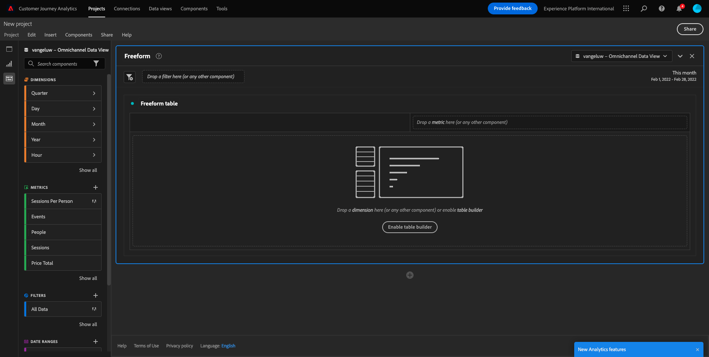
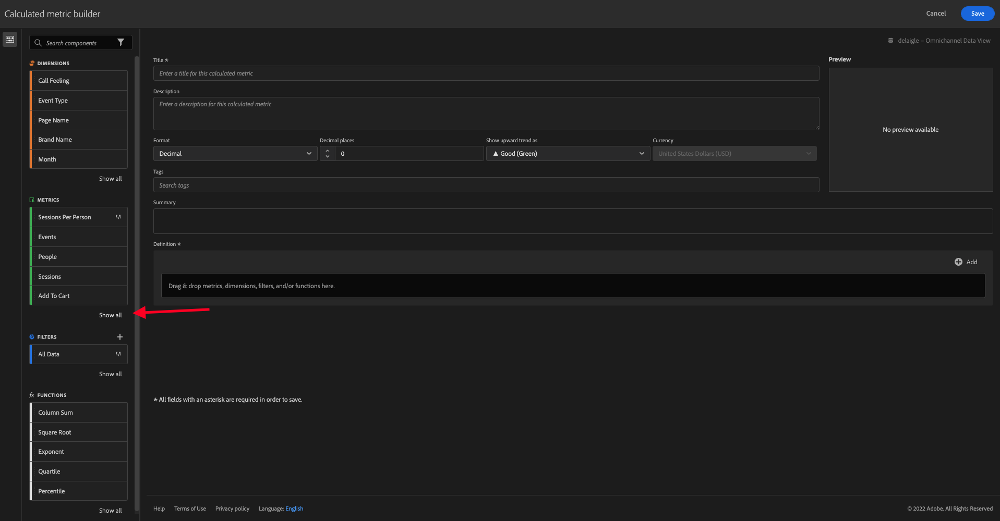

# 4.4 Datenvorbereitung in Analysis Workspace

## Ziele

- Grundlegendes zur Analysis Workspace-Benutzeroberfläche in CJA
- Grundlegendes zur Datenvorbereitung in Analysis Workspace
- Erfahren Sie, wie Sie Datenberechnungen durchführen.

## 4.4.1 Analysis Workspace-Benutzeroberfläche in CJA

Analysis Workspace beseitigt alle typischen Einschränkungen eines einzelnen Analytics-Berichts. Es bietet eine robuste, flexible Arbeitsfläche zum Erstellen benutzerdefinierter Analyseprojekte. Ziehen Sie per Drag-and-Drop eine beliebige Anzahl von Datentabellen, Visualisierungen und Komponenten (Dimensionen, Metriken, Segmente und Zeitgranularitäten) in ein Projekt. Erstellen Sie sofort Aufschlüsselungen und Segmente, erstellen Sie Kohorten für die Analyse, erstellen Sie Warnhinweise, vergleichen Sie Segmente, führen Sie Fluss- und Fallout-Analysen durch und kuratieren und planen Sie Berichte für die Freigabe für andere in Ihrem Unternehmen.

Customer Journey Analytics bringt diese Lösung zusätzlich zu den Platform-Daten. Es wird dringend empfohlen, sich dieses vierminütige Übersichtsvideo anzusehen:

>[!VIDEO](https://video.tv.adobe.com/v/35109?quality=12&learn=on)

Wenn Sie Analysis Workspace noch nie verwendet haben, empfehlen wir dringend, sich dieses Video anzusehen:

>[!VIDEO](https://video.tv.adobe.com/v/26266?quality=12&learn=on)

### Projekt erstellen

Jetzt ist es an der Zeit, Ihr erstes CJA-Projekt zu erstellen. Navigieren Sie zur Registerkarte &quot;Projekte&quot;in CJA.
Klicken Sie auf **Neu erstellen**.

Dann wirst du das sehen. Wählen Sie **Leeres Projekt** und klicken Sie dann auf **Erstellen**.

Dann sehen Sie ein leeres Projekt.

Wählen Sie zuerst die richtige Datenansicht in der oberen rechten Ecke des Bildschirms aus. In diesem Beispiel ist die auszuwählende Datenansicht `CJA Bootcamp - Omnichannel Data View`.

Als Nächstes speichern Sie Ihr Projekt und geben ihm einen Namen. Sie können den folgenden Befehl zum Speichern verwenden:

| Betriebssystem | Kurzschnitt |
| ----------------- |-------------| 
| Windows | Kontrolle + S |
| Mac | Befehl + S |

Dieses Popup wird angezeigt:

Bitte verwenden Sie diese Namenskonvention:

| Name | Beschreibung |
| ----------------- |-------------| 
| `yourLastName - Omnichannel Analysis` | `yourLastName - Omnichannel Analysis` |

Klicken Sie anschließend auf **Speichern**.

## 4.4.2 Berechnete Metriken

Obwohl wir alle Komponenten in der Datenansicht organisiert haben, müssen Sie dennoch einige davon anpassen, damit Geschäftsbenutzer bereit sind, ihre Analyse zu starten. Außerdem können Sie bei jeder Analyse eine berechnete Metrik erstellen, um die Insights-Suche genauer zu untersuchen.

Als Beispiel erstellen wir eine berechnete **Konversionsrate** mit der Metrik/dem Ereignis **Einkäufe** , die/das wir in der Datenansicht definiert haben.

### Konversionsrate

Beginnen wir damit, den Generator für berechnete Metriken zu öffnen. Klicken Sie auf **+** , um Ihre erste berechnete Metrik in Analysis Workspace zu erstellen.

Der Generator für berechnete Metriken **wird angezeigt:**

Suchen Sie im Menü auf der linken Seite in der Liste der Metriken den Eintrag **Einkäufe** . Klicken Sie unter **Metriken** auf **Alle anzeigen**

Ziehen Sie nun die Metrik **Einkäufe** in die Definition der berechneten Metrik.

Normalerweise bedeutet Konversionsrate **Konversionen/Sitzungen**. Gehen wir also dieselbe Berechnung in die Arbeitsfläche der berechneten Metrik-Definition. Suchen Sie die Metrik **Sitzungen** und ziehen Sie sie in den Definition-Builder unter dem Ereignis **Einkäufe** .

Beachten Sie, dass der Trennzeichen-Operator automatisch ausgewählt ist.

Die Konversionsrate wird in der Regel in Prozent dargestellt. Ändern wir also das Format in Prozent und wählen 2 Dezimalstellen aus.

Ändern Sie abschließend den Namen und die Beschreibung der berechneten Metrik:

| Titel | Beschreibung |
| ----------------- |-------------| 
| yourLastName - Konversionsrate | yourLastName - Konversionsrate |

Sie haben so etwas auf Ihrem Bildschirm:

Vergessen Sie nicht, die berechnete Metrik **zu speichern**.

## 4.4.3 Berechnete Dimensionen: Filter (Segmentierung) und Datumsbereiche

### Filter: Berechnete Dimensionen

Berechnungen sind nicht nur für Metriken vorgesehen. Bevor Sie mit einer Analyse beginnen, ist es auch interessant, einige **berechnete Dimensionen** zu erstellen. Dies bedeutete im Grunde **segments** zurück in Adobe Analytics. Unter Customer Journey Analytics werden diese Segmente als **Filter** bezeichnet.

Das Erstellen von Filtern hilft Benutzern aus Unternehmen, die Analyse mit einigen wertvollen berechneten Dimensionen zu beginnen. Dadurch werden einige Aufgaben automatisiert und der Adoptionsteil unterstützt. Hier einige Beispiele:

1. Eigene Medien, gebührenpflichtige Medien,
2. Neue und wiederkehrende Besuche
3. Kunden mit Warenkorb

Diese Filter können vor oder während des Analyseabschnitts erstellt werden (was Sie in der nächsten Übung tun werden).

### Datumsbereiche: Berechnete Dimensionen der Zeit

Zeitdimensionen sind andere Dimensionen. Einige sind bereits erstellt, Sie können aber auch Ihre eigenen benutzerdefinierten Time-Dimensionen in der Datenvorbereitungsphase erstellen.

Mithilfe dieser Dimensionen für berechnete Zeit können Analysten und Geschäftsbenutzer wichtige Daten speichern und diese zum Filtern und Ändern der Berichtszeit verwenden. Typische Fragen und Zweifel, die uns bei der Analyse in den Sinn kommen:

- Wann war Black Friday letztes Jahr? 21.-29.?
- Wann haben wir diese Fernsehkampagne im Dezember geführt?
- Von wann bis wann haben wir die Sommerverkäufe 2018 getätigt? Ich möchte es mit 2019 vergleichen. Wissen Sie übrigens genau die Tage 2019?

Sie haben die Datenvorbereitung mit CJA Analysis Workspace abgeschlossen.

Nächster Schritt: [4.5 Visualisierung mithilfe von Customer Journey Analytics](./ex5.md)

[Zurück zum Benutzerfluss 4](./uc4.md)

[Zu allen Modulen zurückkehren](./../../overview.md)
