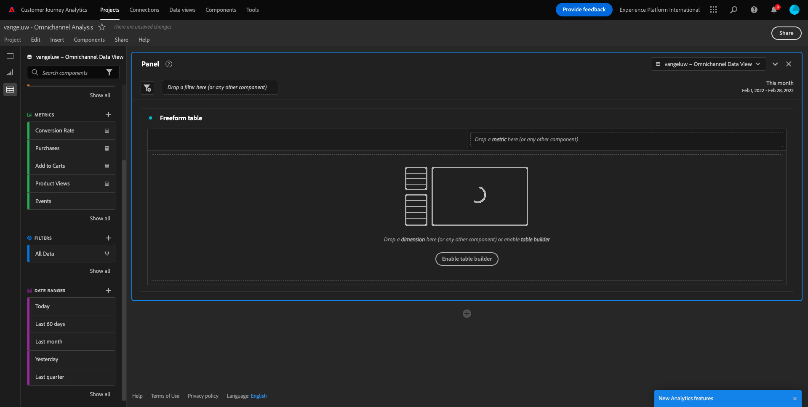
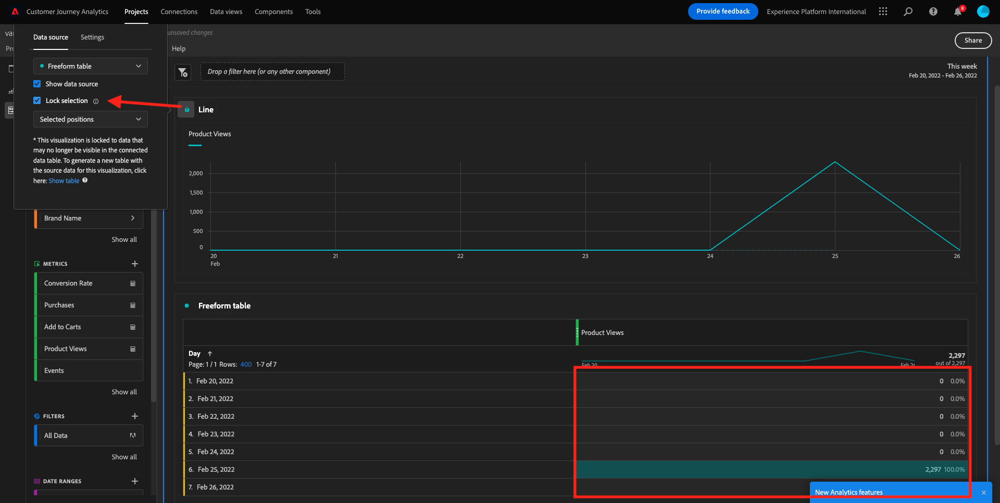
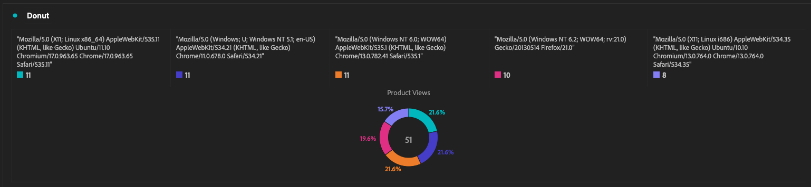
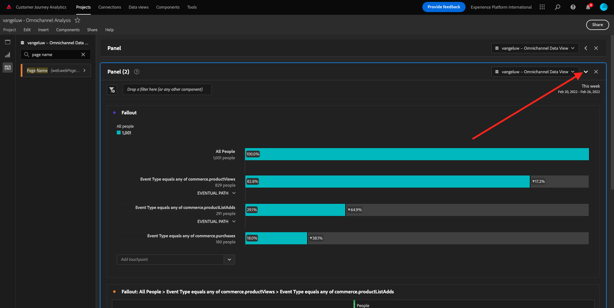
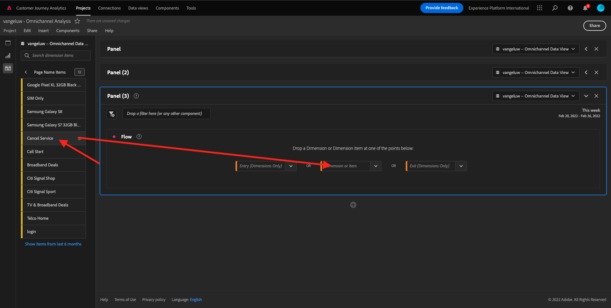
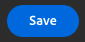

# 4.5 Visualisierung mit Customer Journey Analytics

## Ziele

- Grundlegendes zur Benutzeroberfläche von Analysis Workspace
- Lernen Sie einige Funktionen kennen, die Analysis Workspace so anders machen.
- Erfahren Sie, wie Sie mit Analysis Workspace in CJA analysieren.

## Kontext

In dieser Übung verwenden Sie Analysis Workspace in CJA, um Produktansichten, Produkttribute, Abwanderungen usw. zu analysieren.

Verwenden wir das Projekt, das Sie in [4.4 Datenvorbereitung in Analysis Workspace](./ex4.md), also gehen Sie zu [https://analytics.adobe.com](https://analytics.adobe.com).

Öffnen Sie Ihr Projekt `yourLastName - Omnichannel Analysis`.

Mit geöffnetem Projekt und Datenansicht `CJA Bootcamp - Omnichannel Data View` ausgewählt haben, können Sie mit der Erstellung Ihrer ersten Visualisierungen beginnen.

## Wie viele Produktansichten haben wir täglich?

Zunächst müssen wir die richtigen Daten für die Analyse der Daten auswählen. Gehen Sie auf der rechten Seite der Arbeitsfläche zum Kalender -Dropdown. Klicken Sie darauf und wählen Sie den entsprechenden Datumsbereich aus.

>[!IMPORTANT]
>
>Die neuesten verfügbaren Daten wurden am 9.19.2022 erfasst. Bitte wählen Sie einen Datumsbereich aus, der dieses Datum enthält.

Suchen Sie im Menü links (Komponentenbereich) die berechnete Metrik **Produktansichten**. Wählen Sie sie aus und ziehen Sie sie per Drag-and-Drop in die Arbeitsfläche oben rechts in der Freiformtabelle.

Automatisch die Dimension **Tag** wird hinzugefügt, um Ihre erste Tabelle zu erstellen. Jetzt können Sie sehen, wie Ihre Frage direkt beantwortet wird.

Klicken Sie anschließend mit der rechten Maustaste auf die Metrikzusammenfassung.

Klicken Sie auf **Visualisieren** und wählen Sie **Linie** als Visualisierung.

Sie sehen Ihre Produktansichten nach Tag.

Sie können den Zeitrahmen von Tag zu Tag ändern, indem Sie auf **Einstellungen** innerhalb der Visualisierung.

Klicken Sie auf den Punkt neben **Linie** nach **Datenquelle verwalten**.

Klicken Sie anschließend auf **Auswahl sperren** und wählen Sie **Ausgewählte Elemente** , um diese Visualisierung so zu sperren, dass immer eine Zeitleiste von Produktansichten angezeigt wird.

## Die vier beliebtesten Produkte

Welche Produkte werden am häufigsten angezeigt?

Vergessen Sie nicht, das Projekt ab und zu zu zu speichern.

| BS | Kurzschnitt |
| ----------------- |-------------| 
| Windows | Kontrolle + S |
| Mac | Befehl + S |

Beginnen wir damit, die vier am häufigsten angezeigten Produkte zu finden. Suchen Sie im Menü links die **Produktname** - Dimension.

Jetzt ziehen und ablegen **Produktname** , um **Tag** Dimension:

Dies ist das Ergebnis

Versuchen Sie als Nächstes, eines der Produkte nach Markenname aufzuschlüsseln. Suchen Sie nach **brandName** und ziehen Sie es unter den ersten Produktnamen.

Erstellen Sie anschließend eine Aufschlüsselung anhand der Treuestufe. Suchen Sie nach **Treuestufe** und ziehen Sie es unter den Markennamen.

Daraufhin sehen Sie Folgendes:

Schließlich können Sie weitere Visualisierungen hinzufügen. Suchen Sie auf der linken Seite unter &quot;Visualisierungen&quot;nach `Donut`. Nehmen Sie `Donut`, ziehen Sie sie per Drag-and-Drop auf die Arbeitsfläche unter **Linie** Visualisierung.

Wählen Sie als Nächstes in der Tabelle die 3 **Treuestufe**  Zeilen aus der Aufschlüsselung, die wir unter **Google Pixel XL 32 GB Black Smartphone** > **Citi Signal**. Halten Sie bei Auswahl der drei Zeilen die **STRG** (unter Windows) oder **Befehl** Schaltfläche (in Mac).

Das Ringdiagramm wird sich ändern:

Sie können das Design sogar so anpassen, dass es lesbarer ist, indem Sie beide **Linie** und **Ringdiagramm** Gravieren Sie ein wenig kleiner, damit sie nebeneinander platziert werden können:

Klicken Sie auf den Punkt neben **Ringdiagramm** nach **Datenquelle verwalten**.
Klicken Sie anschließend auf **Auswahl sperren** , um diese Visualisierung so zu sperren, dass immer eine Zeitleiste von Produktansichten angezeigt wird.

Weitere Informationen zu Visualisierungen mit Analysis Workspace finden Sie hier:

- [https://experienceleague.adobe.com/docs/analytics/analyze/analysis-workspace/visualizations/freeform-analysis-visualizations.html?lang=de](https://experienceleague.adobe.com/docs/analytics/analyze/analysis-workspace/visualizations/freeform-analysis-visualizations.html?lang=de)
- [https://experienceleague.adobe.com/docs/analytics/analyze/analysis-workspace/visualizations/t-sync-visualization.html](https://experienceleague.adobe.com/docs/analytics/analyze/analysis-workspace/visualizations/t-sync-visualization.html)

## Produkt-Interaktionstrichter, vom Anzeigen bis zum Kauf

Es gibt viele Möglichkeiten, diese Frage zu lösen. Eine davon besteht darin, den Interaktionstyp &quot;Produkt&quot;zu verwenden und ihn in einer Freiformtabelle zu verwenden. Eine andere Möglichkeit besteht darin, eine **Fallout-Visualisierung**. Verwenden wir die letzte, die wir gleichzeitig visualisieren und analysieren möchten.

Schließen Sie das aktuelle Bedienfeld, das wir haben, indem Sie hier klicken:

Fügen Sie jetzt ein neues leeres Bedienfeld hinzu, indem Sie auf **+ Leeres Bedienfeld hinzufügen**.

Klicken Sie auf die Visualisierung **Fallout**.

Wählen Sie denselben Datumsbereich wie in der vorherigen Übung aus.

Dann wirst du das sehen.

Dimension suchen **Ereignistyp** unter den Komponenten auf der linken Seite:

Klicken Sie auf den Pfeil, um die Dimension zu öffnen:

Es werden alle verfügbaren Ereignistypen angezeigt.

Element auswählen **commerce.productViews** und ziehen Sie sie per Drag-and-Drop auf **Touchpoint hinzufügen** -Feld in **Fallout-Visualisierung**.

Dasselbe gilt für **commerce.productListAdds** und **commerce.purchases** und legen Sie sie auf **Touchpoint hinzufügen** -Feld in **Fallout-Visualisierung**. Ihre Visualisierung sieht nun wie folgt aus:

Du kannst hier vieles tun. Beispiele: Vergleich im Zeitverlauf, Vergleich jedes Schritts nach Gerät oder Vergleich nach Treue. Wenn wir jedoch interessante Dinge analysieren möchten, z. B. warum Kunden nach dem Hinzufügen eines Artikels zum Warenkorb keinen Kauf tätigen, können wir das beste Tool in CJA verwenden: Rechtsklick.

Rechtsklick auf den Touchpoint **commerce.productListAdds**. Klicken Sie anschließend auf **Aufschlüsselungs-Fallout an diesem Touchpoint**.

Es wird eine neue Freiformtabelle erstellt, in der analysiert wird, was die Personen getan haben, wenn sie nichts gekauft haben.

Ändern Sie die **Ereignistyp** von **Seitenname** in der neuen Freiformtabelle, um zu sehen, welche Seiten sie anstelle der Kaufbestätigungsseite besuchen.

## Was machen Personen auf der Site, bevor sie die Seite &quot;Abbrechen&quot;aufrufen?

Auch hier gibt es viele Möglichkeiten, diese Analyse durchzuführen. Verwenden wir die Flussanalyse, um den Erkundungsteil zu starten.

Schließen Sie das aktuelle Bedienfeld, indem Sie hier klicken:

Fügen Sie jetzt ein neues leeres Bedienfeld hinzu, indem Sie auf **+ Leeres Bedienfeld hinzufügen**.

Klicken Sie auf die Visualisierung **Fluss**.

Daraufhin sehen Sie Folgendes:

Wählen Sie denselben Datumsbereich wie in der vorherigen Übung aus.

Dimension suchen **Seitenname** unter den Komponenten auf der linken Seite:

Klicken Sie auf den Pfeil, um die Dimension zu öffnen:

Sie finden alle angezeigten Seiten. Suchen Sie den Seitennamen: **Dienst abbrechen**.
Drag &amp; Drop **Dienst abbrechen** in die Flussvisualisierung des mittleren Felds ein:

Daraufhin sehen Sie Folgendes:

Analysieren wir nun, ob Kunden, die die **Dienst abbrechen** auf der Website auch Callcenter genannt, und was das Ergebnis war.

Gehen Sie unter den Dimensionen zurück und suchen Sie dann nach **Interaktionstyp aufrufen**.
Drag &amp; Drop **Interaktionstyp aufrufen** , um die erste Interaktion auf der rechten Seite innerhalb der **Flussvisualisierung**.

Jetzt sehen Sie das Supportticket der Kunden, die das Callcenter nach dem Besuch der **Dienst abbrechen** Seite.

Suchen Sie als Nächstes unter den Dimensionen nach **Rufempfindlichkeit**.  Ziehen Sie es per Drag-and-Drop in den Arbeitsbereich, um die erste Interaktion auf der rechten Seite im **Flussvisualisierung**.

Daraufhin sehen Sie Folgendes:

Wie Sie sehen können, haben wir mithilfe der Flussvisualisierung eine Omnichannel-Analyse durchgeführt. Dadurch haben wir herausgefunden, dass einige Kunden, die daran gedacht haben, ihren Dienst abzubrechen, ein positives Gefühl hatten, nachdem sie das Callcenter angerufen hatten. Haben wir vielleicht mit einer Beförderung ihre Meinung geändert?

## Wie funktionieren Kunden mit einem positiven Callcenter-Kontakt mit den wichtigsten KPIs?

Segmentieren wir zunächst die Daten, um nur Benutzer mit **positive** -Aufrufe. In CJA werden Segmente als Filter bezeichnet. Navigieren Sie zu Filtern im Komponentenbereich (links) und klicken Sie auf **+**.

Benennen Sie den Filter im Filter-Builder.

| Name | Beschreibung |
| ----------------- |-------------| 
| Rufempfindlichkeit - positiv | Rufempfindlichkeit - positiv |

Suchen Sie unter den Komponenten (innerhalb des Filteraufbaus) nach **Rufempfindlichkeit** und ziehen Sie sie per Drag-and-Drop in die Filtergenerator-Definition.

Jetzt auswählen **positive** als Wert für den Filter.

Ändern des Perimeter **Person** Ebene.

Klicken Sie abschließend einfach auf **Speichern**.

Du wirst dann wieder hier sein. Wenn noch nicht geschehen, schließen Sie das vorherige Bedienfeld.

Fügen Sie jetzt ein neues leeres Bedienfeld hinzu, indem Sie auf **+ Leeres Bedienfeld hinzufügen**.

Wählen Sie denselben Datumsbereich wie in der vorherigen Übung aus.

Klicken Sie auf **Freiformtabelle**.

Ziehen Sie nun den soeben erstellten Filter in den Arbeitsbereich.

Zeit zum Hinzufügen einiger Metriken. Beginnen mit **Produktansichten**. Ziehen Sie die Freiformtabelle in den Arbeitsbereich. Sie können auch die **Veranstaltungen** Metrik.

Dasselbe gilt für **Personen**,  **Zum Warenkorb hinzufügen** und **Käufe**. Du wirst am Ende einen Tisch wie diesen haben.

Dank der ersten Flussanalyse kam eine neue Frage in den Sinn. Also haben wir beschlossen, diese Tabelle zu erstellen und einige KPIs mit einem Segment zu vergleichen, um diese Frage zu beantworten. Wie Sie sehen können, ist die Zeit für Einblicke viel schneller als die Verwendung von SQL oder andere BI-Lösungen.

## Customer Journey Analytics- und Analysis Workspace-Neukodifizierung

Wie Sie in diesem Labor erfahren haben, ordnet Analysis Workspace Daten aus allen Kanälen zu, um die vollständige Journey zu analysieren. Beachten Sie außerdem, dass Sie Daten in denselben Arbeitsbereich bringen können, der nicht mit dem Journey verbunden ist.
Es kann sehr nützlich sein, getrennte Daten in Ihre Analyse aufzunehmen, um dem Journey Kontext zu geben. Einige Beispiele sind NPS-Daten, Umfragen, Facebook Ads-Ereignisse oder Offline-Interaktionen (nicht identifiziert).

Nächster Schritt: [4.6 Von Einblicken zu Aktionen](./ex6.md)

[Zurück zum Benutzerfluss 4](./uc4.md)

[Zu allen Modulen zurückkehren](./../../overview.md)
