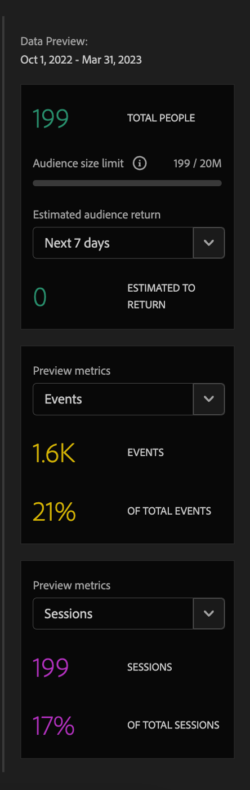

# 4.6 Vom Einblick zum Handeln

## Ziele

- Verstehen, wie eine Zielgruppe basierend auf einer in Customer Journey Analytics erfassten Ansicht erstellt wird
- Diese Zielgruppe in Real-Time CDP und Adobe Journey Optimizer verwenden

## 4.6.1 Erstellen einer Zielgruppe und Veröffentlichen

In Ihrem Projekt haben Sie einen Filter mit dem Namen **Anrufgefühle** erstellt und konnten die Anzahl der Benutzer anzeigen, deren Anrufe beim Callcenter als **positiv** klassifiziert wurden. Jetzt können Sie mit diesen Benutzern ein Segment erstellen und es in Journey oder Kommunikationskanälen aktivieren.

Der erste Schritt ist: Wählen Sie im in der letzten Übung erstellten Bedienfeld Zeile **1 aus. Kontaktaufnahme - Positiv** Klicken Sie mit der rechten Maustaste und wählen Sie die Option **Zielgruppe aus Auswahl erstellen**:

Geben Sie als Nächstes Ihrer Zielgruppe einen Namen, der dem Modell folgt **IhrNachname - CJA-Zielgruppenaufruf fühlt sich positiv an**:

Beachten Sie, dass es möglich ist, eine Vorschau der erstellten Audience zu erhalten:

Klicken Sie abschließend auf **Publish**.

## 4.6.2 Verwenden Sie Ihre Zielgruppe als Teil eines Segments

Navigieren Sie zurück zur Adobe Experience Platform und gehen Sie zu **Segmente > Durchsuchen**. Dort sehen Sie, wie Ihr in CJA erstelltes Segment für Ihre Aktivierungen und Journey verwendet werden kann.

Verwenden wir dieses Segment jetzt in einer Facebook-Aktivierung und in einer Kunden-Journey!

## 4.6.3 Segment in Real-Time CDP in Echtzeit verwenden

Navigieren Sie in Adobe Experience Platform zu **Segmente > Durchsuchen** und suchen Sie die Zielgruppe, die Sie in CJA erstellt haben:

Klicken Sie auf Ihr Segment und dann auf **Für Ziel aktivieren**:

Wählen Sie das Ziel **bootcamp-facebook** aus und klicken Sie dann auf **Weiter**.

Klicken Sie **erneut** Weiter“.

Wählen Sie die **Herkunft Ihrer Zielgruppe** und setzen Sie sie auf **Direkt von Kunden** klicken Sie auf **Weiter**.

Klicken Sie auf **Fertigstellen**.

Ihr Segment ist jetzt mit den benutzerdefinierten Zielgruppen von Facebook verbunden. Verwenden wir nun dasselbe Segment in Adobe Journey Optimizer.

## 4.6.4 Segment in Adobe Journey Optimizer verwenden

Klicken Sie in Adobe Experience Platform auf **Journey Optimizer** und dann im Menü links auf **Journey** und beginnen Sie mit der Erstellung einer Journey durch Klicken auf **Journey erstellen**.

Wählen Sie dann im linken Menü unter **Ereignisse** die Option **Segmentqualifikation** und ziehen Sie sie auf die Journey:

Klicken Sie unter Segment auf **Bearbeiten**, um ein Segment auszuwählen:

Wählen Sie die zuvor in CJA erstellte Zielgruppe aus und klicken Sie auf **Speichern**.

Bereit! Von hier aus können Sie eine Journey für Kunden erstellen, die sich für dieses Segment qualifizieren.

[Zurück zu Benutzerfluss 4](./uc4.md)

[Voltar para todos os módulos](./../../overview.md)
