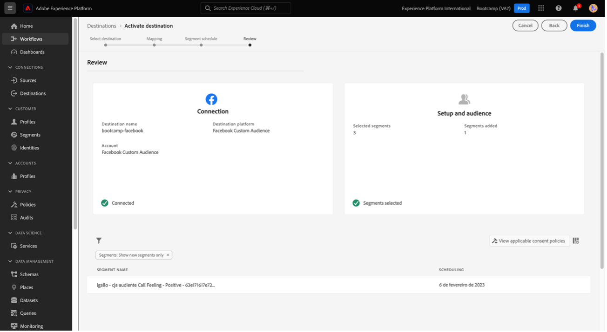

# 4.6 Von Einblicken zu Aktionen

## Ziele

- Erfahren Sie, wie Sie eine Zielgruppe basierend auf einer in Customer Journey Analytics erfassten Ansicht erstellen
- Verwenden dieser Zielgruppe in Real-Time CDP und Adobe Journey Optimizer

## 4.6.1 Erstellen und Veröffentlichen einer Audience

In Ihrem Projekt haben Sie einen Filter mit dem Namen **Call Feelings** erstellt und konnten die Anzahl der Benutzer anzeigen, deren Aufrufe an das Callcenter als **positiv** klassifiziert wurden. Sie können jetzt ein Segment mit diesen Benutzern erstellen und in Journey- oder Kommunikationskanälen aktivieren.

Der erste Schritt ist: Wählen Sie in dem in der letzten Übung erstellten Bedienfeld die Zeile **1 aus. Rufen Sie Feeling - Positiv** auf, klicken Sie mit der rechten Maustaste darauf und wählen Sie die Option **Create audience from selection** aus:

Geben Sie anschließend einen Namen für Ihre Zielgruppe an, der dem Modell **yourLastName - CJA-Audience-Aufruf &quot;Feed positive**&quot;folgt:

Beachten Sie, dass eine Vorschau der zu erstellenden Audience möglich ist:

Klicken Sie abschließend auf **Publish**.

## 4.6.2 Zielgruppe als Teil eines Segments verwenden

Gehen Sie zurück zur Adobe Experience Platform, navigieren Sie zu **Segmente > Durchsuchen** und Sie können sehen, dass Ihr Segment, das in CJA erstellt wurde, bereit ist und für Ihre Aktivierungen und Journey verwendet werden kann!

Verwenden wir dieses Segment jetzt in einer Facebook-Aktivierung und in einer Kunden-Journey!

## 4.6.3 Verwenden Sie Ihr Segment in Real-Time CDP in Echtzeit

Navigieren Sie in Adobe Experience Platform zu **Segmente > Durchsuchen** und suchen Sie die in Customer Journey Analytics erstellte Zielgruppe:

Klicken Sie auf Ihr Segment und dann auf **Auf Ziel aktivieren**:

Wählen Sie das Ziel mit dem Namen **bootcamp-facebook** und klicken Sie dann auf **Weiter**.

Klicken Sie erneut auf **Weiter**.

Wählen Sie die Option **Ursprung Ihrer Audience** aus und legen Sie dafür den Wert **Direkt von Kunden** fest. Klicken Sie dann auf **Weiter**.

Klicken Sie auf **Fertigstellen**.

Ihr Segment ist jetzt mit den benutzerdefinierten Zielgruppen von Facebook verbunden. Verwenden wir jetzt dasselbe Segment in Adobe Journey Optimizer.

## 4.6.4 Segment in Adobe Journey Optimizer verwenden

Klicken Sie in Adobe Experience Platform auf **Journey Optimizer**, klicken Sie dann im linken Seitenmenü auf **Journey** und beginnen Sie mit der Erstellung eines Journey, indem Sie auf **Journey erstellen** klicken.

Wählen Sie dann im linken Seitenmenü unter **Ereignisse** die Option **Segmentqualifikation** aus und ziehen Sie sie auf die Journey:

Klicken Sie unter Segment auf **Bearbeiten** , um ein Segment auszuwählen:

Wählen Sie die zuvor in Customer Journey Analytics erstellte Zielgruppe aus und klicken Sie auf **Speichern**.

Bereit! Von hier aus können Sie eine Journey für Kunden erstellen, die sich für dieses Segment qualifizieren.

[Zurück zum Benutzerfluss 4](./uc4.md)

[Voltar para todos os módulos](./../../overview.md)
