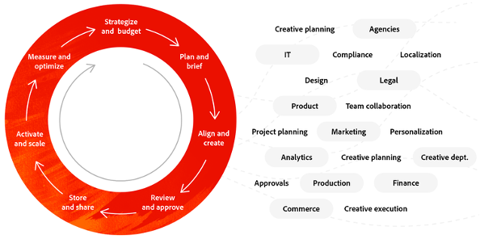
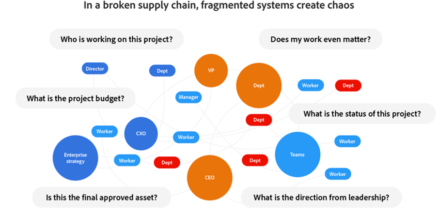

# Inhaltslieferkette in 4 Phasen

Die Welt ist jetzt zuerst digital. Es ist eine Realität, mit der sich Unternehmen arrangieren mussten, und sie wird nicht von heute auf morgen verschwinden. Als Teil dieser digitalen Welt stehen wir vor [einem enormen Anstieg von Inhalten](https://www.prnewswire.com/news-releases/content-marketing-market-size-to-grow-by-usd-487-24-billion--by-objective-platform-end-user-and-geography---forecast-and-analysis-2022-2026--301562808.html) angetrieben von mehr Menschen, die soziale Medien durchsuchen, Zeit in digitalen Räumen verbringen und aus der Ferne arbeiten.

Das bedeutet für Sie, dass es mehr Kanäle, Märkte und Formate gibt, um Inhalte bereitzustellen - und es besteht ein höherer Bedarf an dynamischen und optimierten Inhalten.

_Source:_ [_Deloitte Digital_](https://www2.deloitte.com/content/dam/Deloitte/uk/Documents/consultancy/deloitte-uk-future-of-experience-time-to-market.pdf)

Die gute Nachricht: So schwierig es auch sein mag, mit der Nachfrage nach Inhalten Schritt zu halten, es gibt eine Möglichkeit, Inhalte schneller und einfacher zu planen, zu produzieren und bereitzustellen. Es nennt sich **Inhaltslieferkette**. Und wenn Sie eine mit reibungslosen Prozessen, einer starken Strategie und soliden Verfahren einrichten können, können Sie den gesamten Inhaltslebenszyklus optimieren.

## Collaboration ist der Schlüssel zu einer reibungslosen Inhaltslieferkette

Eine Inhaltslieferkette ist der Prozess, der Mitarbeiter, Tools und Arbeitsabläufe zusammenführt, um Inhalte effektiv zu planen, zu erstellen, zu verwalten und bereitzustellen. Da Kundinnen und Kunden immer mehr und bessere Erlebnisse in immer schnellerem Tempo benötigen, müssen Sie Ihre Inhalte lieber jetzt als später richtig gestalten. Auf diese Weise können Sie Druck auf alle Ihre Teams ausüben, indem Sie Silos aufbrechen und Workflows vereinheitlichen. Außerdem profitieren Sie von einem größeren Nutzen aus Ihren Technologieinvestitionen und können so Ihre Effizienz und Ihren Wert steigern.

Theoretisch handelt es sich dabei um einen Prozess, der Unternehmen überall dabei helfen sollte, ihre Inhalte schneller zur Verfügung zu stellen. In der Praxis werden jedoch die meisten Lieferketten unterbrochen, da funktionsübergreifende Inhaltslebenszyklen naturgemäß sind. Leider können diese Ketten, wenn sie zerbrechen, zu internen Fehlausrichtungen führen, Budgets reduzieren, Mitarbeiter verschleißen und die Geschwindigkeit der Bereitstellung wichtiger Botschaften auf dem Markt verlangsamen.

### Was unterbricht die Wertschöpfungskette Ihrer Inhalte?

- [**70 %**](https://business.adobe.com/resources/reports/future-creative-experiences.html) Zeit wird für Nicht-Kernaufgaben aufgewendet, d. h. für die Verwaltung manueller Aufgaben in unterschiedlichen Systemen in verschiedenen Rollen.
- [**21 %**](https://business.adobe.com/resources/reports/future-creative-experiences.html) Kreativen haben Engpässe im gesamten Inhaltsprozess als Herausforderung für die Erstellung effektiver Erlebnisse identifiziert.
- [**31 %**](https://www.fotoware.com/blog/dam-industry-trends-by-fotoware) Kreativen und Marketern sagen, dass ihre größte Herausforderung die Unfähigkeit ist, Assets mit mehreren Stakeholdern zu teilen.

Um einen noch besseren Einblick in die häufigsten Ursachen für fehlerhafte Lieferketten von Inhalten zu erhalten, ist es hilfreich, sich jede der drei Phasen auf hoher Ebene anzusehen:

1. In der **Planungs**-Phase führt das Fehlen eines einheitlichen Projektprozesses oder einer zentralen Methode zur Verfolgung von Ressourcen zu mehrfachen Überarbeitungen, übermäßigen Kosten, kostspieligen Verzögerungen und der Unfähigkeit, die Arbeit auszugleichen. Außerdem führen Trennungen zwischen Team-Mitgliedern zu verschwendeten Zyklen und langsamen Prioritätsänderungen.
2. Während **Produktion** begrenzen isolierte Systeme und getrennte Workflows die Live-Zusammenarbeit, die Auffindbarkeit von Assets, Verzögerungen und das Burnout. Und weil Kreative Aufgaben und Assets manuell verfolgen und sich wiederholende Aufgaben manuell ausführen müssen, führt dies zu höheren Kosten und mehr Fehlern.
3. Wenn es Zeit für **Bereitstellung** ist, kein zentrales Asset-Management-System zu haben sowie eine begrenzte Automatisierung zur Skalierung von Inhalten, reduziert dies die Fähigkeit von Teams, kanalübergreifend einheitliche, personalisierte Erlebnisse zu starten. Darüber hinaus begrenzen fragmentierte Bereitstellungs-Tools und -Daten die genaue Messung der Asset-Leistung.

## Es ist an der Zeit, über die Lieferkette für Inhalte zu streiten

Wie bei allem, was unter Fehltritten und Fehlkommunikation leidet, gibt es immer eine Möglichkeit, den Prozess zu verbessern. Bleiben wir bei diesen drei Phasen und schauen wir uns an, wie eine großartige Inhaltslieferkette für Ihr Unternehmen aussehen könnte.

### Optimierte Betriebsabläufe durch optimierte Planung

Idealerweise sollte Ihr Marketing-Team eine Work-Management-Lösung verwenden, die eine funktionsübergreifende Zusammenarbeit ermöglicht und Projekte mit geplanten, datengesteuerten Ergebnissen verknüpft. Außerdem sollte es das Marketing-Team in die Lage versetzen, der Arbeit strategische Prioritäten zu setzen und diese Prioritäten Ihrem Kreativ-Team mitzuteilen. Von dort aus sollten die Kreativ-Kurzbeschreibung, die Inhaltsversionen und das Feedback in jedem Projekt miteinander verknüpft sein, sodass Ihr Team nicht nach alten E-Mails suchen muss, um zu finden, wonach es sucht.

Ihr Kreativ-Team sollte mit [einem hervorragenden Digital Asset Management](https://business.adobe.com/products/experience-manager/assets/digital-asset-management.html) [(DAM)](https://business.adobe.com/products/experience-manager/assets/digital-asset-management.html) [System) ](https://business.adobe.com/products/experience-manager/assets/digital-asset-management.html), das mit Ihren Kreativ- und Arbeitsverwaltungs-Tools integriert ist. Auf diese Weise ist es für sie einfach, relevante Assets zu finden, zu verwenden, zu aktualisieren oder wiederzuverwenden. Auf diese Weise können Sie die Markteinführung beschleunigen und interne Abläufe und Prozesse vereinfachen.

### Steigerung der Effizienz in der Produktion durch nahtlose Workflows

Bei der Planung steht eine einheitliche Asset-Management-Lösung im Mittelpunkt einer großartigen Produktionsphase, die zusammen mit Ihrer Work-Management-Anwendung Metadaten in allen Ihren Systemen synchronisiert. Auf diese Weise können Sie sich wiederholende Formatierungsaufgaben automatisieren, damit Sie die Ausgabe beschleunigen können, ohne bei der Qualität Kompromisse eingehen zu müssen. Und wenn Ihre Work-Management-Lösung mit Kreativ-Tools integriert ist, können Ihre Kreativ-Teams nicht nur Anfragen, Workflows und Überprüfungen verwalten, sondern sogar Inhalte in allen Tools, an denen sie bereits arbeiten, genehmigen und abschließen.

Wenn Sie dann künstliche Intelligenz (KI) in Ihre Inhalts-Workflows einfügen, können Sie personalisierte Inhalte erstellen, die mit den Kundeninteressen abgestimmt sind, und das alles automatisch im großen Maßstab. Das bedeutet, dass Ihre Teams alle das tun können, was sie am besten können - Ihre Kreativen können ansprechende Inhalte erstellen und Ihre Marketing-Experten können Einblicke verwenden, um diese Inhalte anzupassen. Alles, damit Sie anfangen können, erstaunliche Erlebnisse bereitzustellen.

### Bereitstellen von Assets und Messen der Inhaltseffizienz

Wenn es an der Zeit ist, Ihre Inhalte bereitzustellen, ist es wichtig, dass alle wichtigen Benutzer oder Teams Zugriff auf die benötigten Inhalte haben. Stellen Sie sicher, dass Ihr DAM Ihren Anforderungen entspricht und Ihre Teams Assets nach Typ oder anderen ausgewählten Tags katalogisieren, verfolgen und finden können. Kunden bewegen sich schnell, und Ihre Teams müssen sich noch schneller bewegen und Videos, Infografiken, Fotos, Nachrichten und mehr im Handumdrehen finden.

Darüber hinaus verwendet eine wirklich großartige Inhaltslieferkette einen DAM, der die Größe von Bildern automatisch ändern, die Versionskontrolle verwalten und Duplizierungen über verschiedene Orte hinweg vermeiden kann. Darüber hinaus sollte es in Ihren gesamten Technologie-Stack integriert werden, einschließlich Ihrer Kreativ-Tools, Ihrer Work-Management-Lösung und Ihres Content-Management-Systems, damit Ihre Teams schnell und einfach neue Inhalte erstellen und an jeden beliebigen Kanal bereitstellen können. Und mit KI können Sie automatisch relevante Inhalte generieren, die sich an die Standorte, Interessen und Aktionen von Kunden anpassen.

## Bei Adobe bauen wir eine erstklassige Inhaltslieferkette auf

Unser eigenes [Adobe Experience Cloud-](https://business.adobe.com/) konzentriert sich darauf, die zuvor beschriebenen Schritte zu befolgen, um unsere Kampagnen zum Leben zu erwecken und mehrere Segmente zu unterstützen. Unsere Vision war es, weltweit überzeugende Inhalte bereitzustellen, die mit unserem Kampagnen-Framework und unserer Botschaft übereinstimmen.

Der Schlüssel zu unserem End-to-End-Inhaltserstellungsprozess ist die Paarung von [Adobe Workfront](https://business.adobe.com/products/workfront/main.html) und [Adobe Experience Manager Assets](https://business.adobe.com/products/experience-manager/assets/aem-assets.html). Sehen wir uns an, wie wir unseren Prozess mit denselben drei Phasen auf hoher Ebene angegangen sind.

Wir beginnen mit **Planung** , wo wir Hunderte von Inhaltsanfragen aus dem gesamten Unternehmen aufnehmen und sie dann nach unseren vierteljährlichen Prioritäten priorisieren. Anschließend verwenden wir in Workfront ein Dashboard für Inhaltsvorschläge, um für Transparenz zu sorgen, damit wir uns mit unseren Stakeholdern abstimmen und schnell unsere Marketing-, Kreativ-, Web- und Vertriebsteams genehmigen können. Auf diese Weise erfassen wir, was wir für das Quartal zugesagt haben, und geben unseren Kreativ- und Web-Teams Einblick in das gesamte Anfragevolumen, damit sie die Ressourcenplanung planen können. Darüber hinaus können Manager die Arbeitslast ihrer Teams einfach überwachen.

Wenn wir zur **Produktion** übergehen, werden aus genehmigten Anfragen Projekte, die unserem Kreativ-Team mehr Details bieten - Dinge wie Creative Briefs, Standorte für die Web-Landing, Werbeanforderungen und mehr. Unsere Inhaltsstrategen arbeiten dann mit Stakeholdern und Kreativen in Workfront zusammen, um Inhalte zu überprüfen und Fristen einzuhalten. Da wir all dies in Workfront tun, haben wir doppelte Schritte, unnötige E-Mails und mehrere Formularausfüllungen eliminiert und beginnen sogar, Produktionszyklen nach Asset-Typ zu verfolgen. Auf diese Weise können wir die Ressourcenausstattung der Mitarbeiter ausgleichen und bei Bedarf neue Prioritäten setzen, indem wir uns die Projektdaten genau ansehen.

Und wenn unsere Inhalte bereit für die **Bereitstellung** sind, [ wir (unsere Angebote, Assets und Werbeinhalte](https://business.adobe.com/customer-success-stories/adobe-content-hub-case-study.html) in Experience Manager Assets veröffentlichen. Insbesondere geht alles in unseren internen Marketing-Hub, wo jeder im Unternehmen schnell den genauen Inhalt finden kann, den er braucht, genau dann, wenn er ihn braucht.

Der Aufbau einer Wertschöpfungskette für Arbeitsinhalte hat sich enorm gelohnt. Insbesondere haben wir unsere doppelte Dateneingabe durch die Migration zu einem einzigen Work-Management-System halbiert. Und obwohl es immer Raum für Verbesserungen gibt, wissen wir, dass wir auf dem Weg zu einem Prozess sind, der uns hilft, den Kundenerwartungen einen Schritt voraus zu sein.

>[!NOTE]
>
> Dieser Artikel wurde ursprünglich im Blog von [_Adobe Experience Cloud veröffentlicht_](https://business.adobe.com/blog/how-to/create-a-content-supply-chain-that-will-stand-the-test-of-time).

## Die vierte Phase: Erkenntnisse

Content Supply Chain ist keine magische Lösung für alle Ihre Probleme. Dies ist eine Arbeitsweise, mit der Sie effizienter arbeiten und alle Erlebnisse verwalten können, die Sie Ihren Kunden bringen möchten. Du musst krabbeln, bevor du gehen und schließlich laufen kannst.

Und wenn Sie schließlich fertig sind, gibt es noch eine weitere Sache, die Sie aus Ihrer End-to-End-Inhaltslieferkette herausholen können: Einblicke. In der Tat, nach einer Weile können Sie beginnen zu erkunden, wie bestimmte Aktionen beeinflussen Zeit, Budget, … Wir werden das auch am Ende des Bootcamps behandeln.

Nächster Schritt: [Creative Brief](./creative-brief.md)

[Zurück zu „Alle Module“](./overview.md)
