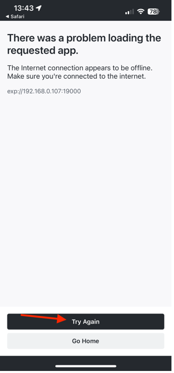

# Mobile App überprüfen

## Android

- Laden Sie die mobile App von herunter [here](https://tinyurl.com/CSCBootcampApp) auf Ihrem Android-Gerät. Sie können sie auf einer [Android-Emulator](https://developer.android.com/studio/run/emulator) oder Ihrem physischen Android-Gerät.

- Öffnen Sie die heruntergeladene Datei, indem Sie darauf tippen.

- Klicken Sie im Popup-Fenster auf die Schaltfläche &quot;Installieren&quot;und bestätigen Sie dann, indem Sie auf &quot;Installieren auf beliebige Weise&quot;klicken.

- Nachdem die App erfolgreich installiert wurde, öffnen Sie sie, indem Sie auf die Schaltfläche &quot;Öffnen&quot;klicken.

## iOS

>[!WARNING]
>
> Stellen Sie sicher, dass Sie mit dem Bootcamp Wifi-Netzwerk verbunden sind. Dies ist wichtig, da die App nur funktioniert, wenn Sie sich im selben WLAN-Netzwerk befinden.

Da es sich hierbei nicht um eine offiziell verteilte App handelt, unterscheidet sich das Setup für iOS von dem, was Sie gewohnt sind.

- Laden Sie die App &quot;Expo Go&quot;aus dem [App Store](https://itunes.apple.com/app/apple-store/id982107779).

- Überprüfen Sie in der iPhone Camera App den QR-Code, den das Adobe-Team im Bootcamp projizieren wird. Klicken Sie nach Aufforderung auf die angezeigte Schaltfläche.

- Dadurch wird eine Webseite geladen, auf der Sie die App in Ihrer iPhone öffnen können. Klicken Sie auf die Schaltfläche &quot;Expo Go&quot;, um sie in der soeben heruntergeladenen App zu öffnen.

- Wählen Sie im sich öffnenden Dialogfeld &quot;Öffnen&quot;aus, damit die Expo Go-App mit den richtigen Informationen geladen werden kann.

- Nachdem die App Expo Go geöffnet wurde, werden Sie aufgefordert, Geräte im lokalen Netzwerk zu finden. Wie bereits erwähnt, ist dies erforderlich, damit wir die App von unseren Adobe-Geräten auf Ihr Handy herunterladen können. Klicken Sie auf &quot;Zulassen&quot;, um dies zu laden.

- Möglicherweise erhalten Sie zuerst eine Fehlerseite. Klicken Sie einfach auf die Schaltfläche &quot;Erneut versuchen&quot;, um die App schließlich auf Ihr Gerät zu laden. Beachten Sie, dass das Schließen der Expo Go-App oder das Trennen des Geräts vom WLAN-Netzwerk dazu führt, dass die App nicht mehr reagiert.

## Navigieren in der App

In der App können Sie Ihr Team aus dem Dropdown-Menü auswählen. Dadurch wird der in AEM erstellte Inhalt dynamisch geladen. Wenn Sie mit dem Inhalt nicht zufrieden sind, können Sie ihn immer im zuvor erstellten Inhaltsfragment aktualisieren und dann den Inhalt erneut veröffentlichen. Anschließend werden die Änderungen in der App angezeigt.

Nächster Schritt: [Phase 3 - Versand: Seite in AEM erstellen](./page-in-aem.md)

[Gehen Sie zurück zu Phase 2 - Produktion: Erstellen von mobilen App-Inhalten](../production/app.md)

[Zu allen Modulen zurückkehren](../../overview.md)
