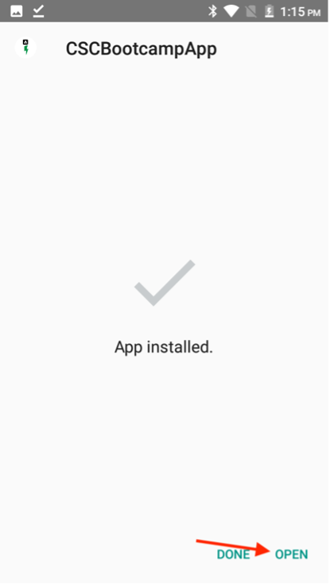
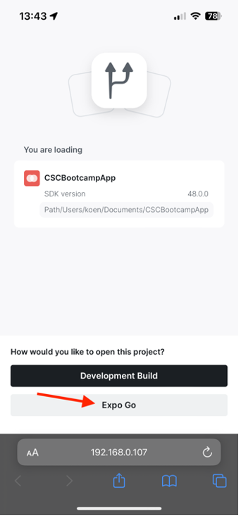
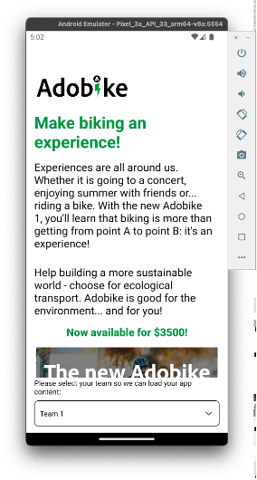

# Mobile App überprüfen

## Android

- Laden Sie die Mobile App von [hier](https://tinyurl.com/CSCBootcampApp) auf Ihr Android-Gerät herunter. Sie können ihn auf einen [Android-Emulator](https://developer.android.com/studio/run/emulator) oder Ihr physisches Android-Gerät herunterladen.

- Öffnen Sie die heruntergeladene Datei, indem Sie darauf tippen.

- Klicken Sie im Popup auf die Schaltfläche Installieren und bestätigen Sie dann durch Klicken auf „Trotzdem installieren“.

- Nachdem die App erfolgreich installiert wurde, öffnen Sie sie, indem Sie auf die Schaltfläche „Öffnen“ klicken.

## iOS

>[!WARNING]
>
> Stellen Sie sicher, dass Sie mit dem Bootcamp-WiFi-Netzwerk verbunden sind. Dies ist wichtig, da die App nur funktioniert, wenn Sie sich im selben WiFi-Netzwerk befinden.

Da es sich hierbei nicht um eine offiziell verteilte App handelt, unterscheidet sich das Setup für iOS etwas von dem, was Sie gewohnt sind.

- Laden Sie die Expo Go-App von der [App Store](https://itunes.apple.com/app/apple-store/id982107779) herunter.

- Scannen Sie in der iPhone Camera App den QR-Code, den das Adobe-Team im Bootcamp projiziert. Klicken Sie nach Aufforderung auf die angezeigte Schaltfläche.

- Dadurch wird eine Web-Seite geladen, mit der Sie die App auf Ihrer iPhone öffnen können. Klicken Sie auf die Schaltfläche „Expo Go“, um sie in der soeben heruntergeladenen App zu öffnen.

- Wählen Sie im Dialog, der sich öffnet, „Öffnen“, damit die Expo Go-App mit den richtigen Informationen geladen werden kann.

- Sobald die Expo Go-App geöffnet wurde, werden Sie aufgefordert, Geräte im lokalen Netzwerk zu finden. Wie bereits erwähnt, ist dies notwendig, damit wir die App von unseren Adobe-Geräten auf Ihr Handy herunterladen können. Auf „Zulassen“ klicken, um dies zu laden.

- Möglicherweise erhalten Sie zunächst eine Fehlerseite. Klicken Sie einfach auf die Schaltfläche „Erneut versuchen“, um die App endgültig auf Ihr Gerät zu laden. Bitte beachten Sie, dass das Schließen der Expo Go-App oder das Trennen Ihres Geräts vom WiFi-Netzwerk dazu führt, dass die App nicht mehr reagiert.

## Navigieren in der App

In der App können Sie Ihr Team aus der Dropdown-Liste auswählen. Dadurch werden die in AEM erstellten Inhalte dynamisch geladen. Wenn Sie mit dem Inhalt nicht zufrieden sind, können Sie ihn immer in dem zuvor erstellten Inhaltsfragment aktualisieren und dann den Inhalt erneut veröffentlichen. Anschließend werden die Änderungen in der App angezeigt.

Nächster Schritt: [Phase 3 - Versand: Seite in AEM erstellen](./page-in-aem.md)

[Zurück zu Phase 2 - Produktion: Erstellen von Mobile-App-Inhalten](../production/app.md)

[Zurück zu „Alle Module“](../../overview.md)
