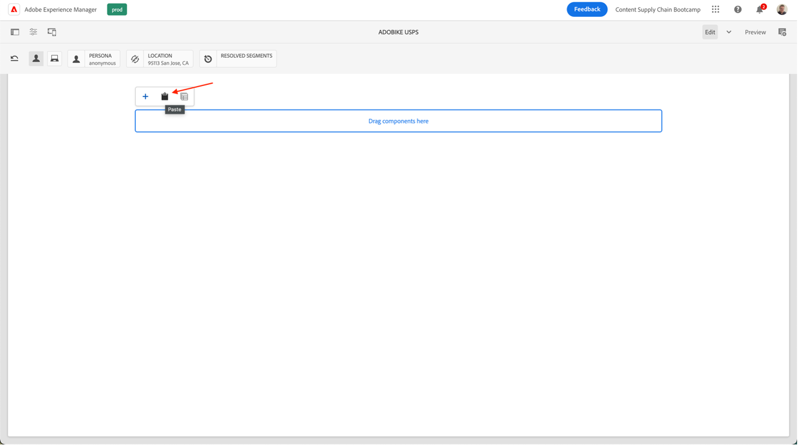
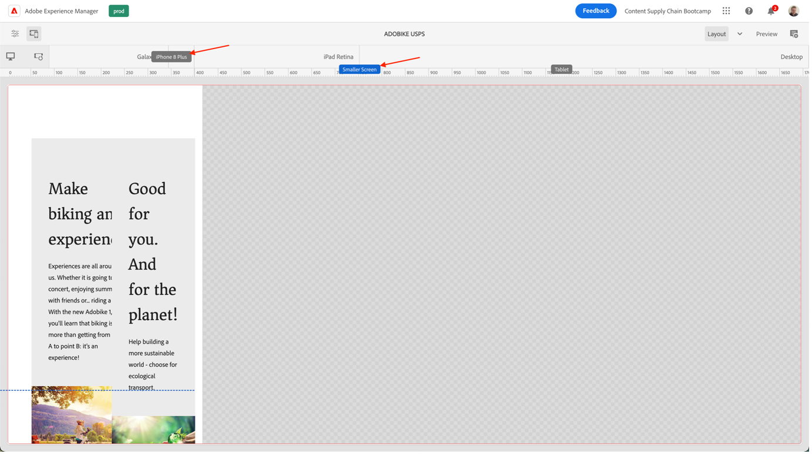
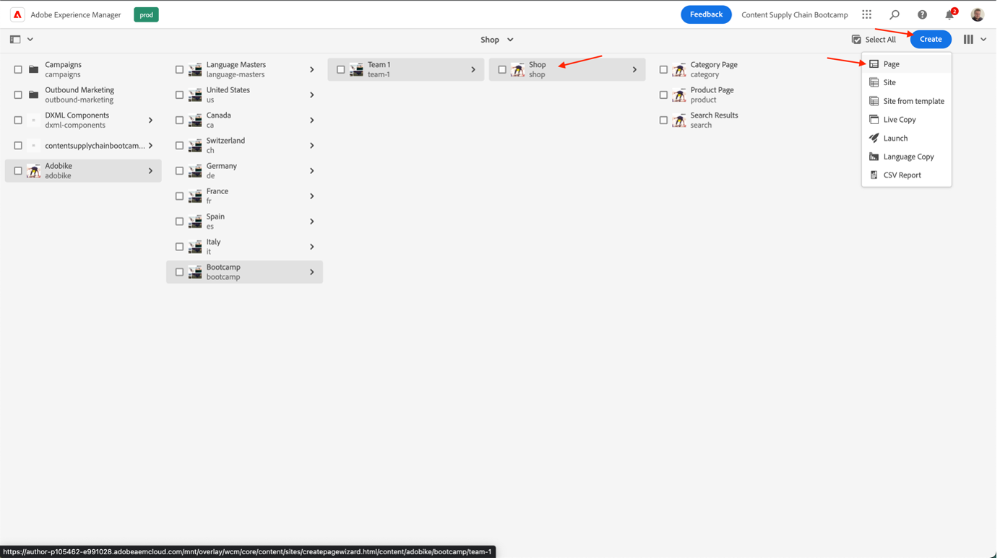

# Seite in AEM erstellen

AEM bietet zwei Umgebungen: die Autorenumgebung und die Publish-Umgebung. Diese interagieren, damit Sie Inhalte auf Ihrer Website bereitstellen können, damit Ihre Besucher sie erleben können.

Die Autorenumgebung bietet die Mechanismen zum Erstellen, Aktualisieren und Überprüfen dieser Inhalte vor der tatsächlichen Veröffentlichung:

- Ein Autor erstellt und überprüft den Inhalt (dabei kann es sich um verschiedene Inhaltstypen handeln, z. B. Seiten, Assets, Veröffentlichungen usw.)
- die zu einem späteren Zeitpunkt auf Ihrer Website veröffentlicht werden.

Als Autor müssen Sie Ihre Website innerhalb von AEM organisieren. Dazu gehört die Erstellung und Benennung Ihrer Inhaltsseiten, sodass:

- Sie können sie einfach in der Autorenumgebung finden
- Besucher Ihrer Site können sie einfach in der Veröffentlichungsumgebung durchsuchen

Die Struktur einer Website kann als Baumstruktur gesehen werden, die die Inhaltsseiten enthält. Die Namen dieser Inhaltsseiten werden zur Bildung der URLs verwendet, während der Titel angezeigt wird, wenn der Seiteninhalt angezeigt wird. Im folgenden Beispiel lautet die barrierefreie URL für die Seite /content/adobike/language-masters/en.html

Sehen wir uns an, wie wir einige neue Seiten zu einer vorhandenen Website hinzufügen und wie wir einige Inhalte wiederverwenden können.

## Erstellen der Startseite

Wie im vorherigen Abschnitt erläutert, funktioniert die AEM-Seitenhierarchie als Baumstruktur. Das bedeutet, dass wir mit der -Seite auf der höchsten Ebene beginnen: der -Startseite.

- Gehen Sie zur AEM-Autoreninstanz auf [https://author-p71057-e991028.adobeaemcloud.com/](https://author-p71057-e991028.adobeaemcloud.com/) und melden Sie sich mit den von uns angegebenen Anmeldeinformationen an.

- Wählen Sie im AEM-Startmenü Navigation \> Sites aus.

- Navigieren wir zunächst in der vorhandenen Baumstruktur zu dem Ort, an dem wir unsere Startseite erstellen möchten. Navigieren Sie in der Baumstruktur, indem Sie in der ersten Spalte „AdobeBike“ und in der zweiten Spalte „Bootcamp“ auswählen. Um eine Seite unter dieser Seite zu erstellen, klicken Sie auf die Schaltfläche „Erstellen“ und wählen Sie im Popup-Menü „Seite“ aus.

- Dadurch wird ein neuer Bildschirm geöffnet und die neue Seite konfiguriert. Als Erstes können wir eine Seitenvorlage auswählen. Seitenvorlagen in AEM ermöglichen es Ihnen, die Seitenstruktur zu definieren sowie zu definieren, welche Inhalte auf dieser Seite verwendet werden können. Da wir die Homepage als Landingpage gestalten möchten, wählen wir die Landingpage-Vorlage aus und klicken dann auf die Schaltfläche „Weiter“, um fortzufahren.

- Im nächsten Bildschirm können Sie Ihre Seite mit ersten Informationen füllen. Die wichtigste Information ist der Titel (eine obligatorische Eigenschaft, angegeben mit einem \* ), der dazu dient, der Seite einen aussagekräftigen Namen zu geben. Wenn Sie den „Namen“ nicht angeben, generiert AEM automatisch die URL, auf der Ihre Seite verfügbar sein wird, und befolgt dabei die Best Practices für SEO. In diesem Fall können Sie dieses Feld leer lassen. Einige andere Eigenschaften können ebenfalls ausgefüllt werden, Sie können die anderen Registerkarten erkunden, aber für den Zweck dieses Bootcamps füllen Sie noch keine anderen Eigenschaften aus. Wenn Sie bereit sind, Ihre Seite zu erstellen, klicken Sie einfach auf die Schaltfläche „Erstellen“.

- AEM erstellt nun die Seite. Sobald dies geschehen ist, wird ein Popup angezeigt, in dem Sie die neu erstellte Seite durch Klicken auf die Schaltfläche „Öffnen“ öffnen können.

- Sie gelangen nun zum AEM-Editor. Dies ist ein Editor für „Was Sie sehen ist was Sie erhalten“ (oder WYSIWYG), in dem Sie Komponenten per Drag-and-Drop auf eine Seite ziehen können, um eine Seite zu erstellen. Sehen wir uns die Navigation an:
  
   - Auf der linken Seite finden Sie das Seitenbedienfeld mit den Assets, die Sie auf Ihren Seiten verwenden können, und den Komponenten (oder Bausteinen), die Sie auf dieser Seite verwenden können, sowie eine praktische Baumstrukturansicht, die Ihnen zeigt, wie Ihre Seite strukturiert ist. Klicken Sie auf eines dieser Symbole, um dessen Ansicht zu öffnen.
   - Auf der rechten Seite sehen Sie den „Layout-Container“. Dies ist ein Bereich, in dem Sie die gewünschten Komponenten ablegen können.
   - Füllen wir unsere Seite mit Inhalten aus. Sie können die Startseite nach Belieben ausfüllen. Im folgenden Beispiel haben wir eine Bild -Komponente, die auf die Produktseite verweist, sowie zwei Teaser -Komponenten verwendet.

## Wiederverwenden von Erlebnissen mithilfe von Experience Fragments

Wir haben nun die Homepage erstellt, die für unseren Adobe-Launch vollständig bereit ist. Einige der dort enthaltenen Inhalte, z. B. die Alleinstellungsmerkmale unseres Fahrrads, können jedoch auf mehreren Seiten wiederverwendet werden.

Idealerweise möchten wir dieses Alleinstellungsmerkmal nur einmal erstellen, damit wir es zentral verwalten und ein personalisiertes, aber dennoch konsistentes Erlebnis sicherstellen können. In AEM können wir dies mit „Experience Fragments“ tun. Ein Experience Fragment ist eine Gruppe aus einer oder mehreren Komponenten (einschließlich Inhalt und Layout), die innerhalb von Seiten referenziert werden können. Sie können jede beliebige Komponente enthalten.

Lassen Sie uns dies sofort verwenden:

- Gehen Sie zur AEM-Autoreninstanz auf [https://author-p71057-e991028.adobeaemcloud.com/](https://author-p71057-e991028.adobeaemcloud.com/) und melden Sie sich mit den von uns angegebenen Anmeldeinformationen an.

- Wählen Sie im AEM-Startmenü die Option Navigation \> Experience Fragments .

- Im folgenden Bildschirm erstellen wir einen Ordner, mit dem Ihr Team seine wiederverwendbaren Erlebnisse speichern kann. Navigieren Sie in der Spaltenansicht zu AdobeBike \> Bootcamp und klicken Sie dann auf die Schaltflächen Erstellen \> Ordner .

- Geben Sie im Popup-Fenster des Modals Ihrem Ordner den Namen Ihres Teams. Sie können das Namensfeld leer lassen. AEM generiert es automatisch für Sie. Nachdem Sie dem Ordner einen Namen gegeben haben, klicken Sie auf die Schaltfläche Erstellen , um den Ordner zu erstellen.

- Der Ordner sollte nun ein Popup-Fenster angezeigt werden. Klicken Sie darauf und dann auf die Schaltflächen Erstellen \> Experience Fragment .

- Wählen wir zunächst eine Experience Fragment-Vorlage aus. Genau wie Seiten können Experience Fragments auf mehreren Vorlagen basieren, wobei jede Vorlage ein vordefiniertes Erlebnis vorsieht. Da wir unsere Inhalte auf unserer Website wiederverwenden möchten, wählen wir in unserem Fall eine „Vorlage für Experience Fragment-Web-Varianten“ aus, indem wir das Kontrollkästchen oben links aktivieren und dann auf die Schaltfläche „Weiter“ klicken.

- Geben Sie Ihrem Experience Fragment einen aussagekräftigen Titel, z. B. „Adobe-USPs“, und klicken Sie dann auf die Schaltfläche „Erstellen“.

- Nachdem Ihr Experience Fragment erstellt wurde, klicken Sie im Modal auf die Schaltfläche „Öffnen“, damit wir einige Inhalte zu Ihrem Experience Fragment hinzufügen können.

- Genau wie bei der Bearbeitung einer Seite wird ein Layout-Container angezeigt, in dem Sie Inhalte hinzufügen können.

- Wir kopieren die Komponenten von der Startseite. Navigieren Sie auf einer neuen Registerkarte zur Homepage, wie im vorherigen Kapitel erläutert, wählen Sie die Komponente aus, über die Sie kopieren möchten, und klicken Sie dann auf das Kopiersymbol.

- Klicken Sie dann zurück in Ihrem Experience Fragment auf den Layout-Container und dann auf die Schaltfläche „Einfügen“.

>[!NOTE]
>
> Tipp: Mit AEM können Sie den „Layout-Modus“ auf jeder Seite oder in jedem Experience Fragment verwenden. Auf diese Weise können Sie die Größe der Komponenten ändern und die Erlebnisse für jedes Gerät optimieren.

- Öffnen Sie im oberen Menü das Dropdown-Menü und wählen Sie „Layout“, um in den Layout-Modus zu wechseln.

- Anschließend können Sie eine beliebige Komponente auswählen und ihre Größe ändern, indem Sie einfach die Griffe auf beiden Seiten der Komponente ziehen, um sie an den auf dem Bildschirm sichtbaren Spalten auszurichten.

- Standardmäßig werden alle Haltepunkte bearbeitet. Wenn Sie jedoch einen bestimmten Breakpoint bearbeiten möchten, können Sie oben auf der Seite in der Symbolleiste ein passendes Gerät auswählen. Der Breakpoint, für den Sie dann erstellen, wird dann hervorgehoben.

- Wie Sie sehen können, sieht ein Zwei-Spalten-Layout auf einem Mobilgerät nicht gut aus. Erstellen wir auf Mobilgeräten ein einspaltiges Layout. Wie Sie auf dem Desktop sehen können, bleibt unser Erlebnis gleich, aber auf Mobilgeräten haben wir jetzt ein besseres Erlebnis mit nur einer Inhaltsspalte.

- Schließlich können wir diese Erfahrung nun auf der Homepage wiederverwenden. Ziehen Sie die Komponente „Experience Fragment“ an die Stelle auf der Seite, an der der Inhalt angezeigt werden soll. Sie können den Inhalt löschen, den wir kopiert haben, da wir ihn aus dem Experience Fragment verwenden werden.

- Öffnen Sie das Konfigurationsdialogfeld für die Experience Fragment-Komponente und wählen Sie mit der Pfadauswahl den Speicherort aus, an dem Sie Ihr Experience Fragment erstellt haben.

- Und schließlich haben wir jetzt unsere wiederverwendbare Erfahrung auf unserer Seite.

## Erstellen der Produktseite

Wenn Sie Adobe Commerce in AEM integrieren, können Sie eine allgemeine Produktdetailseite verwenden, die verwendet wird, wenn Sie auf der Site anhand der generierten Übersichten navigieren. Manchmal möchten wir jedoch auch eine inspirierende Seite vorsehen, die produktspezifische Inhalte mit inspirierenden Inhalten kombiniert. Kopieren wir über den Store, wie von uns vorgemacht, dann lassen Sie uns eine inspirierende Produktseite erstellen.

- Gehen Sie zur AEM-Autoreninstanz auf [https://author-p71057-e991028.adobeaemcloud.com/](https://author-p71057-e991028.adobeaemcloud.com/) und melden Sie sich mit den von uns angegebenen Anmeldeinformationen an.

- Wählen Sie im AEM-Startmenü Navigation \> Sites aus.

- Navigieren Sie in der Spaltenübersicht auf der vorgefertigten Website zum Shop: AdobeBike \> Sprach-Master \> AdobeBike \> Shop. Wählen Sie dann die Shop-Seite mit dem Kontrollkästchen und klicken Sie auf Erstellen \> Live Copy. Ohne zu viele Details aufzugreifen, wird dadurch eine Kopie der Seite erstellt, die Sie auf Ihrer Site verwenden können, damit Sie die bereits vorhandenen Seiten und Inhalte mithilfe von AEM Multi Site Manager wiederverwenden können.

- Wählen Sie im Popup-Bildschirm die Site Ihres Teams als Ziel aus, indem Sie das Kontrollkästchen neben ihrem Namen aktivieren. Klicken Sie dann auf die Schaltfläche Weiter .

- Da wir Multi-Site-Manager nicht weiter vertiefen werden, können Sie einfach diese Konfiguration übernehmen.\
  Titel: Shop\
  Name: shop\
  Rollout-Konfigurationen: Standardmäßige Rollout-Konfiguration\
  Nachdem Sie die Live Copy konfiguriert haben, klicken Sie auf die Schaltfläche Erstellen .

>[!NOTE]
>
> Möchten Sie mehr über Live Copies erfahren? Weitere Informationen finden Sie unter [Erstellen und Synchronisieren von Live Copies“.](https://experienceleague.adobe.com/docs/experience-manager-cloud-service/content/sites/administering/reusing-content/msm/creating-live-copies.html?lang=de)

- Danach sollte der Speicher auf Ihrer Website verfügbar sein. Wählen Sie es aus und klicken Sie dann auf Erstellen \> Seite, um unsere inspirierende Produktseite zu erstellen.

- Da wir Produktinformationen auf der Seite anzeigen möchten, erstellen wir nun eine Seite mit der Vorlage „Produktseite“. Wählen Sie sie aus und klicken Sie dann auf die Schaltfläche Weiter .

- Füllen Sie die Metadaten der Seite aus und klicken Sie dann auf die Schaltfläche Erstellen , genau wie auf der Homepage. Nach der Erstellung können Sie die Seite öffnen, indem Sie auf die Schaltfläche Öffnen klicken. Wie Sie sehen können, ist bereits mit einer Produktdetailkomponente gefüllt.

- Zunächst fügen wir unser zuvor erstelltes Experience Fragment hinzu. Dann können wir auf der Seite alle weiteren Inhalte hinzufügen, die wir noch haben möchten. Schließlich konfigurieren wir die Komponente „Produktdetails“ so, dass unser Adobe-Produkt angezeigt wird, indem wir den Produktfinder im Konfigurationsdialogfeld auswählen, dann unsere Adobe-Kategorie auswählen und das Kontrollkästchen neben dem Produkt aktivieren. Klicken Sie anschließend auf die Schaltfläche Hinzufügen .

- Jetzt haben wir unsere vollständige Inspirationsseite, einschließlich zentral verwalteter Inhalte und Produktinformationen von Adobe Commerce.

Nächster Schritt: [Phase 3 - Versand: Kampagne GO/NO-GO](./go-nogo.md)

[Zurück zu Phase 3 - Versand: Mobile App überprüfen](./app.md)

[Zurück zu „Alle Module“](../../overview.md)
