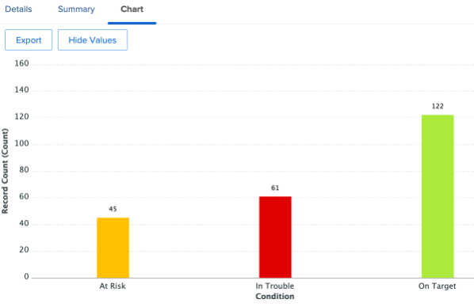
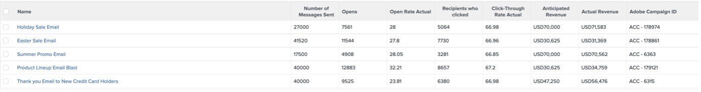

# Einblicke für einen Marketing-Manager

## Wochenansicht des Projektleiter

Klicken Sie in der linken Spalte auf die Wochenansicht des Projektleiter:

Dies umfasst eine Vielzahl von Berichten, die immer angeklickt/verarbeitet werden können, um weitere Details zu erhalten:

- Die **Aufgaben, die diese Woche nach Projekt fällig werden**

- Die **Termine des Projektmanagements** :

- Die **Offene Probleme nach Priorität**

- Die **Verspätete Aufgaben nach Abteilung**

- Die **Verspätete Aufgaben nach Einzelpersonen**

## SCRUM-bezogene Einblicke

Klicken Sie in der linken Spalte auf &quot;Iterationsstatus&quot;

Wenn Ihre Teams mit der SCRUM-Methodik zusammenarbeiten, ist dies ein interessanter Managementbericht:

- **Geschwindigkeit nach Iteration**

- **Durchschnittliche Geschwindigkeit nach Team**

- **Aktuelle Iterationen abgeschlossene Stundensummen nach Zuweisung**

- **Iterationen nach Team**

## Effizienzberichte

Klicken Sie in der linken Spalte auf &quot;Effizienz&quot;.

- **Geplantes/nicht geplantes Verhältnis** (der geleisteten Arbeit)

- **Abgeschlossene Anfragen nach Woche**

## Einblicke in Projekte während des Fluges

Klicken Sie in der linken Spalte auf &quot;Marketing - Projekte im Flug&quot;.

- **Status von Flugbetriebsprojekten**

- **Projekte nach Bedingung nach Monat**

- Liste, Fortschritt und finanzielle Einzelheiten der **Flugbetriebsprojekte**

## Visualisieren (projektübergreifender) Abhängigkeiten

Klicken Sie zurück zur Zeile &quot;PIN&quot;auf &quot;Portfolio Gant View&quot;:

Hier haben Sie eine **Gant Chart-Ansicht einer Projektgruppe** mit möglichen Abhängigkeiten (Vorgänger) zwischen Projekten

## Integrationseinblicke von Drittanbietern

>[!NOTE]
>
> Dies ist ein Beispiel für eine Integration mit einer Software von Drittanbietern. Dies ist eine Integration mit Adobe Campaign zur Veranschaulichung. Importiert die Ergebnisse der abgeschlossenen Kampagnen in Adobe Campaign.

Klicken Sie in der Zeile &quot;PIN&quot;auf &quot;Kampagnenzusammenfassung&quot;:

- **Adobe Campaign-Zusammenfassung**

- **Adobe Campaign an Öffnungen gesendet**

- **Adobe Campaign wird für Klicks geöffnet**

Nächster Schritt: [Schlussfolgerung](../../conclusion.md)

[Zurück zu Phase 4 - Einblicke für einen Projektmanager](./project-manager.md)

[Zu allen Modulen zurückkehren](../../overview.md)
