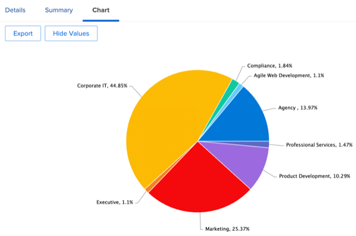

# Einblicke für Marketing-Manager

## Wochenansicht des Projekt-Leiters

Klicken Sie in der linken Spalte auf „Wochenansicht des Projekt-Leaders“:

Dies deckt ein umfangreiches Array von Berichten ab, auf die immer geklickt werden kann bzw. für weitere Details zugegriffen werden kann:

- Die **Aufgaben, die diese Woche nach Projekt fällig sind**

- Die **bevorstehenden Meilensteine des**:

- Die **Offene Probleme nach Priorität**

- Die **Verspätete Aufgaben nach Abteilung**

- Die **Überfällige Aufgaben nach Person**

## SCRUM-bezogene Erkenntnisse

Klicken Sie in der linken Spalte auf „Iterationsstatus“

Wenn Ihre Teams mit der SCRUM-Methodik arbeiten, ist dies ein interessanter Berichtssatz für das Management:

- **Geschwindigkeit nach Iteration**

- **Durchschnittliche Geschwindigkeit nach Team**

- **Aktuelle Iterationen abgeschlossen Stundensummen nach Zuweisung**

- **Iterationen nach Team**

## Effizienzberichte

Klicken Sie noch in der linken Spalte auf „Effizienz“

- **Geplantes/Ungeplantes Verhältnis** (der geleisteten Arbeit)

- **Abgeschlossene Anfragen nach Woche**

## Projekteinblicke während des Fluges

Klicken Sie noch in der linken Spalte auf „Marketing - Projekte in Bearbeitung“

- **Status von Projekten in Bearbeitung**

- **Projekte nach Bedingung und Monat**

- Liste, Fortschritt und finanzielle Details der &quot;**&quot;-Projekte**

## Visualisieren (projektübergreifender) Abhängigkeiten

Zurück zur „PIN“-Zeile, klicken Sie auf &quot;Portfolio-Gantt-Ansicht“:

Hier sehen Sie eine **Gantt-Diagramm-Ansicht einer Gruppe von Projekten** mit möglichen Abhängigkeiten (Vorgänger) zwischen Projekten

## Einblicke in die Integration von Drittanbietern

>[!NOTE]
>
> Dies ist ein Beispiel für eine Integration mit einer Software eines Drittanbieters. Dies ist eine Integration mit Adobe Campaign als Illustration. Die Ergebnisse der abgeschlossenen Kampagnen werden in Adobe Campaign importiert.

Klicken Sie in der Zeile „PIN“ auf „Kampagnenübersicht“:

- **Zusammenfassung zu Adobe Campaign**

- **Adobe Campaign an Öffnungen gesendet**

- **Adobe Campaign wird für Klicks geöffnet**

Nächster Schritt: [Fazit](../../conclusion.md)

[Zurück zu Phase 4: Erkenntnisse für einen Projekt-Manager](./project-manager.md)

[Zurück zu „Alle Module“](../../overview.md)
