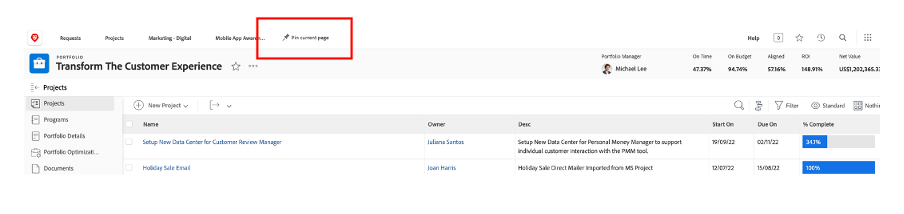
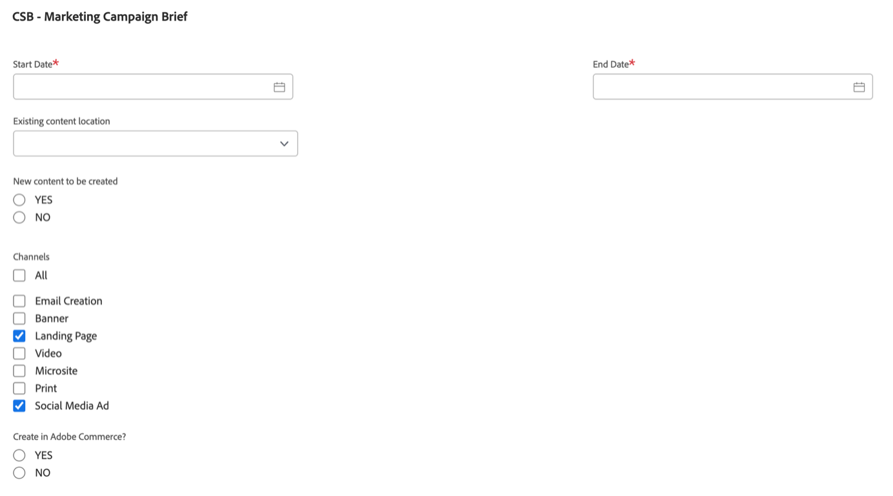
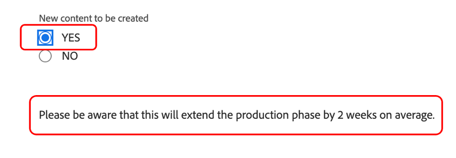

# Planung

>[!NOTE]
>
> Im Bootcamp tragen Sie mehrere Hüte: Anforderer, Projektmanager, Designer und Oberverwaltung. Dadurch erhalten Sie einen Überblick über das Benutzererlebnis jedes Profils.

Sehen wir uns nun die Work Management Platform Adobe Workfront an. Workfront macht Ihre Ziele für das gesamte Unternehmen sichtbar, damit jeder Ihre Arbeit strategisch priorisieren, Fortschritte verfolgen und Ergebnisse messen kann. Und während sich Ihre Ziele entwickeln, kaskadiert Workfront Informationen an Teams, die vor Ort arbeiten. Das Ergebnis? Größere Ausrichtung, Fokussierung und Schnelligkeit für Erfolg.

Melden Sie sich bei Ihrem Workfront-Profil an, indem Sie zu [adobebootcampemea-02032301.testdrive.workfront.com](https://adobebootcampemea-02032301.testdrive.workfront.com) und melden Sie sich mit den Anmeldedaten an, die das Adobe-Team Ihnen bereitgestellt hat.

Sie werden mit dieser Anmeldeseite konfrontiert sein.  Melden Sie sich mit Ihrer professionellen E-Mail-Adresse an, die Sie als Benutzername für das Bootcamp abonniert haben:

Nach erfolgreicher Anmeldung sehen Sie sich diese Homepage an:

## Vorbereiten von Workfront für die Verwendung

Wir werden jetzt unsere Homepage so vorbereiten, als würden wir Workfront regelmäßig verwenden.  Das bedeutet, dass wir die entsprechenden Seiten für unseren Workflow von später und &quot;PIN&quot; auf unserer Homepage erhalten werden.

Als Erstes sollten wir die Arbeitsseite unseres TEAM aufrufen.  Klicken Sie oben rechts auf die Waffel und wählen Sie &quot;Teams&quot;aus.

Sobald unser TEAM (Marketing - Digital) auf dem Bildschirm ist, &quot;PIN&quot;es einfach auf Ihr oberstes Band:

Das obere Band sollte jetzt wie folgt aussehen:

Nun können wir ein Projekt anlegen, das wir später genauer analysieren werden.  Klicken Sie auf die Seite Projekte PINNED und dann auf die Suchschaltfläche .  Geben Sie &quot;Mobile App-Sensibilisierungskampagne&quot;ein und klicken Sie auf den Projektnamen:

Sobald sich das Projekt auf Ihrem Bildschirm befindet, FÜGEN Sie es wie zuvor in Ihr oberstes Band ein:

Das obere Band sollte jetzt wie folgt aussehen:

Klicken Sie abschließend erneut auf die obere rechte Waffel und wählen Sie PORTFOLIO aus.

Klicken Sie auf die Suchschaltfläche und geben Sie &#39;TRANSFORM&#39; ein.  Klicken Sie auf das Portfolio &quot;Kundenerlebnis transformieren&quot;, um es zu öffnen:

Sobald das Portfolio geöffnet ist, FÜGEN Sie es in das obere Band:

Das obere Band sollte jetzt wie folgt aussehen:

Wir sind nun bereit, unseren Workflow mit einer Oberfläche zu starten, die uns regelmäßig genau zeigt, was wir brauchen.

## Anfragenden

Wir beginnen nun mit der tatsächlichen Arbeitsaufnahme mit dem Hut des Anforderers. Ein Anforderer, z. B. ein Produkt-Manager, möchte eine Anforderung für unsere neue Adobe Campaign formalisieren und die Informationen aus dem Marketing Brief bereitstellen.

- Klicken Sie oben links auf Anforderungen:

- Klicken Sie dann auf &quot;Neue Anforderung&quot;:

- Wählen Sie als Anfragetyp &quot;Marketing-Anforderungen&quot;und dann &quot;CSB - Kampagnenanforderungen&quot;:

- Geben Sie den Betreff ein: &quot;Adobe Campaign - \*Team\*&quot; (geben Sie Ihre Teamnummer ein). Sie können eine Beschreibung und eine Priorität hinzufügen.

- Alles unterhalb der Kopfzeile &quot;CSB - Marketing Campaign Brief&quot;ist vollständig anpassbar. In diesem Fall handelt es sich um alle benutzerdefinierten Felder, die Sie an Ihre eigenen Marketing-Kurzbeschreibungen anpassen können. Im Folgenden finden Sie die kurzen Felder, die wir für dieses Bootcamp erstellt haben:

- Beginnen wir mit dem Ausfüllen des Briefes:

   - Setzen Sie das Startdatum auf 06.01.2023 - Enddatum auf 30.06.2023:

   

   - Wählen Sie AEM Assets aus, da dort einige Assets zur Verfügung stehen, die in dieser Kampagne verwendet werden können:

   

   - Beachten Sie bei &quot;Neuer Inhalt&quot;Folgendes: Wenn Sie auf &quot;Ja&quot;klicken, wird ein zusätzliches (bedingtes) Feld mit einer Zeitzeilenwarnung angezeigt:

   

   - Da wir uns in einer knappen Frist befinden, ändern wir unsere Wahl in &quot;NEIN&quot;:

   

   - Auf den Kanälen haben wir die Auswahl von standardmäßig ausgewählten Kanälen getroffen. Und das sind die, die wir für den nächsten Schritt benötigen, sodass hier keine Änderung erforderlich ist:

   

   - Adobe Commerce, wählen Sie Ja aus:

   

- Schließlich können Sie im Abschnitt &quot;Dokumente&quot;jede relevante Dokumentation für Ihre Anfrage hinzufügen.  In unserem Beispiel verwenden wir den AEM Connector, um Ihnen zu zeigen, wie Sie vorhandenen Inhalt von unserer AEM Assets-Instanz erhalten können.

   - Klicken Sie auf &quot;Dateien hinzufügen oder verknüpfen&quot;und wählen Sie Link aus &quot;experience-manager&quot;.

   

   - Sie sehen sich jetzt mit den AEM Assets-Ordnern konfrontiert und können sie durchsuchen (und/oder die Suchmaschine verwenden), um die Dokumente/Assets abzurufen, die Sie für Ihre Anforderung benötigen:

   

   - Sie können beliebige Elemente aus AEM Assets anhängen, die Ihrer Meinung nach für dieses Projekt relevant sein könnten, falls vorhanden. Wenn Sie fertig sind, klicken Sie entweder auf &quot;Link&quot;, um eine Verknüpfung zu Assets herzustellen, oder auf &quot;Schließen&quot;, wenn Sie keine Ordner verknüpfen.

   

- Wir haben unsere Anfrage jetzt abgeschlossen und sind bereit, sie einzureichen:

## Projektmanager

Nachdem wir nun unsere Anfrage als &#39;Anforderer&#39; eingereicht haben (z.B. Produktmanager), werden wir die Hüte wechseln und den von Project Manager tragen.

- Klicken Sie auf das Logo &quot;Adobe&quot; und landen Sie auf der Seite &quot;Neue Marketinganfragen&quot;(dies ist eine typische Startseite des Projektmanagers):

- Im Abschnitt &quot;Marketing - Neue Kampagnenanforderungen&quot;finden Sie Ihre neu erstellte Anforderung:

- Klicken Sie auf den Anforderungsnamen:

- Klicken Sie auf &quot;Details anfordern&quot;:

- Scrollen Sie nach unten zum Abschnitt &quot;CSB - Marketing Campaign Brief&quot;und erweitern Sie ihn:

- Sie können alle Details der Anfragenbeschreibung sehen und mit diesen Informationen können Sie einen Projektplan basierend auf einer Vorlage starten.
   - Klicken Sie oben neben Ihrem Anforderungsnamen auf die drei Punkte:

   

   - Klicken Sie auf &quot;In Projekt aus Vorlage konvertieren&quot;:

   

   - Wählen Sie &quot;CSB - Marketing-Kampagne&quot;und klicken Sie dann auf &quot;Vorlage verwenden&quot;:

   

   - Klicken Sie unten auf der Seite auf &quot;In Projekt konvertieren&quot;:

   

- Jetzt basiert unser Campaign-Projekt-Workflow auf der Vorlage. Lassen Sie uns unser Projekt für später in die Hand nehmen. Klicken Sie auf &quot;Aktuelle Seite veröffentlichen&quot;:

- Einige Schwerpunktbereiche:

1. Begriff der Dauer - Es ist das Fenster der Möglichkeit, eine Aufgabe abzuschließen.\
   Begriff der geplanten Stunden - Dies ist die tatsächliche Zeit, die zum Abschließen einer Aufgabe benötigt wird.

1. Vorstellung von Vorgängern (auch Abhängigkeiten genannt) - Dies sind die Begrenzungen, die Aufgaben zwischen einander haben können (normalerweise kann diese Aufgabe nicht gestartet werden, bevor die andere abgeschlossen ist). Dadurch können wir ein klares Gant Chart mit dem kritischen Pfad für jedes Projekt haben. Klicken Sie auf das Symbol unten, um das Gant-Diagramm anzuzeigen:
   

1. Idee der Zuweisungen - Zum Zeitpunkt der Erstellung des Projekts sind Zuweisungen immer noch allgemein gehalten, da sie aus einer Vorlage stammen. Sie werden entweder an Job-Rollen - vertreten durch das Hammersymbol (d. h. eine Gruppe von Personen, die über die nötigen Fähigkeiten verfügen, um diese Aufgabe zu erledigen) oder an Teams gesendet, die durch das Personensymbol (d. h. eine von Ihrer Unternehmensgruppe definierte Personengruppe) repräsentiert werden. Jetzt ist es an der Zeit, diese Aufgaben Einzelpersonen zuzuweisen.

- Heute werden wir uns auf die Vorbelegung von Teams konzentrieren und erfahren, wie diese Personen zugewiesen werden.

- Wie Sie sehen können, wird Aufgabe 11 &quot;Social Media-Anzeige produzieren&quot;dem Team &quot;Marketing - Digital&quot;zugewiesen:
   

- Lassen Sie uns sehen, wie sich dies auf die Planung dieses Teams auswirkt, indem wir seine Seite &quot;Ressourcenverwaltung&quot;öffnen. Klicken Sie oben auf der Seite auf die PIN &quot;Marketing - Digital&quot;:
   

- Sie haben jetzt diese Ansicht zur Teamplanung:

1. Der obere Teil behandelt die nicht zugewiesene Arbeit für das entsprechende Team. Es listet die Projekte auf, denen das Team zugewiesen ist, und durch Klicken auf den Pfeil hier haben Sie die Möglichkeit, die Aufgaben anzuzeigen, die vom Projekt abgedeckt werden müssen:
   

1. Der untere Teil umfasst die zugewiesene Arbeit für die Personen im Team, aber nicht nur: Es zeigt tatsächlich die tatsächliche Arbeitslast jedes Teammitglieds, aber auch seinen Zeitplan (z.B. Mo-Fr oder Mo-Sat), seinen Urlaub, etc.
   

- Um eine Aufgabe einer Person zuzuweisen, ziehen Sie einfach die Aufgabe aus dem oberen Teil in die Zeile einer Person im unteren Teil - Sehen Sie sich an, wie die Arbeitslast von Bea angepasst und die Details zu ihren Aufgabenzuweisungen hinzugefügt wurden:
   

Nächster Schritt: [Phase 1 - Planung: Sonstige Vorarbeiten](./prework.md)

[Zurück zur Creative Brief](../../creative-brief.md)

[Zu allen Modulen zurückkehren](../../overview.md)
