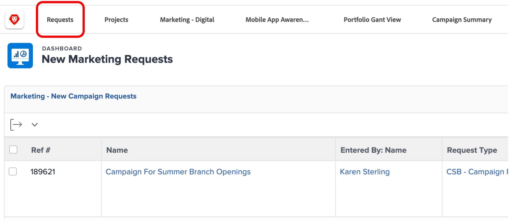
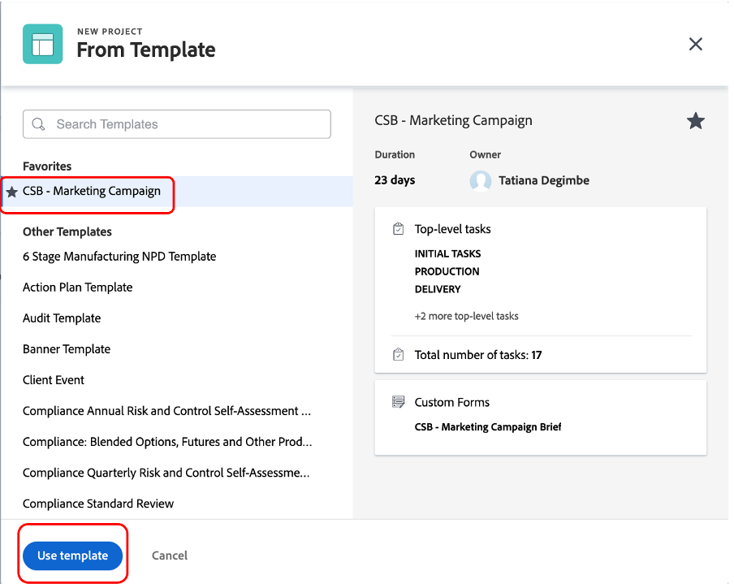

# Planung

>[!NOTE]
>
> Während des Bootcamps tragen Sie mehrere Hüte: Auftraggeber, Projektmanager, Designer und Upper Management. Auf diese Weise erhalten Sie einen Überblick über das Benutzererlebnis jedes Profils.

Werfen wir nun einen Blick auf die Work-Management-Plattform Adobe Workfront. Workfront macht Ihre Unternehmensziele für das gesamte Unternehmen sichtbar, sodass jeder strategisch die Arbeit priorisieren, den Fortschritt verfolgen und die Ergebnisse messen kann. Bei der Weiterentwicklung Ihrer Unternehmensziele überträgt Workfront Informationen an Teams, die vor Ort arbeiten. Das Ergebnis? Bessere Ausrichtung, Fokus und Geschwindigkeit, um Erfolg zu erzielen.

Melden Sie sich bei Ihrem Workfront-Profil an, indem Sie zu [adobebootcampemea-02032301.testdrive.workfront.com](https://adobebootcampemea-02032301.testdrive.workfront.com) navigieren und sich mit den vom Adobe-Team für Sie bereitgestellten Anmeldeinformationen anmelden.

Sie werden mit dieser Anmeldeseite konfrontiert.  Melden Sie sich mit Ihrer professionellen E-Mail-Adresse, die Sie mit dem Bootcamp abonniert haben, als Benutzername an:

Nach erfolgreicher Anmeldung sehen Sie sich mit dieser Homepage konfrontiert:

## Vorbereiten von Workfront für die Verwendung

Wir werden nun unsere Homepage so vorbereiten, als würden wir regelmäßig Workfront verwenden.  Das bedeutet, dass wir die relevanten Seiten für unseren späteren Workflow abrufen und auf unserer Homepage „anheften“.

Als Erstes rufen wir die Workload-Seite unseres TEAM ab.  Klicken Sie oben rechts auf das Waffel und wählen Sie „Teams“ aus.

Sobald unser TEAM (Marketing - Digital) auf dem Bildschirm ist, einfach „PIN“ es an Ihr oberstes Band:

Die obere Multifunktionsleiste sollte nun wie folgt aussehen:

Lassen Sie uns nun ein Projekt anheften, das wir später genauer analysieren werden.  Klicken Sie auf die Seite „Projekte angeheftet“ und dann auf die Schaltfläche „Suchen“.  Geben Sie „Kampagne zur Sensibilisierung für Mobile Apps“ ein und klicken Sie auf den Projektnamen:

Sobald das Projekt auf dem Bildschirm angezeigt wird, heften Sie es wie zuvor an die obere Multifunktionsleiste an:

Die obere Multifunktionsleiste sollte nun wie folgt aussehen:

Klicken Sie abschließend noch einmal auf das Waffel oben rechts und wählen Sie PORTFOLIOS aus.

Klicken Sie auf die Suchschaltfläche und geben Sie „TRANSFORM“ ein.  Klicken Sie auf das Portfolio „Das Kundenerlebnis transformieren“, um es zu öffnen:

Sobald das Portfolio geöffnet ist, heften Sie es an das obere Band:

Die obere Multifunktionsleiste sollte nun wie folgt aussehen:

Wir sind nun bereit, unseren Workflow mit einer Oberfläche zu starten, die uns regelmäßig genau zeigt, was wir brauchen.

## Anfragenden

Wir beginnen nun mit der tatsächlichen Arbeitsaufnahme mit dem Hut des Antragstellers. Als Anfragender, z. B. als Produkt-Manager, möchten wir eine Anfrage für unsere neue Adobe Campaign formalisieren und die Informationen aus dem Marketing Brief bereitstellen.

- Klicken Sie oben links auf Anfragen :

- Klicken Sie dann auf „Neue Anfrage“:

- Wählen Sie als Anfragetyp „Marketing-Anfragen“ und dann „CSB - Kampagnenanfragen“ aus:

- Geben Sie den Betreff „Adobe Campaign - \*Team\*&quot; ein (geben Sie Ihre Team-Nummer ein). Sie können eine Beschreibung und eine Priorität hinzufügen.

- Alles unter der Kopfzeile „CSB - Marketing Campaign Brief“ ist vollständig anpassbar. In diesem Fall handelt es sich um benutzerdefinierte Felder, die Sie an Ihre eigenen Marketing-Kurzanforderungen anpassen können. Hier sind die Kurzfelder, die wir für dieses Bootcamp erstellt haben:

- Beginnen wir mit dem Ausfüllen des Briefs:

   - Legen Sie das Startdatum auf 01/06/2023 fest. Legen Sie das Enddatum auf 30/06/2023 fest:

  

   - Wählen Sie AEM Assets aus, da wir dort einige Assets für die Verwendung in dieser Kampagne haben werden:

  

   - Beachten Sie bei „Neuer Inhalt“, dass beim Klicken auf „Ja“ ein zusätzliches (bedingtes) Feld mit einer Zeitleisten-Warnung angezeigt wird:

  

   - Da wir uns in einer engen Frist befinden, ändern wir unsere Wahl in „NEIN“:

  

   - Bei den Kanälen haben wir die Wahl getroffen, einige standardmäßig vorab auszuwählen. Und das sind diejenigen, die wir für den nächsten Schritt benötigen, also ist hier keine Änderung erforderlich:

  

   - Adobe Commerce, wählen Sie Ja:

  

- Schließlich können Sie im Abschnitt Dokumente jede relevante Dokumentation für Ihre Anfrage hinzufügen.  Hier verwenden wir den AEM-Connector , um Ihnen zu zeigen, wie Sie vorhandene Inhalte aus unserer AEM Assets-Instanz erhalten können.

   - Klicken Sie auf „Dateien hinzufügen oder verknüpfen“ und wählen Sie „Link aus Experience Manager“ aus.

  

   - Sie haben jetzt die AEM Assets-Ordner, durch die Sie navigieren (und/oder die Suchmaschine verwenden) können, um die Dokumente/Assets zu erhalten, die Sie für Ihre Anfrage benötigen:

  

   - Sie können auch beliebige Elemente aus AEM Assets anhängen, die Sie als für dieses Projekt relevant erachten. Wenn Sie fertig sind, klicken Sie entweder auf „Verknüpfen“, um eine Verknüpfung zu Assets herzustellen, oder auf „Schließen“, wenn Sie keine Ordner verknüpfen.

  

- Wir haben unsere Anfrage nun abgeschlossen und sind bereit, sie zu senden:

## Projekt-Manager

Nachdem wir nun unseren Antrag als „Anfragender“ (z. B. als Produkt-Manager) eingereicht haben, werden wir den Hüt wechseln und den des Projekt-Managers tragen.

- Klicken Sie auf das &quot;Adobe&quot;-Logo und Sie landen auf der Seite „Neue Marketing-Anfragen“ (dies ist eine typische „Projekt-Manager“-Startseite):

- Im Abschnitt „Marketing - Neue Kampagnenanfragen“ finden Sie Ihre neu erstellte Anfrage:

- Klicken Sie auf den Anfragenamen:

- Klicken Sie auf „Anfragedetails“:

- Scrollen Sie nach unten zum Abschnitt „CSB - Marketing-Kampagnenbeschreibung“ und erweitern Sie ihn:

- Sie können alle Details der Zusammenfassung des Antragstellers sehen. Mit diesen Informationen können Sie einen Projektplan auf der Grundlage einer Vorlage starten.
   - Klicken Sie oben neben Ihrem Anfragenamen auf die drei Punkte:

  

   - Klicken Sie auf „Aus Vorlage in Projekt konvertieren“:

  

   - Wählen Sie „CSB - Marketing-Kampagne“ aus und klicken Sie dann auf „Vorlage verwenden“:

  

   - Klicken Sie unten auf der Seite auf „In Projekt konvertieren“:

  

- Jetzt basiert unser Campaign-Projekt-Workflow auf der Vorlage. Lassen Sie uns unser Projekt für später anheften. Klicken Sie auf „Aktuelle Seite anheften“:

- Einige Bereiche des Interesses:

1. Begriff der Dauer - Es ist das Zeitfenster, in dem eine Aufgabe abgeschlossen werden kann.\
   Geplante Stunden : Dies ist die tatsächlich für die Ausführung einer Aufgabe benötigte Zeit.

1. Vorläufer (auch als Abhängigkeiten bezeichnet) - Dies sind die Einschränkungen, die Aufgaben zwischen einander haben können (in der Regel kann diese Aufgabe nicht gestartet werden, bevor die andere abgeschlossen ist). Dadurch können wir ein klares Gantt-Diagramm mit dem kritischen Pfad für jedes Projekt erstellen. Klicken Sie auf das folgende Symbol, um das Gantt-Diagramm anzuzeigen:
   

1. Zuweisungen - Zum Zeitpunkt der Projekterstellung sind Zuweisungen immer noch generalistisch, da sie aus einer Vorlage stammen. Sie werden entweder Aufgabengebieten zugewiesen, die durch das Hammersymbol dargestellt werden (d. h. eine Gruppe von Personen, die über die Fähigkeiten verfügen, diese bestimmte Aufgabe auszuführen), oder Teams, die durch das Personensymbol dargestellt werden (d. h. ein durch Ihre Unternehmensgruppe definiertes Personensymbol). Jetzt ist es an der Zeit, diese Aufgaben den Einzelnen zuzuweisen.

- Heute konzentrieren wir uns auf die Vorab-Arbeitsaufträge von Teams und deren Zuweisung an Einzelpersonen.

- Wie Sie sehen können, ist Aufgabe 11 „Werbung für soziale Medien produzieren“ dem Team „Marketing - Digital“ zugewiesen:
  

- Sehen wir uns an, wie sich dies auf die Planung dieses Teams auswirkt, indem wir seine Seite „Ressourcenverwaltung“ öffnen. Klicken Sie oben auf der Seite auf die PIN „Marketing - Digital“:
  

- Sie haben jetzt diese Team-Planungsansicht:

1. Der obere Teil enthält die nicht zugewiesenen Arbeiten für dieses bestimmte Team. Es werden die Projekte aufgelistet, in denen das Team Arbeitsaufträge hat, und durch Klicken auf den Pfeil hier haben Sie Einblick in die exakten Aufgaben, die vom Projekt abgedeckt werden müssen:
   

1. Der untere Teil behandelt die zugewiesene Arbeit für die Personen im Team, aber nicht nur: Er zeigt in der Tat die tatsächliche Arbeitsbelastung jedes Teammitglieds, sondern auch seinen Zeitplan (z.B. Mo-Fr oder Mo-Sa), seinen Urlaub usw.
   

- Um eine Aufgabe einer Person zuzuweisen, ziehen Sie die Aufgabe einfach vom oberen Teil in die Zeile einer Person im unteren Teil. Sehen Sie sich an, wie die Arbeitslast von Bea angepasst wurde und die Details ihrer Aufgabenzuweisungen hinzugefügt wurden:
  

Nächster Schritt: [Phase 1 - Planung: Sonstige Vorarbeiten](./prework.md)

[Zurück zum Creative Brief](../../creative-brief.md)

[Zurück zu „Alle Module“](../../overview.md)
