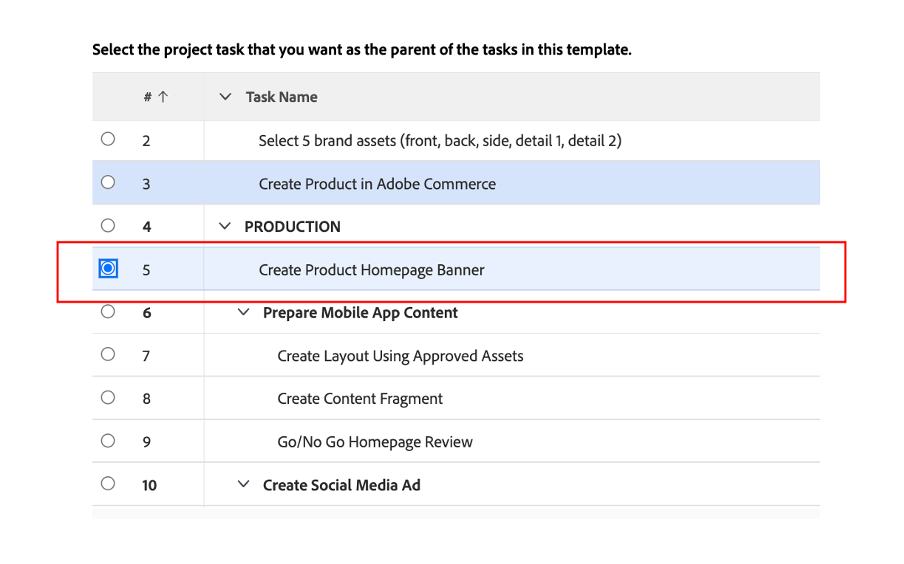

# Sonstige Vorarbeiten

## Brand Assets auswählen

Wie im Creative Brief beschrieben, werden einige Assets benötigt, um unsere Kampagne effektiv zu starten. Diese Marken-Assets werden der Kampagne in Workfront hinzugefügt, damit wir zentral auf sie zugreifen können.

- Erweitern Sie Aufgabe 1, „ANFÄNGLICHE AUFGABEN“ und öffnen Sie dann die Aufgabe „5 Marken-Assets auswählen (vorne, hinten, …)“, indem Sie darauf klicken.

- Auf „Dokumente“ und dann auf „Neu hinzufügen“ klicken:

- Wählen Sie „Aus Experience Manager“ aus. Auf diese Weise können wir Marken-Assets auswählen, die bereits in AEM Assets verfügbar sind:

- Sobald die AEM-Ordnerhierarchie angezeigt wird, navigieren Sie zum folgenden Pfad: experience-manager > AdobeBike Assets > Bike Shots Wählen Sie 5 Assets aus und klicken Sie dann auf „Link“.

- Wir haben jetzt unsere Marken-Assets in unserer Aufgabe. Das bedeutet, dass wir Aufgabe 2 als zu 100 % abgeschlossen festlegen können:

## Demo von Adobe Commerce

Adobe Commerce ist eines der vielen Produkte in Adobe Experience Cloud, mit denen Sie Ihren Kunden die besten digitalen Erlebnisse bieten können. Allerdings war während des Bootcamps einfach zu wenig Zeit, alles gemeinsam zu machen.

Dieses Video macht Sie mit Adobe Commerce vertraut und zeigt das Produkt, das wir während des Bootcamps erstellt haben. In einem realen Szenario würden Sie die zuvor ausgewählten Marken-Assets in Adobe Commerce in die Produktkonfiguration hochladen.

>[!VIDEO](https://video.tv.adobe.com/v/3418945?quality=12&learn=on)

Sobald diese Aufgabe abgeschlossen ist, können Sie Aufgabe 3 in Workfront als zu 100 % abgeschlossen markieren.

## Flexible Kampagnen sind eine Voraussetzung

Bei der Durchsicht unseres Arbeitsplans ist uns ein kleines Problem aufgefallen: Unser Produkt-Manager (der Antragsteller) hat ein Update eingefügt, das er vergessen hat, um ein „Produkt-Homepage-Banner“ zu bitten.  Wir fügen dies unserem Projektplan hinzu.

- Gehen Sie zur Aufgabenliste und fügen Sie unsere Aufgabe „Produkt-Homepage-Banner erstellen“ direkt unter Aufgabe 4 „PRODUKTION“ hinzu. Wählen Sie dazu die Aufgabe „Inhalt der Mobile App vorbereiten“ und klicken Sie auf das Symbol „Aufgabe hinzufügen über“:

- Benennen Sie die hinzugefügte Aufgabe sinnvoll, z. B. „Produkt-Homepage-Banner erstellen“.

- Nachdem wir die Aufgabe erstellt haben, fügen wir ihr nun Inhalt hinzu. Klicken Sie auf die drei Punkte rechts neben Ihrem Projekttitel und wählen Sie „Vorlage anhängen“:

- Wählen Sie „Produkt-Homepage-Banner erstellen“ aus und klicken Sie auf „Anpassen und anhängen“:

- Stellen Sie sicher, dass Sie im Anpassungsbildschirm die Aufgabe „Produkt-Startseitenbanner erstellen“ als übergeordnete Aufgabe erwähnen:

- Stellen Sie abschließend sicher, dass Sie die übergeordnete Aufgabe „Produkt-Startseite erstellen“ mit einem Vorgänger von Aufgabe 3 markieren, da die Produktion erst gestartet werden kann, wenn das Produkt in Adobe Commerce erstellt wurde:

Wir haben jetzt eine vollständige und geplante Kampagne, sodass wir jetzt mit der Produktion und Lieferung unserer Kampagne beginnen können!

Nächster Schritt: [Phase 2 - Produktion: Erstellen Sie das Produkt-Homepage-Banner](../production/banner.md)

[Zurück zu Phase 1 - Planung: Planung](./planning.md)

[Zurück zu „Alle Module“](../../overview.md)
