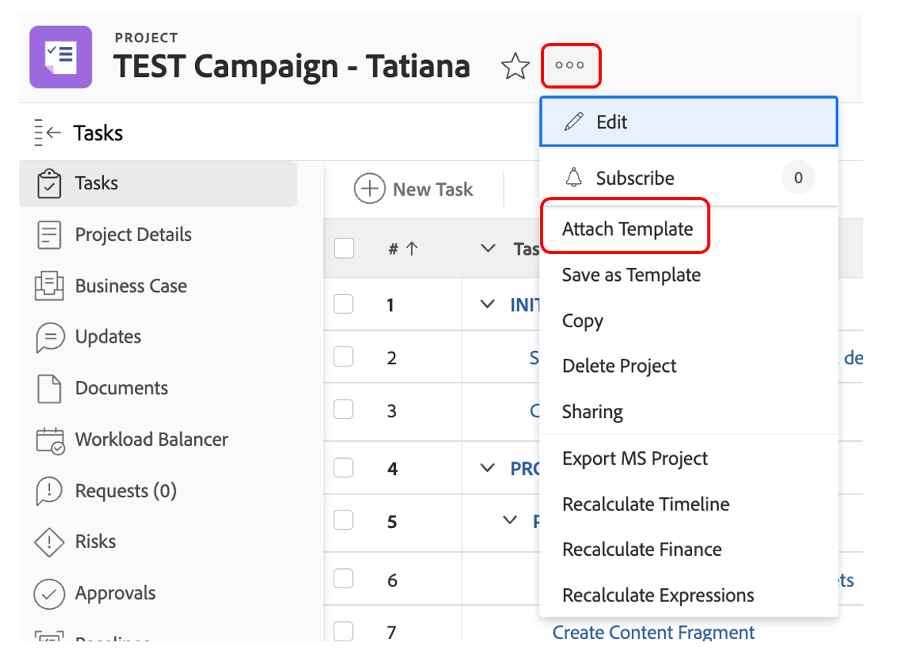

# Sonstige Vorarbeiten

## Auswählen von Brand Assets

Wie in der Kreativbeschreibung beschrieben, sind einige Assets erforderlich, um unsere Kampagne effektiv starten zu können. Diese Marken-Assets werden der Kampagne in Workfront hinzugefügt, damit wir zentral darauf zugreifen können.

- Erweitern Sie Aufgabe 1, &quot;ERSTE AUFGABEN&quot;und öffnen Sie dann die Aufgabe &quot;5 Marken-Assets auswählen (vorne, hinten, ...)&quot;, indem Sie darauf klicken.

- Klicken Sie auf &quot;Dokumente&quot;und dann auf &quot;Neu hinzufügen&quot;:

- Wählen Sie &quot;Von Experience Manager&quot;aus. Auf diese Weise können wir Marken-Assets auswählen, die bereits in AEM Assets verfügbar sind:

- Sobald die AEM Ordnerhierarchie angezeigt wird, navigieren Sie zum folgenden Pfad: experience-manager > Adobe Assets > Bike shots Wählen Sie 5 Assets aus und klicken Sie auf &quot;Link&quot;.

- Wir haben jetzt unsere Marken-Assets in unserer Aufgabe. Das bedeutet, dass wir Aufgabe 2 als 100 % abgeschlossen festlegen können:

## Demo von Adobe Commerce

Adobe Commerce ist eines der vielen Produkte in der Adobe Experience Cloud, mit denen Sie Ihren Kunden die besten digitalen Erlebnisse bieten können. Es gab jedoch einfach zu wenig Zeit, um alles zusammen im Bootcamp zu machen.

In diesem Video erfahren Sie mehr über Adobe Commerce und das Produkt, das wir im Bootcamp entwickelt haben. In einem realen Szenario würden Sie die zuvor ausgewählten Marken-Assets in Adobe Commerce in die Produktkonfiguration hochladen.

>[!VIDEO](https://video.tv.adobe.com/v/3418945?quality=12&learn=on)

Nach Abschluss dieser Aufgabe können Sie Aufgabe 3 in Workfront als zu 100 % abgeschlossen markieren.

## Flexible Kampagnen sind eine Voraussetzung

Bei der Überprüfung unseres Arbeitsplans haben wir ein kleines Problem bemerkt: Unser Produkt-Manager (der Anforderer) hat ein Update vorgenommen, das er vergessen hat, ein &#39;Produkt-Homepage-Banner&#39; anzufordern.  Wir werden dies zu unserem Projektplan hinzufügen.

- Gehen Sie zur Aufgabenliste und fügen Sie unsere Aufgabe &quot;Produkt-Homepage-Banner erstellen&quot;direkt unter Aufgabe 4 &quot;PRODUKTION&quot;hinzu. Wählen Sie dazu die Aufgabe &quot;Inhalt der mobilen App vorbereiten&quot;aus und klicken Sie auf das Symbol &quot;Aufgabe hinzufügen oben&quot;:

 hinzufügen

- Geben Sie der hinzugefügten Aufgabe einen aussagekräftigen Namen, z. B. &quot;Produkt-Homepage-Banner erstellen&quot;.

- Nachdem wir die Aufgabe erstellt haben, fügen wir ihr Inhalt hinzu. Klicken Sie auf die drei Punkte rechts neben Ihrem Projekttitel und wählen Sie &quot;Vorlage anhängen&quot;aus:

- Wählen Sie &quot;Produkt-Homepage-Banner erstellen&quot;und klicken Sie auf &quot;Anpassen und anhängen&quot;:

- Stellen Sie sicher, dass Sie im Bildschirm &quot;Anpassung&quot;die Aufgabe &quot;Produkt-Homepage-Banner erstellen&quot;als übergeordnetes Element erwähnen:

 hinzufügen

- Stellen Sie abschließend sicher, dass Sie die übergeordnete Aufgabe mit &quot;Produkt-Homepage erstellen&quot;mit dem Vorgänger von Aufgabe 3 markieren, da keine Produktion gestartet werden kann, bis das Produkt in Adobe Commerce erstellt wurde:

Wir haben jetzt eine Kampagne, die vollständig und geplant ist, was bedeutet, dass wir jetzt mit der Produktion und dem Versand unserer Kampagne beginnen können!

Nächster Schritt: [Phase 2 - Produktion: Produkt-Homepage-Banner erstellen](../production/banner.md)

[Gehen Sie zurück zu Phase 1 - Planung: Planung](./planning.md)

[Zu allen Modulen zurückkehren](../../overview.md)
