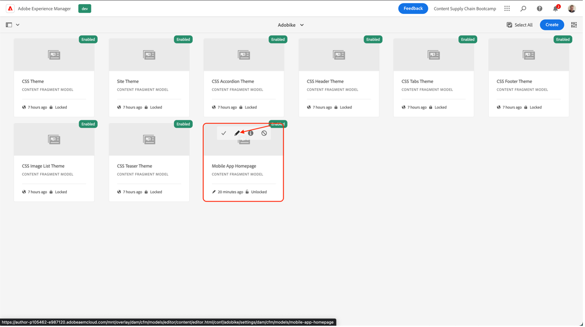
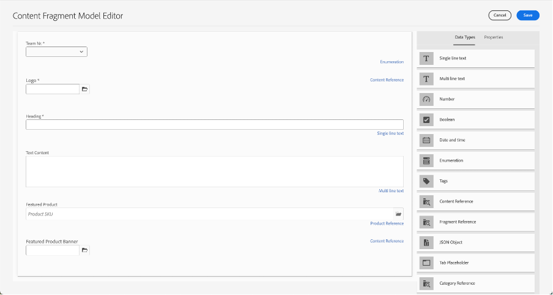

# Erstellen von mobilen App-Inhalten

## Was ist die Bereitstellung Headless Content?

Mit einem Headless-Content-Management-System sind Backend und Frontend jetzt entkoppelt. Der Headless-Teil ist das Inhalts-Backend, da ein Headless-CMS ein reines Back-End-Content-Management-System ist, das explizit als Inhalts-Repository konzipiert und erstellt wurde, das Inhalte über eine API für die Anzeige auf jedem Gerät zugänglich macht.

Das Frontend, das unabhängig voneinander entwickelt und gepflegt wird, ruft mithilfe einer Content Delivery-API Inhalte aus dem Headless-Backend ab, normalerweise im JSON-Format. Dies kann beispielsweise als Web-App oder in unserem Fall als Mobile App erfolgen.

Ein Headless-CMS-Backend erfordert normalerweise, dass der Inhalt basierend auf einem Modell oder Schema strukturiert ist. Dies erleichtert Clientanwendungen, die die richtigen Inhalte für das Rendern eines Erlebnisses anfordern. Einige CMS, wie AEM, können sowohl strukturierte als auch unstrukturierte Inhalte im JSON-Format verfügbar machen.

Ein wesentliches Merkmal dieser Topologie ist, dass der von dem Headless-CMS im JSON-Format bereitgestellte Inhalt reine Inhalte ohne Design- oder Layoutinformationen ist. In einer Headless-CMS-Implementierung werden alle Formatierungen und Layouts von der entkoppelten Frontend-Anwendung verwaltet.

Ein wesentlicher Vorteil einer Headless-CMS-Topologie besteht in der Möglichkeit, Inhalte über mehrere Kanäle hinweg wiederzuverwenden, was verschiedene clientseitige Frontend-Implementierungen verwenden kann. Dadurch kann der Frontend-Entwicklungsprozess effizienter gestaltet werden. Aber es bedeutet auch, dass der Frontend-Erlebnisentwicklungsprozess sehr Code- und IT-orientiert werden kann, wobei die IT im Wesentlichen das Erlebnis besitzt.

## Wie funktioniert die Bereitstellung von Headless Content in AEM?

AEM as a Cloud Service ist ein flexibles Tool für Headless-Implementierungsmodelle mit drei leistungsstarken Funktionen:

1. Inhaltsmodelle
   - Inhaltsmodelle sind strukturierte Darstellungen von Inhalten.
   - Inhaltsmodelle werden von Informationsarchitekten im Editor AEM Inhaltsfragmentmodell definiert.
   - Inhaltsmodelle dienen als Grundlage für Inhaltsfragmente.
1. Inhaltsfragmente
   - Inhaltsfragmente werden basierend auf einem Inhaltsmodell erstellt.
   - Wird von Inhaltsautoren mit dem Inhaltsfragment-Editor AEM erstellt.
   - Inhaltsfragmente werden in AEM Assets gespeichert und in der Administrator-Benutzeroberfläche von Assets verwaltet.
1. Inhalts-API für die Bereitstellung
   - Die AEM GraphQL-API unterstützt die Bereitstellung von Inhaltsfragmenten.
   - Die AEM Assets REST API unterstützt CRUD-Vorgänge für Inhaltsfragmente.
   - Die direkte Inhaltsbereitstellung ist auch mit dem [JSON-Export der Inhaltsfragment-Kernkomponente](https://experienceleague.adobe.com/docs/experience-manager-core-components/using/components/content-fragment-component.html?lang=en) möglich.

## Übung

Für dieses Bootcamp konzentrieren wir uns auf den Teil &quot;Inhalt&quot; - schließlich ist es die Inhaltslieferkette, nach der wir uns bemühen. Wir haben bereits ein Inhaltsmodell sowie die erforderlichen Bereitstellungs-APIs geplant, damit Sie sich auf das Wesentliche konzentrieren können.

Sehen wir uns zunächst unser Inhaltsmodell an: Es ist der &quot;Vertrag&quot;, den wir mit dem Headless-CMS haben, sodass wir wissen, welche Inhalte uns liefern können und in welchem Format.

- Wechseln Sie zum AEM-Autor auf [https://author-p105462-e991028.adobeaemcloud.com/](https://author-p105462-e991028.adobeaemcloud.com/) und melden Sie sich mit den von uns angegebenen Anmeldedaten an.

- Wählen Sie im AEM Startmenü Tools > Allgemein > Inhaltsfragmentmodelle aus.

- Auf dem nächsten Bildschirm erhalten Sie einen Überblick über alle Sites, die Headless Content verwenden. Dadurch können Sie die Verwaltung über mehrere Headless-Sites hinweg behalten, ohne befürchten zu müssen, dass sie sich gegenseitig stören. In unserem Fall arbeiten wir mit unserer Adobe-Site. Wählen Sie daher dieses Modell aus.

- In diesem Ordner können wir einige technische Headless-Inhalte sehen, die wir auf der Adobe-Website verwenden. Möchten Sie mehr wissen? Du kannst dich gerne ausbreiten. Zunächst sollten wir uns auf die Aufgabe konzentrieren, bevor wir sie in den Händen halten: die mobile App. Bewegen Sie den Mauszeiger über die Karte Mobile App-Homepage und klicken Sie auf das Stiftsymbol, um das Inhaltsmodell zu öffnen.

- Im Inhaltsfragmentmodell-Editor können Sie die Details eines bestimmten Inhaltsmodells sehen. In unserem Fall können wir sehen, dass die Homepage unserer mobilen App das Adobe-Bike-Logo, eine Überschrift, einen optionalen freien Text und ein optionales vorgestelltes Produkt enthält. Alle diese Elemente sind einfach zu konfigurieren und zu aktualisieren, sodass, wenn Ihr Inhaltsmodell zusätzliche Elemente benötigt, dies ohne Eingriff von Entwicklern auf der CMS-Seite erfolgen kann.

>[!WARNING]
>
> **Beachten Sie, dass eine Änderung des Inhaltsmodells weitere Auswirkungen auf die Zeile** hat, da die mobile App auf den Empfang bestimmter Informationen angewiesen ist, um die korrekten Elemente anzeigen zu können. Gehen Sie beim Aktualisieren oder Entfernen von Feldern besonders vorsichtig vor. Das Hinzufügen von Feldern sollte keine Auswirkungen haben.

Nachdem wir nun eine Vorstellung davon haben, woraus unser Inhalt bestehen sollte, können wir unser Inhaltsfragment erstellen.

- Klicken Sie auf das AEM Logo oben links, um die Navigation zu öffnen, und navigieren Sie dann zu Navigation \> Inhaltsfragmente .

Menüoption 

- In der folgenden Benutzeroberfläche erhalten Sie einen Überblick über alle vorhandenen Inhalte in AEM. Die Filter auf der linken Seite können verwendet werden, um die Suche nach einem bestimmten Inhaltsfragment einzugrenzen. Um ein neues Inhaltsfragment zu erstellen, klicken wir oben rechts auf die Schaltfläche &quot;Erstellen&quot;.

- Im sich öffnenden Modal sehen Sie, dass einige Felder noch nicht bearbeitbar sind. Das ist logisch: Je nachdem, wo wir unser Fragment erstellen, sind verschiedene Modelle verfügbar.
  
   - Wählen Sie zunächst aus, wo das Fragment erstellt werden soll, indem Sie auf das Ordnersymbol neben dem Feld &quot;Position&quot;klicken. Erweitern Sie den Inhaltsbaum, indem Sie auf die Ordner &quot;adobike&quot; \> &quot;en&quot; \> &quot;mobile-app&quot; klicken und dann Ihre Auswahl bestätigen, indem Sie auf die Schaltfläche &quot;Auswählen&quot; klicken.
     
   - Sie werden feststellen, dass das Feld &quot;Inhaltsfragmentmodell&quot;jetzt bearbeitbar ist. Klicken Sie auf den Pfeil neben dem Feld, um das Dropdown-Menü zu öffnen und das Inhaltsmodell auszuwählen, das wir zuvor angesehen haben: &quot;Mobile App Homepage&quot;.
   - Geben Sie als Nächstes Ihrem Inhaltsfragment einen aussagekräftigen Titel (Tipp: Geben Sie Ihre Team-Nummer ein, um Ihren Inhalt einfach wiederzufinden). Sie werden feststellen, dass das Feld &quot;Name&quot; automatisch ausgefüllt wird, um Ihnen das Leben zu erleichtern: Es ist der Name, den das System verwendet, um Ihr Fragment zu identifizieren, und sollte nicht berührt werden.
   - Klicken Sie abschließend auf die Schaltfläche &quot;Erstellen und öffnen&quot;, da der Name angibt, dass das Inhaltsfragment erstellt und geöffnet wird, damit Sie es sofort bearbeiten können.

- Hier kann Ihr Team entscheiden, welche Inhalte in der App angezeigt werden sollen. 
   - Stellen Sie sicher, dass Sie Ihre Team-Nummer auswählen, damit Sie Ihren Inhalt später in der Mobile App überprüfen können.
   - Klicken Sie zum Auswählen von Bild-Assets auf das Ordnersymbol, um nach AEM Assets für das richtige Bild zu suchen.
   - Klicken Sie für das vorgestellte Produkt auf das Produktsuche-Symbol, damit Sie einfach unser Commerce-Produkt &quot;AdobeBike 1&quot;auswählen können, sodass die Commerce-bezogenen Details in die App geladen werden.
   - Wenn Sie fertig sind, klicken Sie auf die Schaltfläche &quot;Speichern&quot;, um alle erstellten Inhalte zu speichern und Ihre Änderungen zu veröffentlichen.
     

Nachdem wir die mobile App mit einigen Inhalten geplant haben, können wir unsere Kampagne bereitstellen.

Nächster Schritt: [Phase 3 - Bereitstellung: Überprüfen der mobilen App](../delivery/app.md)

[Zurück zur Phase 2: Produktion: Social-Media-Anzeige erstellen](./social.md)

[Zu allen Modulen zurückkehren](../../overview.md)
