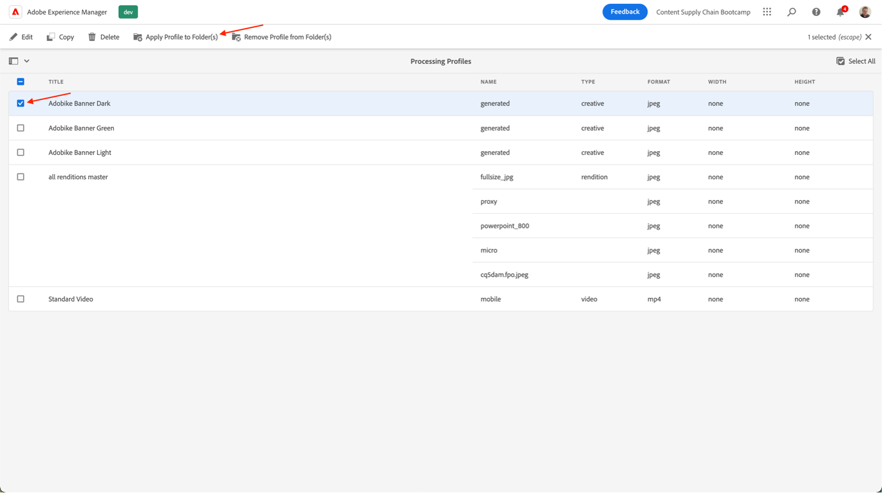
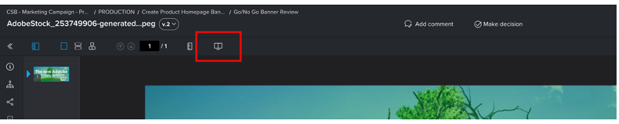

# Produkt-Homepage-Banner erstellen

## Erstellung des Banners

Durch die Automatisierung von Inhalten wird die Leistung von Adobe Creative Cloud auf Experience Manager Assets übertragen, sodass Marketing-Experten die Asset-Produktion skaliert automatisieren und so die Erstellung von Varianten erheblich beschleunigen können. Verwenden wir diese Funktionen, um ein Banner zu generieren, das auf der Homepage verwendet werden soll!

- Navigieren Sie zum AEM Autor auf [https://author-p105462-e991028.adobeaemcloud.com/](https://author-p105462-e991028.adobeaemcloud.com/) und melden Sie sich mit den angegebenen Anmeldedaten an.

- Navigieren Sie auf der Startseite zu Tools > Assets > Verarbeitungsprofile .

- Auf der Benutzeroberfläche werden alle vorhandenen Verarbeitungsprofile angezeigt. Diese können verwendet werden, um bestimmte Automatisierungen zu ermöglichen.

- Die folgenden sind für Sie von Interesse:
   - Adobe Banner Dark: erstellt ein AdobeBike-Banner mit einer dunklen Überlagerung basierend auf dem ausgewählten Asset.
      
   - Adobe Banner Light: erstellt ein AdobeBike-Banner mit einer Lichtüberlagerung, basierend auf dem ausgewählten Asset
      
   - Adobe Banner Green: erstellt ein AdobeBike-Banner mit einer grünen Überlagerung basierend auf dem ausgewählten Asset.
      

- Nachdem Sie den Bannertyp ausgewählt haben, den Sie erstellen möchten, wählen Sie dieses Verarbeitungsprofil und dann &quot;Profil auf Ordner anwenden&quot;.

- Navigieren Sie auf dem nächsten Bildschirm zum Ordner Ihres Teams in AEM Assets. Wählen Sie dann oben links die Schaltfläche &quot;Erstellen&quot; aus, um einen neuen Ordner zu erstellen und ihm einen aussagekräftigen Namen zu geben, z. B. &quot;Dark Banner erstellen&quot;.

- Markieren Sie nach der Erstellung des Ordners das Kästchen neben seinem Namen und klicken Sie dann oben rechts auf die Schaltfläche &quot;Anwenden&quot;.

Nachdem wir die erforderliche Konfiguration vorgenommen haben, erstellen wir unser Banner.

- Klicken Sie auf das AEM Logo oben links, um die Navigation zu öffnen, und navigieren Sie dann zu Navigation \> Assets \> Dateien .

- Suchen Sie den Ordner &quot;Generierte Adobe-Assets&quot;und öffnen Sie ihn durch Klicken auf die Karte. Hier werden die generierten Banner angezeigt.

- Öffnen Sie eine neue Registerkarte und navigieren Sie erneut zu AEM Assets. Navigieren Sie dann zu dem Ordner, auf den das Verarbeitungsprofil angewendet wurde.

- Laden Sie im Ordner das Bild hoch, für das Sie ein Banner erstellen möchten, indem Sie es in den Browser ziehen und dort ablegen oder oben rechts in der Benutzeroberfläche auf Dateien erstellen klicken.

- Warten Sie eine Minute, bis Ihr Asset verarbeitet wurde, und laden Sie dann den Bildschirm neu. Wenn Ihr Asset den Status &quot;Neu&quot;aufweist, wissen Sie, dass die Verarbeitung abgeschlossen ist.

- Navigieren Sie zurück zur vorherigen Registerkarte und laden Sie den Bildschirm auch hier neu. Sie sollten ein neues Asset im Status &quot;Neu&quot;bemerken. Dies ist unser generiertes Banner, alles aus dem DAM! Siehst du es noch nicht? Warten Sie noch eine Minute und laden Sie dann den Bildschirm neu.

>[!NOTE]
>
> Ist das Ergebnis nicht zufrieden? Sie können auch ein anderes Verarbeitungsprofil auf Ihren Ordner anwenden und Ihr Asset erneut hochladen, um ein anderes Banner zu generieren (oder natürlich ein anderes Asset hochladen). Während des Neuladens fragt das System Sie, was Sie mit dem vorhandenen Asset machen möchten, und wählen Sie &quot;Ersetzen&quot;.
> 

Jetzt haben wir unser generiertes Banner, das wir später bei der Bereitstellung unserer Kampagne verwenden können. Stellen Sie sicher, dass Sie das Banner veröffentlichen, indem Sie es auswählen und dann auf die Schaltfläche &quot;Quick Publish&quot;auf dem Band klicken.

## Folgemaßnahmen zu Workfront

Wenn Sie einen formellen und prüfbaren Review- und Genehmigungsprozess für Ihre Assets benötigen, ist Workfront der richtige Ort.

>[!NOTE]
>
> Obwohl wir dies hier ausdrücklich erwähnen, ist es beabsichtigt, die Aufgaben in Workfront zu aktualisieren, nachdem Sie sie abgeschlossen haben. Sie sollten immer nach einem Ablauf &quot;Erstellen&quot;> &quot;Überprüfen&quot;> &quot;Genehmigen&quot;streben.

- Gehen wir zurück zu unserem Projekt und erweitern Sie das Akkordeon &quot;Go/No Go Banner Review&quot;, um die Aufgabe zu öffnen, indem Sie darauf klicken:

- Klicken Sie in der linken Spalte auf den Bereich Dokumente der Aufgabe und dann auf den mit AEM Assets verknüpften Ordner &#39;Final&#39;. Wählen Sie unser Asset aus, indem Sie auf seine Zone klicken und auf &quot;Testversand erstellen&quot;klicken. Ein Beweis ist die Möglichkeit, Inhalte, z. B. Bild, Text, Video, Website usw., in strukturierter und kollaborativer Weise zu überprüfen, wobei Kommentare, Korrekturen, Änderungen der beteiligten Akteure erfasst werden, Versionen und Ergebnisse verglichen und durch einen Klick endgültig genehmigt werden können.

- Wählen Sie &quot;Erweiterter Testversand&quot;, da Sie einen detaillierten Validierungsprozess benötigen.

>[!NOTE]
>
> Wir werden manuell entscheiden, wer unseren Testversand in diesem Bootcamp überprüfen und/oder genehmigen wird. In den meisten realen Anwendungsfällen würden wir eine voreingestellte Vorlage für den/die Validierungsfluss(e) verwenden, die bereits für jeden Testversand-Typ definiert ist/sind.

- Standardmäßig befinden wir uns in einem Workflow-Typ &quot;Standard&quot; und wählen Ihren Workfront Bootcamp-Spezialisten als Reviewer &amp; Genehmiger aus. Geben Sie den Namen Ihres Bootcamp Workfront Specialist ein, in dem steht: Kontaktname oder E-Mail-Adresse, um einen Empfänger hinzuzufügen:

- Legen Sie sie als &quot;Reviewer &amp; Genehmiger&quot;fest:

- Klicken Sie auf &quot;Testversand erstellen&quot;. Workfront benötigt einen Moment, um den Testversand zu erzeugen:

- Ihr Workfront-Spezialist wird jetzt über eine neue Benachrichtigung informiert, dass er über einen Nachweis zur Überprüfung und/oder Genehmigung verfügt:

- Nachdem Sie auf die Benachrichtigung geklickt haben, wird Ihr Testversand angezeigt und kann einige Kommentare abgeben und/oder diesen Testversand validieren.

   - Wenn Anmerkungen vorhanden sind, können sie oben im Bildschirm auf &quot;Kommentar hinzufügen&quot;klicken:

   

   - Sie können dann nicht nur Kommentare hinzufügen, sondern auch die kleine Zeiger-Symbolleiste verwenden, um klar zu definieren, welcher Bereich geändert werden muss.

   

   - Durch Hinzufügen des Kommentars können Sie wissen, dass Sie zusätzliche Arbeit an einer neuen Version des Testversands benötigen. Aktualisieren Sie Ihren Workfront-Tab. Sie erhalten eine neue Benachrichtigung, die Sie darüber informiert. Sobald Sie wissen, welche Änderungen Sie vornehmen müssen, nehmen Sie Ihre Änderungen in AEM vor und laden Sie Ihre neue Version hier hoch:

   

   - Wählen Sie Ihr aktualisiertes Asset aus (wenn im Bootcamp-Szenario keine Änderungen erforderlich sind, laden Sie einfach dasselbe Asset erneut hoch) und klicken Sie auf &quot;Link&quot;:

   

   - Klicken Sie dann auf der rechten Seite auf &#39;Testversand erstellen&#39;.

   

   - Sobald der Testversand erstellt wurde (dies kann einige Augenblicke dauern), erhält Ihr Workfront-Spezialist eine Benachrichtigung und kann diese neue Version überprüfen und hoffentlich genehmigen.  Mithilfe der Schaltfläche zum Testversand-Vergleich können sie beispielsweise einen parallelen Vergleich von V1 und V2 mit allen Kommentaren sehen.

   

   

   

Wir haben jetzt eine formelle Genehmigung für die Verwendung unseres Banners. Es ist einfach zu folgen, wo wir uns im Prozess befinden, und die Updates, die Sie automatisch Trigger-Benachrichtigungen durchführen, damit Sie so effizient wie möglich arbeiten können.

Nächster Schritt: [Phase 2 - Produktion: Social Media-Anzeige erstellen](./social.md)

[Gehen Sie zurück zu Phase 1 - Planung: Sonstige Vorarbeiten](../planning/prework.md)

[Zu allen Modulen zurückkehren](../../overview.md)
