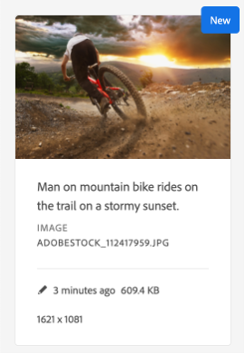
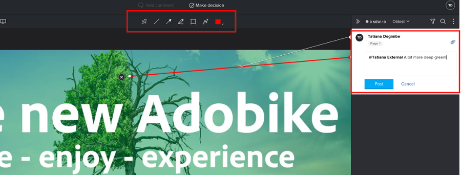

# Produkt-Homepage-Banner erstellen

## Produktion des Banners

Durch die Inhaltsautomatisierung profitiert Experience Manager Assets von der Leistungsfähigkeit von Adobe Creative Cloud. Marketing-Experten können die Asset-Produktion skaliert automatisieren, wodurch die Erstellung von Varianten erheblich beschleunigt wird. Verwenden wir diese Funktionen, um ein Banner zu generieren, das auf der Homepage verwendet werden kann!

- Gehen Sie zur AEM-Autoreninstanz auf [https://author-p105462-e991028.adobeaemcloud.com/](https://author-p105462-e991028.adobeaemcloud.com/) und melden Sie sich mit den von uns angegebenen Anmeldeinformationen an.

- Navigieren Sie auf der Startseite zu Tools \> Assets \> Verarbeitungsprofile.

- In der Benutzeroberfläche werden alle vorhandenen Verarbeitungsprofile angezeigt. Diese können verwendet werden, um bestimmte Automatisierungen zu ermöglichen.

- Die folgenden sind für Sie von Interesse:
   - Adobe Banner Dark: Erstellt ein Adobe Banner mit einer dunklen Überlagerung, basierend auf dem ausgewählten Asset
     
   - Adobe Banner Light: Erstellt ein Adobe Banner mit einer hellen Überlagerung, basierend auf dem ausgewählten Asset
     
   - Adobe Banner Green : Erstellt ein Adobe Banner mit einer grünen Überlagerung, basierend auf dem ausgewählten Asset
     

- Nachdem Sie den Bannertyp ausgewählt haben, den Sie erstellen möchten, wählen Sie dieses Verarbeitungsprofil aus und klicken Sie auf „Profil auf Ordner anwenden“.

- Navigieren Sie im nächsten Bildschirm zum Ordner Ihres Teams in AEM Assets. Wählen Sie dann oben links die Schaltfläche „Erstellen“, um einen neuen Ordner zu erstellen und ihm einen aussagekräftigen Namen zu geben, z. B. „Dunkles Banner erstellen“.

- Aktivieren Sie nach dem Erstellen des Ordners das Kontrollkästchen neben seinem Namen und klicken Sie dann oben rechts auf die Schaltfläche „Anwenden“.

Nachdem wir nun die erforderliche Konfiguration vorgenommen haben, generieren wir unser Banner.

- Klicken Sie oben links auf das AEM-Logo, um die Navigation zu öffnen, und gehen Sie dann zu Navigation \> Assets \> Dateien.

- Suchen Sie den Ordner „Generated AdobeBike Assets&quot; und öffnen Sie ihn durch Klicken auf die Karte. Hier werden die generierten Banner angezeigt.

- Öffnen Sie eine neue Registerkarte und navigieren Sie erneut zu AEM Assets. Navigieren Sie dann zu dem Ordner, auf den wir das Verarbeitungsprofil angewendet haben.

- Laden Sie im Ordner das Bild hoch, für das Sie ein Banner erstellen möchten, indem Sie es entweder per Drag-and-Drop in Ihren Browser ziehen oder indem Sie oben rechts in der Benutzeroberfläche auf Erstellen > Dateien klicken.

- Warten Sie eine Minute, bis das Asset verarbeitet wurde, und laden Sie dann Ihren Bildschirm neu. Wenn Ihr Asset im Status „Neu“ angezeigt wird, wissen Sie, dass die Verarbeitung abgeschlossen ist.

- Navigieren Sie zurück zur vorherigen Registerkarte und laden Sie auch hier den Bildschirm neu. Beachten Sie ein neues Asset im Status „Neu“. Dies ist unser generiertes Banner, alles aus dem DAM! Siehst du es noch nicht? Warten Sie noch eine Minute und laden Sie dann Ihren Bildschirm neu.

>[!NOTE]
>
> Nicht zufrieden mit dem Ergebnis? Sie können auch ein anderes Verarbeitungsprofil auf Ihren Ordner anwenden und Ihr Asset erneut hochladen, um ein anderes Banner zu generieren (oder natürlich ein anderes Asset hochladen). Während des erneuten Uploads fragt das System Sie, was Sie mit dem vorhandenen Asset tun möchten, wählen Sie „Ersetzen“.
> 

Wir haben jetzt unser generiertes Banner, das wir später während des Versands unserer Kampagne verwenden können. Veröffentlichen Sie unbedingt das Banner, indem Sie es auswählen und dann auf der Multifunktionsleiste auf die Schaltfläche „Quick Publish&quot; klicken.

## Folgemaßnahmen in Workfront

Wenn Sie einen formellen und überprüfbaren Prüfungs- und Genehmigungsprozess für Ihre Assets benötigen, ist Workfront der richtige Ort dafür.

>[!NOTE]
>
> Obwohl wir es hier explizit erwähnen, ist es beabsichtigt, die Aufgaben in Workfront zu aktualisieren, nachdem Sie sie abgeschlossen haben. Sie sollten immer nach einem Fluss vom Typ Erstellen > Überprüfen > Genehmigen streben.

- Gehen wir zurück zu unserem Projekt und erweitern das Akkordeon „Go/No Go Banner Review“, um die genannte Aufgabe durch Klicken zu öffnen:

- Klicken Sie auf den Abschnitt Dokumente der Aufgabe (linke Spalte) und dann auf den verknüpften AEM Assets-Ordner „Endgültig“. Wählen Sie Ihr Asset aus, indem Sie auf seine Zone und dann auf „Korrekturabzug erstellen“ klicken. Ein Korrekturabzug ist die Möglichkeit, Inhalte, wie z. B. Bilder, Texte, Videos, Websites usw., strukturiert und kollaborativ zu prüfen, wobei Kommentare, Korrekturen, Änderungen der beteiligten Stakeholder erfasst, Versionen und Ergebnisse verglichen und mit einem Klick endgültig genehmigt werden können.

- Wählen Sie „Erweiterter Korrekturabzug“ aus, da wir einen aufwändigen Genehmigungsprozess benötigen.

>[!NOTE]
>
> Wir werden manuell entscheiden, wer unseren Testversand in diesem Bootcamp überprüfen und/oder genehmigen wird. In den meisten realen Anwendungsfällen würden wir eine vordefinierte Vorlage von Genehmigungsflüssen verwenden, die bereits für jeden Testversand-Typ definiert ist bzw. sind.

- Standardmäßig haben wir den Workflow-Typ „Standard“ und wählen Ihren Workfront Bootcamp-Spezialisten als Prüfer und Genehmiger aus. Geben Sie den Namen Ihres Bootcamp Workfront-Spezialisten ein, der lautet: „Kontaktnamen oder E-Mail-Adresse eingeben, um einen Empfänger hinzuzufügen:

- Legen Sie sie als „Prüfende Person und genehmigende Person“ fest:

- Klicken Sie auf „Korrekturabzug erstellen“. Workfront benötigt einige Minuten, um den Testversand zu generieren:

- Ihr Workfront-Spezialist erhält jetzt eine neue Benachrichtigung, die ihn darüber informiert, dass er einen Korrekturabzug zur Überprüfung und/oder Genehmigung hat:

- Nachdem er auf die Benachrichtigung geklickt hat, wird er mit Ihrem Korrekturabzug konfrontiert und kann einige Kommentare abgeben und/oder diesen Korrekturabzug genehmigen.

   - Er kann auf „Kommentar hinzufügen“ oben auf dem Bildschirm klicken, wenn er Anmerkungen hat:

  

   - Sie können dann nicht nur Kommentare hinzufügen, sondern auch die kleine Zeiger-Symbolleiste verwenden, um klar zu definieren, welcher Bereich geändert werden muss.

  

   - Durch Hinzufügen des Kommentars können Sie darüber informiert werden, dass Sie an einer neuen Version des Korrekturabzugs zusätzliche Arbeit leisten müssen. Aktualisieren Sie Ihre Registerkarte Workfront . Sie erhalten eine neue Benachrichtigung, die Sie genau darüber informiert. Sobald Sie wissen, welche Änderungen Sie vornehmen müssen, nehmen Sie Ihre Änderungen in AEM vor und laden Sie dann Ihre neue Version hier hoch:

  

   - Wählen Sie Ihr aktualisiertes Asset aus (wenn im Bootcamp-Szenario keine Änderungen erforderlich sind, laden Sie dasselbe Asset erneut hoch) und klicken Sie auf „Link“:

  

   - Klicken Sie dann auf der rechten Seite auf „Korrekturabzug erstellen“.

  

   - Sobald der Korrekturabzug erstellt wurde (dies kann einige Augenblicke dauern), erhält Ihr Workfront-Spezialist eine Benachrichtigung und kann diese neue Version überprüfen und hoffentlich genehmigen.  Beispielsweise können sie mithilfe der Schaltfläche für den Korrekturabzug-Vergleich einen direkten Vergleich von V1 und V2 mit allen vorgenommenen Kommentaren sehen.

  

  

  

Wir haben jetzt eine formelle Genehmigung für die Verwendung unseres Banners. Es ist einfach zu verfolgen, wo wir uns befinden, und die Updates, die Sie vornehmen, führen automatisch zu einem Trigger von Benachrichtigungen, sodass Sie so effizient wie möglich arbeiten können.

Nächster Schritt: [Phase 2 - Produktion: Social-Media-Anzeige erstellen](./social.md)

[Zurück zu Phase 1 - Planung: Sonstige Vorarbeiten](../planning/prework.md)

[Zurück zu „Alle Module“](../../overview.md)
