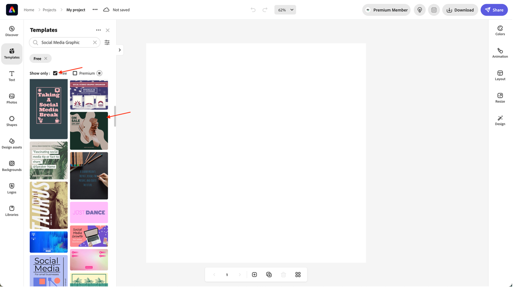
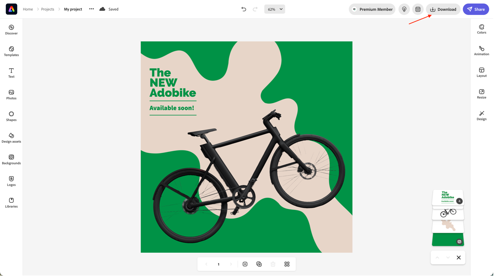

# Social-Media-Anzeige erstellen

Unabhängig davon, ob Sie als Unternehmen versuchen, Ihre Zielgruppe zu erreichen, oder ob Sie nur eine Einzelperson sind, die Ihre Stimmung teilt, kann Adobe Express Ihnen dabei helfen, beeindruckende Social-Media-Bilder für jede Plattform zu erstellen. Wenn Ihnen die Ideen fehlen, dann erkunden Sie die Vorlagenbibliothek, um Ihre Kreativität zu fördern. Adobe Express enthält Tausende von professionell gestalteten Social-Media-Grafiken wie die folgenden Beispiele sowie kostenlose Bilder, Symbole und Grafiken, die Sie per Drag-and-Drop direkt auf Ihr Design ziehen können.

- Navigieren Sie zum [Adobe Expreß ](https://www.adobe.com/express/create/social-media-graphic) und klicken Sie auf die Schaltfläche „Jetzt eine Social-Media-Grafik erstellen“, um zu beginnen.

- Wenn Sie Adobe Expreß zum ersten Mal verwenden, klicken Sie im Popup-Fenster, um zu beginnen, auf die Schaltfläche „Zustimmen, um fortzufahren“.

- Aktivieren Sie in der Seitenleiste auf der linken Seite das Kästchen „Frei“, um einen Überblick über die kostenlosen Vorlagen des Adobe Expresses zu erhalten. Wählen Sie dann den Grafiktyp aus, den Sie mit Ihrem Team festgelegt haben. In unserem Fall erstellen wir einen Instagram-Beitrag. Klicken Sie einfach auf die Vorlage, die Sie in den Editor laden möchten.

- Sobald Sie mit Ihrem Beitrag zufrieden sind, klicken Sie auf die Schaltfläche „Herunterladen“ oben rechts, um Ihren Social-Media-Beitrag in Ihrem bevorzugten Format herunterzuladen. Bewahren Sie es an einem sicheren Ort auf, wir werden es später brauchen!

>[!NOTE]
>
>**Wussten Sie schon?**\
>Adobe Expreß entwickelt sich immer weiter, so wie alle unsere Produkte bei Adobe. Deshalb freuen wir uns sehr, die bevorstehende Integration zwischen Adobe Express und AEM Assets bekannt geben zu können. Auf diese Weise können Sie die Assets Ihrer Marke im Adobe Expreß verwenden und das Ergebnis direkt im Adobe Expreß speichern.

Nächster Schritt: [Phase 2 - Produktion: Erstellen von Mobile-App-Inhalten](./app.md)

[Zurück zu Phase 2 - Produktion: Produkt-Homepage-Banner erstellen](./banner.md)

[Zurück zu „Alle Module“](../../overview.md)
