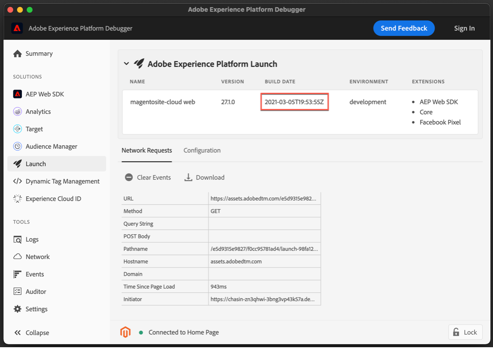

# Implementieren der Zustimmung mit einer Zustimmungsverwaltungsplattform (CMP) mithilfe der Platform Web SDK-Erweiterung

Viele gesetzliche Datenschutzbestimmungen haben Anforderungen an die aktive und spezifische Einwilligung in Bezug auf Datenerfassung, Personalisierung und andere Marketing-Anwendungsfälle eingeführt. Um diese Anforderungen zu erfüllen, können Sie mit Adobe Experience Platform Einwilligungsinformationen in einzelnen Kundenprofilen erfassen und diese Voreinstellungen als entscheidenden Faktor dafür verwenden, wie die Daten der einzelnen Kunden in nachgelagerten Platform-Workflows verwendet werden.

>[!NOTE]
>
>Adobe Experience Platform Launch wird als eine Suite von Datenerfassungstechnologien in Adobe Experience Platform integriert. In der Benutzeroberfläche wurden verschiedene terminologische Änderungen eingeführt, die Sie bei der Verwendung dieses Inhalts beachten sollten:
>
> * platform launch (Client-seitig) ist jetzt **[[!DNL tags]](https://experienceleague.adobe.com/docs/experience-platform/tags/home.html?lang=de)**
> * platform launch Server Side ist jetzt **[[!DNL event forwarding]](https://experienceleague.adobe.com/docs/experience-platform/tags/event-forwarding/overview.html)**
> * Edge-Konfigurationen sind jetzt verfügbar **[[!DNL datastreams]](https://experienceleague.adobe.com/docs/experience-platform/edge/fundamentals/datastreams.html?lang=de)**

In diesem Tutorial erfahren Sie, wie Sie mithilfe der Platform Web SDK-Erweiterung in der Datenerfassung Einwilligungsdaten implementieren und aktivieren, die von einer Consent Management Platform (CMP) erhalten wurden. Dazu verwenden wir sowohl die Adobe-Standards als auch den IAB TCF 2.0-Zustimmungsstandard, wobei OneTrust oder SourcePoint als Beispiel-CMPs verwendet wird.

In diesem Tutorial wird die Platform Web SDK-Erweiterung verwendet, um Zustimmungsdaten an Platform zu senden. Einen Überblick über das Web SDK finden Sie unter [diese Seite](https://experienceleague.adobe.com/docs/experience-platform/edge/home.html?lang=de).

## Voraussetzungen

Die Voraussetzungen für die Verwendung des Web SDK werden aufgelistet [here](https://experienceleague.adobe.com/docs/experience-platform/edge/fundamentals/prerequisite.html#fundamentals).

Auf dieser Seite ist ein &quot;Ereignis-Datensatz&quot;erforderlich. Genau wie es sich anhört, ist dies ein Datensatz, in dem Ihre Erlebnisereignisdaten gespeichert werden. Um Einverständnisinformationen mit Ereignissen zu senden, muss die [IAB TCF 2.0-Einverständnisdetails](https://experienceleague.adobe.com/docs/experience-platform/landing/governance-privacy-security/consent/iab/dataset.html) -Feldergruppe zu Ihrem Erlebnisereignis-Schema hinzugefügt werden:


Für den Platform-Zustimmungsstandard v2.0 benötigen wir außerdem Zugriff auf Adobe Experience Platform, um ein Schema und einen Datensatz für individuelle XDM-Profile zu erstellen. Eine Anleitung zur Schemaerstellung finden Sie unter [Erstellen eines Schemas mit dem Schema Editor](https://experienceleague.adobe.com/docs/experience-platform/xdm/tutorials/create-schema-ui.html#tutorials) und für die erforderliche Feldergruppe &quot;Einverständniserklärung und Voreinstellungsdetails&quot;siehe [Datensatz konfigurieren, um Einwilligungs- und Voreinstellungsdaten zu erfassen](https://experienceleague.adobe.com/docs/experience-platform/landing/governance-privacy-security/consent/adobe/dataset.html).

In diesem Tutorial wird davon ausgegangen, dass Sie Zugriff auf die Datenerfassung haben und eine clientseitige Tags-Eigenschaft mit installierter Web SDK-Erweiterung und einer für die Entwicklung erstellten und erstellten Arbeitsbibliothek erstellt haben. Diese Themen werden in diesen Dokumenten ausführlich beschrieben:

* [Erstellen und Konfigurieren von Eigenschaften](https://experienceleague.adobe.com/docs/experience-platform/tags/admin/companies-and-properties.html?lang=en#create-or-configure-a-property)
* [Übersicht über Bibliotheken](https://experienceleague.adobe.com/docs/experience-platform/tags/publish/libraries.html?lang=de)
* [Veröffentlichungsübersicht](https://experienceleague.adobe.com/docs/experience-platform/tags/publish/overview.html?lang=de)

Wir werden auch die [Platform Debugger](https://chrome.google.com/webstore/detail/adobe-experience-platform/bfnnokhpnncpkdmbokanobigaccjkpob) Chrome-Erweiterung zur Überprüfung und Validierung unserer Implementierung.

Um das IAB TCF-Beispiel mit einer CMP auf Ihrer eigenen Site zu implementieren, benötigen Sie Zugriff auf eine CMP wie OneTrust oder SourcePoint, um die von ihnen bereitgestellten Daten zu generieren. Alternativ können Sie hier einfach folgen und die Ergebnisse unten anzeigen.

## Verwenden des Web SDK mit der Adobe Consent Standard (v1.0 oder v2.0)

>[!NOTE]
>
>Der 1.0-Standard wird schrittweise zugunsten von v2.0 eingestellt. Mit dem 2.0-Standard können Sie zusätzliche Zustimmungsdaten hinzufügen, die verwendet werden können, um Zustimmungsvoreinstellungen manuell zu erzwingen. Die Screenshots unten der Platform Web SDK-Erweiterung stammen aus der Version [2,4,0](https://experienceleague.adobe.com/docs/experience-platform/edge/release-notes.html#version-2.4.0) der Erweiterung, die mit Version 1.0 oder v2.0 der Adobe Consent Standard kompatibel ist.

Weitere Informationen zu diesen Standards finden Sie unter [Unterstützen von Zustimmungsvoreinstellungen von Kunden](https://experienceleague.adobe.com/docs/experience-platform/edge/consent/supporting-consent.html).

### Schritt 1: Konfigurieren der Zustimmung in der Web SDK-Erweiterung

Nachdem wir die Platform Web SDK-Erweiterung in einer Tags-Eigenschaft installiert haben, können wir die Optionen für die Adressierung von Zustimmungsdaten auf dem Bildschirm für die Erweiterungskonfiguration konfigurieren:


Im Abschnitt &quot;Datenschutz&quot;wird die Zustimmungsstufe für das SDK festgelegt, wenn der Benutzer zuvor keine Zustimmungseinstellungen angegeben hat. Dadurch wird der Standardstatus für die Einwilligung und die Ereignisdatenerfassung im SDK festgelegt. Die ausgewählte Einstellung beantwortet die Frage &quot;Was sollte das SDK tun, wenn der Benutzer noch keine expliziten Zustimmungsvoreinstellungen angegeben hat?&quot;

* In - Erfasst Ereignisse, die auftreten, bevor der Benutzer Zustimmungsvoreinstellungen bereitstellt.
* Out - Drop-Ereignisse, die auftreten, bevor der Benutzer Zustimmungsvoreinstellungen bereitstellt.
* Ausstehend - Queue-Ereignisse, die auftreten, bevor der Benutzer Zustimmungsvoreinstellungen bereitstellt.
* Wird vom Datenelement bereitgestellt

Wenn die standardmäßige Zustimmungseinstellung &quot;In&quot;lautet, teilt dies dem SDK mit, dass es nicht auf die ausdrückliche Zustimmung warten sollte und die Ereignisse erfassen sollte, die auftreten, bevor der Benutzer Zustimmungsvoreinstellungen bereitstellt. Diese Voreinstellungen werden normalerweise in einer CMP verarbeitet und gespeichert.

Wenn die standardmäßige Zustimmungseinstellung &quot;Out&quot;lautet, teilt dies dem SDK mit, dass keine Ereignisse erfasst werden sollen, die vor dem Festlegen der Benutzeranmeldeeinstellungen auftreten. Besucheraktivitäten, die vor dem Festlegen der Zustimmungsvoreinstellung auftreten, werden nicht in Daten aufgenommen, die vom SDK gesendet werden, nachdem die Einwilligung festgelegt wurde. Wenn Sie beispielsweise einen Bildlauf durchführen und eine Webseite anzeigen, bevor Sie das Einwilligungsbanner auswählen, und diese Einstellung &quot;Out&quot;verwendet wird, werden diese Bildlaufaktivität und Anzeigezeit nicht gesendet, wenn der Benutzer später seine ausdrückliche Einwilligung zur Datenerfassung erteilt.

Wenn die standardmäßige Zustimmungseinstellung &quot;Ausstehend&quot;lautet, stellt das SDK alle Ereignisse in die Warteschlange, die auftreten, bevor der Benutzer Zustimmungsvoreinstellungen bereitstellt. Daher können die Ereignisse gesendet werden, nachdem Zustimmungsvoreinstellungen festgelegt wurden und nachdem das SDK während eines Besuchs anfänglich konfiguriert wurde.

Mit dieser Einstellung &quot;Ausstehend&quot;führt der Versuch, Befehle auszuführen, die Benutzeranmeldeeinstellungen erfordern (z. B. den Ereignisbefehl), dazu, dass der Befehl innerhalb des SDK in die Warteschlange gestellt wird. Diese Befehle werden erst verarbeitet, nachdem Sie die Nutzeranmeldeeinstellungen an das SDK übermittelt haben.

Sobald eine CMP die Voreinstellungen des Benutzers erfasst, können wir diese Voreinstellungen dem SDK mitteilen. In einem späteren Abschnitt unten erfahren Sie, wie Sie diese Opt-in-Daten abrufen und mit der Web SDK-Erweiterung verwenden können.

Mit &quot;Wird durch Datenelement bereitgestellt&quot;können wir auf ein Datenelement zugreifen, das alle Einwilligungsvoreinstellungsdaten enthält, die von benutzerdefiniertem Code oder einer CMP auf Ihrer Site oder in Ihrer Datenschicht erfasst werden. Ein zu diesem Zweck verwendetes Datenelement sollte in &quot;in&quot;, &quot;out&quot;oder &quot;ausstehend&quot;aufgelöst werden.

Bitte beachten Sie: Diese Konfigurationseinstellung für das SDK wird nicht in Benutzerprofilen beibehalten. Sie ist spezifisch für das Festlegen des Verhaltens des SDK, bevor explizite Zustimmungsvoreinstellungen vom Besucher bereitgestellt werden.

Weitere Informationen zum Konfigurieren der Web SDK-Erweiterung finden Sie unter [Übersicht über die Platform Web SDK-Erweiterung](https://experienceleague.adobe.com/docs/experience-platform/edge/extension/web-sdk-extension-configuration.html?lang=en#configure-the-extension) und [Unterstützen von Zustimmungsvoreinstellungen von Kunden](https://experienceleague.adobe.com/docs/experience-platform/edge/consent/supporting-consent.html).

Wählen Sie für dieses Beispiel die Option &quot;Ausstehend&quot;aus und wählen Sie **Speichern** um unsere Konfigurationseinstellungen zu speichern.

### Schritt 2: Voreinstellungen für die Übermittlung

Nachdem wir nun das Standardverhalten des SDK festgelegt haben, können wir Tags verwenden, um die expliziten Zustimmungsvoreinstellungen eines Besuchers an Platform zu senden. Das Senden von Einwilligungsdaten mit dem Adobe 1.0- oder 2.0-Standard ist einfach mithilfe der `setConsent` Aktion des Web SDK in Ihren Tag-Regeln.

#### Festlegen der Zustimmung mit Platform Consent Standard 1.0

Erstellen wir eine Regel, um dies zu demonstrieren. Wählen Sie in Ihrer Platform-Tag-Eigenschaft Regeln und dann die blaue Schaltfläche Regeln hinzufügen aus. Benennen wir die Regel &quot;setAdobeConsent&quot;und wählen Sie aus, um ein Ereignis hinzuzufügen. Wählen Sie für den Ereignistyp &quot;Fenster geladen&quot;aus, wodurch diese Regel beim Laden einer Seite auf unserer Website Trigger wird. Wählen Sie anschließend unter &quot;Aktionen&quot;die Option &quot;Hinzufügen&quot;aus, um den Bildschirm für die Aktionskonfiguration zu öffnen. Hier legen wir die Einwilligungsdaten fest. Wählen Sie das Dropdown-Menü &quot;Erweiterung&quot;und dann &quot;Plattform-Web-SDK&quot;, wählen Sie dann den Aktionstyp und wählen Sie &quot;Einverständnis festlegen&quot;.

Wählen Sie unter &quot;Einverständnisinformationen&quot;die Option &quot;Formular ausfüllen&quot;. In dieser Regelaktion verwenden wir das Web SDK, um die Zustimmung für den Zustimmungsstandard der Adobe 1.0 festzulegen, indem wir das angezeigte Formular ausfüllen:


Wir können &quot;In&quot;, &quot;Out&quot;oder &quot;Provided by data element&quot;mit dieser Aktion &quot;Set Consent&quot;übergeben. Ein Datenelement sollte hier in &quot;in&quot;oder &quot;out&quot;aufgelöst werden.

In diesem Beispiel wählen wir &quot;In&quot;aus, um anzugeben, dass der Besucher zugestimmt hat, dem Web SDK zu erlauben, Daten an Platform zu senden. Wählen Sie die blaue Schaltfläche &quot;Änderungen beibehalten&quot;, um diese Aktion zu speichern, und dann &quot;Speichern&quot;, um diese Regel zu speichern.

Hinweis: Nachdem sich ein Besucher der Website abgemeldet hat, ist es im SDK nicht möglich, die Zustimmung der Benutzer auf einzustellen.

Ihre Tag-Regeln können durch eine Vielzahl integrierter oder benutzerdefinierter [events](https://experienceleague.adobe.com/docs/experience-platform/tags/extensions/adobe/core/overview.html) die verwendet werden kann, um diese Zustimmungsdaten zum richtigen Zeitpunkt während einer Besuchersitzung zu übergeben. Im obigen Beispiel haben wir das Ereignis &quot;window loaded&quot;verwendet, um die Regel Trigger. In einem späteren Abschnitt verwenden wir ein Zustimmungsvoreinstellungsereignis von einer CMP, um eine Einwilligungsaktion festlegen Trigger. Sie können die Aktion &quot;Einverständniserklärung festlegen&quot;in einer Regel verwenden, die von einem von Ihnen bevorzugten Ereignis ausgelöst wird, das eine Opt-in-Voreinstellung angibt.

#### Festlegen der Zustimmung mit Platform Consent Standard 2.0

Version 2.0 des Platform-Zustimmungsstandards funktioniert mit [XDM](https://experienceleague.adobe.com/docs/platform-learn/tutorials/schemas/schemas-and-experience-data-model.html?lang=de) Daten. Dazu müssen Sie auch die Feldergruppe &quot;Consent and Preference Details&quot;zu Ihrem Profilschema in Platform hinzufügen. Siehe [Verarbeitung der Zustimmung in Platform](https://experienceleague.adobe.com/docs/experience-platform/landing/governance-privacy-security/consent/adobe/overview.html) für weitere Informationen zur Adobe Standard Version 2.0 und dieser Feldergruppe.

Wir erstellen ein Datenelement für benutzerdefinierten Code, um Daten an die Eigenschaften &quot;collect&quot;und &quot;metadata&quot;des Zustimmungsobjekts zu übergeben, das im unten stehenden Schema angezeigt wird:


Diese Feldergruppe &quot;Einwilligungen und Voreinstellungsdetails&quot;enthält Felder für die [XDM-Datentyp für Einwilligungen und Voreinstellungen](https://experienceleague.adobe.com/docs/experience-platform/xdm/data-types/consents.html#prerequisites) die die Einwilligungsvoreinstellungsdaten enthalten, die wir mit der Platform Web SDK-Erweiterung in unserer Regelaktion an Platform senden. Derzeit sind die einzigen erforderlichen Eigenschaften zur Implementierung von Platform Consent Standard 2.0 der Erfassungswert (val) und der Metadaten-Zeitwert, der oben in Rot hervorgehoben ist.

Erstellen wir ein Datenelement für diese Daten. Wählen Sie Datenelemente und die blaue Schaltfläche Datenelement hinzufügen aus. Nennen wir dies &quot;xdm-consent 2.0&quot;. Mit der Haupterweiterung wählen wir einen Typ &quot;Benutzerspezifischer Code&quot;. Sie können die folgenden Daten in das Fenster des Editors für benutzerdefinierten Code eingeben oder kopieren und einfügen:

```js
var dateString = new Date().toISOString();

return {
  collect: {
    val: "y"
  },
  metadata: {
    time: dateString
  }
}
```

Im Zeitfeld sollte angegeben werden, wann der Benutzer seine Zustimmungseinstellungen zuletzt aktualisiert hat. Wir erstellen hier einen Zeitstempel als Beispiel mit einer Standardmethode für das JavaScript-Datumsobjekt. Wählen Sie Speichern aus, um den benutzerdefinierten Code zu speichern, und wählen Sie erneut Speichern aus, um das Datenelement zu speichern.

Wählen Sie anschließend Regeln aus und geben Sie dann die blaue Schaltfläche Regel hinzufügen den Namen &quot;setConsent onLoad - Consent 2.0&quot;ein. Wählen Sie als Trigger &quot;Fenster geladen&quot;und dann unter &quot;Aktionen&quot;die Option Hinzufügen aus. Wählen Sie die Platform Web SDK-Erweiterung und wählen Sie für Aktionstyp die Option Einverständnis festlegen. Der Standard sollte Adobe sein und die Version 2.0. Für Wert verwenden wir das soeben erstellte Datenelement, das die erfassten Werte und Zeitwerte enthält, die wir an Platform senden müssen:


Um diese Beispielaktion zu überprüfen, rufen wir &quot;Set Consent&quot;über die Platform Web SDK-Erweiterung auf und übergeben den Standard und die Version aus dem Formular, während die Werte für &quot;collect&quot;und &quot;time&quot;aus dem zuvor erstellten Datenelement übergeben werden.

Wählen Sie die blaue Schaltfläche Speichern aus und speichern Sie die Regel erneut.

Jetzt haben wir zwei Regeln, eine für jeden Platform-Standards für die Zustimmung. In der Praxis werden Sie wahrscheinlich einen Standard für Ihre Site(s) wählen. Als Nächstes erstellen wir ein Beispiel mit dem IAB TCF 2.0-Zustimmungsstandard.

## Verwenden des Web SDK mit dem IAB TCF 2.0 Consent Standard

Weitere Informationen über Version 2.0 des IAB Transparency and Consent Framework finden Sie unter [IAB Europe-Website](https://iabeurope.eu/transparency-consent-framework/).

Um die Einwilligungsvoreinstellungsdaten mithilfe dieses Standards festzulegen, müssen wir die IAB TCF 2.0-Schemafeldgruppe Einverständnisdetails zu unserem Experience Event-Schema in Platform hinzufügen:


Diese Feldergruppe enthält die Einwilligungsvoreinstellungsfelder, die vom IAB TCF 2.0-Standard benötigt werden. Weitere Informationen zu Schemas und Feldergruppen finden Sie im Abschnitt [XDM-Systemübersicht](https://experienceleague.adobe.com/docs/experience-platform/xdm/home.html?lang=de).

### Schritt 1: Einverständnisdatenelement erstellen

Um Einwilligungsereignisdaten von Tags mithilfe des IAB TCF 2.0-Zustimmungsstandards zu senden, richten wir zunächst ein xdm-Datenelement mit den erforderlichen Einwilligungsfeldern ein:


Wählen Sie in der clientseitigen Eigenschaft Ihrer Tags Datenelemente und die blaue Schaltfläche &quot;Datenelement hinzufügen&quot;aus. Wir nennen dieses Datenelement &quot;xdm-consentStrings&quot; für dieses Beispiel. Diese xdm-Felder enthalten die für den IAB TCF 2.0-Standard erforderlichen Benutzerzustimmungsdaten.

Wählen Sie im Dropdown-Menü Erweiterung die Option &quot;Platform Web SDK&quot;und wählen Sie für Datenelementtyp &quot;XDM Object&quot;. Der xdm-Mapper sollte angezeigt werden, sodass Sie das Element &quot;consentStrings&quot;auswählen und erweitern können, wie im Screenshot oben gezeigt.

Wir legen jeden der consentStrings wie folgt fest:

* **`consentStandard`**:  `IAB TCF`
* **`consentStandardVersion`**:  `2.0`
* **`consentStringValue`**:  `%IAB TCF Consent String%`
* **`containsPersonalData`**:  `False` (über die Schaltfläche Wert auswählen ausgewählt)
* **`gdprApplies`**:  `%IAB TCF Consent GDPR%`

Die `consentStandard` und `consentStandardVersion` -Felder sind beides nur Textzeichenfolgen für den Standard, den wir verwenden, nämlich IAB TCF Version 2.0. Die `consentStringValue` referenziert ein Datenelement mit dem Namen &quot;IAB TCF Consent String&quot;. Die Prozentzeichen um den Text zeigen den Namen eines Datenelements an, und wir werden uns das gleich ansehen. Die `containsPersonalData` gibt an, ob die IAB TCF 2.0-Zustimmungszeichenfolge personenbezogene Daten mit &quot;True&quot;oder &quot;False&quot;enthält. Die `gdprApplies` gibt entweder &quot;true&quot;für die DSGVO an, &quot;false&quot;für die DSGVO gilt nicht, oder &quot;undefined&quot;für unbekannt, ob die DSGVO zutrifft. Derzeit behandelt das Web SDK &quot;undefined&quot;als &quot;true&quot;. Daher werden Einwilligungsdaten, die mit &quot;gdprApplies&quot;gesendet werden, wie folgt behandelt: undefined&quot;so behandelt, als befinde sich der Besucher in einem Gebiet, in dem die DSGVO gilt.

Siehe [Einverständnisdokumentation](https://experienceleague.adobe.com/docs/experience-platform/edge/consent/iab-tcf/with-launch.html#getting-started) Weitere Informationen zu diesen Eigenschaften und zu IAB TCF 2.0 in Tags.

### Schritt 2: Erstellen einer Regel zum Festlegen der Zustimmung mit dem IAB TCF 2.0-Standard

Als Nächstes erstellen wir eine Regel, die die Zustimmung mit dem Web SDK festlegt, wenn Einwilligungsdaten für diesen Standard von einem Website-Besucher festgelegt oder geändert werden. In dieser Regel werden wir auch sehen, wie wir diese Zustimmungsänderungen von einem CMP wie [OneTrust](https://www.onetrust.com/products/cookie-consent/) oder [Sourcepoint](https://www.sourcepoint.com/cmp/).

#### Hinzufügen eines Regelereignisses

Wählen Sie den Abschnitt Regeln in Ihrer Platform-Tag-Eigenschaft und dann die blaue Schaltfläche Regel hinzufügen aus. Benennen wir die Regel setConsent - IAB und wählen Sie Hinzufügen unter Ereignisse aus. Benennen wir dieses Ereignis tcfapi addEventListener und wählen Sie Editor öffnen aus, um den Editor für benutzerdefinierten Code zu öffnen.

Kopieren Sie den folgenden Code und fügen Sie ihn in das Editor-Fenster ein:

```js
// Wait for window.__tcfapi to be defined, then trigger when the customer has completed their consent and preferences.
function addEventListener() {
  if (window.__tcfapi) {
    window.__tcfapi("addEventListener", 2, function (tcData, success) {
      if (success && (tcData.eventStatus === "useractioncomplete" || tcData.eventStatus === "tcloaded")) {
        // save the tcData.tcString properties in data elements
        _satellite.setVar("IAB TCF Consent String", tcData.tcString);
        _satellite.setVar("IAB TCF Consent GDPR", tcData.gdprApplies);
        trigger();
      }
    });
  } else {
    // window.__tcfapi wasn't defined. Check again in 100 milliseconds
    setTimeout(addEventListener, 100);
  }
}
addEventListener();
```

Dieser Code erstellt und führt einfach eine Funktion mit dem Namen `addEventListener`. Die Funktion prüft, ob die `window.__tcfapi` -Objekt vorhanden ist und wenn dies der Fall ist, wird ein Ereignis-Listener gemäß den Spezifikationen der API hinzugefügt. Weitere Informationen zu diesen Spezifikationen finden Sie im Abschnitt [IAB-Repo](https://github.com/InteractiveAdvertisingBureau/GDPR-Transparency-and-Consent-Framework) auf GitHub. Wenn dieser Ereignis-Listener erfolgreich hinzugefügt wurde und der Website-Besucher seine Zustimmungs- und Voreinstellungsoptionen abgeschlossen hat, setzt der Code benutzerdefinierte Variablen für die Tags `tcData.tcString`und den Indikator für die DSGVO-Regionen. Weitere Informationen zum IAB TCF finden Sie im IAB-Handbuch. [website](https://iabeurope.eu/transparency-consent-framework/) und [GitHub-Repository](https://github.com/InteractiveAdvertisingBureau/GDPR-Transparency-and-Consent-Framework) für technische Details. Nachdem Sie diese Werte festgelegt haben, führt der Code die Trigger-Funktion aus, die diese Regel zum Ausführen Trigger.

Wenn die Variable `window.__tcfapi` -Objekt nicht vorhanden war, wenn diese Funktion zum ersten Mal ausgeführt wurde, prüft die Funktion alle 100 Millisekunden erneut, ob es erneut vorhanden ist, sodass der Ereignis-Listener hinzugefügt werden kann. Die letzte Codezeile führt einfach die `addEventListener` -Funktion, die in den Codezeilen darüber definiert ist.

Zusammenfassend haben wir eine Funktion erstellt, mit der der Status der Zustimmung überprüft wird, die ein Website-Besucher mithilfe eines CMP- (oder benutzerdefinierten) Zustimmungsbanners einstellt. Wenn diese Zustimmungsvoreinstellung festgelegt ist, erstellt dieser Code zwei benutzerdefinierte Variablen (Datenelemente für benutzerdefinierten Code), die wir in unserer Regelaktion verwenden können. Nachdem Sie den obigen Code in das Fenster des benutzerdefinierten Code-Editors unseres Ereignisses eingefügt haben, wählen Sie die blaue Schaltfläche Speichern aus, um das Regelereignis zu speichern.

Richten wir nun die Aktion Einverständnisregel festlegen ein, um diese Werte zu verwenden und an Platform zu senden.

#### Hinzufügen einer Regelaktion

Wählen Sie im Abschnitt Aktionen die Option Hinzufügen aus. Wählen Sie unter Erweiterung die Option Platform Web SDK aus der Dropdown-Liste aus. Wählen Sie unter Aktionstyp die Option Einverständnis festlegen aus. Benennen wir diese Aktion setConsent.

Wählen Sie in der Aktionskonfiguration unter Einverständnisinformationen die Option Formular ausfüllen aus. Wählen Sie für Standard IAB TCF und für Version 2.0 aus. Für den Wert verwenden wir die benutzerdefinierte Variable aus unserem Ereignis und geben `%IAB TCF Consent String%` aus dem [tcData](https://github.com/InteractiveAdvertisingBureau/GDPR-Transparency-and-Consent-Framework/blob/master/TCFv2/IAB%20Tech%20Lab%20-%20CMP%20API%20v2.md#tcdata) Wir haben oben in unserer benutzerspezifischen Regelereignis-Funktion erfasst.

Unter Anwendung der DSGVO verwenden wir die andere benutzerdefinierte Variable aus unserem Ereignis und geben `%IAB TCF Consent GDPR%` die auch aus dem `tcData` Wir haben oben in unserer benutzerspezifischen Regelereignis-Funktion erfasst. Wenn Sie wissen, dass die DSGVO definitiv für Besucher dieser Website gilt oder nicht, können Sie je nach Bedarf Ja oder Nein auswählen, anstatt die benutzerdefinierte Variable (Datenelement) zu verwenden. Sie können auch Bedingungslogik in einem Datenelement verwenden, um zu überprüfen, ob die DSGVO zutrifft, und den entsprechenden Wert zurückgeben.

Wählen Sie unter DSGVO enthält personenbezogene Daten die Option aus, um anzugeben, ob die Daten für diesen Benutzer personenbezogene Daten enthalten. Ein Datenelement sollte hier auf &quot;true&quot;oder &quot;false&quot;aufgelöst werden.


Wählen Sie die blaue Schaltfläche Speichern , um die Aktion zu speichern, und die blaue Schaltfläche Speichern (oder In Bibliothek speichern), um die Regel zu speichern. An dieser Stelle haben Sie das Datenelement und die Regel erfolgreich in Tags implementiert, um die Zustimmung mithilfe der Web SDK-Erweiterung mit dem IAB TCF 2.0-Zustimmungsstandard festzulegen.

### Schritt 3: In Bibliothek speichern und erstellen

Wenn Sie die [Arbeitsbibliothek](https://experienceleague.adobe.com/docs/platform-learn/implement-in-websites/configure-tags/add-data-elements-rules.html#use-the-working-library-feature) Voraussetzung ist, dass Sie diese Änderungen bereits gespeichert und Ihre Entwicklungsbibliothek erstellt haben:


### Schritt 4: Inspect und Validieren der Datenerfassung

Auf unserer Site aktualisieren wir die Seite und bestätigen den Bibliotheks-Build im [Debugger](https://chrome.google.com/webstore/detail/adobe-experience-cloud-de/ocdmogmohccmeicdhlhhgepeaijenapj) Chrome-Erweiterung im Bereich des Tags-Menüs:



Wir können auch den setConsent-Aufruf für die Adobe 1.0- oder 2.0-Standards im Debugger Platform Web SDK-Abschnitt überprüfen, indem Sie in der Netzwerkanforderung auf die Zeile POST Body klicken. `{"consent":[{"value":{"general":"in"},"version…`:


Um den setConsent-Aufruf und unsere Regel für den IAB TCF 2.0-Standard zu validieren, verwenden wir das OneTrust-Einverständnisbanner auf unserer Test-Site, um unsere Zustimmungsvoreinstellungen festzulegen und die zuvor beschriebenen tcData zu erstellen:


Nachdem Sie &quot;Ich akzeptiere&quot;ausgewählt haben, können wir den setConsent-Aufruf für den IAB TCF 2.0-Standard im Debugger Platform Web SDK-Abschnitt überprüfen, indem wir in der Netzwerkanforderung, wo Sie sehen, die Zeile &quot;POST Body&quot;auswählen `{"consent":[{"value":"someAlphaNumericCharacters…`.


Hier sehen wir die Daten, die wir zuvor eingerichtet haben, in unseren Datenelementen und Tag-Regeln. Die value-Eigenschaft enthält die kodierten tcString-Daten, die wir zuvor gesehen haben.

OneTrust, SourcePoint und andere CMPs, die den IAB TCF 2.0-Standard implementieren, erzeugen alle ähnliche Daten auf unseren Seiten. Wir können diese Daten erfassen und mit der Web SDK-Erweiterung in Tags verwenden, indem wir das benutzerspezifische Code-Ereignis in der oben erstellten Regel verwenden. Der benutzerdefinierte Code ist unabhängig von der CMP, mit der die IAB TCF 2.0-Daten generiert wurden, identisch. Der benutzerdefinierte Code kann auch mit einem der Plattformzustimmungsstandards (1.0 oder 2.0) verwendet werden.

## Senden von Einwilligungsdaten mit Erlebnisereignissen

Möglicherweise haben Sie bemerkt, dass wir nicht auf das Datenelement &quot;xdm-consentStrings&quot;verwiesen haben, das wir zuvor in einem Datenelementfeld in einer unserer Regeln erstellt haben. Dieses Datenelement ist für die Verwendung vorgesehen, wenn Sie Einwilligungsdaten mit einem Erlebnisereignis senden müssen.


Da dieses Datenelement alle Felder enthält, die für den IAB TCF 2.0-Standard erforderlich sind, können Sie beim Senden dieser xdm-Daten mit Ihren Erlebnisereignissen einfach auf das Datenelement verweisen:


## Zusammenfassung

Nachdem wir die Daten überprüft und validiert haben, sollten Sie sehen, wie Sie mithilfe der Platform Web SDK-Erweiterung für Platform Einwilligungsdaten implementieren und aktivieren können, die von einem CMP erhalten wurden.
