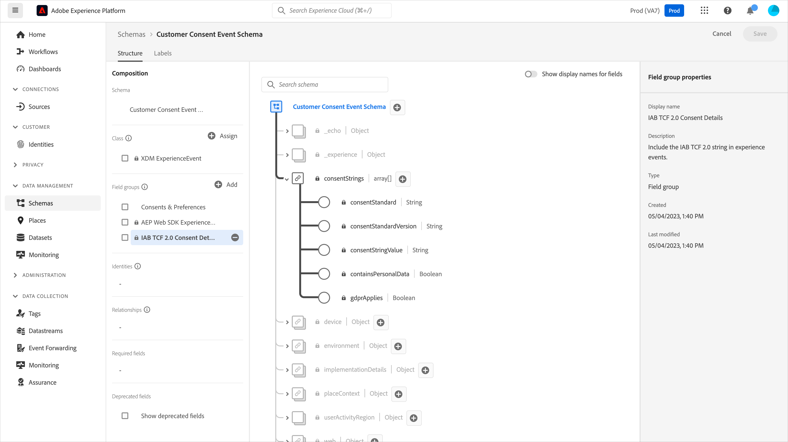

# Implementieren des Einverständnisses mit einer Einverständnisverwaltungsplattform (CMP) mithilfe der Platform Web SDK-Erweiterung

Viele gesetzliche Datenschutzbestimmungen haben Anforderungen für aktive und spezifische Einverständnisse bei der Datenerfassung, Personalisierung und anderen Marketing-Anwendungsfällen eingeführt. Um diese Anforderungen zu erfüllen, können Sie mit Adobe Experience Platform Einverständnisinformationen in individuellen Kundenprofilen erfassen und diese Voreinstellungen als bestimmenden Faktor dafür verwenden, wie die Daten jedes Kunden in nachgelagerten Platform-Workflows verwendet werden.

>[!NOTE]
>
>Adobe Experience Platform Launch wird als eine Suite von Datenerfassungstechnologien in Adobe Experience Platform integriert. In der Benutzeroberfläche wurden mehrere terminologische Änderungen eingeführt, die Sie bei der Verwendung dieses Inhalts beachten sollten:
>
> * Platform launch (Client-seitig) ist jetzt **[[!DNL tags]](https://experienceleague.adobe.com/docs/experience-platform/tags/home.html?lang=de)**
> * Platform launch Server Side ist jetzt **[[!DNL event forwarding]](https://experienceleague.adobe.com/docs/experience-platform/tags/event-forwarding/overview.html?lang=de)**
> * Edge-Konfigurationen sind jetzt **[[!DNL datastreams]](https://experienceleague.adobe.com/docs/experience-platform/edge/fundamentals/datastreams.html?lang=de)**

In diesem Tutorial erfahren Sie, wie Sie Einverständnisdaten, die von einer Consent Management Platform (CMP) mithilfe der Platform Web SDK-Erweiterung in der Datenerfassung abgerufen wurden, implementieren und aktivieren. Wir verwenden dabei sowohl die Adobe-Standards als auch den IAB TCF 2.0-Einverständnisstandard, wobei OneTrust oder SourcePoint als Beispiel-CMPs dienen.

In diesem Tutorial wird die Platform Web SDK-Erweiterung verwendet, um Einverständnisdaten an Platform zu senden. Einen Überblick über Web SDK finden Sie auf [dieser Seite](https://experienceleague.adobe.com/docs/experience-platform/edge/home.html?lang=de).

## Voraussetzungen

Die Voraussetzungen für die Verwendung der Web-SDK sind [hier](https://experienceleague.adobe.com/docs/experience-platform/edge/fundamentals/prerequisite.html?lang=de#fundamentals) aufgeführt.

Auf dieser Seite gibt es eine Anforderung für einen „Ereignis-Datensatz“, und genau wie es sich anhört, ist dies ein Datensatz zum Speichern Ihrer Erlebnisereignisdaten. Um Einverständnisinformationen mit Ereignissen zu senden, muss [&#x200B; Feldergruppe „IAB TCF 2](https://experienceleague.adobe.com/docs/experience-platform/landing/governance-privacy-security/consent/iab/dataset.html?lang=de)0 Einverständnisdetails“ zu Ihrem Erlebnisereignis-Schema hinzugefügt werden:



Für den Platform Consent Standard v2.0 benötigen wir auch Zugriff auf Adobe Experience Platform, um ein Schema und einen Datensatz mit XDM Individual Profile zu erstellen. Ein Tutorial zur Schemaerstellung finden Sie unter [Erstellen eines Schemas mit dem Schema-Editor](https://experienceleague.adobe.com/docs/experience-platform/xdm/tutorials/create-schema-ui.html?lang=de#tutorials) und für die erforderliche Feldergruppe „Einverständnis und Präferenzdetails“ finden Sie unter [Konfigurieren eines Datensatzes zur Erfassung von Einverständnis- und Präferenzdaten](https://experienceleague.adobe.com/docs/experience-platform/landing/governance-privacy-security/consent/adobe/dataset.html?lang=de).

In diesem Tutorial wird davon ausgegangen, dass Sie Zugriff auf die Datenerfassung haben und eine Client-seitige Tags-Eigenschaft mit installierter Web SDK-Erweiterung und einer für die Entwicklung erstellten Arbeitsbibliothek erstellt haben. Diese Themen werden in diesen Dokumenten detailliert beschrieben:

* [Erstellen oder Konfigurieren einer Eigenschaft](https://experienceleague.adobe.com/docs/experience-platform/tags/admin/companies-and-properties.html?lang=de#create-or-configure-a-property)
* [Überblick über Bibliotheken](https://experienceleague.adobe.com/docs/experience-platform/tags/publish/libraries.html?lang=de)
* [Veröffentlichungsübersicht](https://experienceleague.adobe.com/docs/experience-platform/tags/publish/overview.html?lang=de)

Außerdem verwenden wir die Chrome-Erweiterung [Platform Debugger](https://chrome.google.com/webstore/detail/adobe-experience-platform/bfnnokhpnncpkdmbokanobigaccjkpob) um unsere Implementierung zu überprüfen und zu validieren.

Um das IAB TCF-Beispiel mit einer CMP auf Ihrer eigenen Site zu implementieren, benötigen Sie Zugriff auf eine CMP wie OneTrust oder SourcePoint, um die von ihnen bereitgestellten Daten zu generieren. Alternativ können Sie einfach hier folgen und die Ergebnisse unten sehen.

## Verwenden des Web SDK mit dem Adobe-Einverständnisstandard (v1.0 oder v2.0)

>[!NOTE]
>
>Der 1.0-Standard wird schrittweise zugunsten von v2.0 abgeschafft. Mit dem 2.0-Standard können Sie zusätzliche Einverständnisdaten hinzufügen, die zur manuellen Durchsetzung von Einverständnisvoreinstellungen verwendet werden können. Die folgenden Screenshots der Platform Web SDK-Erweiterung stammen aus Version [2.4.0](https://experienceleague.adobe.com/docs/experience-platform/edge/release-notes.html?lang=de#version-2.4.0) der Erweiterung, die entweder mit v1.0 oder v2.0 des Adobe-Einverständnisstandards kompatibel ist.

Weitere Informationen zu diesen Standards finden Sie unter [Unterstützen von Voreinstellungen für das Kundeneinverständnis](https://experienceleague.adobe.com/docs/experience-platform/edge/consent/supporting-consent.html?lang=de).

### Schritt 1: Konfigurieren des Einverständnisses in der Web SDK-Erweiterung

Nachdem wir die Platform Web SDK-Erweiterung in einer Tags-Eigenschaft installiert haben, können wir die Optionen für die Adressierung von Einverständnisdaten auf dem Erweiterungskonfigurationsbildschirm konfigurieren:


Im Abschnitt „Datenschutz“ wird die Einverständnisebene für die SDK festgelegt, wenn der Benutzer noch keine Einverständnisvoreinstellungen angegeben hat. Dadurch wird der Standardstatus für die Einverständnis- und Ereignisdatenerfassung in der SDK festgelegt. Die ausgewählte Einstellung beantwortet die Frage: „Was sollte die SDK tun, wenn die Benutzerin bzw. der Benutzer noch keine expliziten Einverständnisvoreinstellungen angegeben hat?“

* In : Erfassen Sie Ereignisse, die auftreten, bevor die Benutzerin bzw. der Benutzer die Einverständnisvoreinstellungen bereitstellt.
* Ablegen - Ereignisse, die auftreten, bevor die Benutzerin bzw. der Benutzer Einverständnisvoreinstellungen gibt.
* Ausstehend : Warteschlangenereignisse, die auftreten, bevor der Benutzer Einverständnisvoreinstellungen bereitstellt.
* Von Datenelement bereitgestellt

Wenn die standardmäßige Einverständniseinstellung „In“ lautet, weist dies den SDK an, nicht auf ein explizites Einverständnis warten zu sollen, sondern die Ereignisse zu erfassen, die auftreten, bevor der Benutzer Einverständnisvoreinstellungen bereitstellt. Diese Voreinstellungen werden normalerweise in einer CMP verarbeitet und gespeichert.

Wenn die standardmäßige Einverständniseinstellung „Out“ lautet, teilt dies dem SDK mit, dass keine Ereignisse erfasst werden sollten, die auftreten, bevor die Opt-in-Voreinstellungen für Benutzende festgelegt werden. Besucheraktivitäten, die vor dem Festlegen der Einverständnisvoreinstellung stattfinden, werden in keine Daten aufgenommen, die von SDK nach dem Festlegen des Einverständnisses gesendet werden. Wenn Sie beispielsweise scrollen und eine Web-Seite anzeigen, bevor Sie das Einverständnisbanner auswählen, und diese Einstellung „Out“ verwendet wird, werden diese Scroll-Aktivität und die Anzeigezeit nicht gesendet, wenn der Benutzer der Datenerfassung später ausdrücklich zustimmt.

Wenn die Standardeinstellung für das Einverständnis „Ausstehend“ lautet, stellt die SDK alle Ereignisse in die Warteschlange, die auftreten, bevor die Benutzerin bzw. der Benutzer die Einverständnisvoreinstellungen festlegt, sodass die Ereignisse gesendet werden können, nachdem die Einverständnisvoreinstellungen festgelegt wurden und nachdem die SDK bei einem Besuch anfänglich konfiguriert wurde.

Bei dieser Einstellung „Ausstehend“ führt der Versuch, Befehle auszuführen, für die Benutzeranmeldevoreinstellungen erforderlich sind (z. B. den Ereignisbefehl), dazu, dass der Befehl in der SDK in die Warteschlange gestellt wird. Diese Befehle werden erst verarbeitet, nachdem Sie die Nutzeranmeldeeinstellungen an das SDK übermittelt haben.

Sobald eine CMP die Voreinstellungen der Benutzenden erfasst hat, können wir diese Voreinstellungen der SDK mitteilen. In einem späteren Abschnitt unten erfahren Sie, wie Sie diese Opt-in-Daten abrufen und mit der Web SDK-Erweiterung verwenden können.

Mit „Von Datenelement bereitgestellt“ können wir auf ein Datenelement zugreifen, das sämtliche Einverständnisvoreinstellungsdaten enthält, die von benutzerdefiniertem Code oder einer CMP auf Ihrer Site oder in Ihrer Datenschicht erfasst werden. Ein für diesen Zweck verwendetes Datenelement sollte in „ein“, „aus“ oder „ausstehend“ aufgelöst werden.

Hinweis: Diese Konfigurationseinstellung für die SDK wird nicht den Benutzerprofilen beibehalten. Sie dient dazu, das Verhalten der SDK festzulegen, bevor der Besucher seine ausdrückliche Einwilligung erteilt.

Weitere Informationen zum Konfigurieren der Web SDK-Erweiterung finden Sie unter [Platform Web SDK-Erweiterung - Übersicht](https://experienceleague.adobe.com/docs/experience-platform/edge/extension/web-sdk-extension-configuration.html?lang=de#configure-the-extension) und [Unterstützen von Voreinstellungen für die Kundenzustimmung](https://experienceleague.adobe.com/docs/experience-platform/edge/consent/supporting-consent.html?lang=de).

Wählen Sie für dieses Beispiel die Option „Ausstehend“ und anschließend &quot;**&quot;,** Ihre Konfigurationseinstellungen zu speichern.

### Schritt 2: Kommunikation der Einverständnisvoreinstellungen

Nachdem wir nun das Standardverhalten der SDK festgelegt haben, können wir Tags verwenden, um die expliziten Einverständnisvoreinstellungen eines Besuchers an Platform zu senden. Das Senden von Einverständnisdaten mit dem Adobe 1.0- oder 2.0-Standard kann einfach mithilfe der `setConsent`-Aktion von Web SDK in Ihren Tag-Regeln implementiert werden.

#### Festlegen des Einverständnisses mit dem Platform Consent Standard 1.0

Erstellen wir eine Regel, um dies zu demonstrieren. Wählen Sie in der Platform-Tag-Eigenschaft Regeln und dann auf der blauen Schaltfläche Regeln hinzufügen aus. Benennen wir die Regel „setAdobeConsent“ und wählen Sie aus, um ein Ereignis hinzuzufügen. Wählen Sie für den Ereignistyp „Window Loaded“, wodurch diese Regel immer dann Trigger wird, wenn eine Seite auf unserer Website geladen wird. Wählen Sie als Nächstes unter „Aktionen“ die Option „Hinzufügen“ aus, um den Aktionskonfigurationsbildschirm zu öffnen. Hier legen wir die Einverständnisdaten fest. Wählen Sie im Dropdown-Menü „Erweiterung“ die Option „Platform Web SDK&quot;, dann den Aktionstyp und anschließend „Einverständnis festlegen“ aus.

Wählen Sie unter „Einverständnisinformationen“ die Option „Formular ausfüllen“. In dieser Regelaktion verwenden wir die Web-SDK, um das Einverständnis für den Adobe 1.0-Einverständnisstandard festzulegen, indem wir das angezeigte Formular ausfüllen:


Mit dieser Aktion „Einverständnis festlegen“ können wir „In“, „Out“ oder „Von Datenelement bereitgestellt“ übergeben. Ein Datenelement hier sollte in „in“ oder „out“ aufgelöst werden.

In diesem Beispiel wählen wir „In“ aus, um anzugeben, dass der Besucher dem Senden von Daten an Platform durch die Web-SDK zugestimmt hat. Klicken Sie auf die blaue Schaltfläche „Änderungen beibehalten“, um diese Aktion zu speichern, und dann auf „Speichern“, um diese Regel zu speichern.

Hinweis: Nachdem sich ein Website-Besucher abgemeldet hat, können Sie in der SDK die Einwilligung des Benutzers nicht mehr für die Anmeldung festlegen.

Ihre Tag-Regeln können durch eine Vielzahl integrierter oder benutzerdefinierter [Ereignisse“ ausgelöst &#x200B;](https://experienceleague.adobe.com/docs/experience-platform/tags/extensions/adobe/core/overview.html?lang=de), die verwendet werden können, um diese Einverständnisdaten zum richtigen Zeitpunkt während einer Besuchersitzung zu übergeben. Im obigen Beispiel haben wir das Fensterladeereignis verwendet, um die Regel in einen Trigger zu bringen. In einem späteren Abschnitt verwenden wir ein Einverständnispräferenzereignis von einer CMP, um eine Einverständnisaktion festzulegen und Trigger dazu auszuführen. Sie können die Aktion „Einverständnis festlegen“ in einer Regel verwenden, die von einem beliebigen von Ihnen bevorzugten Ereignis ausgelöst wird, das eine Opt-in-Voreinstellung angibt.

#### Festlegen des Einverständnisses mit Platform Consent Standard 2.0

Version 2.0 des Platform-Einverständnisstandards funktioniert mit [XDM](https://experienceleague.adobe.com/docs/platform-learn/tutorials/schemas/schemas-and-experience-data-model.html?lang=de)-Daten. Außerdem ist es erforderlich, die Feldergruppe Einverständnis und Voreinstellungsdetails zu Ihrem Profilschema in Platform hinzuzufügen. Weitere Informationen [&#x200B; Adobe-Standardversion 2.0 und dieser Feldergruppe finden Sie unter &#x200B;](https://experienceleague.adobe.com/docs/experience-platform/landing/governance-privacy-security/consent/adobe/overview.html?lang=de)Einverständnisverarbeitung in Platform“.

Wir erstellen ein benutzerdefiniertes Code-Datenelement, um Daten an die Sammlungs- und Metadateneigenschaften des im folgenden Schema gezeigten Einverständnisobjekts zu übergeben:


Diese Feldergruppe Einverständnis und Präferenzdetails enthält Felder für den XDM-Datentyp [Einverständnisse und Präferenzen](https://experienceleague.adobe.com/docs/experience-platform/xdm/data-types/consents.html?lang=de#prerequisites) der die Einverständnispräferenzdaten enthält, die wir in unserer Regelaktion mit der Platform Web SDK-Erweiterung an Platform senden. Derzeit sind die einzigen erforderlichen Eigenschaften zum Implementieren von Platform Consent Standard 2.0 der Sammlungswert (val) und der Metadaten-Zeitwert, die oben rot hervorgehoben sind.

Erstellen wir ein Datenelement für diese Daten. Wählen Sie Datenelemente und dann die blaue Schaltfläche Datenelement hinzufügen . Nennen wir dies „xdm-consent 2.0“ und wählen wir mit der Core-Erweiterung einen benutzerdefinierten Code-Typ aus. Sie können die folgenden Daten eingeben oder kopieren und in das Fenster des benutzerdefinierten Code-Editors einfügen:

```js
var dateString = new Date().toISOString();

return {
  collect: {
    val: "y"
  },
  metadata: {
    time: dateString
  }
}
```

Im Zeitfeld sollte angegeben werden, wann die Benutzerin bzw. der Benutzer ihre Einverständnisvoreinstellungen zuletzt aktualisiert hat. Hier erstellen wir einen Zeitstempel als Beispiel mit einer Standardmethode für das Datumsobjekt von JavaScript. Wählen Sie Speichern aus, um den benutzerdefinierten Code zu speichern, und wählen Sie erneut Speichern aus, um das Datenelement zu speichern.

Wählen Sie als Nächstes Regeln und dann die blaue Schaltfläche Regel hinzufügen aus und geben Sie den Namen „setConsent onLoad - Consent 2.0“ ein. Wählen wir als Regelereignis das Trigger „Window Loaded“ aus und klicken Sie dann unter „Aktionen“ auf Hinzufügen. Wählen Sie die Platform Web SDK-Erweiterung und für Aktionstyp Einverständnis festlegen aus. Der Standard sollte Adobe und die Version 2.0 sein. Als Wert verwenden wir das soeben erstellte Datenelement, das die Erfassungs- und Zeitwerte enthält, die wir an Platform senden müssen:


Um diese Beispielaktion zu überprüfen, rufen wir die Einverständniserklärung von der Platform Web SDK-Erweiterung auf und übergeben die standardmäßige und die -Version aus dem Formular, während wir die Werte für „Erfassen“ und „Zeit“ aus dem zuvor erstellten Datenelement übergeben.

Klicken Sie auf die blaue Schaltfläche Speichern und erneut, um die Regel zu speichern.

Wir haben jetzt zwei Regeln, eine für jeden der Platform-Einverständnisstandards. In der Praxis werden Sie wahrscheinlich einen Standard für Ihre Site(s) wählen. Als Nächstes erstellen wir ein Beispiel mit dem IAB TCF 2.0-Einverständnisstandard.

## Verwenden von Web SDK mit dem IAB TCF 2.0-Einverständnisstandard

Weitere Informationen zur Version 2.0 des IAB Transparency and Consent Framework finden Sie auf der [IAB Europe](https://iabeurope.eu/transparency-consent-framework/).

Um die Einverständnisvoreinstellungsdaten mit diesem Standard festzulegen, müssen wir die Schemafeldgruppe IAB TCF 2.0-Einverständnisdetails zu unserem Erlebnisereignisschema in Platform hinzufügen:


Diese Feldergruppe enthält die Einverständnisvoreinstellungsfelder, die gemäß IAB TCF 2.0-Standard erforderlich sind. Weitere Informationen zu Schemata und Feldergruppen finden Sie unter [XDM-Systemübersicht](https://experienceleague.adobe.com/docs/experience-platform/xdm/home.html?lang=de).

### Schritt 1: Erstellen eines Einverständnisdatenelements

Um Einverständnisereignisdaten von Tags unter Verwendung des IAB TCF 2.0-Einverständnisstandards zu senden, richten wir zunächst ein XDM-Datenelement mit den erforderlichen Einverständnisfeldern ein:


Wählen Sie in Ihrer Client-seitigen Tags-Eigenschaft Datenelemente und dann die blaue Schaltfläche „Datenelement hinzufügen“ aus. Wir nennen dieses Datenelement für dieses Beispiel „xdm-consentStrings“. Diese XDM-Felder enthalten die für den IAB TCF 2.0-Standard erforderlichen Daten zur Benutzerzustimmung.

Wählen Sie im Dropdown-Menü Erweiterung die Option „Platform Web SDK&quot; und für Datenelementtyp die Option „XDM-Objekt“. Der XDM-Mapper sollte angezeigt werden, sodass Sie das Element „consentStrings“ auswählen und erweitern können, wie im obigen Screenshot gezeigt.

Wir legen jede der consentStrings wie folgt fest:

* **`consentStandard`**: `IAB TCF`
* **`consentStandardVersion`**: `2.0`
* **`consentStringValue`**: `%IAB TCF Consent String%`
* **`containsPersonalData`**: `False` (über die Schaltfläche Wert auswählen ausgewählt)
* **`gdprApplies`**: `%IAB TCF Consent GDPR%`

Die Felder `consentStandard` und `consentStandardVersion` sind nur Textzeichenfolgen für den verwendeten Standard, IAB TCF Version 2.0. Die `consentStringValue` verweist auf ein Datenelement mit dem Namen „IAB TCF Consent String“. Die Prozentzeichen um den Text herum geben den Namen eines Datenelements an, und wir werden uns das gleich ansehen. Das Feld `containsPersonalData` gibt an, ob die IAB TCF 2.0-Einverständniszeichenfolge personenbezogene Daten mit „True“ oder „False“ enthält. Das `gdprApplies` Feld gibt entweder an, ob für die DSGVO „true“ gilt, „false“ für die DSGVO nicht gilt oder „undefined“ für unbekannt, ob die DSGVO gilt. Derzeit behandelt Web SDK „undefined“ als „true“, sodass Einverständnisdaten, die mit „gdprApplies: undefined“ gesendet werden, so behandelt werden, als ob sich der Besucher in einem Bereich befindet, in dem die DSGVO anwendbar ist.

Weitere Informationen zu diesen Eigenschaften sowie [&#x200B; IAB TCF 2.0 in Tags finden Sie &#x200B;](https://experienceleague.adobe.com/docs/experience-platform/edge/consent/iab-tcf/with-launch.html?lang=de#getting-started) der Einverständnisdokumentation .

### Schritt 2: Erstellen einer Regel zum Festlegen des Einverständnisses mit dem IAB TCF 2.0-Standard

Als Nächstes erstellen wir eine Regel, um das Einverständnis mit der Web-SDK festzulegen, wenn Einverständnisdaten für diesen Standard von einem Website-Besucher festgelegt oder geändert werden. In dieser Regel sehen wir auch, wie wir diese Einverständnisänderungssignale von einer CMP wie [OneTrust“ &#x200B;](https://www.onetrust.com/products/cookie-consent/) &quot;[&quot; &#x200B;](https://www.sourcepoint.com/cmp/).

#### Regelereignis hinzufügen

Wählen Sie in der Platform-Tag-Eigenschaft den Abschnitt Regeln und dann die blaue Schaltfläche Regel hinzufügen aus. Benennen wir die Regel setConsent - IAB und wählen Sie Hinzufügen unter Ereignisse. Nennen wir dieses Ereignis tcfapi addEventListener und wählen Sie Editor öffnen , um den benutzerdefinierten Code-Editor zu öffnen.

Kopieren Sie den folgenden Code und fügen Sie ihn in Ihr Editor-Fenster ein:

```js
// Wait for window.__tcfapi to be defined, then trigger when the customer has completed their consent and preferences.
function addEventListener() {
  if (window.__tcfapi) {
    window.__tcfapi("addEventListener", 2, function (tcData, success) {
      if (success && (tcData.eventStatus === "useractioncomplete" || tcData.eventStatus === "tcloaded")) {
        // save the tcData.tcString properties in data elements
        _satellite.setVar("IAB TCF Consent String", tcData.tcString);
        _satellite.setVar("IAB TCF Consent GDPR", tcData.gdprApplies);
        trigger();
      }
    });
  } else {
    // window.__tcfapi wasn't defined. Check again in 100 milliseconds
    setTimeout(addEventListener, 100);
  }
}
addEventListener();
```

Dieser Code erstellt einfach eine Funktion namens `addEventListener` und führt sie aus. Die Funktion prüft, ob das `window.__tcfapi` Objekt vorhanden ist. Ist dies der Fall, wird ein Ereignis-Listener gemäß den Spezifikationen der API hinzugefügt. Weitere Informationen zu diesen Spezifikationen finden Sie im [IAB-Repository](https://github.com/InteractiveAdvertisingBureau/GDPR-Transparency-and-Consent-Framework) auf GitHub. Wenn dieser Ereignis-Listener erfolgreich hinzugefügt wurde und der Website-Besucher seine Einverständnis- und Voreinstellungsentscheidungen getroffen hat, legt der Code benutzerdefinierte Variablen für die `tcData.tcString` und den Indikator für DSGVO-Regionen fest. Weitere Informationen zum IAB TCF finden Sie auf der IAB [Website](https://iabeurope.eu/transparency-consent-framework/) und [GitHub repo](https://github.com/InteractiveAdvertisingBureau/GDPR-Transparency-and-Consent-Framework) für technische Details. Nach dem Festlegen dieser Werte führt der Trigger die Codefunktion aus, die diese Regel zum Ausführen Trigger.

Wenn das `window.__tcfapi` bei der ersten Ausführung dieser Funktion nicht vorhanden war, prüft die Funktion alle 100 Millisekunden erneut, ob es vorhanden ist, damit der Ereignis-Listener hinzugefügt werden kann. Die letzte Codezeile führt einfach die `addEventListener` aus, die in den darüber liegenden Codezeilen definiert ist.

Zusammenfassend haben wir eine Funktion erstellt, um den Einverständnisstatus zu überprüfen, den ein Website-Besucher mithilfe eines CMP- (oder benutzerdefinierten) Einverständnisbanners festlegt. Wenn diese Einverständnisvoreinstellung festgelegt ist, erstellt dieser Code zwei benutzerdefinierte Variablen (Datenelemente mit benutzerdefiniertem Code), die wir in unserer Regelaktion verwenden können. Nachdem Sie den obigen Code in das Fenster des benutzerdefinierten Code-Editors Ihres Ereignisses eingefügt haben, klicken Sie auf die blaue Schaltfläche Speichern , um das Regelereignis zu speichern.

Richten wir nun die Aktion Einverständnisregel festlegen ein, um diese Werte zu verwenden und an Platform zu senden.

#### Regelaktion hinzufügen

Wählen Sie Hinzufügen im Abschnitt Aktionen aus. Wählen Sie unter Extension die Option Platform Web SDK aus dem Dropdown-Menü. Wählen Sie unter „Aktionstyp“ die Option Einverständnis festlegen aus. Nennen wir diese Aktion setConsent.

Wählen Sie in der Aktionskonfiguration unter „Einverständnisinformationen“ die Option „Formular ausfüllen“ aus. Wählen Sie für „Standard“ die Option „IAB TCF“ und für „Version“ die Option 2.0. Für den Wert verwenden wir die benutzerdefinierte Variable aus unserem Ereignis und geben `%IAB TCF Consent String%` ein, die aus den „tcData[&#x200B; stammt](https://github.com/InteractiveAdvertisingBureau/GDPR-Transparency-and-Consent-Framework/blob/master/TCFv2/IAB%20Tech%20Lab%20-%20CMP%20API%20v2.md#tcdata) die wir oben in unserer benutzerdefinierten Funktion für Regelereignisse erfasst haben.

Unter Anwendung der DSGVO verwenden wir die andere benutzerdefinierte Variable aus unserem Ereignis und geben `%IAB TCF Consent GDPR%` ein, die auch aus den `tcData` stammt, die wir oben in unserer benutzerdefinierten Funktion für Regelereignisse erfasst haben. Wenn Sie wissen, dass die DSGVO für Besuchende dieser Website definitiv gilt oder nicht, können Sie Ja oder Nein auswählen, anstatt die benutzerdefinierte Variable (Datenelement) zu verwenden. Sie können auch eine bedingte Logik in einem Datenelement verwenden, um zu überprüfen, ob die DSGVO anwendbar ist, und den entsprechenden Wert zurückgeben.

Wählen Sie unter DSGVO enthält personenbezogene Daten die Option, um anzugeben, ob die Daten für diesen Benutzer personenbezogene Daten enthalten oder nicht. Ein Datenelement hier sollte in „true“ oder „false“ aufgelöst werden.


Klicken Sie auf die blaue Schaltfläche Speichern , um die Aktion zu speichern, und auf die blaue Schaltfläche Speichern (oder In Bibliothek speichern) , um die Regel zu speichern. An dieser Stelle haben Sie das Datenelement und die Regel erfolgreich in Tags implementiert, um das Einverständnis mithilfe der Web SDK-Erweiterung mit dem Einverständnisstandard IAB TCF 2.0 festzulegen.

### Schritt 3: In Bibliothek speichern und erstellen

Wenn Sie die Voraussetzung [Arbeitsbibliothek](https://experienceleague.adobe.com/docs/platform-learn/implement-in-websites/configure-tags/add-data-elements-rules.html?lang=de#use-the-working-library-feature) verwenden, haben Sie diese Änderungen bereits gespeichert und Ihre Entwicklungsbibliothek erstellt:


### Schritt 4: Inspect und Validieren der Datenerfassung

Auf unserer Site aktualisieren wir die Seite und bestätigen den Bibliotheks-Build in der [Debugger](https://chromewebstore.google.com/detail/adobe-experience-platform/bfnnokhpnncpkdmbokanobigaccjkpob) Chrome im Menüabschnitt Tags :


Wir können auch den setConsent-Aufruf für die Adobe 1.0- oder 2.0-POST im Abschnitt mit dem Platform Web SDK-Debugger überprüfen, indem wir in der Netzwerkanfrage, unter der `{"consent":[{"value":{"general":"in"},"version…` angezeigt wird, auf der Textzeile der Debugging-Plattform auswählen:


Zur Validierung des setConsent-Aufrufs und unserer Regel für den IAB TCF 2.0-Standard verwenden wir das OneTrust-Einverständnisbanner auf unserer Test-Site, um unsere Einverständnisvoreinstellungen festzulegen und die oben beschriebenen tcData zu erstellen:


Nach Auswahl von „Ich akzeptiere“ können wir den setConsent-Aufruf für den IAB TCF 2.0-Standard im Abschnitt „Debugger Platform Web SDK&quot; überprüfen, indem wir in der Zeile &quot;POST Body“ der Netzwerkanfrage auswählen, wo `{"consent":[{"value":"someAlphaNumericCharacters…` angezeigt wird.


Hier sehen wir die Daten, die wir zuvor in unseren Datenelementen und Tag-Regeln eingerichtet haben. Die value-Eigenschaft enthält die codierten tcString-Daten, die wir zuvor gesehen haben.

OneTrust, SourcePoint und andere CMPs, die den IAB TCF 2.0-Standard implementieren, erzeugen alle ähnliche Daten auf unseren Seiten. Wir können diese Daten erfassen und sie mit der Web-SDK-Erweiterung in Tags verwenden, indem wir das benutzerspezifische Codeereignis in der Regel verwenden, die wir oben erstellt haben. Der benutzerdefinierte Code ist unabhängig von der CMP, die zum Generieren der IAB TCF 2.0-Daten verwendet wird, identisch. Der benutzerdefinierte Code kann auch mit einem der Platform-Einverständnisstandards (1.0 oder 2.0) verwendet werden.

## Senden von Einverständnisdaten mit Erlebnisereignissen

Sie haben möglicherweise bemerkt, dass wir in keiner unserer Regeln auf das Datenelement „xdm-consentStrings“ verwiesen haben, das wir zuvor in einem Datenelementfeld erstellt haben. Dieses Datenelement ist für den Fall vorgesehen, dass Sie Einverständnisdaten mit einem Erlebnisereignis senden müssen.


Da dieses Datenelement alle für den IAB TCF 2.0-Standard erforderlichen Felder enthält, können Sie beim Senden dieser XDM-Daten mit Ihren Erlebnisereignissen einfach auf das Datenelement verweisen:


## Zusammenfassung

Nachdem wir die Daten überprüft und validiert haben, sollten Sie sehen, wie Sie Einverständnisdaten, die von einer CMP mithilfe der Platform Web SDK-Erweiterung für Platform abgerufen wurden, implementieren und aktivieren.
