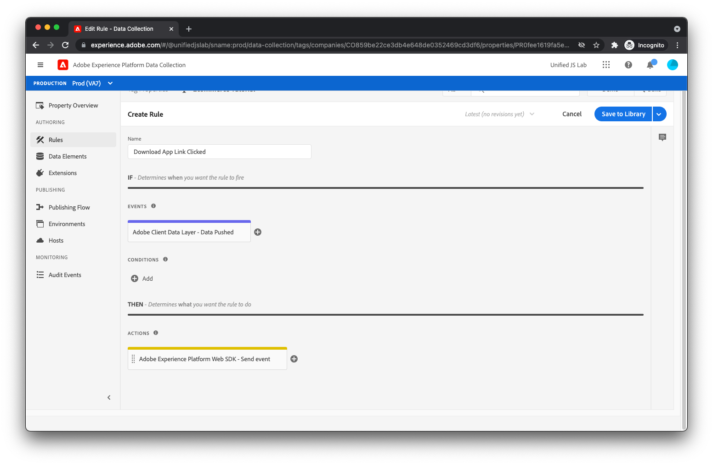

# Erstellen eines Datenelements und einer Regel zum Verfolgen von App-Downloads

Zur Erinnerung: Wenn Sie verfolgen, wann ein Benutzer auf die [!UICONTROL App herunterladen] -Link, haben Sie wie folgt zur Datenschicht gepusht:

```js
window.adobeDataLayer.push({
  "event": "downloadAppClicked",
  "eventInfo": {
    "web": {
      "webInteraction": {
        "URL": "https://example.com/download",
        "name": "App Download",
        "type": "download"
      }
    }
  }
});
```

Sie haben die `eventInfo` -Schlüssel, der die Datenschicht anweist, diese Daten zusammen mit dem Ereignis zu kommunizieren, aber _not_ die Daten in der Datenschicht beibehalten. Bei einem Link-Klick ist es nicht nützlich, Informationen über den angeklickten Link zur Datenschicht hinzuzufügen, da dies nicht für andere Ereignisse gilt, die später auf der Seite auftreten können.

Für diese Implementierung senden Sie ein Erlebnisereignis an Adobe Experience Platform, das das zusammengeführte Ergebnis von (1) dem berechneten Status der Datenschicht und (2) dem Inhalt von `eventInfo`.

Dazu müssen Sie zunächst ein Datenelement erstellen, das diese beiden Informationsblöcke zusammenführt.

## ein Datenelement erstellen

Um das entsprechende Datenelement zu erstellen, klicken Sie auf [!UICONTROL Datenelemente] im Menü links. Klicken Sie anschließend auf das [!UICONTROL Datenelement hinzufügen] Link.

Geben Sie für den Datenelementnamen `computedStateAndEventInfo`. Für [!UICONTROL Erweiterung] Feld, wählen Sie [!UICONTROL Core] , wenn sie nicht bereits ausgewählt ist. Für [!UICONTROL Datenelementtyp] Feld, wählen Sie [!UICONTROL Zusammengeführte Objekte]. Mit diesem Datenelement können Sie mehrere Objekte tief zusammenführen. Das zusammengeführte Ergebnis wird vom Datenelement zurückgegeben.

Geben Sie für das erste Objekt, das Sie in die Zusammenführung einbeziehen möchten, `%event.fullState%`. Bei Verwendung in einer Regel, die von einer [!UICONTROL Übermittelte Daten] -Regelereignis, wird hierdurch der berechnete Status der Adobe Client-Datenschicht zum Zeitpunkt der Regelauslösung referenziert.

Klicken [!UICONTROL Weitere hinzufügen].

Geben Sie für das zweite Objekt `%event.eventInfo%`. Bei Verwendung in einer Regel, die von einer [!UICONTROL Übermittelte Daten] -Regelereignis, das auf die `eventInfo` -Teil, der in die Adobe Client-Datenschicht übertragen wurde.


Das Datenelement ist abgeschlossen. Speichern Sie das Datenelement, indem Sie auf das [!UICONTROL Speichern] Schaltfläche.

## Erstellen einer Regel

So erstellen Sie eine Regel zum Verfolgen von Klicks auf die [!UICONTROL App herunterladen] Link, erster Klick [!UICONTROL Regeln] im Menü links.

Klicken Sie auf [!UICONTROL Regel hinzufügen].

Geben Sie für den Regelnamen _Link zum Herunterladen des Programms angeklickt_.

## Ereignis hinzufügen

Klicken Sie auf [!UICONTROL Hinzufügen] Schaltfläche unter [!UICONTROL Veranstaltungen]. Sie werden jetzt in der Ereignisansicht angezeigt. Für [!UICONTROL Erweiterung] Feld, wählen Sie [!UICONTROL Adobe Client-Datenschicht]. Für [!UICONTROL Ereignistyp] Feld, wählen Sie [!UICONTROL Übermittelte Daten].

Da diese Regel nur ausgelöst werden soll, wenn die Variable `downloadAppClicked` -Ereignis an die Datenschicht gesendet wird, wählen Sie die [!UICONTROL Bestimmtes Ereignis] Radio under [!UICONTROL Hören Sie zu] und Typ _downloadAppClicked_ in [!UICONTROL Ereignis/Schlüssel zur Registrierung]  Textfeld, das angezeigt wird.


Klicken Sie auf [!UICONTROL Änderungen beibehalten].

## Hinzufügen einer Aktion

Nachdem Sie sich wieder in der Regelansicht befinden, klicken Sie auf die [!UICONTROL Hinzufügen] Schaltfläche unter [!UICONTROL Aktionen]. Sie sollten sich jetzt in der Aktionsansicht befinden. Für [!UICONTROL Erweiterung] Feld, wählen Sie [!UICONTROL Adobe Experience Platform Web SDK]. Für [!UICONTROL Aktionstyp] Feld, wählen Sie [!UICONTROL Ereignis senden].

Suchen Sie rechts auf dem Bildschirm die [!UICONTROL Typ] Feld und wählen Sie `web.webinteraction.linkClicks`.

Für [!UICONTROL XDM-Daten] -Feld, klicken Sie auf die Schaltfläche für die Datenelementauswahl und wählen Sie [!UICONTROL computedStateAndEventInfo]. Dies ist das soeben erstellte Datenelement.

Für diese Regel (im Gegensatz zu den anderen von Ihnen erstellten Regeln) überprüfen Sie die [!UICONTROL Dokument wird entladen] aktivieren. Dies teilt dem SDK im Wesentlichen mit, dass der Benutzer beim Klicken auf den Link von der Seite weg navigiert. Dies ist wichtig, da es dem SDK ermöglicht, die Anfrage so zu stellen, dass die Anfrage auch dann weiterhin im Hintergrund ausgeführt wird und dann auf den Server gelangt, wenn der Benutzer von der Seite weg navigiert. Wenn dieses Kontrollkästchen deaktiviert ist, wird die Anfrage nicht auf diese Weise gestellt und daher beim Entladen des aktuellen Dokuments wahrscheinlich abgebrochen.

Sie fragen sich vielleicht: &quot;Das klingt gut. Warum ist diese Option dann nicht immer aktiviert?&quot;

Nun, es ist ein wenig kompliziert, aber bei Verwendung dieser Funktion verwendet das SDK eine Browser-Methode namens [`sendBeacon`](https://developer.mozilla.org/de-DE/docs/Web/API/Navigator/sendBeacon) , um die Anfrage zu senden. Beim Senden einer Anforderung mit `sendBeacon`, erlaubt der Browser dem SDK (oder anderen) nicht den Zugriff auf vom Server zurückgegebene Daten. Wenn das SDK diese Funktion für jede Anfrage verwenden würde, könnte das SDK nie Daten vom Server empfangen. Aus diesem Grund ist es wichtig, die [!UICONTROL Dokument wird entladen] nur dann, wenn das aktuelle Dokument entladen wird. In diesem Fall können die Antwortdaten trotzdem verworfen werden.


Speichern Sie die Aktion, indem Sie auf die [!UICONTROL Änderungen beibehalten] Schaltfläche.

## Speichern Sie die Regel

Ihre Regel sollte jetzt abgeschlossen sein.



Speichern Sie die Regel, indem Sie auf [!UICONTROL Speichern].
