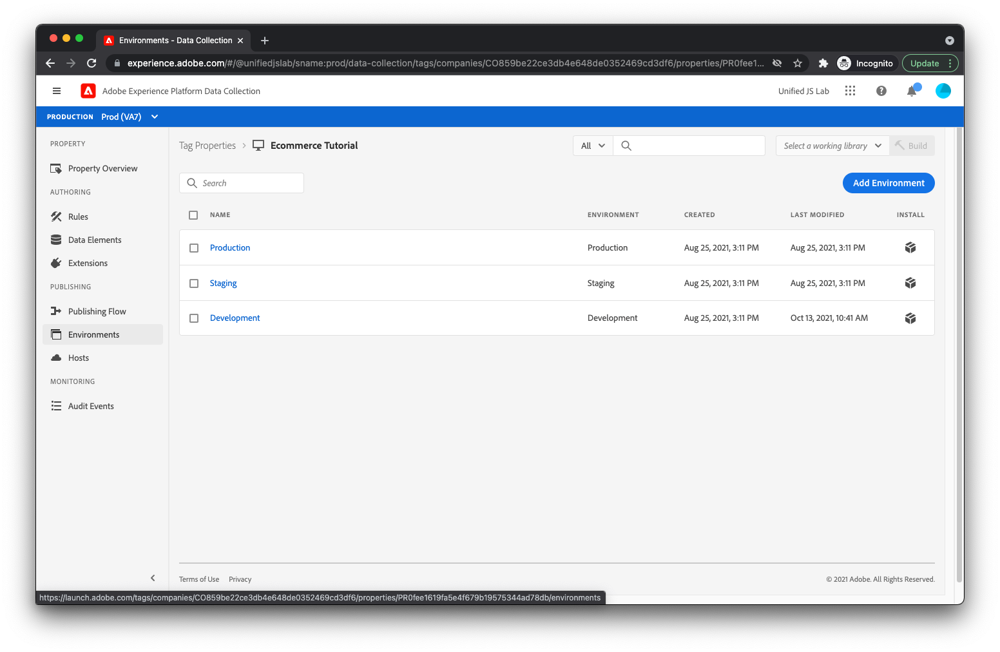

# Bibliothek veröffentlichen

Jetzt ist es an der Zeit, die Tag-Bibliothek auf Ihrer Website bereitzustellen.

## eine Bibliothek erstellen

Zunächst müssen Sie eine Bibliothek erstellen, die die von Ihnen erstellten Erweiterungen, Regeln und Datenelemente enthält. Um eine Bibliothek zu erstellen, wählen Sie [!UICONTROL Veröffentlichungsfluss] im Menü links.

Auswählen [!UICONTROL Bibliothek hinzufügen].

Sie sollten die Ansicht zur Bibliothekserstellung sehen.


Geben Sie der Bibliothek einen Namen, z. B. _Demo_. Auswählen [!UICONTROL Entwicklung] im [!UICONTROL Umgebung] Dropdown-Liste. Klicken Sie anschließend auf [!UICONTROL Alle geänderten Ressourcen hinzufügen].

Jetzt sollten alle Erweiterungen, Regeln und Datenelemente angezeigt werden, die unter [!UICONTROL Ressourcenänderungen]. Klicken [!UICONTROL Speichern und in Entwicklung erstellen].

## Hinzufügen des Einbettungscodes zu Ihrer HTML

Jetzt müssen Sie Ihrer Produktseiten-HTML ein Skript-Tag hinzufügen, das die neu erstellte Tag-Bibliothek lädt.

Starten durch Klicken auf [!UICONTROL Umgebungen] im Menü links. Es sollten drei verschiedene Umgebungen aufgeführt sein.



Klicken Sie auf das Paketsymbol auf der [!UICONTROL Entwicklung] Umgebungszeile. Es sollten Anweisungen zum Installieren des Launch-Bibliotheksskripts auf Ihrer Seite angezeigt werden.


Kopieren Sie das Skript-Tag (es gibt eine Schaltfläche zum Kopieren in die Zwischenablage ). Öffnen Sie die Produktseiten-HTML und fügen Sie das Skript-Tag vor dem `</head>` -Tag. Ihre endgültige HTML sollte wie folgt aussehen:

```html
<!DOCTYPE html>
<html lang="en">
  <head>
    <title>Product Page</title>
    <script>
      window.adobeDataLayer = window.adobeDataLayer || [];
      window.adobeDataLayer.push({
        "event": "pageViewed",
        "web": {
          "webPageDetails": {
            "name": "Foam Roller",
            "siteSection": "Equipment"
          },
        },
        "productListItems": [
          {
            "SKU": "eqfr08",
            "currencyCode": "USD",
            "name": "Foam Roller",
            "priceTotal": 18.95
          }
        ]
      });
      window.adobeDataLayer.push({
        "event": "productViewed"
      });
      window.onAddToCartClick = function() {
        // In a real implementation, you would change this condition to 
        // only pass if a cart doesn't already exist. You would typically 
        // do this by checking a cookie or variable value.
        if (true) {
          window.adobeDataLayer.push({
            "event": "cartOpened",
          });
        }
        window.adobeDataLayer.push({
          "event": "productAddedToCart"
        });
      };
      window.onDownloadAppClick = function() {
        window.adobeDataLayer.push({
          "event": "downloadAppClicked",
          "eventInfo": {
            "web": {
              "webInteraction": {
                "URL": "https://example.com/download",
                "name": "App Download",
                "type": "download"
              }
            }
          }
        });
      };
    </script>
    <!--Swap this script tag with your own-->
    <script src="https://assets.adobedtm.com/xxxxxxxxxxxx/xxxxxxxxxxxx/launch-xxxxxxxxxxxx-development.min.js" async></script>
  </head>
  <body>
    <h1>Foam Roller</h1>
    <p>This foam roller is composed of durable material that holds its shape and delivers deep tissue therapy. Purchase now for only $18.95!</p>
    <button type="button" onclick="onAddToCartClick()">Add to cart</button>
    <a href="https://example.com/download" onclick="onDownloadAppClick()">Download the app</a>
  </body>
</html>
```

Sehen Sie sich die [Veröffentlichungsdokumentation für Tags](https://experienceleague.adobe.com/docs/experience-platform/tags/publish/overview.html?lang=de) , wenn Sie mehr über den Veröffentlichungsprozess erfahren möchten.

Als Nächstes testen Sie Ihre neue Implementierung!
