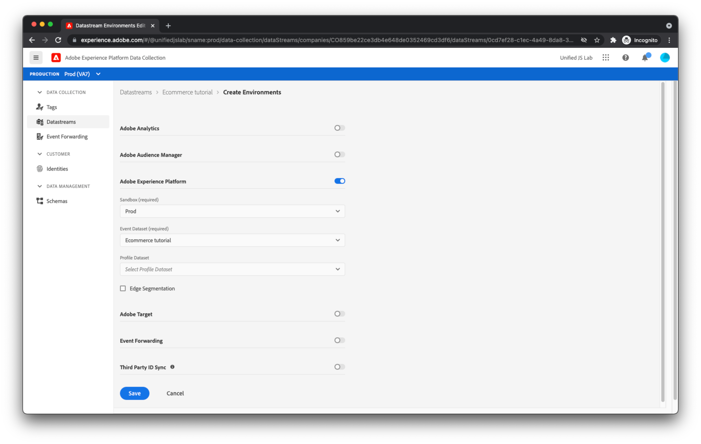

# Erstellen eines Datenspeichers

Die Daten, die Sie von Ihrer Website senden, erreichen eine Reihe von Adobe-Servern, die [Adobe Experience Platform Edge](https://business.adobe.com/products/experience-platform/experience-platform-edge-network.html). Dieses Netzwerk kann Ihre Daten an die [Adobe Experience Platform-Datensatz, den Sie zuvor erstellt haben](create-a-schema.md) und anderen Produkten in Adobe Experience Cloud. Diese Adobe-Produkte können auch mit Daten auf Ihre Webseite reagieren. Beispielsweise kann Edge Network Personalisierungsinhalte von Adobe Target zurückgeben.

Um zu konfigurieren, welche Adobe-Produkte das Edge Network Daten an und von übermittelt, müssen Sie einen Datastraam erstellen. Wenn Edge Network Daten von Ihrer Webseite erhält, prüft es den von Ihnen erstellten Datastrom, liest seine Konfiguration und leitet dann Daten an die entsprechenden Adobe-Produkte weiter.

Um einen Datastream zu erstellen, navigieren Sie zunächst zum [!UICONTROL Datenspeicher] Ansicht innerhalb [!UICONTROL Datenerfassung]. Klicken [!UICONTROL Datenspeicher erstellen] in der oberen rechten Ecke. Geben Sie einen Namen für den Datastream an.

Im nächsten Bildschirm können Sie konfigurieren, welche Adobe-Produkte die von Ihrer Website gesendeten Daten empfangen sollen. Aktivieren Sie in diesem Tutorial nur Adobe Experience Platform und wählen Sie den zuvor erstellten Datensatz aus (der standardmäßig [!UICONTROL Prod] Sandbox) und klicken Sie auf [!UICONTROL Speichern].

Ihr Datenspeicher wurde erstellt.

## Datenspeicherumgebungen

Unternehmen haben normalerweise einen Promotionspfad für alle Website-Aktualisierungen. Jemand im Unternehmen (ein Marketing-Experte oder -Techniker, je nach Änderungen) testet seine Änderungen in einer Entwicklungsumgebung, die nur von dieser Person verwendet wird. Sobald sie mit den Änderungen vertraut sind, werden die Änderungen in eine Staging-Umgebung weitergeleitet, in der sie weitere Tests erhalten. Schließlich werden die Änderungen auf der Produktions-Website veröffentlicht, die Benutzer sehen. Datastreams unterstützen dieses Promotion-Muster.

Nachdem Sie auf [!UICONTROL Speichern]hätten Sie feststellen müssen, dass drei Datastream-Umgebungen automatisch für Sie erstellt wurden: [!UICONTROL Entwicklungsumgebung], [!UICONTROL Staging-Umgebung]und [!UICONTROL Produktionsumgebung].

Wenn Sie auf jede Datastream-Umgebung klicken, werden Sie feststellen, dass ihnen alle dieselbe Konfiguration wie Sie erhalten haben. Diese Umgebungen können jedoch individuell angepasst werden.

Wenn Sie mit Adobe Experience Platform-Tags vertraut sind, sind Sie möglicherweise bereits mit dem Konzept einer Entwicklungs-, Staging- und Produktionsumgebung vertraut. Umgebungen innerhalb von Tags sind mit Umgebungen in einem Datastream verbunden. Wenn Sie eine Tag-Bibliothek durch den Tag-Veröffentlichungs-Workflow von der Entwicklung zur Staging- zur Produktionsumgebung verschieben, wechselt die verwendete Datastream-Umgebung ebenfalls automatisch von [!UICONTROL Entwicklungsumgebung], um [!UICONTROL Staging-Umgebung], um [!UICONTROL Produktionsumgebung]. Auf diese Weise können Sie beispielsweise Daten in einen Datensatz senden, während Ihre Änderungen in der Entwicklung sind, und Daten an einen anderen Datensatz senden, sobald Ihre Änderungen in Produktion sind. Auf diese Weise können Sie Ihre Produktionsdaten frei von allen Speicherdaten halten, die Sie während des Entwicklungsprozesses generieren können. Wir besprechen später die Datastream-Umgebungen beim Konfigurieren von Erweiterungen in Ihrer Tag-Eigenschaft.

Der Server ist nun vollständig für den Empfang von Daten von Ihrer Webseite konfiguriert.
