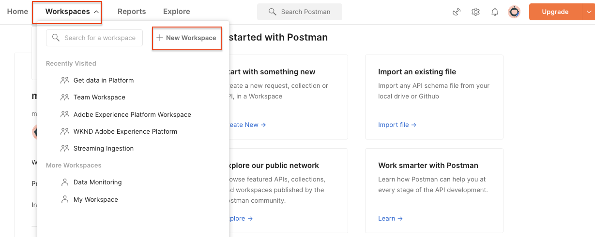

# Beispieldaten nach Adobe Experience Platform importieren

Erfahren Sie, wie Sie eine Experience Platform-Sandbox-Umgebung mit Beispieldaten einrichten. Mithilfe einer Postman-Sammlung können Sie Feldergruppen, Schemata und Datensätze erstellen und dann Beispieldaten in Experience Platform importieren.

## Anwendungsfall für Beispieldaten

Experience Platform-Business-Anwender müssen häufig eine Reihe von Schritten durchführen, darunter die Identifizierung von Feldergruppen, das Erstellen von Schemas, das Vorbereiten von Daten, das Erstellen von Datensätzen und das anschließende Erfassen von Daten, bevor sie die von Experience Platform bereitgestellten Marketing-Funktionen untersuchen können. In diesem Tutorial werden einige der Schritte automatisiert, sodass Sie Daten so schnell wie möglich in eine Platform-Sandbox übertragen können.

Dieses Tutorial konzentriert sich auf eine fiktive Einzelhandelsmarke namens Luma. Sie investieren in Adobe Experience Platform, um Loyalitäts-, CRM-, Produktkatalog- und Offline-Kaufdaten in Echtzeit-Kundenprofile zu kombinieren und diese Profile zu aktivieren, um ihr Marketing auf die nächste Stufe zu bringen. Wir haben Beispieldaten für Luma generiert. Im Rest dieses Tutorials importieren Sie diese Daten in eine Ihrer Experience Platform-Sandbox-Umgebungen.

>[!NOTE]
>
>Das Endergebnis dieses Tutorials ist eine Sandbox mit ähnlichen Daten wie die [Tutorial zu den ersten Schritten mit Adobe Experience Platform für Datenarchitekten und Dateningenieure](https://experienceleague.adobe.com/docs/platform-learn/getting-started-for-data-architects-and-data-engineers/overview.html). Sie wurde im April 2023 aktualisiert, um die [Herausforderungen für Journey Optimizer](https://experienceleague.adobe.com/docs/journey-optimizer-learn/challenges/introduction-and-prerequisites.html?lang=de).

## Voraussetzungen

* Sie haben Zugriff auf Experience Platform-APIs und können sich authentifizieren. Wenn nicht, lesen Sie bitte diesen Abschnitt [Tutorial](https://experienceleague.adobe.com/docs/platform-learn/tutorials/platform-api-authentication.html?lang=de).
* Sie haben Zugriff auf eine Sandbox zur Entwicklung von Experience Platformen.
* Sie kennen Ihre Experience Platform-Mandanten-ID. Sie können sie abrufen, indem Sie eine authentifizierte [API-Anfrage](https://experienceleague.adobe.com/docs/experience-platform/xdm/api/getting-started.html?lang=en#know-your-tenant_id)
oder extrahieren Sie sie aus der URL, wenn Sie sich bei Ihrem Platform-Konto anmelden. In der folgenden URL lautet der Mandant beispielsweise &quot;
`techmarketingdemos`&quot; `https://experience.adobe.com/#/@techmarketingdemos/sname:prod/platform/home`.

## Verwenden von Postman {#postman}

### Umgebungsvariablen einrichten

Bevor Sie die Schritte ausführen, stellen Sie sicher, dass Sie die [Postman](https://www.postman.com/downloads/) Anwendung.  Los geht‘s!

1. Laden Sie die [platform-utils-main.zip](../assets/data-generator/platform-utils-main.zip) -Datei, die alle für dieses Tutorial erforderlichen Dateien enthält.

   >[!NOTE]
   >
   >Benutzerdaten, die in der Variablen [platform-utils-main.zip](../assets/data-generator/platform-utils-main.zip) -Datei ist fiktiv und nur zu Demonstrationszwecken verwendet.

1. Verschieben Sie die Datei `platform-utils-main.zip` aus dem Downloads-Ordner an den gewünschten Speicherort auf Ihrem Computer und entpacken Sie sie.
1. Im `luma-data` Ordner, öffnen Sie alle `json` -Dateien in einem Texteditor und ersetzen Sie alle Instanzen von `_yourOrganizationID` mit Ihrer eigenen Mandanten-ID, der ein Unterstrich vorangestellt ist.
1. Öffnen `luma-offline-purchases.json` und `luma-web-events.json` in einem Texteditor verwenden und alle Zeitstempel so aktualisieren, dass die Ereignisse im letzten Monat eintreten (suchen Sie beispielsweise nach `"timestamp":"2022-11` und ersetzen Jahr und Monat)
1. Notieren Sie den Speicherort des entpackten Ordners, wie Sie ihn später bei der Einrichtung der `FILE_PATH` Postman-Umgebungsvariable:

   >[!NOTE]
   > Um den Dateipfad auf Ihrem Mac abzurufen, navigieren Sie zum `platform-utils-main` Ordner, klicken Sie mit der rechten Maustaste auf den Ordner und wählen Sie **Informationen abrufen** -Option.
   >
   > 

   >[!NOTE]
   > Um den Dateipfad in Ihren Fenstern abzurufen, klicken Sie auf den Speicherort des gewünschten Ordners und klicken Sie dann mit der rechten Maustaste rechts neben dem Pfad in der Adressleiste. Kopieren Sie die Adresse, um den Dateipfad abzurufen.
   > 
   > 

1. Öffnen Sie Postman und erstellen Sie einen neuen Arbeitsbereich über die **Arbeitsbereiche** Dropdown-Menü:\
   
1. Geben Sie einen **Name** und optional **Zusammenfassung** für Ihren Arbeitsbereich und klicken Sie auf **Arbeitsbereich erstellen**. Postman wechselt bei der Erstellung zu Ihrem neuen Arbeitsbereich.
   
1. Passen Sie jetzt einige Einstellungen an, um die Postman-Sammlungen in diesem Arbeitsbereich auszuführen. Klicken Sie in der Kopfzeile von Postman auf das Zahnradsymbol und wählen Sie **Einstellungen** , um das Einstellungs-Modal zu öffnen. Sie können auch den Tastaturbefehl (CMD/STRG + , ) verwenden, um das Modal zu öffnen.
1. Unter dem `General` -Tab, aktualisieren Sie den Anforderungstimeout in ms auf `5000 ms` und aktivieren `allow reading file outside this directory`
   

   >[!NOTE]
   > Wenn Dateien aus dem Arbeitsverzeichnis geladen werden, wird sie geräteübergreifend reibungslos ausgeführt, wenn dieselben Dateien auf den anderen Geräten gespeichert werden. Wenn Sie jedoch Dateien von außerhalb des Arbeitsverzeichnisses ausführen möchten, muss eine Einstellung aktiviert sein, um denselben Intent anzugeben. Wenn `FILE_PATH` nicht mit dem Arbeitsordnerpfad von Postman übereinstimmt, sollte diese Option aktiviert sein.

1. Schließen Sie die **Einstellungen** Bereich.
1. Wählen Sie die **Umgebungen** und wählen Sie **Import**:
   
1. Importieren Sie die heruntergeladene JSON-Umgebungsdatei, `DataInExperiencePlatform.postman_environment`
1. Wählen Sie in Postman Ihre Umgebung in der oberen rechten Dropdown-Liste aus und klicken Sie auf das Augensymbol, um die Umgebungsvariablen anzuzeigen:
   

1. Stellen Sie sicher, dass die folgenden Umgebungsvariablen ausgefüllt sind. Informationen zum Abrufen des Werts der Umgebungsvariablen finden Sie in der [Bei Experience Platform-APIs authentifizieren](/help/platform/authentication/platform-api-authentication.md) Tutorial für schrittweise Anweisungen.

   * `CLIENT_SECRET`
   * `API_KEY`—`Client ID` in der Adobe Developer Console
   * `TECHNICAL_ACCOUNT_ID`
   * `META_SCOPE`
   * `IMS`
   * `IMS_ORG`—`Organization ID` in der Adobe Developer Console
   * `PRIVATE_KEY`
   * `SANDBOX_NAME`
   * `CONTAINER_ID`
   * `TENANT_ID`—Stellen Sie sicher, dass Sie mit einem Unterstrich führen, z. B. `_techmarketingdemos`
   * `platform_end_point`
   * `FILE_PATH`—Verwenden Sie den lokalen Ordnerpfad, aus dem Sie die `platform-utils-main.zip` -Datei. Vergewissern Sie sich, dass darin der Ordnername enthalten ist, z. B. `/Users/dwright/Desktop/platform-utils-main`

1. **Speichern** die aktualisierte Umgebung

### Importieren von Postman-Sammlungen

Als Nächstes müssen Sie die Sammlungen in Postman importieren.

1. Auswählen **Sammlungen** und wählen Sie dann die Importoption aus:

   

1. Importieren Sie die folgenden Sammlungen:

   * `0-Authentication.postman_collection.json`
   * `1-Luma-Loyalty-Data.postman_collection.json`
   * `2-Luma-CRM-Data.postman_collection.json`
   * `3-Luma-Product-Catalog.postman_collection.json`
   * `4-Luma-Offline-Purchase-Events.postman_collection.json`
   * `5-Luma-Product-Inventory-Events.postman_collection.json`
   * `6-Luma-Test-Profiles.postman_collection.json`
   * `7-Luma-Web-Events.postman_collection.json`

   

### Authentifizieren

Als Nächstes müssen Sie sich authentifizieren und ein Benutzer-Token generieren. Bitte beachten Sie, dass die in diesem Tutorial verwendeten Methoden zur Token-Generierung nur für produktionsfremde Zwecke geeignet sind. &quot;Lokales Signieren&quot;lädt eine JavaScript-Bibliothek von einem Drittanbieter-Host und das Remote-Signieren sendet den privaten Schlüssel an einen von Adoben verwalteten und verwalteten Webdienst. Während Adobe diesen privaten Schlüssel nicht speichert, sollten Produktionsschlüssel nie für andere freigegeben werden.

1. Öffnen Sie die `Authentication` Sammlung, wählen Sie die `IMS: JWT Generate + Auth via User Token` POST-Anfrage und klicken Sie auf `SEND` , um sich zu authentifizieren und das Zugriffstoken abzurufen.

   

1. Überprüfen Sie die Umgebungsvariablen und beachten Sie, dass die `JWT_TOKEN` und `ACCESS_TOKEN` werden nun ausgefüllt.

### Datenimport

Jetzt können Sie die Daten vorbereiten und in Ihre Platform-Sandbox importieren. Die Postman Kollektionen, die Sie importiert haben, werden die ganze Mühe tun!

1. Öffnen Sie die `1-Luma-Loyalty-Data` Sammlung und Klicken **Ausführen** auf der Registerkarte Übersicht , um einen Collection Runner zu starten.

   

1. Wählen Sie im Fenster des Sammlungs-Runners die Umgebung aus der Dropdown-Liste aus und aktualisieren Sie die **Verzögerung** nach `4000ms`, überprüfen Sie die **Antworten speichern** und stellen Sie sicher, dass die Ausführungsreihenfolge korrekt ist. Klicken Sie auf **Luma-Treuedaten ausführen** button

   

   >[!NOTE]
   >
   >**1-Luma-Loyalty-Data** erstellt ein Schema für Kundenloyalitätsdaten. Das Schema basiert auf der Klasse &quot;XDM Individual Profile&quot;, der Standardfeldgruppe sowie einer benutzerdefinierten Feldergruppe und einem benutzerdefinierten Datentyp. Die Sammlung erstellt einen Datensatz mithilfe des Schemas und lädt Beispieldaten zur Kundenloyalität in Adobe Experience Platform hoch.

   >[!NOTE]
   >
   >Wenn Sammlungsanfragen während des Postman-Sammlungs-Runners fehlschlagen, stoppen Sie die Ausführung und führen Sie die Sammlungsanfragen einzeln aus.

1. Wenn alles gut geht, werden alle Anforderungen in der `Luma-Loyalty-Data` -Sammlung sollte übergeben werden.

   

1. Melden wir uns jetzt bei an [Adobe Experience Platform-Benutzeroberfläche](https://platform.adobe.com/) und zu Datensätzen navigieren.
1. Öffnen Sie die `Luma Loyalty Dataset` -Datensatz und im Fenster mit der Datensatzaktivität können Sie eine erfolgreiche Batch-Ausführung anzeigen, die 1.000 Datensätze erfasst hat. Sie können auch auf die Option Datensatz-Vorschau klicken, um die erfassten Datensätze zu überprüfen. Möglicherweise müssen Sie mehrere Minuten warten, um zu bestätigen, dass 1000 [!UICONTROL Neue Profilfragmente] erstellt wurden.
   
1. Wiederholen Sie die Schritte 1 bis 3, um die anderen Sammlungen auszuführen:
   * `2-Luma-CRM-Data.postman_collection.json` erstellt ein Schema und einen ausgefüllten Datensatz für CRM-Daten von Kunden. Das Schema basiert auf der Klasse &quot;XDM Individual Profile&quot;, die demografische Details, persönliche Kontaktdetails, Präferenzdetails und eine benutzerdefinierte Identitätsfeldgruppe umfasst.
   * `3-Luma-Product-Catalog.postman_collection.json` erstellt ein Schema und einen ausgefüllten Datensatz für Produktkataloginformationen. Das Schema basiert auf einer benutzerdefinierten Produktkatalogklasse und verwendet eine benutzerdefinierte Feldgruppe für den Produktkatalog.
   * `4-Luma-Offline-Purchase-Events.postman_collection.json` erstellt ein Schema und einen ausgefüllten Datensatz für Offline-Kaufereignisdaten von Kunden. Das Schema basiert auf der XDM ExperienceEvent-Klasse und umfasst eine benutzerdefinierte Identitäts- und Commerce-Details-Feldergruppe.
   * `5-Luma-Product-Inventory-Events.postman_collection.json` erstellt ein Schema und einen befüllten Datensatz für Ereignisse im Zusammenhang mit Produkten, die auf Lager sind. Das Schema basiert auf einer benutzerdefinierten Business-Event-Klasse und einer benutzerdefinierten Feldergruppe.
   * `6-Luma-Test-Profiles.postman_collection.json` erstellt ein Schema und einen Datensatz mit Testprofilen, die in Adobe Journey Optimizer verwendet werden sollen
   * `7-Luma-Web-Events.postman_collection.json` erstellt ein Schema und einen befüllten Datensatz mit einfachen historischen Webdaten.

## Validierung

Die Beispieldaten wurden so konzipiert, dass bei der Ausführung der Sammlungen Echtzeit-Kundenprofile erstellt werden, die Daten aus mehreren Systemen kombinieren. Ein gutes Beispiel dafür ist der erste Datensatz der Datensätze zu Treue, CRM und Offline-Einkäufen. Überprüfen Sie dieses Profil, um zu bestätigen, dass die Daten erfasst wurden. Im [Adobe Experience Platform-Benutzeroberfläche](https://platform.adobe.com/):

1. Navigieren Sie zu **[!UICONTROL Profile]** > **[!UICONTROL Durchsuchen]**
1. Auswählen `Luma Loyalty Id` als **[!UICONTROL Identitäts-Namespace]**
1. Suchen Sie nach `5625458` als **[!UICONTROL Identitätswert]**
1. Öffnen Sie die `Daniel Wright` profile

>[!TIP]
>
>Wenn das Profil nicht angezeigt wird, überprüfen Sie die [!UICONTROL Datensätze] -Seite, um zu bestätigen, dass alle Datensätze erfolgreich erstellt und erfasst wurden. Wenn das gut aussieht, warten Sie fünfzehn Minuten und überprüfen Sie, ob das Profil im Viewer verfügbar ist.  Wenn bei der Datenerfassung Probleme aufgetreten sind, überprüfen Sie die Fehlermeldungen, um das Problem zu finden. Sie können auch versuchen, die Fehlerdiagnose für die [!UICONTROL Datensätze] und ziehen Sie die JSON-Datendatei per Drag-and-Drop, um die Daten erneut zu erfassen.

Durch Durchsuchen der Daten im **[!UICONTROL Attribute]** und **[!UICONTROL Veranstaltungen]** -Tabs anzeigen, sollte das Profil Daten aus den verschiedenen Datendateien enthalten:

## Nächste Schritte

Wenn Sie mehr über Adobe Journey Optimizer erfahren möchten, enthält diese Sandbox alles, was Sie zum [Herausforderungen für Journey Optimizer](https://experienceleague.adobe.com/docs/journey-optimizer-learn/challenges/introduction-and-prerequisites.html?lang=de)

Wenn Sie mehr über Zusammenführungsrichtlinien, Data Governance, Query Service und den Segment Builder erfahren möchten, können Sie zu [Lektion 11 im Tutorial &quot;Erste Schritte für Datenarchitekten und Dateningenieure&quot;](https://experienceleague.adobe.com/docs/platform-learn/getting-started-for-data-architects-and-data-engineers/create-merge-policies.html?lang=en). Die früheren Lektionen dieses anderen Tutorials zeigen Ihnen, wie Sie manuell alles erstellen können, was gerade von diesen Postman-Sammlungen befüllt wurde - genießen Sie den Vorsprung!

Wenn Sie eine Web SDK-Beispielimplementierung erstellen möchten, um eine Verknüpfung zu dieser Sandbox herzustellen, gehen Sie zu
[Tutorial zur Implementierung von Adobe Experience Cloud mit Web SDK](https://experienceleague.adobe.com/docs/platform-learn/implement-web-sdk/overview.html?lang=de). Nachdem Sie die Lektionen &quot;Erste Konfiguration&quot;, &quot;Tags-Konfiguration&quot;und &quot;Experience Platform einrichten&quot;des Web SDK-Tutorials eingerichtet haben, melden Sie sich mit den ersten zehn E-Mail-Adressen in der `luma-crm.json` Datei mit dem Kennwort `test` , um zu sehen, wie die Profilfragmente mit den in diesem Tutorial hochgeladenen Daten zusammengeführt werden.

Wenn Sie eine Mobile SDK-Beispielimplementierung erstellen möchten, um eine Verknüpfung zu dieser Sandbox herzustellen, gehen Sie zu
[Tutorial zur Implementierung von Adobe Experience Cloud in Apps](https://experienceleague.adobe.com/docs/platform-learn/implement-mobile-sdk/overview.html?lang=de). Nachdem Sie die Lektionen &quot;Erstkonfiguration&quot;, &quot;App-Implementierung&quot;und &quot;Experience Platform&quot;des Web SDK-Tutorials eingerichtet haben, melden Sie sich mit den ersten E-Mail-Adressen in der `luma-crm.json` -Datei, um zu sehen, wie ein Profilfragment mit den in diesem Tutorial hochgeladenen Daten zusammengeführt wird.

## Sandbox-Umgebung zurücksetzen {#reset-sandbox}

Beim Zurücksetzen einer Nicht-Produktions-Sandbox werden alle mit dieser Sandbox verbundenen Ressourcen (Schemas, Datensätze usw.) gelöscht, wobei der Name der Sandbox und die zugehörigen Berechtigungen beibehalten werden. Diese „saubere“ Sandbox ist für Benutzer, die Zugriff darauf haben, unter demselben Namen weiter verfügbar.

Führen Sie die Schritte aus [here](https://experienceleague.adobe.com/docs/experience-platform/sandbox/ui/user-guide.html?lang=en#reset-a-sandbox) , um eine Sandbox-Umgebung zurückzusetzen.
